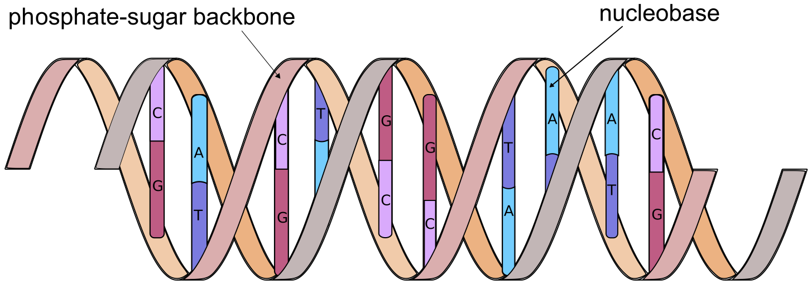

# What is Sequence data ?

## Biological sequences, a primer

To fully understand the work that was done during this thesis, as well as the choices that were made some basic knowledge of biology and more particularly genetics are needed. If you are already familiar with biological sequences, feel free to skip ahead to section \@ref(obtaining-sequence-data).

### What is DNA ?

**D**esoxyribo**N**ucleic **A**cid (DNA) is one of the most important molecules there is, without it complex life as we know it is impossible. It contains all the genetic information of a given organism, that is to say all the information necessary for the organism to: 1) function as a living being and 2) make a perfect copy of itself. This is the case for the overwhelming majority of living organisms on planet earth, from elephants to potatoes, to micro-organisms like bacteria.!g molecular biology tetbo

DNA is a polymer, composed of monomeric units called nucleotides. Each nucleotide is composed of Ribose (a five carbon sugar) on which are attached a phosphate group as well as one of four nucleobases: Adenine (A), Cytosine (C), Guanine (G) of Thymine (T). These 4 types of nucleotide monomers link up with one-another, through phosphate-sugar bonds, creating a single strand of DNA. The ordered sequence of these four types of nucleotides in strand encodes all the genetic information necessary for the organism to function. Nucleotides in a strand form strong complementary bonds with nucleotides from another strand, A with T and C with G. These bonds allows two strands of DNA to form the double-helix structure of DNA [@watson1953] shown in Figure \@ref(fig:figDNA). The specificity of nucleotide bonds ensure that the two strands of the double helix are complementary and that the information contained in one strand can be recovered from the other. This ensures a certain structural stability to the DNA molecule and a way to recover the important information that could be lost due to a damaged strand.

```{r}
figDNACaption <- "**Double-helix** structure of DNA. Each strand of DNA has a phosphate-sugar backbone on which are attached nucleobases. The two strands are linked by complementary bonds between the nucleobases of different strands (A bonding with T and C bonding with G)."
```

```{r, figDNA, fig.cap=figDNACaption, label="figDNA", eval=knitr::is_html_output()}

```

```{=tex}
\begin{figure}[h]
\centering
\includegraphics[width=\linewidth]{./figures/Basic-Intro/DNA.pdf}
\extcaption{Double-helix structure of DNA}{}
\label{fig:figDNA}
\end{figure}
```
The amount of DNA necessary to encode the information varies greatly from organism to organism: 5400 base pairs (5.4kBp) for the $\varphi X174$ phage [@sangerNucleotideSequenceBacteriophage1977], 4.9MBp for *Escherichia coli* [@archer2011], 3.1GBp for *Homo sapiens* [@nurk2022] all the way up to almost 150GBp for *Paris japonica,* a Japanese mountain flowering plant [@pellicer2010]. While very small genome size tend to occur in smaller, simpler organisms genome size does not correlate with organism complexity [@macgregor2001]

### From Information to action

#### Proteins, their structure and their role

The double stranded DNA molecules present in the cells of a living organism contains only information; in order for the organism to live, this information must be read and transformed into actions. Most of the actions necessary for "life" are taken by large molecules called proteins, they have a very wide range of functions from catalyzing reactions in the cell to giving it it's structure [@alberts2002].

Proteins are macromolecules, that are made up of one or several chains of amino acids. These chains then link together and fold up in a specific 3 dimensional structure, giving the protein the shape it needs to fulfill it's goal. This structure is determined by the sequence of amino acids, and a given protein can be identified by this amino acid sequence [@alberts2002].

This sequence is directly dependent on the information contained in the DNA. First the DNA is transcripted in a similar, but single stranded, molecule called RNA which encodes the same sequence. This RNA molecule is then translated into a protein by the following process [@crick1961]:

1.  Nucleotides in the RNA sequence are read in groups of 3 called a codon.
2.  These codons are read sequentially along the RNA molecule
3.  Each codon corresponds to an amino acid, according to the genetic code.
4.  The sequence of codons in RNA *(and by extension DNA)* determines the sequence of amino acids.
5.  The translation process is stopped when a specific type of codon is read.

With 4 types of nucleotides and codons grouping 3 nucleotides there are $4^3=64$ possible codons. However, as stated above, proteins are only made up of 20 different amino acids, meaning that several different codons correspond to the same amino acid. This gives the translation process a certain robustness to errors that can occur when the DNA is copied to create a new cell, or when it is transformed into RNA prior to protein translation.

#### Making mistakes

Going from DNA sequence to protein is quite a complicated process involving several steps, it is therefore possible for a mistake to happen. There are several mechanisms to avoid mistakes and alteration of the genetic information: the complementary nature of the 2 strands of DNA, the redundant nature of the genetic code as well as error correction mechanisms in the molecules that read and write DNA and RNA *(polymerases)*. However, despite all that, some errors still make it through.

##### Where can mistakes happen ?

There are several sources of error that can alter the genetic information [@chatterjee2017]:

-   **DNA replication:** When a cell divides, or when an organism reproduces, the DNA molecule must be copied in order to transmit genetic information. This process has a very low rate of errors, with as low as 1 error for every billion to every hundred billions of base pairs replicated [@fijalkowska2012]. This is due to the fact that the DNA polymerase (the protein that is responsible for copying DNA molecules), has a relatively error rate to start with, but mostly due to the error correcting mechanisms that are present in certain cells and bacteria [@pray2008dna].

-   **RNA transcription:** error rate between 4 errors for each million [@gout2013] to 2 errors for each hundred thousand [@gout2017] base pairs transcribed.

-   **Other mutagenic events:** Ionizing radiation [@desouky2015], UV rays [@kiefer2007], Toxins [@bennett2003], heat Stress [@kantidze2016], cold stress [@gregory1994], oxidative stress [@gafter-gvili2013].

##### What kind of errors are possible?

-   substitution
-   insertion
-   deletion

##### What effect can mutations have ?

-   illnesses

-   acquired traits

## Obtaining sequence data

In order to study living organisms we need to be able to obtain their genetic information, i.e figure out a way to get the sequence of nucleobases that make up their DNA.

### Sanger sequencing, a breakthrough

The first true sequencing method was developed in 1977 [@sangerDNASequencingChainterminating1977]. Sanger *et al.* devised a simple method to read the sequence of nucleotides that make up a DNA sequence.

1.  Clone sequence / amplify
2.  Prepare 4 different sequencing environments with a majority of dNTP (ie regular nucleotides) and in each a single type of ddNTP (a terminator). ddNTP are marked
3.  In each test tube add DNA polymerase, primers and denatures DNA fragments you want to sequence
4.  Sequence is replicated until incorporation of ddNTP stopping reaction
5.  Separate replicated fragments by electrophoresis (i.e shorter fragments go further), 1 ddNTP type in each lane
6.  With marked you can see which nucleotide is present at a given position

This allowed Sanger *et al.* to sequence the first whole $\varphi X174$ bacteriophage genome [@sangerNucleotideSequenceBacteriophage1977]. This method, although revolutionnary was costly and time consuming.

The marking of primers and ddNTP with fluorescence allowed to do the polymerization in a single test tube and use a single lane for electrophoresis [@smithSynthesisOligonucleotidesContaining1985; @smithFluorescenceDetectionAutomated1986]. The fluorescence also allowed for automated reading ***(base-calling ?)*** with optical systems.

***I need to speak of performance / throughput of these methods here.***

### Next-generation sequencing

Developed to lower cost and more throughput

-   Massively parallel

-   Long reads sequencing

Quick summary on PacBio and ONT

As a conclusion, mention the work done on protein sequencing, but we usually get the protein sequence from the DNA sequence that is translated from codons.

## Sequencing errors, how to account for them ?

general context of sequencing errors

### Long read errors

Mainly indels, in certain regions of the genomes, particularily homopolymers.

### HPC

-   HPC takes repeated runs of a single nucleotide and compresses them to a single occurence

-   Empirically is has been shown to improve mapping and other applications

## Biological sequences, a computational view (here ?)

Essentially a text file. Just a long succession of letters, so we can apply text algorithmics to it.

\printbibliography[segment=\therefsegment,heading=subbibintoc,title={References for chapter \thechapter}]
