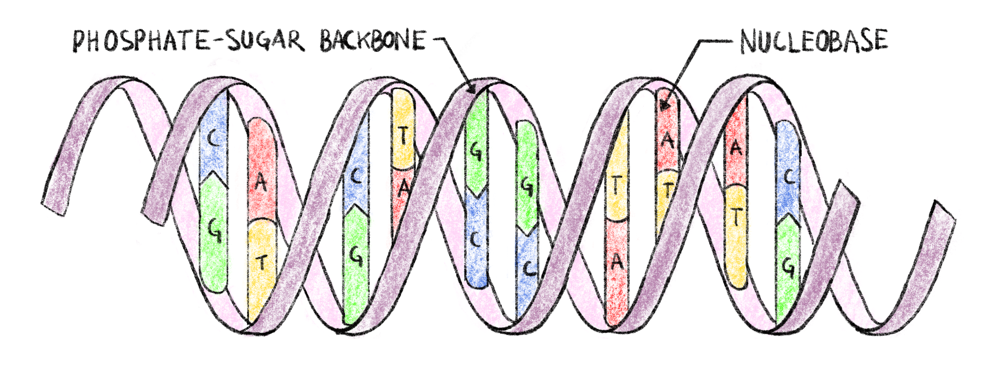
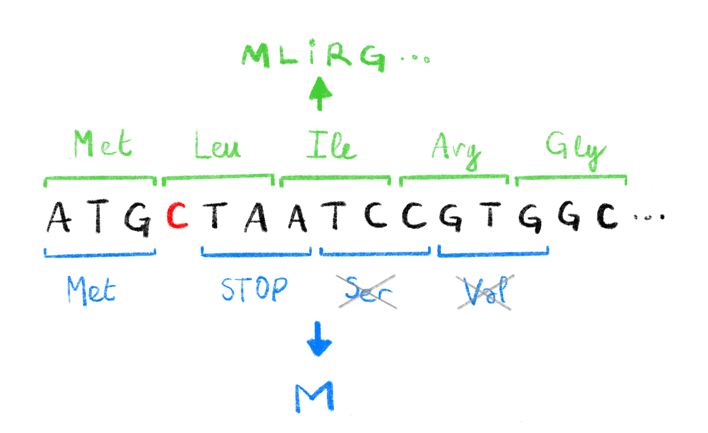
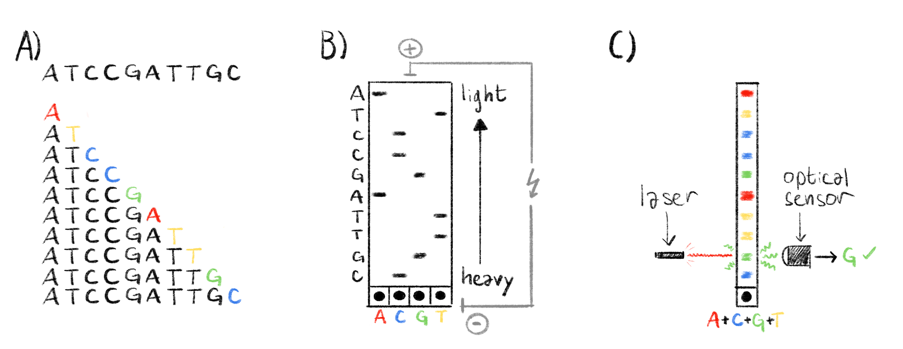
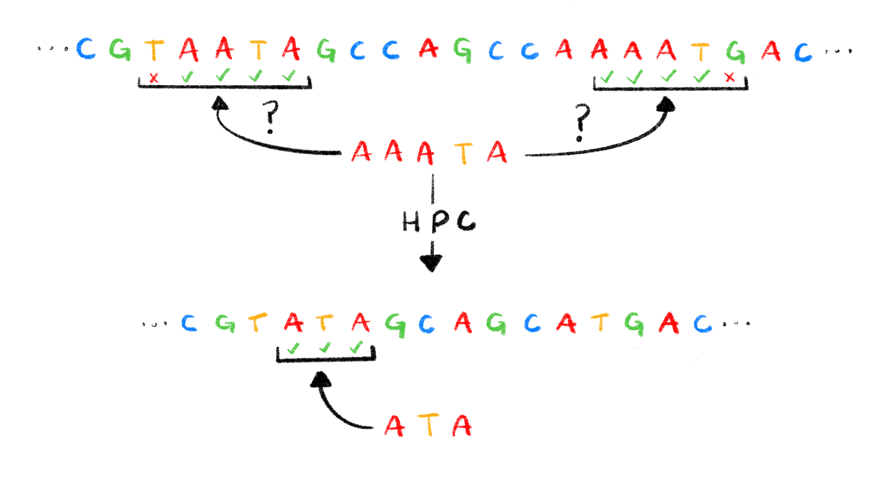

# What is Sequence Data ?

## Biological sequences, a primer

To fully understand the work that was done during this thesis, as well as the choices that were made, some basic knowledge of molecular biology and genetics is needed. If you are already familiar with biological sequences, feel free to skip ahead to section \@ref(obtaining-sequence-data).

### What is DNA ?

**D**esoxyribo**N**ucleic **A**cid (DNA) is one of the most important molecules there is, without it complex life as we know it is impossible. It contains all the genetic information of a given organism, that is to say all the information necessary for the organism to: 1) function as a living being and 2) make a perfect copy of itself. This is the case for the overwhelming majority of living organisms on planet earth, from elephants to potatoes, to micro-organisms like bacteria.

DNA is a polymer, composed of monomeric units called nucleotides. Each nucleotide is composed of ribose (a five carbon sugar) on which are attached a phosphate group as well as one of four nucleobases: Adenine (A), Cytosine (C), Guanine (G) of Thymine (T). These four types of nucleotide monomers link up with one-another, through phosphate-sugar bonds, creating a single strand of DNA. The ordered sequence of these four types of nucleotides in strand encodes all the genetic information necessary for the organism to function. Nucleotides in a strand form strong complementary bonds with nucleotides from another strand, A with T and C with G. These bonds allow two strands of DNA to form the double-helix structure of DNA [@watsonStructureDna1953] shown in Figure \@ref(fig:figDNA). The specificity of nucleotide bonds ensure that the two strands of the double helix are complementary and that the information contained in one strand can be recovered from the other. This ensures a certain structural stability to the DNA molecule and a way to recover the important information that could be lost due to a damaged strand.

```{r}
figDNACaption <- "**Double-helix structure of DNA.**  
Each strand of DNA has a phosphate-sugar backbone on which are attached nucleobases. The two strands are linked by complementary bonds between the nucleobases of different strands (A bonding with T and C bonding with G), encoding the same information of both strands."
```

```{r, figDNA, fig.cap=figDNACaption, label="figDNA", eval=knitr::is_html_output(), cache=FALSE}

```

```{=tex}
\begin{figure}[h]
\centering
\includegraphics[width=\linewidth]{./figures/Sequence-Intro/DNA.png}
\extcaption{Double-helix structure of DNA.}{Each strand of DNA has a phosphate-sugar backbone on which are attached nucleobases. The two strands are linked by complementary bonds between the nucleobases of different strands (A bonding with T and C bonding with G), encoding the same information of both strands.}
\label{fig:figDNA}
\end{figure}
```
The amount of DNA necessary to encode the information varies greatly from organism to organism: 5400 base pairs (5.4kBp) for the $\varphi X174$ phage [@sangerNucleotideSequenceBacteriophage1977], 4.9MBp for *Escherichia coli* [@archerGenomeSequenceColi2011], 3.1GBp for *Homo sapiens* [@nurkCompleteSequenceHuman2022] all the way up to almost 150GBp for *Paris japonica,* a Japanese mountain flowering plant [@pellicerLargestEukaryoticGenome2010]. While very small genome size tend to occur in smaller, simpler organisms, genome size does not correlate with organism complexity [@macgregorCValueParadox2001].

### From Information to action

#### Proteins, their structure and their role

The double stranded DNA molecules present in the cells of a living organism contain information only; in order for the organism to live, this information must be read and translated into actions. Most of the actions necessary for "life" are taken by large molecules called proteins, they have a very wide range of functions from catalyzing reactions in the cell to giving it structure [@albertsMolecularBiologyCell2002].

Proteins are macromolecules that are made up of one or several chains of amino acids. These chains then link together and fold up in a specific three dimensional structure, giving the protein the shape it needs to fulfill its goal. This structure is determined by the sequence of amino acids, and a given protein can be identified by this amino acid sequence [@albertsMolecularBiologyCell2002].

This sequence is directly dependent on the information contained in the DNA. First the DNA is transcribed in a similar, but single stranded, molecule called RNA (Ribonucleic Acid) which encodes the same sequence. This RNA molecule is then translated into a protein by the following process [@crickGeneralNatureGenetic1961]:

1.  Nucleotides in the RNA sequence are read in groups of three called codons.
2.  These codons are read sequentially along the RNA molecule.
3.  Each codon corresponds to an amino acid, according to the genetic code.
4.  The sequence of codons in RNA *(and by extension DNA)* determines the sequence of amino acids.
5.  The translation process is stopped when a specific type of codon *(a "Stop" codon)* is read.

With four types of nucleotides and codons grouping three nucleotides there are $4^3=64$ possible codons. However, as stated above, proteins are only made up of 20 different amino acids, meaning that several different codons correspond to the same amino acid. This gives the translation process a certain robustness to errors that can occur when the DNA is copied to create a new cell, or when it is transformed into RNA prior to protein translation.

The portion of DNA that is read to create the protein is said to be "coding", and is called a gene. There are several thousands of genes in the human genome [@internationalhumangenomesequencingconsortiumFinishingEuchromaticSequence2004] resulting in proteins executing thousands of different functions in a cell. In human beings, coding DNA represents only 1% to 2% of the total genome [@elkonCharacterizationNoncodingRegulatory2017; @omennReflectionsHUPOHuman2021]. The large majority of the DNA in a human being is not translated into proteins, a portion of it has a regulatory role, controlling transcription and translation, but the role remains unknown for the rest of the human genome [@shabalinaMammalianTranscriptomeFunction2004; @theencodeprojectconsortiumIntegratedEncyclopediaDNA2012].

#### Making mistakes

Going from DNA sequence to protein is quite a complicated process involving several steps, it is therefore possible for a mistake to happen. There are several mechanisms to avoid mistakes and alteration of the genetic information: the complementary nature of the two strands of DNA, the redundant nature of the genetic code as well as error correction mechanisms in the molecules *(called "polymerases")* that read and write DNA and RNA being some of them. Despite all that, some errors in the nucleic acid (DNA and RNA) or protein sequences still make it through, these are called mutations.

##### Where can mistakes happen ?

There are several sources of error that can alter genetic information [@chatterjeeMechanismsDNADamage2017]:

-   **DNA replication:** When a cell divides, or when an organism reproduces, the DNA molecule must be copied in order to preserve and transmit genetic information. This process has a very low rate of errors, with as low as one error for every billion to every hundred billion of replicated base pairs [@fijalkowskaDNAReplicationFidelity2012]. This is due to the fact that the DNA polymerase (the protein responsible for copying DNA molecules), has a relatively low error rate to start with, but mostly to the error correcting mechanisms that are present in certain cells and bacteria [@prayDNAReplicationCauses2008].

-   **RNA transcription:** Since errors in RNA transcripts are less important than in replicated DNA, RNA polymerases have a much higher error rate than their DNA counterparts. This error rate has been estimated to be between four errors for each million [@goutLargescaleDetectionVivo2013] to two errors for each hundred thousand [@goutLandscapeTranscriptionErrors2017] transcribed bases.

-   **Protein translation:** The process of translating RNA to a protein is done by proteins called ribosomes. This is a very error prone process with a mistranslation rate estimated to be of the order of one error for every 10,000 codons translated [@shcherbakovRibosomalMistranslationLeads2019]

-   **Other mutagenic events:** Many external events and factors have been shown to provoke mutations in exposed DNA such as Ionizing radiation [@desoukyTargetedNontargetedEffects2015], UV rays [@kieferEffectsUltravioletRadiation2007], toxins [@bennettMycotoxins2003], heat stress [@kantidzeHeatStressInducedDNA2016], cold stress [@gregoryRegulationCellSurvival1994] or oxidative stress [@gafter-gviliOxidativeStressInducedDNA2013].

##### What kind of errors are possible?

In biological sequences (nucleic acids and proteins), mutations can result from one of three error modes:

-   **Substitutions**, where the original base unit (nucleotide or amino acid) is mistakenly replaced by another one, for instance inserting an A instead of a G during RNA transcription.
-   **Insertions**,where a new base unit not present in the original sequence is added to the newly synthesized biological sequence.
-   **deletions**, where a base unit from the original sequence is skipped and not taken into account when synthesizing the new sequence.

While these three types of errors occur both in nucleic acids and proteins there are some things to consider about the consequences of nucleic acid mutations on protein synthesis. Due to the redundant nature of the genetic code mentioned in Section \@ref(proteins-their-structure-and-their-role), some substitutions in the nucleic acid sequence will result in the same protein sequence and therefore not have altered protein activity. Some mutations however will result in a substitution at the amino acid level which could potentially lead to a physicochemically altered or even non-functional protein. Finally, insertion and deletion errors (collectively called indels) can have big consequences on resulting proteins. Inserting or deleting nucleotides in multiples of three will result in the insertion/deletion of amino acids in the protein, any other length of indel will result in what is called a frameshift mutation [@rothFrameshiftMutations1974]. These mutations causes changes in all the codons, potentially resulting in a completely different amino-acid sequence, including premature stop codon apparition as shown in Figure \@ref(fig:frameshift).

```{r, frameshiftCaption}
frameshiftCaption <- "**Effect of frameshift mutations.**  
The deletion of a single C (highlighted in red) in the original DNA sequence leads to a change in the codons read during translation. The original codons (shown in green, with corresponding amino acids, above the sequence) translate to a functional protein `MLIRG...`. The new codons caused by the deletion (shown in blue, with corresponding amino acids, below the sequence), induce a premature STOP codon leading to a non-functional protein `M`. The Serine and Valine codons are not translated due to the STOP codon. 
"
```

```{r, frameshift, label="frameshift", fig.cap=frameshiftCaption, eval=knitr::is_html_output(), out.width="50%", cache=FALSE}

```

```{=tex}
\begin{figure}[h]
\centering
\includegraphics[width=0.5\linewidth]{./figures/Sequence-Intro/Frameshift.png}
\extcaption{Effect of frameshift mutations.}{The deletion of a single C (highlighted in red) in the original DNA sequence leads to a change in the codons read during translation. The original codons (shown in green, with corresponding amino acids, above the sequence) translate to the functional protein \texttt{MLIRG...}. The new codons caused by the deletion (shown in blue, with corresponding amino acids, below the sequence), induce a premature STOP codon leading to a non-functional protein \texttt{M}. The Serine and Valine codons are not translated due to the STOP codon.}
\label{fig:frameshift}
\end{figure}
```
##### What effect can mutations have ?

As we stated above, some mutations in DNA may have no repercussions, some others can lead to non-functional proteins. In some cases mutations can be associated with a trait in the mutated individual. For example a single mutation in a gene linked with coagulation can lead to pathological Leiden thrombophilia [@kujovichFactorLeidenThrombophilia2011], a single amino acid deletion in the CFTR protein leads to *(the very deadly)* cystic fibrosis [@cuttingCysticFibrosisGenetics2015], and many mutations have been linked to complex diseases like type 2 diabetes [@fuchsbergerGeneticArchitectureType2016; @morrisLargescaleAssociationAnalysis2012]. All mutational effects are not necessarily bad for the organism though, and mutations are essential for bacteria [@woodfordEmergenceAntibioticResistance2007] or viruses like HIV [@rheeHumanImmunodeficiencyVirus2003] to develop resistance to treatment *(more on that in Chapters* \@ref(viruses-hiv-and-drug-resistance) *and* \@ref(HIV-paper)*).*

While some mutations, have had their mechanisms and consequences thoroughly studied, in many cases mutations are simply linked to a trait. Since it is easier to show correlation than causation, and that the former does not necessarily imply the latter, it is important to further study mutations of notice to understand their potential consequences.

## Obtaining sequence data

In many fields, especially in computational biology, we need to know what genetic information the studied organism has. That is to say: what is the exact sequence of nucleotides that make up its DNA? The process of figuring out this sequence is, perhaps unsurprisingly, called sequencing. A sequence that is produced by this process is called a *sequencing read* or, more commonly, just a *read*.

### Sanger sequencing, a breakthrough

The first sequencing method was developed in 1977 [@sangerDNASequencingChainterminating1977]. Sanger *et al.* devised a simple method to read the sequence of nucleotides that make up a DNA sequence known as *chain termination sequencing* or simply *Sanger sequencing* *(represented in Figure* \@ref(fig:sanger)*)*. Although this method is now mostly obsolete, it established some key concepts in sequencing, some of which are in action in the most modern sequencers.

To understand Sanger sequencing, one must first understand how to synthesize DNA. As we stated in Section \@ref(what-is-dna), DNA is built up from building blocks that we called nucleotides, more specifically deoxynucleotide triphosphates or dNTPs. These dNTPs are made up of a sugar (deoxyribose), a nucleobase (A, T, G or C) and 3 phosphate groups. By successively adding these dNTPs at the end of an existing DNA molecule, we extend it, linking one of the phospates of the dNTP to an oxygen atom on the last nucleotide of the DNA molecule. Let us now consider a dideoxynucleotide triphosphate (ddNTP), which is identical to a dNTP except we remove a specific oxygen atom. This ddNTP can be added to the growing molecule of DNA like regular dNTPs, but since it is missing that one oxygen atom no more dNTPs or ddNTPs can be added to the DNA molecule after this one. The elongation is terminated and we call these ddNTPs chain-terminators. This combination of DNA synthesis followed by termination are at the heart of Sanger sequencing.

It is important to note that dNTPs and ddNTPs refer to nucleotides with any nucleobase. We can refer to specific dNTPs by replacing the "N" with the base of choice. For example, dATP refers to the dNTP that has adenine as a base. Similarly we have dCTP, dGTP and dTTP (as well as ddATP, ddCTP, ddGTP and ddTTP).

1.  The first step of Sanger sequencing (and most sequencing methods) is to amplify the DNA molecule we wish to sequence, *i.e.* make many copies of it (usually through a process called PCR). These clones of the sequence are then separated into their two complementary strands one of which will be used as a template for the sequencing steps.
2.  The second step is to prepare 4 different sequencing environments *(think of it as 4 test tubes)*. In each environment we introduce an equal mix of the 4 dNTPs, that will be used to elongate new DNA molecules from the amplified templates, and a single type of ddNTP. So in the first test tube we will have only ddATP, ddCTP in the second, *et cetera.* In addition, these ddNTP are marked, at first with radioactive isotopes, and later on, as the technology matured, with dyes. This marking means that we can observe the location of these ddNTPs later on.
3.  Then an equal portion of the template is introduced in each environment with DNA polymerases (that will add the nucleotides to elongate a sequence that is complementary to the template), and short specific DNA molecules called primers that are necessary for the polymerases to start synthesizing new DNA.
4.  During synthesis the chain is elongated with dNTPs by the polymerase and the reaction stops once a ddNTP is incorporated. At the end of this process we have plenty of fragments of DNA in each test tube, and we know that these fragments end with a specific base in a given environment. For example, in the test tube where we added ddATP, we know that all the fragments end with an A, and that we have all the possible fragments that start at the beginning of the template and end with an A. If the template is AACTA, then the fragments we would get in the ddATP test tube would be A, AA, and AACTA.
5.  Then, a sample from each environment is taken and deposited on a gel, each in its own lane. A process called electrophoresis is then used to separate the fragments according to their weight. By applying an electrical current to the gel, the fragments of DNA will migrate away from where they were deposited along their lane in the gel. Lighter, shorter DNA fragments will travel further than heavier ones. We then get clusters of fragments ordered by weight (and therefore by length) called bands. With the marked ddNTP we can reveal these bands in the gel.
6.  We know that: 1) bands are ordered by length; 2) consecutive bands correspond to the addition of a single nucleotide; 3) in a specific lane fragments corresponding to a band end with a specific base. This knowledge is enough to deduce the sequence of the template. An example gel is shown in Figure \@ref(fig:sanger).

This process allowed Sanger *et al.* to sequence the first genome, of a $\varphi X174$ bacteriophage, in 1977 [@sangerNucleotideSequenceBacteriophage1977]. Although revolutionary, this method was costly, time consuming and labor intensive. Adjustments to this method were made in order to make it faster and less expensive. An important step was to change the way ddNTPs were marked. By using fluorescent markers, each base having a distinct "color", we can eliminate the need to have 4 different environments and lanes in the gel [@smithSynthesisOligonucleotidesContaining1985; @smithFluorescenceDetectionAutomated1986]. This also paved the way for automating sequencing, each fluorescently marked band can be excited with a laser, and the resulting specific wavelength can be recorded by optical systems and the corresponding base automatically deduced [@ansorgeAutomatedDNASequencing1987] (Also see Figure \@ref(fig:sanger)). Other improvements were made such as using capillary electrophoresis instead of gel electrophoresis.

```{r, sangerCaption}
sangerCaption <- "**Overview of the sanger sequencing protocol.**  
**A)** The sequence to read and all the generated fragments, with highlighted ddNTP chain terminators, ordered by molecular weight (i.e. length). **B)** Classical Sanger sequencing. The fragments are separated by electrophoresis and the lighter fragments travel further from the wells at the botom of the gel. Each lane in the gel correpsonds to a specific ddNTP. The radioactivly marked ddNTPs appear as black band in the gel and we can reconstruct the sequence by reading the bands from top to bottom, the column in wich the band appears indicating which base is at each position. **C)** Automated Sanger sequencing. The fragments are also separated by electrophoresis, as in panel B. Chain terminators are marked with fluorescent markers. When excited by a laser, each ddNTP emits a specific wavelength. This is read by an optical sensor and the corresponding ddNTP is recorded. By exciting each band we can quickly deduce the sequence. 
"
```

```{r, sanger, label="sanger", fig.cap=sangerCaption, eval=knitr::is_html_output(), out.width="80%", cache=FALSE}

```

```{=tex}
\begin{figure}[h]
\centering
\includegraphics[width=0.8\linewidth]{./figures/Sequence-Intro/Sanger.png}
\extcaption{Overview of the sanger sequencing protocol.}{\textbf{A)} The sequence to read and all the generated fragments, with highlighted ddNTP chain terminators, ordered by molecular weight (i.e. length). \textbf{B)} Classical Sanger sequencing. The fragments are separated by electrophoresis and the lighter fragments travel further from the wells at the botom of the gel. Each lane in the gel correpsonds to a specific ddNTP. The radioactivly marked ddNTPs appear as black band in the gel and we can reconstruct the sequence by reading the bands from top to bottom, the column in which the band appears indicating which base is at each position. \textbf{C)} Automated Sanger sequencing. The fragments are also separated by electrophoresis, as in panel B. Chain terminators are marked with fluorescent markers. When excited by a laser, each ddNTP emits a specific wavelength. This is read by an optical sensor and the corresponding ddNTP is recorded. By exciting each band we can quickly deduce the sequence. }
\label{fig:sanger}
\end{figure}
```
These gradual improvements to the Sanger sequencing protocol made it possible to sequence longer and more accurate reads, with the latest technologies resulting in reads reaching 1 ,000 base pairs with an accuracy of 99.999% [@shendureNextgenerationDNASequencing2008]. These improvements also resulted in a lower cost for sequencing, which was greatly decreased from around \$1000 per base-pair [@collinsHumanGenomeProject2003] to only \$0.5 per kilobase [@shendureNextgenerationDNASequencing2008]. Finally these technological improvements also increased the throughput of sequencing machines from around 1 kilobase per day [@collinsHumanGenomeProject2003] to 120 kilobases per hour [@liuComparisonNextGenerationSequencing2012].

Despite these improvements, for ambitious endeavors such as the human genome project, sequencing was a massive undertaking: the first human genome is estimated to have cost between 500 million and 1 billion US dollars to sequence [@CostSequencingHuman].

### Next-generation sequencing

Thanks to these large sequencing projects and the genomics field in general, the richness and usefulness of sequence data was made ever more apparent. This growing need of sequence data ushered in a new era of sequencing with the development of many new sequencing methods designed to have a higher throughput and a lower cost than Sanger sequencing. This second generation of sequencing technologies is often referred to as *Next-Generation Sequencing* (NGS) or *Massively parallel* sequencing. While there are different technologies, they share a few common key points [@metzkerSequencingTechnologiesNext2010]:

-   As with Sanger sequencing, we first need to amplify and clone the DNA template. However, since these technologies result in shorter reads than Sanger sequencing, the DNA we want to sequence must first be randomly broken up into small template fragments before being amplified.

-   The amplified template fragments are attached to some sort of solid support, resulting in a physical support with billions of template fragments attached to it.

-   As in Sanger sequencing, DNA molecules, complementary to the template fragments, are elongated. This happens for billions of fragments at the same time (hence the "massively parallel" epithet).

-   The addition of specific nucleotides to a chain are detected in real time, and there is no permanent chain termination. There is no need for the long step of electrophoresis. These detections are simultaneous for all the molecules being elongated at once.

The result of these steps is a very large number of short reads. With data analysis these short reads can be used to deduce longer sequences and eventually a fragmented approximation of the original whole genome sequence through a process called *assembly*.

The main NGS method is called "sequencing by synthesis", developed by a company: Illumina. It is commonly referred to as *Illumina sequencing*. This method is based on *reversible chain terminators*, developed at the Institut Pasteur in the 90's [@canardDNAPolymeraseFluorescent1994]. These are marked dNTPs that can be used to elongate DNA molecules, but that have an additional molecular group that makes them terminators by default. However this terminating group can be removed once the NTP is included in a DNA molecule allowing the elongation process to continue. These dNTPs are fluorescently marked and when excited with a laser they emit light with a distinctive color. During Illumina sequencing, these reversible chain terminators are included to millions of fragments at the same time, stopping elongation. At this point all the fragments are excited with a laser and an optical system takes a picture of the emitted colors for all the fragments at once. In this image, a pixel loosely corresponds to a sequenced fragment, and its color to the most recently added dNTP. The terminating groups are then cleaved and the process can start over by incorporating a new batch of reversible terminators. By observing the successive images we can deduce the sequence of added nucleotides for each sequenced fragment and obtain all of our reads.

Another NGS method is called pyrosequencing, commercialized by 454 Life Sciences. Contrary to Illumina sequencing, this method does not use reversible chain terminators. Instead it uses a special enzyme called luciferase that emits light as specific dNTPs are added. This process is repeated for the 4 dNTPs (similarly to Sanger sequencing) and from the light emissions we can deduce the sequence of nucleotides [@nyrenSolidPhaseDNA1993].

These technologies yield reads around 150 nucleotides for Illumina and 400nt for pyrosequencing [@mardisDecadePerspectiveDNA2011]. This is much shorter than the 1kB reads obtainable with the latest Sanger sequencing technologies. However the throughputs are much higher [@liuComparisonNextGenerationSequencing2012]: 2.5 to 12.5 Gigabases per hour for Illumina and 30 Megabases per hour for pyrosequencing. Costs are also quite low: \$0.07 and \$10 per Megabase for Illumina and pyrosequencing respectively. The per-base sequencing accuracies are also quite high, up to 99.9% for both Illumina [@stolerSequencingErrorProfiles2021] and pyrosequencing [@liuComparisonNextGenerationSequencing2012]. A summary of the key characteristics for various sequencing technologies can be found in Table \@ref(tab:sequencing). The lower cost and higher throughput has made the Illumina sequencing technology the dominant one. The company estimates that 90% of the world's sequencing data was generated with Illumina machines in 2015 [@SequencingTechnologySequencing].

### Long read sequencing

Although NGS technologies revolutionized the sequencing world, recent efforts have been made to get longer reads. These third-generation methods generate reads of tens of kilobases and are commonly called *long-read sequencing* method. Long reads have a host of applications [@pollardLongReadsTheir2018] for which short NGS reads might not be well suited: *De novo* assembly of large complex genomes, studying complex repetitive regions such as centromeres or telomeres or detection of structural variants. They have recently been used to assemble the first truly complete human genome, including telomeric and centromeric regions [@nurkCompleteSequenceHuman2022].

The two available long read technologies are: Single Molecule Real Time sequencing (SMRT), commercialized by Pacific Biosciences (PacBio) and Nanopore sequencing, commercialized by Oxford Nanopore Technologies (ONT). While these technologies are quite different, they both result in much longer reads than even Sanger sequencing in real time, without the need for chain terminators or separate sequencing reactions, all with a high throughput and at a reasonably low cost.

SMRT sequencing was first developed in 2009 [@eidRealTimeDNASequencing2009], before being commercialized and furthered by PacBio. The basic principle is as follows:

1.  Fragment and amplify DNA to obtain a very large number of DNA templates.
2.  Link both strands of each DNA template together with known sequences called *bell adapters*. Denature the DNA to create a single stranded, circular DNA molecule.
3.  Primers and polymerases are attached to the circular molecule specifically on one of the bell adapters.
4.  Add the circular DNA template, primer, polymerases complexes to a SMRT chip. This chip is essentially a large aluminium surface with hundreds of thousands of microscopic wells called *Zero-Mode Waveguides* (ZMWs) only 100nm in diameter [@leveneZeroModeWaveguidesSingleMolecule2003]. The polymerases are chemically bonded to the bottom of each of these ZMWs so we effectively get a single DNA template and polymerase per well.
5.  Fluorescently marked dNTPs are incorporated progressively in each of the wells. When a marked dNTP is incorporated in the newly synthesized DNA brand, light of a specific wavelength is emitted.
6.  The size of these ZMWs make the detection of the fluorescence possible with an optical system. Incorporation of dNTPs in each ZMW can be detected simultaneously in a parallel fashion and the resulting sequences deduced.

Nanopore sequencing, thought of in the eighties, further developed along the years [@clarkeContinuousBaseIdentification2009] and first commercialized by ONT in 2014 [@deamerThreeDecadesNanopore2016], is completely different from all the sequencing technologies previously mentioned. Where all the other ones are based on synthesizing a complementary DNA strand and detecting specific dNTP incorporation in some way or another, there is no synthesis in nanopore sequencing. The principle relies on feeding a single strand of a DNA template through a small hole in a membrane, a *nanopore*, at a controlled speed. As the nucleotides go through the nanopore, an electric current is formed between both sides of the membrane. This current can be measured and is specific to the succession of 5 to 6 nucleotides inside the nanopore channel at any given time. By looking at the evolution of the electric current as the DNA strand goes through the nanopore, we can deduce the sequence of nucleotides through a process called *base calling.* Base calling is usually done with machine learning methods, mainly artificial neural networks [@wickPerformanceNeuralNetwork2019]. In the flow cells used in ONT sequencers, there are hundreds of thousands of nanopores, spread out over a synthetic membrane, allowing for massively parallel sequencing as well. Theoretically, since this method is not based on synthesis, the upper limit for read length is only limited by the length of the template, and in practice ONT sequencing produces the longest reads.

Both technologies yield long reads, the median and highest read lengths being 10 kilobases and 60 kilobases respectively for PacBio sequencing [@rhoadsPacBioSequencingIts2015]. For nanopore the median read lengths of 10 to 12 kilobases [@ipMinIONAnalysisReference2015; @logsdonLongreadHumanGenome2020] are similar to PacBio, but in it can also yield ultra-long reads of 1 up to 2.3 megabases long [@jainNanoporeSequencingAssembly2018; @TharSheBlows; @payneBulkVisGraphicalViewer2019]. The length of the reads and parallel nature of these two technologies allow these sequencers to have truly massive throughputs. PacBio sequencers can sequence between 2 and 11 gigabases per hour and ONT from 12.5 gigabases per hour, up to a staggering 260 gigabases per hour using the latest ONT PromethION machines [@logsdonLongreadHumanGenome2020]. The cost of sequencing with these machines, while higher than for Illumina sequencers, remains reasonably affordable at \$0.32 and \$0.13 per megabase for PacBio and ONT respectively [@murigneuxComparisonLongreadMethods2020]. These characteristics are summarized in Table \@ref(tab:sequencing) along with other sequencing technologies.

The length, throughput and sequencing cost of both these technologies paint a pretty picture, and indeed they have proved useful in many settings, but sequencing accuracy is a problem with these technologies. The per-base sequencing accuracy has been estimated to be between 85% and 92% for PacBio sequencers and 87% to 98% for ONT machines [@chaissonResolvingComplexityHuman2015; @logsdonLongreadHumanGenome2020; @jainOxfordNanoporeMinION2016]. This accuracy is much lower than either Sanger sequencing or Illumina reads. Characterizing, correcting and accounting for these errors is widely studied and it will be discussed in more detail in Sections \@ref(sequencing-errors-how-to-account-for-them) and \@ref(the-special-case-of-homopolymers).

```{r}
sequencingTableCaption <- "**Comparison of sequencing technology characteristics.**  
Characteristics for the latest sequencers were used for the Sanger sequencing entry. The length is given in nucleotides, throughputs in sequenced nuctleotides per hour and cost in US dollars per megabase."
```

```{r, sequencing, label="sequencing", tab.topcaption=FALSE, cache=FALSE, eval=knitr::is_html_output()}
dt <- read_csv("tables/Sequence-data/Table1.csv")

flextable(dt) %>%
  ftExtra::colformat_md() %>%
  set_table_properties(width=1, layout="autofit") %>%
  theme_booktabs() %>%
  set_caption(caption=sequencingTableCaption, style="caption")
```

```{=tex}
\begin{table}
    \centering
    \begin{tabular}{lllll}
        \toprule
        technology & read length (nt) & throughput (nt/hour) & cost (\$/Mb) & accuracy \\ \midrule
        Sanger & \numprint{1000} & 120 $10^3$ & \$500 & 99.999\% \\
        Illumina & 150 & 2.5-12.5 $10^9$ & \$0.07 & 99.9\% \\
        Pyrosequencing & 400 & 30 $10^6$ & \$10 & 99.9\% \\
        PacBio SMRT & \numprint{10000} (up to \numprint{60000}) & 2-11 $10^9$ & \$0.32 & 85-92\% \\
        Nanopore & \numprint{12000} (up to 2.5 $10^6$) & 12.5-260 $10^9$ & \$0.13 & 87-98\% \\
    \bottomrule
    \end{tabular}
    \extcaption{Comparison of sequencing technology characteristics.}{Characteristics for the latest sequencers were used for the Sanger sequencing entry. The length is given in nucleotides, throughputs in sequenced nuctleotides per hour and cost in US dollars per megabase.}
    \label{tab:sequencing}
\end{table}
```
While most of the mentioned technologies can also be adapted and used to sequence RNA instead of DNA [@hongRNASequencingNew2020; @ozsolakRNASequencingAdvances2011], directly sequencing proteins remains a challenge. The sequence of amino acids making up a protein is usually deduced from the codons in sequenced DNA or RNA after detection of potentially coding regions called open reading frames (ORFs). Development of methods to directly sequence protein molecules using mass spectrometry was started not very long after Sanger sequencing [@huntProteinSequencingTandem1986] and improved [@smithProteinSequencingProtocols2002]. New methods are still being developed [@restrepo-perezPavingWaySinglemolecule2018] but protein sequencing remains a challenge.

## Sequencing errors, how to account for them ?

Sequencing technologies are not perfect. They make mistakes, as we can see from the accuracy rates reported in Section \@ref(obtaining-sequence-data). For technologies based on nucleic acid synthesis (i.e. everything except ONT), since they use polymerases it stands to reason that the same three types of errors, described in Section \@ref(making-mistakes), occur: substitutions, insertions and deletions. For long read technologies though, most of the errors do not come from the polymerase, but from signal processing used to deduce the sequence. Since both technologies execute single molecule sequencing, the signal to noise ratio is low [@weiratherComprehensiveComparisonPacific2017; @wangNanoporeSequencingTechnology2021] making base calling more complicated.

This explains the discrepancy in error rates between short and long read sequencing technologies: the former getting as low as 10^-4^ or 10^-5^ after computational processing [@maAnalysisErrorProfiles2019] where the latter are between 10% and 15%. This high error rate long reads is bothersome and many efforts have been made to lower this error rate, computationally and technologically.

### Error correction methods

The long read error-correction literature and toolset is rich and active [@limaComparativeAssessmentLongread2020; @fuComparativeEvaluationHybrid2019; @zhangComprehensiveEvaluationLong2020]. There are two main ways to correct errors: 1) hybrid methods where high-accuracy short reads are used, and 2) non-hybrid methods where only the long-reads are used.

In Non-hybrid methods [@limaComparativeAssessmentLongread2020; @amarasingheOpportunitiesChallengesLongread2020], by finding regions that overlap fairly well between reads and taking the consensus of the overlapped regions (i.e. the majority nucleotide at each position), some errors can be eliminated. In many analyses and sequencing data processing pipelines, the first step is to break up the reads into all possible overlapping subsequences of length $k$ called $k$-mers (e.g the 3-mers of ATTGC are ATT, TTG and TGC). Rare $k$-mers in the read dataset, i.e. $k$-mers that appear only a handful of times in all the reads, are likely the result of an error and filtering them out can improve analysis. One or both of these procedures are implemented in several pieces of commonly used software such as assembler like `wtdbg2` [@ruanFastAccurateLongread2020], and `canu` [@korenCanuScalableAccurate2017] or standalone long-read correctors like `daccord` [@tischlerNonHybridLong2017]. In some cases, errors are corrected not on the raw reads but after having assembled the long reads into long continuous sequences (contigs), this process is called polishing. The `ntEdit` polisher [@warrenNtEditScalableGenome2019] also filters out rare $k$-mers to correct errors. The `Arrow` [@heplerImprovedCircularConsensus2016] and `Nanopolish` [@simpsonDetectingDNACytosine2017] polishers correct the assembly using the raw PacBio and ONT long reads respectively.

Hybrid methods, as their name suggest, make use of short reads to correct errors in long reads. By finding similar regions between the short and long reads we can use the higher accuracy of short reads to correct the long ones. This is implemented in many pieces of software `proovread` [@hacklProovreadLargescaleHighaccuracy2014], `Jabba` [@miclotteJabbaHybridError2016], `PBcR` [@korenHybridErrorCorrection2012] or `LoRDEC` [@salmelaLoRDECAccurateEfficient2014]. Short reads can also be used to polish long read assemblies with tools like `Pilon` [@walkerPilonIntegratedTool2014] or `Racon` [@vaserFastAccurateNovo2017]. The first complete human genome was assembled and polished using many different sequencing technologies including PacBio, ONT and Illumina technologies [@nurkCompleteSequenceHuman2022].

### More accurate sequencing methods

While a lot of effort is being put into error correction, another angle of attack to lower the error rate of long reads is to improve the sequencing technology.

In 2019, PacBio introduced HiFi reads, based on a circular consensus (CCS) technique [@wengerAccurateCircularConsensus2019]. During SRMT sequencing the 2 strands are linked together by bell adapters to form a circular DNA template (c.f. Section \@ref(long-read-sequencing)), the central idea of CCS is to sequence this molecule multiple times by going over the circle more than once. In the resulting long sequence the known bell adapter sequences can be removed, and a consensus sequence can be built from the multiple passes over the same DNA template. This results in long-read accuracies of 99.8% to 99.9% [@wengerAccurateCircularConsensus2019; @logsdonLongreadHumanGenome2020]. This works because PacBio sequencing errors are mostly randomly distributed along the sequenced template (more on that in Section \@ref(homopolymers-and-long-reads)). Therefore it is unlikely that the same error will appear in multiple passes over the same template portion.

For ONT sequencing, most improvement efforts have been focused on base-callers. These tools were originally based on Hidden Markov Models [@timpDNABaseCallingNanopore2012] (HMMs), but gradually they have been shifting over to neural network based deep learning methods [@peresiniNanoporeBaseCalling2021; @bozaDeepNanoDeepRecurrent2017; @wickPerformanceNeuralNetwork2019; @amarasingheOpportunitiesChallengesLongread2020] with faster inference times and better performance.

Similarly to PacBio HiFi reads, ONT developed 2D, and 1D^2^ sequencing. In 2D sequencing, both strands of the DNA molecule to sequence are linked with a hairpin adapter to form one long sequence. Each strand is sequenced once and a consensus is built from these 2 passes [@tylerEvaluationOxfordNanopore2018]. 1D^2^ sequencing operates in a similar fashion but without the need for a hairpin adapter [@linNanoporeTechnologyIts2021]. 2D sequencing produces reads with 97% accuracy albeit much shorter than standard 1D sequencing [@tylerEvaluationOxfordNanopore2018]. Recently, Oxford Nanopore Technologies announced the release of a new technology they call duplex. Using new chemistry, a new basecaller and sequencing of both strands (similarly to 2D and 1D^2^) they announce raw read accuracies of 99.3% [@OxfordNanoporeTech]. Pre-printed research seems to confirm these numbers with one experiment yielding duplex reads with a 99.9% accuracy [@sandersonComparisonR9Kit102022].

A technologically agnostic method using unique molecular identifiers added during the template preparation phase, and consensus sequencing has been shown, in specific contexts, to improve the accuracies of both ONT and PacBio CCS long reads to 99.59% and 99.93% respectively [@karstHighaccuracyLongreadAmplicon2021].

Finally, new sequencing technologies are being developed, like built in error-correction short-read technologies yielding error-free reads of up to 200 nucleotides long [@chenHighlyAccurateFluorogenic2017]. Illumina also recently announced its own high-throughput, high-accuracy long-read sequencing technology in 2022 [@HighPerformanceLong], although details about the performance and technology are scarce.

## The special case of homopolymers

Despite improvement in error correction methods and sequencing technologies, certain genetic patterns are particularly difficult to process, homopolymers are one such pattern.

### Homopolymers and the human genome

```{r, hp-analysis}
names <- c("chromosome", "length", "base", "count")
hps <- read.table("./data/chm13_hp_counts2.txt", sep="\t", col.names=names)
big_l <- 4
big <- hps %>% filter(length >= big_l)

genome_size  <- 3054832041
hp_size <- sum(hps$length * hps$count)
big_hp_size <- sum(big$length * big$count)

freqs <- hps %>%
  group_by(length) %>%
  summarize(count = sum(count)) %>%
  arrange(-row_number()) %>%
  mutate(prop = cumsum(count)/genome_size)

per_base <- hps %>%
  group_by(base) %>%
  summarize(total = sum(count * length))
```

*Homopolymers* consist of a stretch of repeated nucleotides (i.e. $\geq 2$) occurring at some point in the genome. For example, the sequence AAAA is a length 4 adenine homopolymer. In the complete human genome assembly (CHM13 v1.1 from the T2T consortium [@nurkCompleteSequenceHuman2022]), `r format(100 * hp_size / genome_size, digits=1)`% of its three gigabases are in homopolymers of size `r min(hps$length)` or more, and `r format(100 * big_hp_size / genome_size, digits=1)`% are in homopolymers of length equal or greater than `r big_l`. As can be seen in Figure \@ref(fig:HPpercent), short and medium length homopolymers make up a significant part of the genome. In a previous GRCh38 human genome assembly, more than 1.9 megabases are in homopolymers of length 8 or higher [@booeshaghiPseudoalignmentFacilitatesAssignment2022], representing about 1‰ of that assembly. The longest homopolymer run in the CHM13 v1.1 assembly is `r max(hps$length)` *(90 in GRCh38 [@booeshaghiPseudoalignmentFacilitatesAssignment2022])*.

```{r, hpFracCaption}

hpFracCaptionShort <- "Homopolymer fraction of the whole human genome by homopolymer length."

extend <- "The homopolymer counts were calculated from the T2T consortium full human genome assembly CHM13 v1.1. This figure was inspired by Figure 3b of reference"

titlePre <- ""
titlePost <- ""
extPre <- ""
extPost <- ""

if (knitr::is_html_output()) {
  titlePre <- "**"
  titlePost <- "**  \n"
  extPre <- ""
  extPost <- " [@booeshaghiPseudoalignmentFacilitatesAssignment2022]."
} else if (knitr::is_latex_output()) {
  titlePre <- "\\textbf{"
  titlePost <- "}\\\\"
  extPre <- ""
  extPost <- " \\autocite{booeshaghiPseudoalignmentFacilitatesAssignment2022}."
}
  
hpFracCaption <- paste0(titlePre, hpFracCaptionShort, titlePost, extPre, extend, extPost)
```

```{r, HPpercent, fig.cap=hpFracCaption, fig.scap=hpFracCaptionShort, label="HPpercent",out.width="70%", cache=FALSE}
labels <- c("", "", "", "", "", "", "", "", "", expression(10^1), "", "", "", "", "", "", "", "", expression(10^2))
breaks <- c(1, 2, 3, 4, 5, 6, 7, 8, 9, 10, 20, 30, 40, 50, 60, 70, 80, 90, 100)

ggplot(freqs, aes(x=length, y=prop)) +
  geom_point() +
  scale_x_log10(
    breaks = breaks,
    labels = labels,
    name="homopolymer length"
  ) +
  scale_y_log10(
    breaks = scales::trans_breaks("log10", function(x) 10^x),
    labels = scales::trans_format("log10", scales::math_format(10^.x)),
    name="cumulative occurence as a\nfraction of genome size"
  ) +
  theme_light(base_size=15)
```

In the human genome, homopolymers tend to occur more often in adenine and thymine runs than guanine and cytosine. There are are approximately twice as many nucleotides within A or T homopolymers (`r round(filter(per_base, base=="A")$total/1e6)` Mb and `r round(filter(per_base, base=="T")$total/1e6)` Mb) than G or C (`r round(filter(per_base, base=="G")$total/1e6)` Mb and `r round(filter(per_base, base=="C")$total/1e6)` Mb). This discrepancy is even more pronounced when looking at homopolymers longer than four nucleotides (c.f. Figure \@ref(fig:HPdistrib)).

```{r, hpCaption}

hpDistribCaptionShort <- paste0("Distribution of homopolymer lengths per base in the human genome, for homopolymers of length $\\geq$ ", big_l, ".")

extend <- "The homopolymer counts were calculated from the T2T consortium full human genome assembly CHM13 v1.1."

titlePre <- ""
titlePost <- ""
extPre <- ""
extPost <- ""

if (knitr::is_html_output()) {
  titlePre <- "**"
  titlePost <- "**  \n"
  extPre <- ""
  extPost <- ""
} else if (knitr::is_latex_output()) {
  titlePre <- "\\textbf{"
  titlePost <- "}\\\\"
  extPre <- ""
  extPost <- ""
}
  
hpDistribCaption <- paste0(titlePre, hpDistribCaptionShort, titlePost, extPre, extend, extPost)
```

```{r, HPdistrib, fig.cap=hpDistribCaption, fig.scap=hpDistribCaptionShort, label="HPdistrib", out.width="70%", cache=FALSE}

ggplot(big, aes(x=length, y=count)) +
  geom_col() +
  theme(legend.position = "none") +
  facet_wrap(. ~ base) +
  theme_light(base_size=15)
```

### Homopolymers and long reads {#homopolymers-and-long-reads}

Unfortunately, homopolymers are a source of errors in sequencing, particularly for long-read technologies. While substitutions seem to be randomly distributed along the reads for PacBio and ONT, the main error mode seems to be indels in homopolymeric sections, *i.e.* reading the same nucleotide several times or skipping over one of the repeated nucleotides. Many studies show that homopolymeric indels are the main type of error for PacBIO SMRT and ONT long-read sequencing [@delahayeSequencingDNANanopores2021; @goodwinOxfordNanoporeSequencing2015; @dohmBenchmarkingLongreadCorrection2020; @weiratherComprehensiveComparisonPacific2017]. This is even the case for PacBio HiFi reads, while the circular consensus approach eliminates the randomly distributed substitutions but homopolymer indels remain [@wengerAccurateCircularConsensus2019]. It seems that ONT reads are more prone to this type of error than PacBIo [@logsdonLongreadHumanGenome2020]. The rate of these errors is independent of the length of the homopolymer for ONT, but it rises with homopolymer length for short-read and PacBio technologies [@fooxPerformanceAssessmentDNA2021].

### Accounting for homopolymers

The fact that they make up a significant part of the human genome, and that they are a source of errors for long read technologies means that homopolymers warrant special attention and care. Methods have been devised and implemented, specifically to counter homopolymer-linked errors.

#### Specific error correction

Homopolymer errors are taken under special consideration during assembly polishing when using certain tools like `HomoPolish` [@huangHomopolishMethodRemoval2021], `NanoPolish` [@simpsonDetectingDNACytosine2017] or `Pilon` [@walkerPilonIntegratedTool2014]. Methods to improve base calling of homopolymer stretches have been developed for nanopore sequencing [@rangSquiggleBasepairComputational2018; @sarkozyCallingHomopolymerStretches2018], and implemented in state of the art base-callers such as `guppy` or `scrappie` [@wickPerformanceNeuralNetwork2019].

Steps before sequencing can also be taken in order to reduce the effect of these errors, like avoiding homopolymers in barcode sequences [@hawkinsIndelcorrectingDNABarcodes2018; @srivathsanMinIONBasedPipeline2018] or during the development of DNA based storage systems [@wangConstructionBioConstrainedCode2019].

Improving the sequencing technologies can also be a solution, by reducing the number of homopolymer errors straight from the source. The latest ONT chemistry R.10 reportedly improves accuracy in homopolymer rich regions [@R10NewestNanopore; @amarasingheOpportunitiesChallengesLongread2020]. Non-biological solid-state nanopores also reduces errors in homopolymers [@zhouDetectionDNAHomopolymer2019; @gotoIdentificationFourSinglestranded2018].

#### Homopolymer compression, a nifty trick {#hpc-trick}

In many cases, reads cannot be re-sequenced with newer technologies, or base-called with better base callers. Only the read sequences potentially containing homopolymer errors, are available for usage. In order to account for this sort of error, a simple pre-processing trick was developed: *homopolymer compression* (HPC).

The idea is very simple: for any sequence, replace a repeated run of any nucleotide (i.e. homopolymers) by a single occurrence of that nucleotide. This means that after going through HPC the sequence AAACTGGG will yield the sequence ACTG. This simple pre-processing step, applied to all the reads and sequences to analyze, removes all indels in homopolymers, and can resolve some ambiguities (c.f. Figure \@ref(fig:hpcSchema)). It can also remove legitimate information contained in homopolymers, but the trade-off with the reduced error rate has been deemed advantageous.

HPC has been implemented in many sequence bioinformatics software tools. The `HiCanu` [@nurkHiCanuAccurateAssembly2020], `MDBG` [@ekimMinimizerspaceBruijnGraphs2021], `wtdbg2` [@ruanFastAccurateLongread2020], `shasta` [@shafinNanoporeSequencingShasta2020] assemblers all use HPC under the hood to provide better assemblies, and HPC was used to assemble the complete human genome sequence [@nurkCompleteSequenceHuman2022]. The first published usage of HPC, was actually in the `CABOG` assembler [@millerAggressiveAssemblyPyrosequencing2008] developed for pyrosequencing reads. HPC has also been implemented for other tasks, like clustering [@sahlinNovoClusteringLongRead2020], long read error correction with `LSC` [@auImprovingPacBioLong2012] and `LSCPlus` [@huLSCplusFastSolution2016], alignment with `minimap2` [@liMinimap2PairwiseAlignment2018] and `winnowmap2` [@jainWeightedMinimizerSampling2020], or specific analysis pipelines for satellite tandem repeats [@vannesteForensicSTRAnalysis2012].

```{r, hpcCaption}
hpcCaption <- "**Homopolymer compression can help resolve ambiguities due to sequencing errors.**  
A read with homopolymer related sequencing errors can be homologous to two different regions of the reference genome, with one discrepancy for each region. After applying HPC, this ambiguity is properly accounted for and the read is homologous to only one region. This figure, however, only shows one way homopolymers can be detrimental and others are possible^[Homopolymer indels can be harmful in opposite circumstances as well. Let us consider, for example, a read that should correspond to several repetitions of a conserved motif. Homopolymer indels can artificially resolve an ambiguity by making the read unique and prefer a specific repetition of the motif or entirely misplace the read.].
"
```

```{r, hpcSchema, label="hpcSchema", fig.cap=hpcCaption, eval=knitr::is_html_output(),out.width="70%", cache=FALSE}

```

```{=tex}
\begin{figure}[h]
\centering
\includegraphics[width=0.7\linewidth]{./figures/Sequence-Intro/Hpc.png}
\extcaption{Homopolymer compression can help resolve ambiguities due to sequencing errors.}{
A read with homopolymer related sequencing errors can be homologous to two different regions of the reference genome, with one discrepancy for each region. After applying HPC, this ambiguity is properly accounted for and the read is homologous to only one region. This figure, however, only shows one way homopolymers can be detrimental and others are possible\footnotemark.
}
\label{fig:hpcSchema}
\end{figure}
\footnotetext{Homopolymer indels can be harmful in opposite circumstances as well. Let us consider, for example, a read that should correspond to several repetitions of a conserved motif. Homopolymer indels can artificially resolve an ambiguity by making the read unique and prefer a specific repetition of the motif or entirely misplace the read.}
```
## Conclusion

I hope, after reading this chapter, you will agree with me that sequencing is fundamental for furthering our knowledge of biological processes, organisms and Life in general. And as such, the sequencing field is still very active with new technologies being developed to improve the current technologies in various aspects. Illumina promises high accuracy long reads with Infinity [@HighPerformanceLong] and PacBio is developing its own short read sequencing technology, moving away from sequencing by synthesis [@ShortreadSequencingBinding; @cetinPlasmonicSensorCould2018]. Finally, efforts are also being made to make sequencing more affordable and available in a greater number settings with Ultima genomics promising accurate short reads for as low as \$1 per gigabase [@almogyCostefficientWholeGenomesequencing2022].

With all these technological improvements we are approaching an era where sequencing is easy and quick, opening the door for massive projects like Tara Oceans [@sunagawaTaraOceansGlobal2020] or the BioGenome project [@lewinEarthBioGenomeProject2018] to better understand biodiversity. Routine whole-genome sequencing could also usher in an era personalized medicine [@lightbodyReviewApplicationsHighthroughput2019].

Despite all these advancements, sequencing errors remain an obstacle to certain analyses. This is particularly true for the ever more used and useful long reads, and the important fraction of genomes made up of homopolymers. Detecting, removing or accounting for these errors in some way is a crucial step to improve any analysis based on sequencing data, and to make sure that no theory or conclusion are built upon erroneous sequence data.

Finally, it is important to note (at least for the remainder of this thesis) that, from a computational standpoint, a biological sequence is simply a succession of letters and a set of reads is simply a text file. Therefore, many analyses and data processing methods are inspired or directly transposed from the field of text algorithmics.

\printbibliography[segment=\therefsegment,heading=subbibintoc,title={References for chapter \thechapter}]
