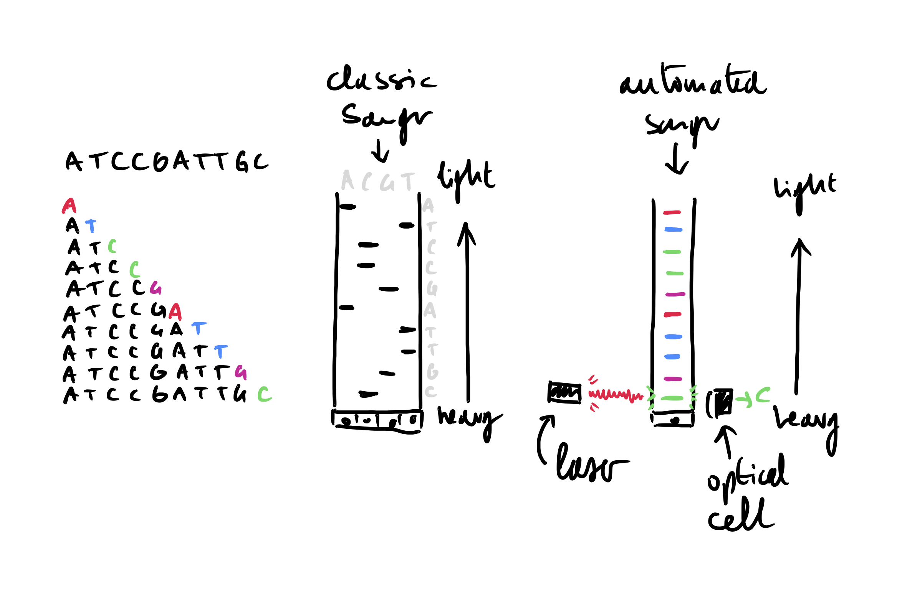
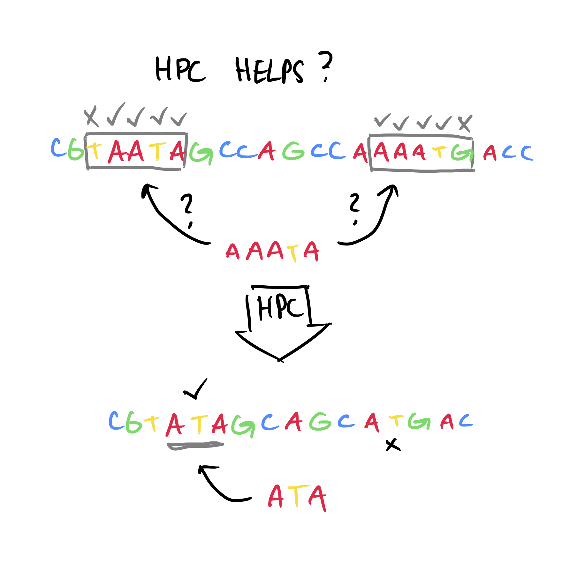

# What is Sequence data ?

## Biological sequences, a primer

To fully understand the work that was done during this thesis, as well as the choices that were made some basic knowledge of biology and more particularly genetics are needed. If you are already familiar with biological sequences, feel free to skip ahead to section \@ref(obtaining-sequence-data).

### What is DNA ?

**D**esoxyribo**N**ucleic **A**cid (DNA) is one of the most important molecules there is, without it complex life as we know it is impossible. It contains all the genetic information of a given organism, that is to say all the information necessary for the organism to: 1) function as a living being and 2) make a perfect copy of itself. This is the case for the overwhelming majority of living organisms on planet earth, from elephants to potatoes, to micro-organisms like bacteria.

DNA is a polymer, composed of monomeric units called nucleotides. Each nucleotide is composed of Ribose (a five carbon sugar) on which are attached a phosphate group as well as one of four nucleobases: Adenine (A), Cytosine (C), Guanine (G) of Thymine (T). These 4 types of nucleotide monomers link up with one-another, through phosphate-sugar bonds, creating a single strand of DNA. The ordered sequence of these four types of nucleotides in strand encodes all the genetic information necessary for the organism to function. Nucleotides in a strand form strong complementary bonds with nucleotides from another strand, A with T and C with G. These bonds allows two strands of DNA to form the double-helix structure of DNA [@watson1953] shown in Figure \@ref(fig:figDNA). The specificity of nucleotide bonds ensure that the two strands of the double helix are complementary and that the information contained in one strand can be recovered from the other. This ensures a certain structural stability to the DNA molecule and a way to recover the important information that could be lost due to a damaged strand.

```{r}
figDNACaption <- "**Double-helix structure of DNA**.\
Each strand of DNA has a phosphate-sugar backbone on which are attached nucleobases. The two strands are linked by complementary bonds between the nucleobases of different strands (A bonding with T and C bonding with G)."
```

```{r, figDNA, fig.cap=figDNACaption, label="figDNA", eval=knitr::is_html_output(), cache=FALSE}
knitr::include_graphics("./figures/Basic-Intro/DNA.png")
```

```{=tex}
\begin{figure}[h]
\centering
\includegraphics[width=\linewidth]{./figures/Basic-Intro/DNA.pdf}
\extcaption{Double-helix structure of DNA}{Each strand of DNA has a phosphate-sugar backbone on which are attached nucleobases. The two strands are linked by complementary bonds between the nucleobases of different strands (A bonding with T and C bonding with G).}
\label{fig:figDNA}
\end{figure}
```
The amount of DNA necessary to encode the information varies greatly from organism to organism: 5400 base pairs (5.4kBp) for the $\varphi X174$ phage [@sangerNucleotideSequenceBacteriophage1977], 4.9MBp for *Escherichia coli* [@archer2011], 3.1GBp for *Homo sapiens* [@nurk2022] all the way up to almost 150GBp for *Paris japonica,* a Japanese mountain flowering plant [@pellicer2010]. While very small genome size tend to occur in smaller, simpler organisms genome size does not correlate with organism complexity [@macgregor2001].

### From Information to action

#### Proteins, their structure and their role

The double stranded DNA molecules present in the cells of a living organism contains only information; in order for the organism to live, this information must be read and transformed into actions. Most of the actions necessary for "life" are taken by large molecules called proteins, they have a very wide range of functions from catalyzing reactions in the cell to giving it it's structure [@alberts2002].

Proteins are macromolecules, that are made up of one or several chains of amino acids. These chains then link together and fold up in a specific 3 dimensional structure, giving the protein the shape it needs to fulfill it's goal. This structure is determined by the sequence of amino acids, and a given protein can be identified by this amino acid sequence [@alberts2002].

This sequence is directly dependent on the information contained in the DNA. First the DNA is transcripted in a similar, but single stranded, molecule called RNA which encodes the same sequence. This RNA molecule is then translated into a protein by the following process [@crick1961]:

1.  Nucleotides in the RNA sequence are read in groups of 3 called a codon.
2.  These codons are read sequentially along the RNA molecule
3.  Each codon corresponds to an amino acid, according to the genetic code.
4.  The sequence of codons in RNA *(and by extension DNA)* determines the sequence of amino acids.
5.  The translation process is stopped when a specific type of codon is read.

With 4 types of nucleotides and codons grouping 3 nucleotides there are $4^3=64$ possible codons. However, as stated above, proteins are only made up of 20 different amino acids, meaning that several different codons correspond to the same amino acid. This gives the translation process a certain robustness to errors that can occur when the DNA is copied to create a new cell, or when it is transformed into RNA prior to protein translation.

The portion of DNA that is read to create the protein is said to be "coding", and is called a gene. There are several thousands of genes in the human genome [@internationalhumangenomesequencingconsortiumFinishingEuchromaticSequence2004] resulting in proteins executing thousands of different functions in a cell. In human beings, coding DNA represents only 1% to 2% of the total genome [@elkonCharacterizationNoncodingRegulatory2017; @omennReflectionsHUPOHuman2021]. The large majority of the DNA in a human being is not translated into proteins, a portion of it has a regulatory role, controlling transcription and translation, but the role remains unknown for a portion of the human genome [@shabalinaMammalianTranscriptomeFunction2004; @IntegratedEncyclopediaDNA2012].

#### Making mistakes

Going from DNA sequence to protein is quite a complicated process involving several steps, it is therefore possible for a mistake to happen. There are several mechanisms to avoid mistakes and alteration of the genetic information: the complementary nature of the 2 strands of DNA, the redundant nature of the genetic code as well as error correction mechanisms in the molecules that read and write DNA and RNA *(polymerases)*. However, despite all that, some errors still make it through.

##### Where can mistakes happen ?

There are several sources of error that can alter the genetic information [@chatterjee2017]:

-   **DNA replication:** When a cell divides, or when an organism reproduces, the DNA molecule must be copied in order to transmit genetic information. This process has a very low rate of errors, with as low as 1 error for every billion to every hundred billions of base pairs replicated [@fijalkowska2012]. This is due to the fact that the DNA polymerase (the protein that is responsible for copying DNA molecules), has a relatively error rate to start with, but mostly due to the error correcting mechanisms that are present in certain cells and bacteria [@pray2008dna].

-   **RNA transcription:** error rate between 4 errors for each million [@gout2013] to 2 errors for each hundred thousand [@gout2017] base pairs transcribed.

-   **Other mutagenic events:** Ionizing radiation [@desouky2015], UV rays [@kiefer2007], Toxins [@bennett2003], heat Stress [@kantidze2016], cold stress [@gregory1994], oxidative stress [@gafter-gvili2013].

##### What kind of errors are possible?

-   substitution
-   insertion
-   deletion

##### What effect can mutations have ?

SNPs, many individual mutations have been linked to certain traits (however, a trait is not usually caused only by a single mutation, plus hard to prove causality)

-   Diseases:

    -   Pathologic coagulation linked to a single mutation in DNA coding for a coagulation protein [@kujovichFactorLeidenThrombophilia2011].

    -   Cystic Fibrosis, a deletion of a single amino acid in the protein leads to fatal disease [@cuttingCysticFibrosisGenetics2015]

    -   Plenty of mutation in specific genes have been linked with type 2 diabetes [@fuchsbergerGeneticArchitectureType2016; @morrisLargescaleAssociationAnalysis2012]

-   Added traits, like drug resistance:

    -   Dozens of mutations proven to confer HIV resistance to commonly used drugs [@rheeHumanImmunodeficiencyVirus2003]

    -   A large amount of mutations have been shown to confer antibacterial resistance in a range of bacteria [@woodfordEmergenceAntibioticResistance2007]

## Obtaining sequence data

In order to study living organisms we need to be able to obtain their genetic information, i.e figure out a way to get the sequence of nucleobases that make up their DNA.

### Sanger sequencing, a breakthrough

The first true sequencing method was developed in 1977 [@sangerDNASequencingChainterminating1977]. Sanger *et al.* devised a simple method to read the sequence of nucleotides that make up a DNA sequence *(also represented in Figure* \@ref(fig:sanger)*)*.

1.  Clone sequence / amplify
2.  Prepare 4 different sequencing environments with a majority of dNTP (ie regular nucleotides) and in each a single type of ddNTP (a terminator). ddNTP are marked
3.  In each test tube add DNA polymerase, primers and denatures DNA fragments you want to sequence
4.  Sequence is replicated until incorporation of ddNTP stopping reaction
5.  Separate replicated fragments by gel electrophoresis (i.e shorter fragments go further), 1 ddNTP type in each lane
6.  With marked you can see which nucleotide is present at a given position

This allowed Sanger *et al.* to sequence the first whole $\varphi X174$ bacteriophage genome [@sangerNucleotideSequenceBacteriophage1977]. This method, although revolutionnary was costly and time consuming.

The marking of primers and ddNTP with fluorescence allowed to do the polymerization in a single test tube and use a single lane for electrophoresis [@smithSynthesisOligonucleotidesContaining1985; @smithFluorescenceDetectionAutomated1986]. The fluorescence also allowed for automated reading with optical systems. Plus switching to capillary electrophoresis allowed for automation and speeding up. Shotgun sequencing also speed up stuff at the reconstruct the whole genome.

```{r, sangerCaption}
sangerCaption <- "caption (WIP)"
```

```{r, sanger, label="sanger", fig.cap=sangerCaption, eval=knitr::is_html_output, out.width="60%"}

```

```{=tex}
\begin{figure}[h]
\centering
\includegraphics[width=0.6\linewidth]{./figures/Basic-Intro/sanger-sequencing.pdf}
\extcaption{Caption}{(WIP)}
\label{fig:sanger}
\end{figure}
```

***I need to speak of performance / throughput of these methods here.***

With the latest Sanger sequencing technologies, sequenced sequences can reach 1kBp with an accuracy of 99.999% [@shendureNextgenerationDNASequencing2008]. Although very time consuming and expensive at it's dawn, the sequencing of the first human genome costing between 500 million and 1 billion dollars [@CostSequencingHuman]. Over time and with technological advancments, the cost of Sanger sequencing was greatly reduced from \$1000 per Bp [@collinsHumanGenomeProject2003] to \$0.5 per kBp [@shendureNextgenerationDNASequencing2008], and the throughput increased from 1 kBp per day [@collinsHumanGenomeProject2003] to up to 120 kBp per hour [@liuComparisonNextGenerationSequencing2012].

### Next-generation sequencing

Developed to lower cost and more throughput

-   Massively parallel *(no need to detail technology, just numbers i.e. throughput and cost) (i.e. 2nd gen)* [@metzkerSequencingTechnologiesNext2010]

    -   Key points:

        -   Break up DNA to sequence in smaller fragments

        -   Amplify fragments (i.e. clone them)

        -   Attach fragments to solid support so we can thousands to billions of sequencing reactions at once

        -   detect the polymerization as it happens, speeding up the process.

    -   Illumina:

        -   150nt [@mardisDecadePerspectiveDNA2011]

        -   98% accuracy, \$0.07 per MBp, 2.5 to 12.5 Gbp per hour [@liuComparisonNextGenerationSequencing2012]

        -   Detect polymerization by adding marked terminating NTP, imaging and cleaving terminating group to allow further polymerization.

    -   pyrosequencing:

        -   400nt [@mardisDecadePerspectiveDNA2011]

        -   99.9% accuracy, \$10 per MBp, 30Mbp per hour [@liuComparisonNextGenerationSequencing2012]

        -   Detect polymerization with a reaction that emits light during the incorporation of a dNTP to the synthesized DNA, measure the light emission to determine the base that was added.

-   Long reads sequencing (i.e. 3rd gen):

    -   Introduce need for longer reads:

        -   Better for analyzing complex and repetitive parts of the genome, and were used for assembly **[CITE]**, structural variant detection **[CITE]**, etc...

        -   Real time sequencing, i.e.

        -   High throughput and

    -   PacBIO SMRT [@eidRealTimeDNASequencing2009]:

        -   Tech summary:
            -   Link 2 strands of DNA to sequence with a hairpin sequence to create circular DNA

            -   Capture inserted with polymerase fixed to bottom of a well (up to 8million wells in 1 sequencing cell)

            -   Florescently marked dNTP are added and excited with laser and light emission recorded by camera

            -   Stop when you reach the hairpin
        -   Most reads around 10kb in length with reads up to 60kb [@rhoadsPacBioSequencingIts2015]
        -   85% to 92% accuracy [@chaissonResolvingComplexityHuman2015; @logsdonLongreadHumanGenome2020]
        -   \$0.32 per Mbp [@murigneuxComparisonLongreadMethods2020]
        -   2Gbp to 11Gbp per hour [@logsdonLongreadHumanGenome2020]

    -   NanoPore [@clarkeContinuousBaseIdentification2009]:

        -   Tech summary:

            -   100k nanopores spread out on synthetic membrane

            -   Protein splits the 2 strands and pushes 1 of the brands through a nanopore at a controlled rate

            -   As DNA goes through the pore it disrupts the electrical current between 2 sides of the membrane

            -   Disruptions are characteristic of the 5/6 bases in the nanopore channel -\> deduce sequence from current disruptions (i.e. base calling)

        -   Median read length around 10kb - 12kb [@ipMinIONAnalysisReference2015; @logsdonLongreadHumanGenome2020].

        -   you can get ultra long reads, of almost 1Mb [@jainNanoporeSequencingAssembly2018; @TharSheBlows] and even up to 2.3 Mb [@payneBulkVisGraphicalViewer2019].

        -   87% to 98% accuracy [@jainOxfordNanoporeMinION2016; @logsdonLongreadHumanGenome2020]

        -   \$0.13 per Mbp [@murigneuxComparisonLongreadMethods2020]

        -   12.5Gbp to 260Gbp per hour !! [@logsdonLongreadHumanGenome2020]

As a conclusion, quickly mention the work done on protein sequencing:

-   has been going on for a long time [@huntProteinSequencingTandem1986; @smithProteinSequencingProtocols2002] with mass spectrometry

-   But still ongoing with new methods [@restrepo-perezPavingWaySinglemolecule2018]

but we usually deduce the protein sequence from the DNA sequence that is translated from codons after detecting ORFs.

## Sequencing errors, how to account for them ?

Just like mutations we can get substitutions and indels.

general context of sequencing errors, i.e. short reads have high accuracy (After computational correction you can get 10^-4^ to 10^-5^ error rate [@maAnalysisErrorProfiles2019] ) , long reads high error rate as stated before, 10% to 15%.

### Error correction methods

-   In Non-Hybrid error correcting methods only the long reads are used, by overlapping them and taking the consensus of the overlap it is possible to eliminate some errors, as well as filtering very rare subsequences likely due to a sequencing error [@limaComparativeAssessmentLongread2020; @amarasingheOpportunitiesChallengesLongread2020]. These methods are applied in several pieces of software like wtdbg2 [@ruanFastAccurateLongread2020], canu [@korenCanuScalableAccurate2017], or daccord [@tischlerNonHybridLong2017].

-   In Hybrid methods, shorter more accurate reads are used to correct long-read errors, it has been used in software like proovread [@hacklProovreadLargescaleHighaccuracy2014], Jabba [@miclotteJabbaHybridError2016] or LoRDEC [@salmelaLoRDECAccurateEfficient2014]

-   In some cases it can be useful to correct errors after having assembled the raw reads in a process called polishing. One can use non-hybrid methods by filtering out rare subsequences like in ntEdits , or correcting with raw PacBio or ONT data as is done in Arrow [@heplerImprovedCircularConsensus2016] or Nanopolish [@simpsonDetectingDNACytosine2017] respectively. Conversly, hybrid methods using short reads also exist to correct assembled reads like Pilon [@walkerPilonIntegratedTool2014] or Racon [@vaserFastAccurateNovo2017].

-   Error correction bibliography is rich and many people are working on this [@limaComparativeAssessmentLongread2020; @fuComparativeEvaluationHybrid2019; @zhangComprehensiveEvaluationLong2020]

### More accurate sequencing methods

-   CCS / HiFi stuff -\> 99.8% to 99.9% accuracy on long reads [@wenger2019; @logsdonLongreadHumanGenome2020] because errors are randomly distributed. Most errors are still indels in homopolymers [@wenger2019]

-   Using unique molecular identifiers and consensus reads, you can reduce error rate to 99.59% and 99.93% accuracies for ONT and PacBio CCS [@karstHighaccuracyLongreadAmplicon2021].

-   Improve base calling models for ONT by switching from HMMs to deep learning, [@peresiniNanoporeBaseCalling2021; @bozaDeepNanoDeepRecurrent2017; @wickPerformanceNeuralNetwork2019; @amarasingheOpportunitiesChallengesLongread2020]

-   Built in error correction [@chenHighlyAccurateFluorogenic2017], results in shorter reads with 99.82% accuracy (200-250nt reads though). Error free up to 200bp.

-   To come Illumina Infinity [@HighPerformanceLong], high throughput long reads.

## The special case of homopolymers

### Homopolymers and the genome

```{r, hp-analysis}
names <- c("chromosome", "length", "base", "count")
hps <- read.table("./data/chm13_hp_counts2.txt", sep="\t", col.names=names)
big_l <- 4
big <- hps %>% filter(length >= big_l)

genome_size  <- 3054832041
hp_size <- sum(hps$length * hps$count)
big_hp_size <- sum(big$length * big$count)

freqs <- hps %>%
  group_by(length) %>%
  summarize(prop = sum(count)/genome_size)
```

-   What are homopolymers -\> repeated stretches of identical nucleotides
-   On the CHM13 whole human genome assembly v1.1, `r format(100 * hp_size / genome_size, digits=1)`% of the 3Gb are in homopolymers of size length or more, and `r format(100 * big_hp_size / genome_size, digits=1)`% are in homopolymers fof size `r big_l` or more. The longest homopolymer in the CHM13 v1.1 whole human genome assembly is `r max(hps$length)`. Homopolymers of short/medium lengths make up a significant part of the human genome (Figure \@ref(fig:HPpercent)).
-   HPs are more often A/T rich than G/C rich in the human genome (Figure \@ref(fig:HPdistrib)).
-   More than 1.4 million homopolymers 4-mers and up in the exome (i.e. DNA that is translated into proteins) [@ivadyAnalyticalParametersValidation2018]
-   according to [@booeshaghiPseudoalignmentFacilitatesAssignment2022], in the GRCh38 human genome assembly, more than 1.9 Mb are in homopolymers of length 8 or higher, representing about a thousandth of the genome, still a lot of bases to make mistakes on! Longest HP is 90.

```{r, hpCaption}
hpDistribCaption <- paste0("Distribution of homopolymer lengths per base in the human genome (for homopolyers of length $\\geq ", big_l, "$.)")
```

```{r, HPdistrib, fig.cap=hpDistribCaption, label="HPdistrib", out.width="70%", cache=FALSE}

ggplot(big, aes(x=length, y=count, fill=base)) +
  geom_col() +
  theme(legend.position = "none") +
  facet_wrap(. ~ base)
```

```{r, HPpercent, fig.cap="Homopolymer length as fraction of the genome", label="HPpercent",out.width="70%"}
# 
labels <- c("", "", "", "", "", "", "", "", "", expression(10^1), "", "", "", "", "", "", "", "", expression(10^2))
breaks <- c(1, 2, 3, 4, 5, 6, 7, 8, 9, 10, 20, 30, 40, 50, 60, 70, 80, 90, 100)

ggplot(freqs, aes(x=length, y=prop)) +
  geom_point() +
    scale_x_log10(
    breaks = breaks,
    labels = labels,
  name="homopolymer length"
  ) +
 scale_y_log10(
    breaks = scales::trans_breaks("log10", function(x) 10^x),
    labels = scales::trans_format("log10", scales::math_format(10^.x)),
    name="cumulative occurence as a\nfraction of genome size"
 )
```

### Homopolymers and long reads

Mainly indels, in certain regions of the genomes, particularly homopolymers. For ONT [@delahaye2021; @goodwin2015], for PacBIO and ONT [@dohmBenchmarkingLongreadCorrection2020; @weirather2017]. ONT has more homopolymer errors than PacBIO [@logsdonLongreadHumanGenome2020]. For short reads and PacBio the error rate usually goes up as the homopolymer length grows, however ONT's error rate in HPs does not depend on the length (even though it's the highest it's flat) [@fooxPerformanceAssessmentDNA2021].

### Accounting for homopolymers

#### Specific error correction

-   In some cases homopolymers are taken into special consideration during polishing [@huangHomopolishMethodRemoval2021; @simpsonDetectingDNACytosine2017], and computational approaches are developed to deal with homopolymers [@rangSquiggleBasepairComputational2018; @sarkozyCallingHomopolymerStretches2018]
-   Specific technologies:
    -   R.10 Nanopore: [@R10NewestNanopore; @amarasingheOpportunitiesChallengesLongread2020]

    -   Solid state nanopores: [@zhouDetectionDNAHomopolymer2019; @gotoIdentificationFourSinglestranded2018]

    -   BaseCallers which deal with homopolymers, like can be seen in Fig 3 of [@wickPerformanceNeuralNetwork2019] (scrappie raw 1.4.1 or guppy)
-   Avoid using HPs in barcode sequences [@hawkinsIndelcorrectingDNABarcodes2018; @srivathsanMinIONBasedPipeline2018].
-   A little different but HPs have to be taken into account when developing DNA based data storage [@wangConstructionBioConstrainedCode2019]

#### HPC Trick

homopolymers are still tricky regions even with long high accuracy reads -\> so HPC

-   HPC takes repeated runs of a single nucleotide and compresses them to a single occurrence

-   Can help resolve ambiguities in some cases c.f. Figure \@ref(fig:hpcSchema).

-   Used in many software tools for long reads [@auImprovingPacBioLong2012; @nurkHiCanuAccurateAssembly2020; @liMinimap2PairwiseAlignment2018; @ruanFastAccurateLongread2020; @shafinNanoporeSequencingShasta2020; @sahlinNovoClusteringLongRead2020; @ekimMinimizerspaceBruijnGraphs2021] and even pyrosequencing reads [@millerAggressiveAssemblyPyrosequencing2008]

reconstruct the whole genome.

```{r, hpcCaption}
hpcCaption <- "caption (WIP)"
```

```{r, hpcSchema, label="hpcSchema", fig.cap=hpcCaption, eval=knitr::is_html_output,out.width="60%"}

```

```{=tex}
\begin{figure}[h]
\centering
\includegraphics[width=0.6\linewidth]{./figures/Basic-Intro/hpc-helps.pdf}
\extcaption{Caption}{(WIP)}
\label{fig:hpcSchema}
\end{figure}
```

## Conclusion

-   **Sequencing is an active field:** new methods, both in short reads (ultima) and long reads (illumina infinity), as well as improving existing technologies

-   **Long reads are good:** Super useful for plenty of very important tasks but...

-   **Errors are bad:** particularly in HPs since they are an important part of the genome and a major source of error in long reads

-   **Computational view:** sequences Essentially a text file. Just a long succession of letters, so we can apply String/text algorithmics to it.

\printbibliography[segment=\therefsegment,heading=subbibintoc,title={References for chapter \thechapter}]
