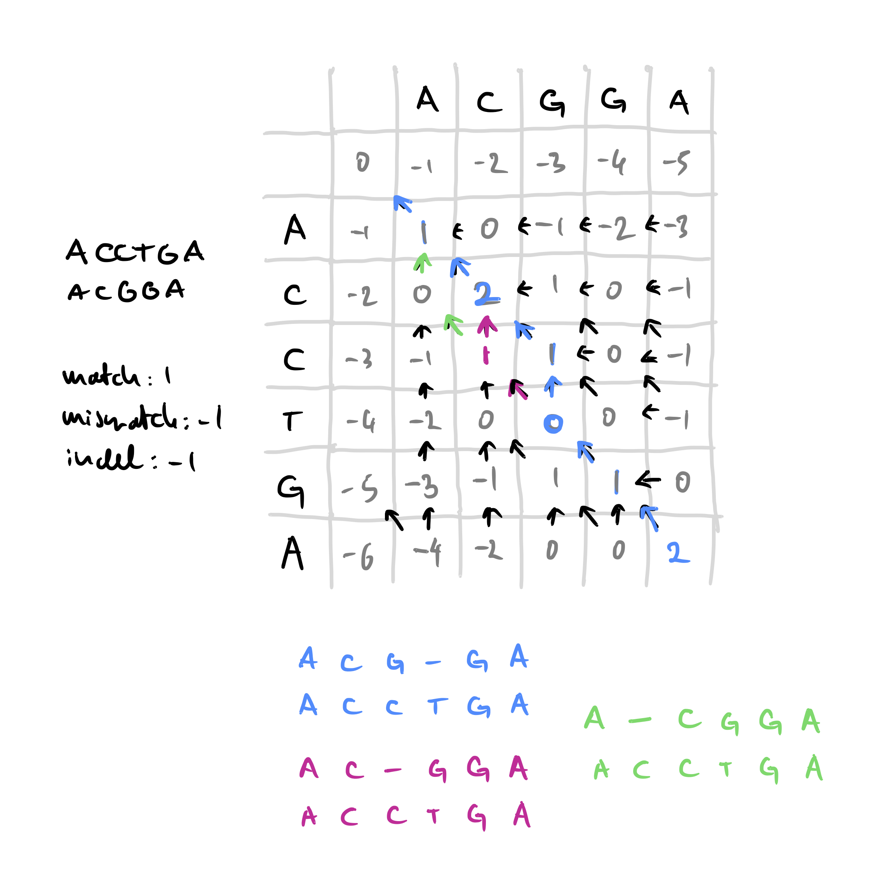
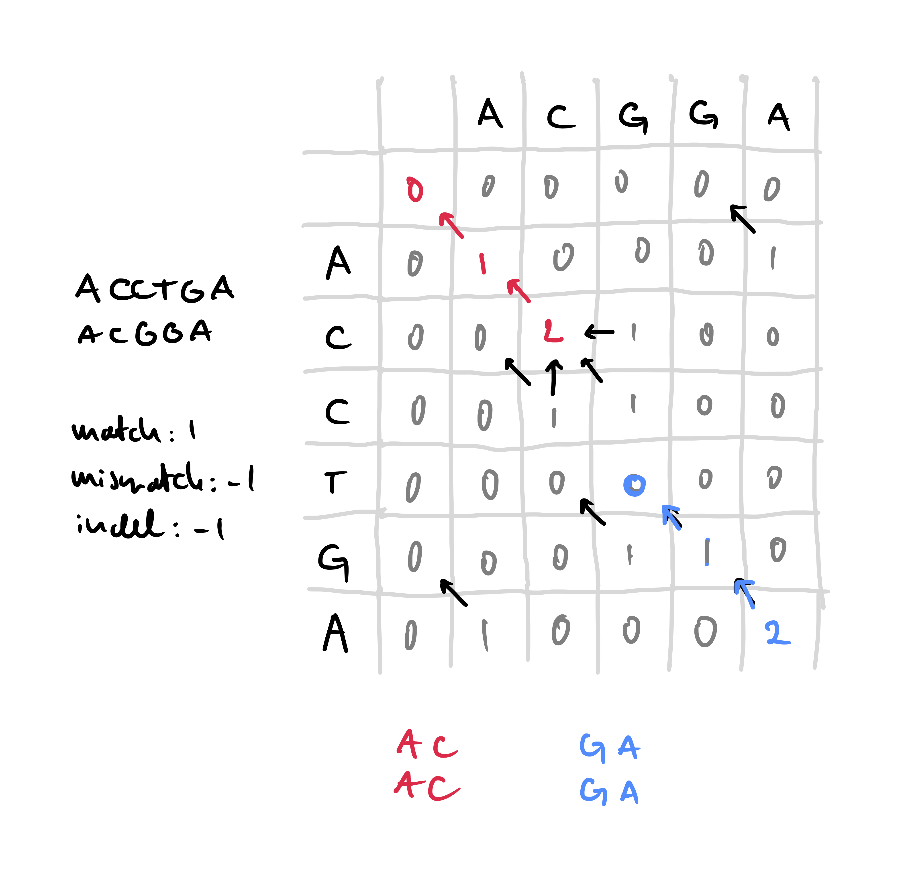
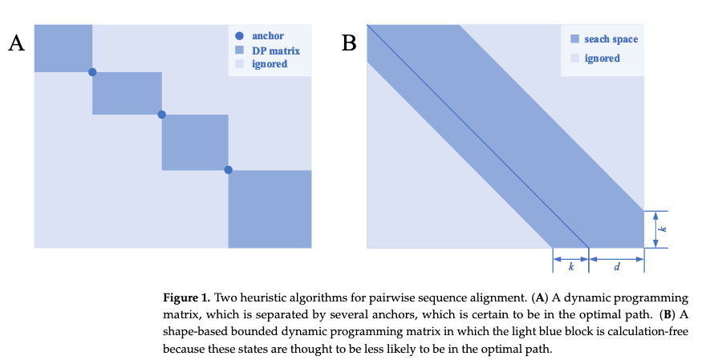
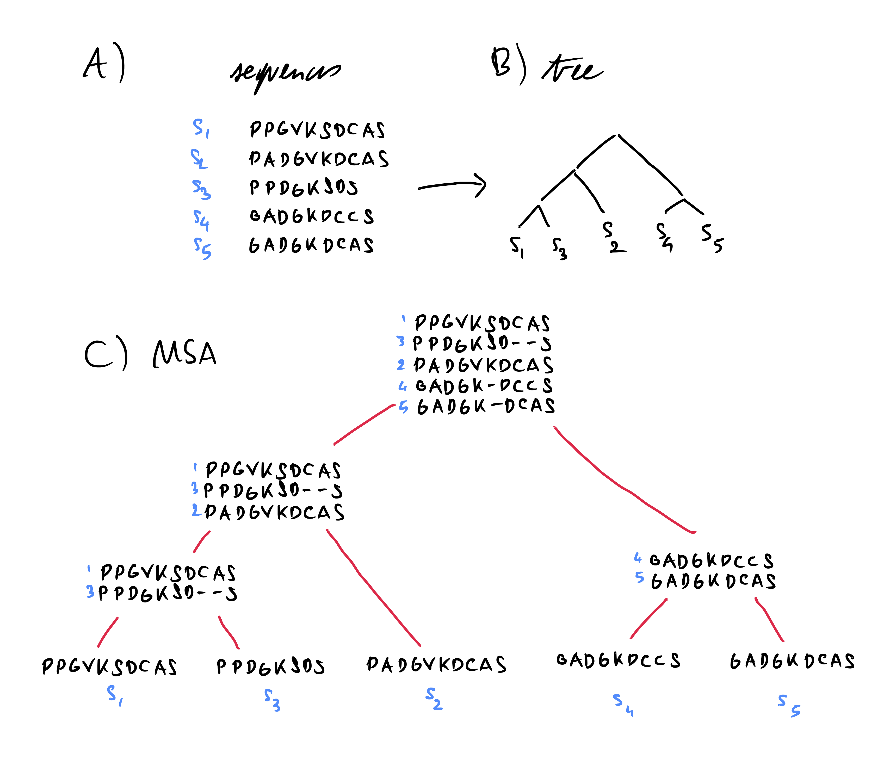

# Aligning sequence data

## What is an alignment ?

In biology, comparison is at the heart of many studies: between individuals, between species, between sequencing runs, *etc*... In order to do this at a fine grained level and extract knowledge from it we need to compare what is comparable, this is where sequence alignment steps in. In broad terms, during sequence alignment, we aim to find regions similar to each other in two or more sequences and group them together. When this process is done with only two sequences it is called a *pairwise alignment*, when three or more sequences are used it is called *multiple alignment*. We will first focus on pairwise alignment as it was used as the basis for the more complex multiple alignment.

### Why align ?

The first question we might ask ourselves is why align at all, if we want to compare two sequences there are plenty of distances and metrics out there to use. Something like the Hamming distance [@hammingCodingInformationTheory1980] is very quick and easy to compute by comparing characters two by two. It is however ill-suited to our needs in biology: first the two sequences to compare must be of the same length, second the differences between the sequences arise from biological processes. These processes (c.f. Section \@ref(what-kind-of-errors-are-possible)) can be substitutions which the Hamming distance can handle, however insertions and deletions shifts one of the sequences and introduce many character-to-character differences that could be explained by a single indel.

For example, if we have the two following sequences `ATGTGCAGTA` and `AGTGCAGTAC`. if we count the differences character by character, except the first pair of A, all the characters are different (c.f. below). However if we consider that the first T was deleted and a C was inserted at the end of the second sequence then we can see that none of the characters are actually different. In order to represent insertions and deletions *gaps* are inserted in the sequences as seen below:

<center>

| **`ATGTGCAGTA-`**
| **`A-GTGCAGTAC`**

</center>

This problem of comparing two sequences with insertions or deletions is a fairly studied one in text algorithmics: the string-edit problem [@gusfieldAlgorithmsStringsTrees1997]. Some metrics like the Levenshtein distance [@levenshteinBinaryCodesCapable1966] and the more edit distance [@gusfieldAlgorithmsStringsTrees1997] exist and are closely related to the pairwise sequence alignment problem, finding the minimal number of substitution, insertion of deletion operations to go from one sequence to the other.

Sequence alignments have many downstream use-cases. They are the basis of comparative genomics [@hardisonComparativeGenomics2003] and are used to infer evolutionary relationships and phylogenetic tree reconstruction methods usually take as input multiple alignments [@felsensteinEvolutionaryTreesDNA1981; @kumarMEGAMolecularEvolutionary1994; @kozlovRAxMLNGFastScalable2019; @guindonNewAlgorithmsMethods2010; @priceFastTreeApproximatelyMaximumLikelihood2010]. Sequence alignments have been used to study protein structure [@jumperHighlyAccurateProtein2021; @karplusPredictingProteinStructure1999 ] and function [@watsonPredictingProteinFunction2005; @leePredictingProteinFunction2007]. They can be used to correct sequencing errors [@hacklProovreadLargescaleHighaccuracy2014; @korenHybridErrorCorrection2012; @salmelaCorrectingErrorsShort2011] or detect structural variations in genomes [@medvedevComputationalMethodsDiscovering2009; @mahmoudStructuralVariantCalling2019]. All this to say that they are absolutely fundamental to the field of computational biology and errors in alignments can lead to errors somewhere down the line.

### How to align two sequences ?

There are two approaches for for pairwise alignment [@sungAlgorithmsBioinformaticsPractical2011]: *global alignment* where the entirety of both sequences is used when aligning them, and *local alignment* where we only seek to find regions in each sequence that are most similar to each other. Global alignment is used when the two sequences are expected to be quite similar (e.g. comparing two related proteins), whereas local alignment is mostly used when we expect the sequences to be fairly different but with highly similar regions, like genomes of two distantly related species that share a highly conserved region.

The seminal method for global pairwise alignment was the Needleman-Wünsch algorithm [@needlemanGeneralMethodApplicable1970] based on a dynamic programming method. A decade later, the Smith-Waterman algorithm [@smithIdentificationCommonMolecular1981] was developed with similar ideas to perform local alignment. Both are still used today for pairwise alignment.

Dynamic programming is often used to solve complex problems by breaking it into smaller sub-problems and solving each one optimally and separately [@bradleyAppliedMathematicalProgramming1977; @bellmanTheoryDynamicProgramming1954], it is particularly useful when we wish to have a precise alignment between 2 sequences.

#### Global alignment

The fundamental algorithm for globally aligning two sequences was the Needleman-Wünsch (NW) algorithm [@needlemanGeneralMethodApplicable1970], this can be conceptualized in one of two equivalent ways: finding the alignment with 1) the lowest edit-distance or 2) the highest alignment score. These two are equivalent so in this section we will maximize the alignment score.

The first thing that is needed is, given an alignment, how to compute an alignment score. To do this we need to assign costs to each operation. Usually matches (i.e. aligning two identical characters) are given a positive cost and mismatches or indels a negative cost. If we assign a cost of +1 to a match and a cost of -1 to mismatches and indels then the alignment presented above in Section \@ref(why-align) would have an alignment score of 9 - 2 = 7 *(9 matches and two indels)*.

The NW algorithm is based on a simple recurrence relation: the optimal alignment score of two sequences $S_1$ and $S_2$ of lengths $n$ and $m$ respectively is the maximum of:

1.  The optimal alignment score of $S_1[1,n-1]$[^aligning-sequences-1] and $S_2[1,m-1]$ plus the cost of a match or mismatch between the $n^{th}$ character of $S_1$ and the $m^{th}$ character of $S_2$

2.  The optimal alignment score of $S_1$ and $S_2[1,m-1]$ plus the cost of an indel

3.  The optimal alignment score of $S_1[1,n-1]$ and $S_2$ plus the cost of an indel

[^aligning-sequences-1]: Here I am using an index starting at 1 and inclusive, so $S_1[1,n-1]$ represents the first $n-1$ characters. If $S_1 = ABCD$ then $S_1[1;3]=ABC$

This simple relation can be used to compute optimal global alignment score for two sequences, however if it is implemented naively it can be very inefficient as the number of scores to compute grows exponentially with sequence lengths, and many intermediary alignment scores need to be computed many times. This is where dynamic programming comes in: these intermediary costs are pre-computed in an efficient manner and one can then deduce the optimal alignment from these. This pre-computing step is usually represented as filling out a matrix whose rows and columns represent the characters in each sequence to be aligned.

If $S_1$ represents the rows of the matrix, and $S_2$ the columns, the value $C(i,j)$ of a cell $(i,j)$ of this matrix represents the optimal alignment score between $S_1[1,i]$ and $S_2[1,j]$. In the recurrence relation described above the alignment score as dependant on the optimal alignment scores of subsequences, when filling out the dynamic programming matrix we proceed in the inverse fashion by using the scores of short subsequences to build up the scores of progressively longer sequences.

We will go here through a short example showing how the NW algorithm is used to align two short sequences: $S_1=$`ACCTGA` and $S_2=$`ACGGA`. The first step is to represent the dynamic programming matrix, prefix each sequence with an empty character and label the rows of the matrix with one of the sequences and the columns with the other *(this extra row and column at the beginning of each sequence are indexed as column and row 0)*. In this matrix, due to the recurrence relation stated above, the score of a particular cell, $C(i,j)$ is the maximum of:

1.  The score in the diagonally adjacent cell $C(i-1,j-1)$ plus the cost of a match or mismatch between $S_1[i]$ and $S_2[j]$.
2.  The score of the cell to the left $C(i,j-1)$ plus the cost of an indel
3.  The score of the cell on top $C(i-1,j)$ plus the cost of an indel

Therefore in order to compute $C(i,j)$ we need to know the three values of $C(i-1,j-1)$, $C(i-1,j)$ and $C(i,j-1)$. This is the reason why we start with an extra column and row at the beginning of each sequence that we can fill out with the increasing costs of indels. In our case since the cost of an indel is -1, this row and column are filled out with decreasing relative integers, as can be seen in the matrix below.

| $S_1$\\$S_2$ |     |  A  |  C  |  G  |  G  |  A  |
|:------------:|:---:|:---:|:---:|:---:|:---:|:---:|
|              |  0  | -1  | -2  | -3  | -4  | -5  |
|      A       | -1  |     |     |     |     |     |
|      C       | -2  |     |     |     |     |     |
|      C       | -3  |     |     |     |     |     |
|      T       | -4  |     |     |     |     |     |
|      G       | -5  |     |     |     |     |     |
|      A       | -6  |     |     |     |     |     |

From this starting point we can fill out the Dynamic programming matrix with all the alignment scores. To compute $C(1,1)$ we have three possible values:

1.  $C(0,0)$ plus the cost of a match between $S_1[1]=A$ and $S_2[1]=A$: $0+1=1$
2.  $C(0,1)$ plus the cost of an indel: $-1 -1 = -2$
3.  $C(0,1)$ plus the cost of an indel: $-1-1=-2$

By taling the maximum out of these three values we can fill out the matrix with $C(1,1)=1$. By continuing this process until we fill out the whole we obtain the scores visible below. This is enough if we only want to compute the optimal global alignment score between $S_1$ and $S_2$, however if we want to deduce the operations leading to alignment, and therefore the alignment itself, we need to keep track of which operation we made to get a specific score. The easiest way to do that is to also consider this matrix as a graph where each cell is a vertex. When we compute the score of cell $(i,j)$ we add an edge from this cell to the previous cell that was used to compute $C(i,j)$. In our example above, we obtained $C(1,1)$ from a match and $C(0,0)$, so we can add an edge in our graph going from cell $(1,1)$ to cell $(0,0)$. The filled out matrix with the graph edges represented as arrows can be seen in Figure \@ref(fig:nwAlign).

| $S_1$\\$S_2$ |     |  A  |  C  |  G  |  G  |  A  |
|:------------:|:---:|:---:|:---:|:---:|:---:|:---:|
|              |  0  | -1  | -2  | -3  | -4  | -5  |
|      A       | -1  |  1  |  0  | -1  | -2  | -3  |
|      C       | -2  |  0  |  2  |  1  |  0  | -1  |
|      C       | -3  | -1  |  1  |  1  |  0  | -1  |
|      T       | -4  | -2  |  0  |  0  |  0  | -1  |
|      G       | -5  | -3  | -1  |  1  |  1  |  0  |
|      A       | -6  | -4  | -2  |  0  |  0  |  2  |

Once this matrix *(and corresponding graph)* is filled out, we can deduce the alignment by following a path through the graph starting at cell $(n,m)$ to cell $(0,0)$. A diagonal edge starting at $(i,j)$ indicates a match or mismatch between $S_1[i]$ and $S_2[j]$, a vertical edge indicates a gap in $S_2$ and a horizontal edge a gap in $S_1$. This can lead to several optimal alignments if there are several such paths in the graph. In our case this algorithm yields three equally optimal global alignments shown in Figure \@ref(fig:nwAlign).

```{r, nwCaption}
nwCaption <- "**Example global alignment with the Needleman-Wunsch algorithm**\ The match score is 1, the mismatch and indel scores are both set to -1. This results in 3 equally optimal global alignments."
```

```{r, nwAlign, label="nwAlign", fig.cap=nwCaption, eval=knitr::is_html_output(), out.width="60%"}

```

```{=tex}
\begin{figure}[h]
\centering
\includegraphics[width=0.6\linewidth]{./figures/Align-Intro/Nw-dp.pdf}
\extcaption{Example global alignment with the Needleman-Wunsch algorithm}{The match score is 1, the mismatch and indel scores are both set to -1. This results in 3 equally optimal global alignments.}
\label{fig:nwAlign}
\end{figure}
```
This algorithm although guaranteed to result in an optimal alignment, has a time complexity of $O(nm)$ where $n$ and $m$ are the lengths of the sequences to align [@sungAlgorithmsBioinformaticsPractical2011]. Some methods have been proposed to speed up [@masekFasterAlgorithmComputing1980], however the complexity is still $O(nm/\log(n))$. Lower bounds have been studied and there is not much optimization to be done if optimal exact alignment are needed [@vinhInformationTheoreticMeasures2010; @ullmanBoundsComplexityLongest1976]. If we want to do better we have to rely on heuristics.

Another issue is space complexity since we need to store the matrix, the space complexity is also $O(nm)$. If we wish to align 2 human genomes we would need to store $\approx 10^{19}$ matrix cells, which would amount to 10 Exabytes of storage if we use 8bit integers *(i.e. the storage scale of a data-center)*. However, in practice, we can do much better than that, and construct an optimal alignment in linear space complexity $O(n+m)$ [@hirschbergLinearSpaceAlgorithm1975] meaning we would only need a couple gigabytes to store the matrix for 2 human genomes. This resulted in an improved global alignment algorithm, the Myers-Miller algorithm [@myersOptimalAlignmentsLinear1988], implemented in the EMBOSS stretcher alignment software [@riceEMBOSSEuropeanMolecular2000].

#### Local alignment

In global alignment two full sequences are aligned to each other. In local alignment the goal is to find the optimal alignment of two subsequences from these parent sequences. The main algorithm for locally aligning is the Smith-Waterman (SW) algorithm [@smithIdentificationCommonMolecular1981] developed a decade later than NW.

The two algorithms are very similar, SW also relies on first building the dynamic programming matrix with the same parametrizable costs for matches, mismatches and indels as NW. One key difference is that the optimal scores in the matrix are bound by 0 so they cannot become negative, we only store edges in the alignment graph is the starting cell has an alignment score \> 0. If we use the SW algorithm to locally align the two example sequences $S_1$ and $S_2$ and the same costs as used above, we obtain the dynamic programming matrix and graph shown in Figure \@ref(fig:swAlign).

```{r, swCaption}
swCaption <- "**Example local alignment with the Smith-Waterman algorithm**\ The match score is 1, the mismatch and indel scores are both set to -1. This results in 2 equally optimal local alignments."
```

```{r, swAlign, label="swAlign", fig.cap=swCaption, eval=knitr::is_html_output(), out.width="60%", cache=FALSE}

```

```{=tex}
\begin{figure}[h]
\centering
\includegraphics[width=0.6\linewidth]{./figures/Align-Intro/SW-dp.pdf}
\extcaption{Example local alignment with the Smith-Waterman algorith}{The match score is 1, the mismatch and indel scores are both set to -1. This results in 2 equally optimal local alignments.}
\label{fig:swAlign}
\end{figure}
```
The traceback part to determine the optimal alignment is very similar to NW, however instead of starting at cell $(n,m)$, we start at the cell in with the maximal alignment score and follow the path back until we arrive at a cell with an alignment score of 0. In the example shown in Figure \@ref(fig:swAlign), two cells contain the maximal alignment score of 2. Tracing back from these cells gives two optimal local alignments between $S_1$ and $S_2$: `AC` to `AC` and `GA` to `GA`.

Since the SW algorithm is so similar to NW it has the same quadratic time and space complexity, however the same optimization can be used to bring it down to a linear space complexity [@sungAlgorithmsBioinformaticsPractical2011]. Optimizations were resulted in the Huang and Miller algorithm [@huangTimeefficientLinearspaceLocal1991] which is implemented in the EMBOSS Lalign tool [@riceEMBOSSEuropeanMolecular2000], and the Waterman Eggert algorithm [@watermanNewAlgorithmBest1987].

Both the NW and the SW algorithms are implemented in many different software tools and are used widely to perform pairwise alignments of short sequences [@stajichBioperlToolkitPerl2002; @gentlemanBioconductorOpenSoftware2004; @riceEMBOSSEuropeanMolecular2000]. Some versions even benefit from hardware acceleration with version implemented for specific CPU instruction sets [@dailyParasailSIMDLibrary2016] or GPUs [@frohmbergGPASImprovedVersion2012] to substantially speed up alignment.

### Scoring and substitution models

In the examples used above to present the NW and SW algorithms, we used a very simple cost function: a match has a cost of +1 while mismatches and indels have a cost of -1. This is really the simplest cost function we can use but also the crudest. In many cases it may be interesting to infuse this cost function with biological knowledge. For example some substitutions might occur more rarely than others in nature so it would stand to reason to penalize those more than other, more common, substitutions.

These biology-aware cost functions usually take the form of a matrix, called scoring or substitution matrix corresponding to an underlying evolutionary model. When using these matrices, matches and mismatches between specific characters are given. For example the cost of aligning an A and a T might be lower than aligning that same A with a G. A lot of different substitution matrices have been developed especially for protein alignments [@altschulSubstitutionMatrices2013], developed with different techniques and underlying models and with different use-cases.

The earliest and simplest substitution matrices are match/mismatch matrices, they are effectively what we used above where all matches are given a fixed positive score and all mismatches a fixed negative score. In our examples above the corresponding substitution matrix would be a four by four matrix with ones on the diagonal indicating matches and -1 everywhere else. These are simple and useful however when dealing with proteins they have a severe limitation as they ignore the biology of amino acids and.

In order to reflect this biological reality of proteins, new substitution matrices were developed using Log-odds models, based on the fact that substitutions in amino acids are not equiprobable, and some mutations between related amino acids *(e.g. I and L)* are much more common than others. Two of the most widely used substitution matrices, PAM and BLOSUM matrices, were built this way. The score for aligning residue $i$ with residue $j$ is given by the matrix entry $s_{i,j}$ by looking at the background frequencies *(i.e. how often one expects to see a particular residue in a sequence)* of $i$ and $j$ denoted $p_i$ and $p_j$ respectively and the frequency $q_{i,j}$ with which $i$ and $j$ are aligned in accurate biological alignments. from this we can compute the substitution score $s_{i,j}$ as a Log-odds [@altschulSubstitutionMatrices2013]:

$$
S_{i,j}=\log\bigg(\frac{q_{i,j}}{p_ip_j}\bigg)
$$

Both $p_i$ and $p_j$ are easy to compute from available biological sequence data, the real work in developing a Log-odds based substitution matrix is to estimate $q_{i,j}$ values. To do this accurate biological alignments are needed, and how you obtain or choose these is determining of the substitution model. Finally this Log-odds formulation yields values with nice properties for local alignment, namely negative scores for unlikely substitutions and positive ones for likely substitutions and matches.

The PAM matrix (Point Accepted Mutation), developed in 1978 [@dayhoffModelEvolutionaryChange1978], is one such matrix. Using families of closely related proteins, and phylogenetic analysis, Dayhoff and colleagues estimated the probability of one amino acid replacing another over time to build an evolutionary model. Using this model they could estimate values for $q_{i,j}$ and obtain a substitution matrix: the PAM matrix. Using this model, several PAM matrices were actually built, optimized for aligning sequences of different similarities: the PAM~250~ matrix is suited to alignments where we expect 20% of identical residues, the PAM~180~ matrix however is suited to more closely related sequences where we expect 27% of identical residues [@altschulSubstitutionMatrices2013]. With the growing amount of sequence data and curated alignments, further refinements have been made leading to the development of PAM-like matrices based on the same principles [@mullerModelingAminoAcid2000] but some improvements to the underlying mathematical model.

The other main type of substitution matrix are the BLOSUM matrices (Block Substitution matrix), developed in 1992 [@henikoffAminoAcidSubstitution1992]. Instead of using whole, closely-related protein sequences like the PAM matrices, the values of $q_{i,j}$ were estimated on highly conserved segments across whole protein families. Furthermore, to derive the BLOSUM scores, Henikoff and Henikoff did not estimate an underlying evolutionary model but only counted substitutions to estimate $q_{i,j}$ values. Similarly to PAM matrices there are several BLOSUM matrices adapted to different levels of similarity between the sequences to be aligned.

PAM and BLOSUM matrices have fairly broad use-cases and are widely used in alignment, however there exist many other protein substitution models. Instead of using log-odds, some substitution models were developed by estimating scores with maximum-likelihood approaches [@whelanGeneralEmpiricalModel2001; @leImprovedGeneralAmino2008]. Some matrices were developed with very specific usage conditions in mind. Some are tailored to specific types of proteins like Transmembrane [@mullerNonsymmetricScoreMatrices2001; @ngPHATTransmembranespecificSubstitution2000], disordered [@trivediAminoAcidSubstitution2019] or polar/non-polar [@goonesekereContextspecificAminoAcid2008] proteins. Some matrices were developed to align sequences from specific organisms like *P. falciparum* [@pailaGenomeBiasInfluences2008] *(responsible for malaria)* or HIV [@nickleHIVSpecificProbabilisticModels2007]. A substitution matrix was even developed in 2005 specifically for global rather than local alignment [@sardiuScoreStatisticsGlobal2005].

This wealth of protein substitution matrices reflects the biological and evolutionary diversity of proteins, however substitution matrices for aligning DNA sequences are much less frequent. Some work has been done to derive matrices similar to PAM matrices from DNA alignments [@chiaromonteScoringPairwiseGenomic2001]. Codon substitution matrices [@schneiderEmpiricalCodonSubstitution2005; @doron-faigenboimCombinedEmpiricalMechanistic2007] have been developed as well, although they are used in DNA sequence alignment, ultimately they use knowledge derived from protein alignments.

### Dealing with gaps

In the NW and SW examples of Section \@ref(how-to-align-two-sequences), as with the simplistic match/mismatch costs, we used a very simple cost of insertions and deletions: any indel has a cost of -1. However this, as was the case with substitutions, does not reflect the biological reality very well.

In biology, when insertions or deletions occur it is more likely that the indel will span several nucleotides rather than just one [@cartwrightProblemsSolutionsEstimating2009]. This means that when inserting gaps into longer gap stretches are more likely than many individual gaps. For example the two alignments below have the same number of matches, mismatches and gaps. The second one is more likely since it is the result of a single insertion (or deletion) of `AGGT` rather than multiple independent indels.

<center>

| **`AGGAGGTTCG`**        **`AGGAGGTTCG`**
| **`A-G-G-T-CC`**        **`AGG----TCC`**

</center>

The first approach was to try and optimize the gaps more generally [@fitchOptimalSequenceAlignments1983] over the whole aligned sequence, however even with dynamic programming this has at best a time complexity of $o(n^2m)$ [@watermanBiologicalSequenceMetrics1976]. In 1982, Gotoh proposed affine gap costs [@gotohImprovedAlgorithmMatching1982], with this model there are two separate costs associated to indels: 1) the gap open cost and 2) the gap extend cost. Usually the costs are set up so that opening a new gap is more costly than extending it, meaning that longer gap stretches are favored over many short indels. The other major advantage is that with Gotoh's algorithm time complexity is back down to $o(nm)$. The algorithm was further refined by Altschul *et al.* [@altschulOptimalSequenceAlignment1986].

Over the years different types of gap costs were developed and tested like the logarithmic gap costs proposed by Waterman [@watermanEfficientSequenceAlignment1984] and improved by Miller and Myers [@millerSequenceComparisonConcave1988] turned out to be less accurate than affine gap costs [@cartwrightLogarithmicGapCosts2006]). A bi-linear gap cost was also proposed to replace the affine cost[@goonesekereFrequencyGapsObserved2004], with a breakpoint at gaps of length three, the size of a codon. As more and more sequence data became available, similarly to what happened with substitution matrices, empirical profile-based models derived from this data were developed [@bennerEmpiricalStructuralModels1993]. Some of these penalties leverage structural information and context for proteins [@wrablGapsStructurallySimilar2004; @zhangSP5ImprovingProtein2008]. A context dependent gap penalty depending on the hydrophobicity of aligned residues is inplemented in Clustal X [@jeanmouginMultipleSequenceAlignment1998] one of the most widely used sequence aligners. Although quite complex and empirically derived, these profile-based penalties show limited improvement over the affine and bi-linear penalties [@wangComparisonLinearGap2011].

## How do we speed up pairwise alignment ?

Although NW and SW give us optimal alignments [@pearson27DynamicProgramming1992] when dealing with large sequences they become impractical due to time and space complexity. We need heuristics, review [@chaoDevelopmentsAlgorithmsSequence2022], .

### Change the method

-   Bounded DP [@spougeSpeedingDynamicProgramming1989a; @fickettFastOptimalAlignment1984], we can make an assumption about the relationship between the sequences, there will probably not be many gaps, therefore the scores we will used will be concentrated around the diagonal of the DP matrix c.f. \@ref(fig:optimMethods)

-   New Algorithms like the wavefront algorithm [@marco-solaFastGapaffinePairwise2020]

-   HMMs:

    -   PairHMMs can be used to align 2 sequences, in some cases it is mathematically equivalent to NW [@durbinBiologicalSequenceAnalysis1998].

    -   Software: HHsearch [@sodingProteinHomologyDetection2005], HMMer [@finnHMMERWebServer2011], MCALIGN2 [@wangMCALIGN2FasterAccurate2006] is used to efficiently search for alignments in large databases

-   You can also align with Fast Fourier Transforms (FFT) as in MAFFT [@katohMAFFTNovelMethod2002] by quickly computing correlations with FFT to find homologous regions and then using these to align.

### Seed and extend with data structures

-   General idea:

    -   Seed + extend for local alignment

    -   Find anchors for global alignment

    -   In both cases: divide and conquer approach: as you can restrict the DP matrix by blocks defined by the anchors/seeds c.f. \@ref(fig:optimMethods)

    -   Many ways of finding seeds [@sunChoosingBestHeuristic2006] and to index them [@liSurveySequenceAlignment2010]

    -   2 use cases:

        -   global alignment: align 2 large sequences that would overload computing resources.

        -   local alignment:

            -   to a database: ie. find hits in many sequences.

            -   to a reference: ie find best hit in one sequence.

```{r}
optimCaption <- "**2 heuristic methods to speed up alignment:**\
divide and conquer and bounded dynamic programming. Adapted from [@chaoDevelopmentsAlgorithmsSequence2022] **(Original figure here as a placeholder, I will adapt it)**"
```

```{r, optimMethods, label="optimMethods", fig.cap=optimCaption, out.width="80%", eval=knitr::is_html_output()}

```

```{=tex}
\begin{figure}[h]
\centering
\includegraphics[width=\linewidth]{./figures/Align-Intro/optim-to-adapt.png}
\extcaption{2 heuristic methods to speed up alignment:}{divide and conquer and bounded dynamic programming. Adapted from \autocite{chaoDevelopmentsAlgorithmsSequence2022} \textbf{(Original figure here as a placeholder, I will adapt it)}
}
\label{fig:optimMethods}
\end{figure}
```
-   Building indices/databases (useful when you want to try aligning a query sequence to a bunch of possible targets, i.e. in order to search for homology, this does approximate local alignment):

#### Hash tables

-   BLAST [@altschulBasicLocalAlignment1990]

    -   We break up our sequences into overlapping "words" i.e. all possible short sub-sequences.

    -   Construct a database of words with positions in the reference sequence(s)

    -   Get list of words for your query sequence and generate possible "hits", i.e. words that align with your query words with a score higher than a threshold.

    -   Scan the database for these generated words, if you find one it is a hit and these 2 words are a candidate position for a local alignment.

    -   extend the local alignment with SW in both directions from the hit to get a local alignment, stop extending if the alignment score gets too low.

    -   Plenty of variants: BLASTP for proteins, BLASTN or MEGABLAST for DNA, BLASTX for comparing DNA query to a protein database, PSI-BLAST that iteratively refines the alignment by building multiple alignments from the statistically significant alignments, learns a specific scoring matrix from this and starts over, other people have refined the heuristic for even faster seed prediction as in UBLAST [@edgarSearchClusteringOrders2010].

    -   It is important to note that it is a heuristic method, it has a decreased sensitivity to the SW algorithm which is optimal [@shpaerSensitivitySelectivityProtein1996], it is however much faster and can allow users to search for similarities among millions of sequences at once

    -   Particularly useful, one of the most cited papers in the world: quickly search for homologs of unknown sequences, ... available as a web service hosted by NCBI (<https://blast.ncbi.nlm.nih.gov/Blast.cgi>).

-   FASTA [@pearsonImprovedToolsBiological1988], derived from FASTP [@lipmanRapidSensitiveProtein1985] which could not deal with gaps, preceded BLAST.

    -   Similarly to BLAST, break query up into overlapping words

    -   Scan the library for exact-matching words to build up regions with high similarity (save 10 best regions)

    -   Score regions with a substitution matrix

    -   High scoring regions are combined to build an approximate alignment

    -   Highest scoring ungapped alignment is realigned with banded SW.

-   Both methods are very Fast, taking only a couple seconds to find approximate local alignments for 100 sequences [@saripellaBenchmarkingNextGeneration2016] in a database of over 80 million sequences [@finnPfamProteinFamilies2016], with HMMs being quite slow. It is much faster to use these than to try to do the same task with SW or NW [@essoussiComparisonFourPairwise2007].

-   Both BLAST and FASTA compute a statistical p-value for a pairwise alignment and an expected number of random hits when scanning the database (E-value) [@karlinMethodsAssessingStatistical1990a; @mottAlignmentStatisticalSignificance2005]

-   Minimap2 [@liMinimap2PairwiseAlignment2018] minimizer (Figure \@ref(fig:minimizers)) hash table

-   Diamond [@buchfinkFastSensitiveProtein2015; @buchfinkSensitiveProteinAlignments2021] which indexes both the reference and query at the same time.

```{r, minimizercaption}
progCaption <- "**Example of kmers sharing a minimizer**"
```

```{r, minimizers, label="minimizers", eval=knitr::is_html_output(), fig.cap=progCaption, out.width="70%"}
knitr::include_graphics("./figures/Align-Intro/minimizers.png")
```

```{=tex}
\begin{figure}[h]
\centering
\includegraphics[width=0.7\textwidth]{./figures/Align-Intro/minimizers.pdf}
\extcaption{Example of kmers sharing a minimizer}{}
\label{fig:minimizers}
\end{figure}
```
#### Suffix trees / suffix arrays

-   Used in many pattern matching problems [@gusfieldAlgorithmsStringsTrees1997].

-   Software: AVID uses suffix trees to find anchors [@brayAVIDGlobalAlignment2003], MUMmer finds largest identical subsequences between 2 sequences to anchor alignments using suffix trees [@delcherFastAlgorithmsLargescale2002]

#### FM Index

-   FM index [@ferraginaOpportunisticDataStructures2000]:

-   In some cases when using suffix trees take too much memory we can use an FM index which is based on the burrows wheeler transform [@burrowsBlockSortingLosslessData1994].

-   used for in exact and approximate string matching [@sungAlgorithmsBioinformaticsPractical2011]

-   Software: BWT-SW uses an FM-index to speed up local alignment [@lamCompressedIndexingLocal2008], Bowtie 2 uses an FM index to find seeds [@langmeadFastGappedreadAlignment2012], BWA and BWA-SW use a similar idea [@liFastAccurateShort2009; @liFastAccurateLongread2010], BWA-MEM [@liAligningSequenceReads2013] and CUSHAW [@liuLongReadAlignment2012] also uses FM indices to find exact matches to seed a local alignment .

## Multiple sequence alignment

When we need to compare a lot of individuals together we can do MSA, essential task in many bioinformatics analyses [@russellMultipleSequenceAlignment2014].

NP-hard [@wangComplexityMultipleSequence1994; @justComputationalComplexityMultiple2001] problem if you do it with DP so we need heuristics or tricks

Even if we align all sequences pairwise we need to then combine all gaps and stuff -\> complicated.

### Progressive alignment

guide tree, clustering of sequences then refine alignment. Good heuristic but with larger datasets, becomes harder. [@fengProgressiveSequenceAlignment1987] Main MSA method.

1.  Compute pairwise distance matrix for sequence set:
    -   either by doing N(N-1)/2 pairwise alignments

    -   Or alignment free methods to speed things up [@jonesRapidGenerationMutation1992; @blaisdellMeasureSimilaritySets1986]
2.  Build guide tree from distances (neighbor joining, UPGMA, ...)
3.  Align sequences one by one according to the tree, from the leafs (i.e sequences) to the root (full MSA).

```{r, progcaption}
progCaption <- "**Overview of the progressive alignment process.**\
A) sequences to align B) guide tree constructed from distances C) Alignment steps along the guide tree and resulting MSA. Adapted from [@sungAlgorithmsBioinformaticsPractical2011]"
```

```{r, progAlign, label="progAlign", eval=knitr::is_html_output(), fig.cap=progCaption, out.width="70%"}

```

```{=tex}
\begin{figure}[h]
\centering
\includegraphics[width=0.7\textwidth]{./figures/Align-Intro/progressive-aln.pdf}
\extcaption{Overview of the progressive alignment process.}{A) sequences to align B) guide tree constructed from distances C) Alignment steps along the guide tree and resulting MSA. Adapted from \autocite{sungAlgorithmsBioinformaticsPractical2011}}
\label{fig:progAlign}
\end{figure}
```
Problems -\> keeps gaps and if bad alignment at first steps error propagates ("once a gap, always a gap" [@fengProgressiveSequenceAlignment1987]).

In order to curtail this problem we have iterative refinement [@russellMultipleSequenceAlignment2014]:

1.  create MSA (e.g. progressive)
2.  divide MSA into 2 groups + remove columns with only gaps
3.  realign with profile alignment
4.  Redo 2+3 until no improvement is made, according to some scoring function (Weighted sum-of-pair [@altschulWeightsDataRelated1989], or others like log-odds, correlation [@edgarComparisonScoringFunctions2004] or consistency [@notredameCOFFEEObjectiveFunction1998])

Some of the most used MSA software uses these methods of progressive/iterative refinement:

-   CLUSTAL-W [@thompsonCLUSTALImprovingSensitivity1994] and CLUSTAL-X [@thompsonCLUSTALWindowsInterface1997]

-   T-Coffee [@notredameTcoffeeNovelMethod2000]

-   MUSCLE [@edgarMUSCLEMultipleSequence2004a; @edgarMUSCLEMultipleSequence2004]

-   MAFFT [@katohMAFFTNovelMethod2002]

-   ProbCons [@doProbConsProbabilisticConsistencybased2005]

Different strenghts/weaknesses so many reviews and benchmarks to make a choice [@notredameRecentEvolutionsMultiple2007; @notredameRecentProgressMultiple2002; @edgarMultipleSequenceAlignment2006; @paisAssessingEfficiencyMultiple2014; @thompsonBAliBASEBenchmarkAlignment1999]

### HMMs in profile-profile or seq-profile alignments

HMM method similar performance to clustal-w [@eddyMultipleAlignmentUsing], HHMer [@finnHMMERWebServer2011], MSAProbs [@liuMSAProbsMultipleSequence2010] and COVID-align [@lemoineCOVIDAlignAccurateOnline2020]

Example of COVID where homology is high so we can get away with aligning pairwise to ancestral-sequence NextClade/NextAlign [@aksamentovNextcladeCladeAssignment2021]

### Other methods (short)

-   Simulated annealing to speed up DP [@kimMultipleSequenceAlignment1994; @ishikawaMultipleSequenceAlignment1993; @huoSimulatedAnnealingAlgorithm2007]

-   Genetic algorithm, review [@chowdhuryReviewMultipleSequence2017], can speed things up [@zhangGeneticAlgorithmMultiple1997]

    -   SAGA [@notredameSAGASequenceAlignment1996], VGDA [@nazninVerticalDecompositionGenetic2011], GAPAM [@nazninProgressiveAlignmentMethod2012]

-   recently: regressive method [@garrigaLargeMultipleSequence2019] root to leaf allows to align a very large number of sequences: 1.4 million!

## The specificities of read-mapping {#the-specificities-of-read-mapping}

Huge review of mapping in [@alserTechnologyDictatesAlgorithms2021]

### What is read-mapping ?

Task: locally/semi-globally align independent sequencing reads to a reference genome.

Plenty of aligners both for short reads (reviews [@schbathMappingReadsGenomic2012; @hatemBenchmarkingShortSequence2013; @canzarShortReadMapping2017]) and long-reads ([@liMinimap2PairwiseAlignment2018]. Active field and there are benchmarks [@brindaRNFGeneralFramework2016] and reviews [@alserTechnologyDictatesAlgorithms2021; @ruffaloComparativeAnalysisAlgorithms2011].

-   Mapping quality:
    -   Intro and definition, quite a loosely defined term.

        -   Different definitions/implementations ?

    -   Mapping quality from tandem simulation [@langmeadTandemSimulationFramework2017]
-   Technical aspects to speed up, since we usually have a couple refs and and many many query reads, the index strategy described earlier is particularly well suited:
    -   hash tables: [@liMinimap2PairwiseAlignment2018]

    -   FM index / BWT: BWT-SW [@lamCompressedIndexingLocal2008], Bowtie 2 [@langmeadFastGappedreadAlignment2012], BWA, BWA-SW [@liFastAccurateShort2009; @liFastAccurateLongread2010], BWA-MEM [@liAligningSequenceReads2013] and CUSHAW [@liuLongReadAlignment2012].
-   Divide and conquer as well: [@linKartDivideandconquerAlgorithm2017]
-   These heuristics also become more and more needed as sequencing technologies yield longer and longer reads.
-   Also hardware acceleration for short [@olsonHardwareAccelerationShort2012] and long [@chenAcceleratingNextGeneration2014; @suzukiIntroducingDifferenceRecurrence2018; @zeniLOGANHighPerformanceGPUBased2020] reads.

### Challenges of read-mapping

-   low homology / sequencing errors... make mapping and other tasks hard [@gusfieldAlgorithmsStringsTrees1997]
    -   Particularly with long reads since sequencing error rate is higher: specific long read mappers that take this into account:

        -   PB: BLASR [@chaissonMappingSingleMolecule2012], lordFAST [@haghshenasLordFASTSensitiveFast2019]

        -   ONT: GraphMap [@sovicFastSensitiveMapping2016]

        -   Both: NGMLR [@sedlazeckAccurateDetectionComplex2018], MashMap [@jainFastApproximateAlgorithm2018], DuploMap [@prodanovSensitiveAlignmentUsing2020]
-   Repetitive regions (centromeres, telomeres) make it hard to map [@alserTechnologyDictatesAlgorithms2021]. Specific tools have been developed for this:
    -   winnowmap [@jainWeightedMinimizerSampling2020], winnowmap2 [@jainLongreadMappingRepetitive2022]

    -   tandemtools [@mikheenkoTandemToolsMappingLong2020] for tandem repeats.
-   homopolymers can also be a problem, so HPC is implemented in mappers *(c.f.* \@ref(hpc-trick)*)*

\printbibliography[segment=\therefsegment,heading=subbibintoc,title={References for chapter \thechapter}]
