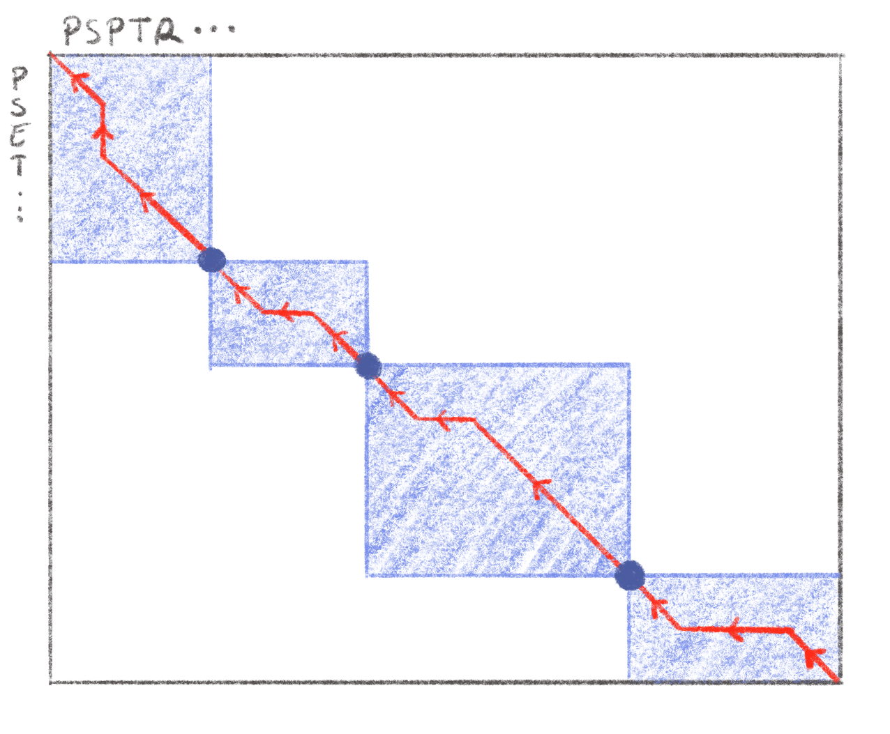

# Aligning sequence data

## What is an alignment ?

In biology, comparison is at the heart of many studies: between individuals, between species, between sequencing runs, *etc*... In order to do this at a fine grained level and extract knowledge from it we need to compare what is comparable, this is where sequence alignment steps in. In broad terms, during sequence alignment, we aim to find regions similar to each other in two or more sequences and group them together. When this process is done with only two sequences it is called a *pairwise alignment*, when three or more sequences are used it is called *multiple alignment*. We will first focus on pairwise alignment as it was used as the basis for the more complex multiple alignment.

### Why align ?

The first question we might ask ourselves is why align at all, if we want to compare two sequences there are plenty of distances and metrics out there to use. Something like the Hamming distance [@hammingCodingInformationTheory1980] is very quick and easy to compute by comparing characters two by two. It is however ill-suited to our needs in biology: while it can handle substitutions but indels induce very large Hamming distances. Indeed, insertions and/or deletions shift one of the sequences, compared to the other, and introduce many character-to-character differences that could be explained by a single indel.

For example, let us consider the two following sequences: `ATGTGCAGTA` and `AGTGCAGTAC`. if we count the differences character by character, except the first pair of A, all the characters are different (c.f. below). However if we consider that the first T was deleted and a C was inserted at the end of the second sequence then we can see that none of the characters are actually different. In order to represent insertions and deletions *gaps* are inserted in the sequences as seen below:

<center>

| **`ATGTGCAGTA-`**
| **`A-GTGCAGTAC`**

</center>

This problem of comparing two sequences with insertions or deletions is a fairly studied one in text algorithmics: the string-edit problem [@gusfieldAlgorithmsStringsTrees1997]. Some metrics like the Levenshtein distance [@levenshteinBinaryCodesCapable1966] and the edit distance [@gusfieldAlgorithmsStringsTrees1997] exist and are closely related to the pairwise sequence alignment problem, finding the minimal number of substitution, insertion of deletion operations to go from one sequence to the other.

Sequence alignments have many downstream use-cases. They are the basis of comparative genomics [@hardisonComparativeGenomics2003] and are used to infer evolutionary relationships and phylogenetic tree reconstruction methods usually take as input multiple alignments [@felsensteinEvolutionaryTreesDNA1981; @kumarMEGAMolecularEvolutionary1994; @kozlovRAxMLNGFastScalable2019; @guindonNewAlgorithmsMethods2010; @priceFastTreeApproximatelyMaximumLikelihood2010]. Sequence alignments have been used to study protein structure [@jumperHighlyAccurateProtein2021; @karplusPredictingProteinStructure1999 ] and function [@watsonPredictingProteinFunction2005; @leePredictingProteinFunction2007]. They can be used to correct sequencing errors [@hacklProovreadLargescaleHighaccuracy2014; @korenHybridErrorCorrection2012; @salmelaCorrectingErrorsShort2011] or detect structural variations in genomes [@medvedevComputationalMethodsDiscovering2009; @mahmoudStructuralVariantCalling2019]. All this to say that they are absolutely fundamental to the field of computational biology and errors in alignments can lead to errors somewhere down the line.

### How to align two sequences ?

There are two approaches for pairwise alignment [@sungAlgorithmsBioinformaticsPractical2011]: *global alignment* where the entirety of both sequences is used when aligning them, and *local alignment* where we only seek to find regions in each sequence that are most similar to each other. Global alignment is used when the two sequences are expected to be quite similar (e.g. comparing two related proteins), whereas local alignment is mostly used when we expect the sequences to be fairly different but with highly similar regions, like genomes of two distantly related species that share a highly conserved region.

The seminal method for global pairwise alignment was the Needleman-Wünsch algorithm [@needlemanGeneralMethodApplicable1970] based on a dynamic programming method. A decade later, the Smith-Waterman algorithm [@smithIdentificationCommonMolecular1981] was developed with similar ideas to perform local alignment. Both are still used today for pairwise alignment.

Dynamic programming is often used to solve complex problems by breaking it into smaller sub-problems and solving each one optimally and separately [@bradleyAppliedMathematicalProgramming1977; @bellmanTheoryDynamicProgramming1954], it is particularly useful when we wish to have a precise alignment between 2 sequences.

#### Global alignment

The fundamental algorithm for globally aligning two sequences was the Needleman-Wünsch (NW) algorithm [@needlemanGeneralMethodApplicable1970], this can be conceptualized in one of two equivalent ways: finding the alignment with 1) the lowest edit-distance or 2) the highest alignment score. These two are equivalent so in this section we will maximize the alignment score.

The first thing that is needed is, given an alignment, how to compute an alignment score. To do this we need to assign costs to each operation. Usually matches (i.e. aligning two identical characters) are given a positive cost and mismatches or indels a negative cost. If we assign a cost of +1 to a match and a cost of -1 to mismatches and indels then the alignment presented above in Section \@ref(why-align) would have an alignment score of 9 - 2 = 7 *(9 matches and two indels)*.

The NW algorithm is based on a simple recurrence relation: the optimal alignment score of two sequences $S_1$ and $S_2$ of lengths $n$ and $m$ respectively is the maximum of:

1.  The optimal alignment score of $S_1[1,n-1]$[^aligning-sequences-1] and $S_2[1,m-1]$ plus the cost of a match or mismatch between the $n^{th}$ character of $S_1$ and the $m^{th}$ character of $S_2$

2.  The optimal alignment score of $S_1$ and $S_2[1,m-1]$ plus the cost of an indel

3.  The optimal alignment score of $S_1[1,n-1]$ and $S_2$ plus the cost of an indel

[^aligning-sequences-1]: Here I am using an index starting at 1 and inclusive, so $S_1[1,n-1]$ represents the first $n-1$ characters. If $S_1 = ABCD$ then $S_1[1;3]=ABC$

This simple relation can be used to compute optimal global alignment score for two sequences, however if it is implemented naively it can be very inefficient as the number of scores to compute grows exponentially with sequence lengths, and many intermediary alignment scores need to be computed many times. This is where dynamic programming comes in: these intermediary costs are pre-computed in an efficient manner and one can then deduce the optimal alignment from these. This pre-computing step is usually represented as filling out a matrix whose rows and columns represent the characters in each sequence to be aligned.

If $S_1$ represents the rows of the matrix, and $S_2$ the columns, the value $C(i,j)$ of a cell $(i,j)$ of this matrix represents the optimal alignment score between $S_1[1,i]$ and $S_2[1,j]$. In the recurrence relation described above the alignment score as dependant on the optimal alignment scores of subsequences, when filling out the dynamic programming matrix we proceed in the inverse fashion by using the scores of short subsequences to build up the scores of progressively longer sequences.

We will go here through a short example showing how the NW algorithm is used to align two short sequences: $S_1=$`ACCTGA` and $S_2=$`ACGGA`. The first step is to represent the dynamic programming matrix, prefix each sequence with an empty character and label the rows of the matrix with one of the sequences and the columns with the other *(this extra row and column at the beginning of each sequence are indexed as column and row 0)*. In this matrix, due to the recurrence relation stated above, the score of a particular cell, $C(i,j)$ is the maximum of:

1.  The score in the diagonally adjacent cell $C(i-1,j-1)$ plus the cost of a match or mismatch between $S_1[i]$ and $S_2[j]$.
2.  The score of the cell to the left $C(i,j-1)$ plus the cost of an indel
3.  The score of the cell on top $C(i-1,j)$ plus the cost of an indel

Therefore in order to compute $C(i,j)$ we need to know the three values of $C(i-1,j-1)$, $C(i-1,j)$ and $C(i,j-1)$. This is the reason why we start with an extra column and row at the beginning of each sequence that we can fill out with the increasing costs of indels. In our case since the cost of an indel is -1, this row and column are filled out with decreasing relative integers, as can be seen in Figure \@ref(fig:nwAlign)A.

From this starting point we can fill out the Dynamic programming matrix with all the alignment scores. To compute $C(1,1)$ we have three possible values:

1.  $C(0,0)$ plus the cost of a match between $S_1[1]=A$ and $S_2[1]=A$: $0+1=1$
2.  $C(0,1)$ plus the cost of an indel: $-1 -1 = -2$
3.  $C(0,1)$ plus the cost of an indel: $-1-1=-2$

By taling the maximum out of these three values we can fill out the matrix with $C(1,1)=1$. By continuing this process until we fill out the whole we obtain the scores visible below. This is enough if we only want to compute the optimal global alignment score between $S_1$ and $S_2$, however if we want to deduce the operations leading to alignment, and therefore the alignment itself, we need to keep track of which operation we made to get a specific score. The easiest way to do that is to also consider this matrix as a graph where each cell is a vertex. When we compute the score of cell $(i,j)$ we add an edge from this cell to the previous cell that was used to compute $C(i,j)$. In our example above, we obtained $C(1,1)$ from a match and $C(0,0)$, so we can add an edge in our graph going from cell $(1,1)$ to cell $(0,0)$. The filled out matrix with the graph edges represented as arrows can be seen in Figure \@ref(fig:nwAlign)B.

```{r, nwCaption}
nwCaption <- "**Example global alignment with the Needleman-Wunsch algorithm.**  
This figure represents three different steps in the NW algorithm, with a match cost of +1, a mismatch cost of -1 and an indel cost of -1. **A)** the matrix is initialized with $S_1$ as the columns and $S_2$ as the rows. Column and row 0 are filled out. **B)** The dynamic programming matrix is filled out, and the alignment graph is constructed. **C)** The alignment graph is traversed from the vertex in the bottom right cell to the vertex in the top left cell. Each of the three possible paths corresponds to an optimal global alignment, represented on the right."
```

```{r, nwAlign, label="nwAlign", fig.cap=nwCaption, eval=knitr::is_html_output(), out.width="100%", cache=FALSE}

```

```{=tex}
\begin{figure}[h]
\centering
\includegraphics[width=\linewidth]{./figures/Align-Intro/NW-total.png}
\extcaption{Example global alignment with the Needleman-Wunsch algorithm.}{This figure represents three different steps in the NW algorithm, with a match cost of +1, a mismatch cost of -1 and an indel cost of -1. \textbf{A)} the matrix is initialized with $S_1$ as the columns and $S_2$ as the rows. Column and row 0 are filled out. \textbf{B)} The dynamic programming matrix is filled out, and the alignment graph is constructed. \textbf{C)} The alignment graph is traversed from the vertex in the bottom right cell to the vertex in the top left cell. Each of the three possible paths corresponds to an optimal global alignment, represented on the right.}
\label{fig:nwAlign}
\end{figure}
```
Once this matrix *(and corresponding graph)* is filled out, we can deduce the alignment by following a path through the graph starting at cell $(n,m)$ to cell $(0,0)$. A diagonal edge starting at $(i,j)$ indicates a match or mismatch between $S_1[i]$ and $S_2[j]$, a vertical edge indicates a gap in $S_2$ and a horizontal edge a gap in $S_1$. This can lead to several optimal alignments if there are several such paths in the graph. In our case this algorithm yields three equally optimal global alignments shown in Figure \@ref(fig:nwAlign)C.

This algorithm although guaranteed to result in an optimal alignment, has a time complexity of $O(nm)$ where $n$ and $m$ are the lengths of the sequences to align [@sungAlgorithmsBioinformaticsPractical2011]. Some methods have been proposed to speed up [@masekFasterAlgorithmComputing1980], however the complexity is still $O(nm/\log(n))$. Lower bounds have been studied and there is not much optimization to be done if optimal exact alignment are needed [@vinhInformationTheoreticMeasures2010; @ullmanBoundsComplexityLongest1976]. If we want to do better we have to rely on heuristics.

Another issue is space complexity since we need to store the matrix, the space complexity is also $O(nm)$. If we wish to align 2 human genomes we would need to store $\approx 10^{19}$ matrix cells, which would amount to 10 Exabytes of storage if we use 8bit integers *(i.e. the storage scale of a data-center)*. However, in practice, we can do much better than that, and construct an optimal alignment in linear space complexity $O(n+m)$ [@hirschbergLinearSpaceAlgorithm1975] meaning we would only need a couple gigabytes to store the matrix for 2 human genomes. This resulted in an improved global alignment algorithm, the Myers-Miller algorithm [@myersOptimalAlignmentsLinear1988], implemented in the EMBOSS stretcher alignment software [@riceEMBOSSEuropeanMolecular2000].

#### Local alignment

In global alignment two full sequences are aligned to each other. In local alignment the goal is to find the optimal alignment of two subsequences from these parent sequences. The main algorithm for locally aligning is the Smith-Waterman (SW) algorithm [@smithIdentificationCommonMolecular1981] developed a decade later than NW.

The two algorithms are very similar, SW also relies on first building the dynamic programming matrix with the same parametrizable costs for matches, mismatches and indels as NW. One key difference is that the optimal scores in the matrix are bound by 0 so they cannot become negative, we only store edges in the alignment graph is the starting cell has an alignment score \> 0. If we use the SW algorithm to locally align the two example sequences $S_1$ and $S_2$ and the same costs as used above, we obtain the dynamic programming matrix and graph shown in Figure \@ref(fig:swAlign).

```{r, swCaption}
swCaption <- "**Example local alignment with the Smith-Waterman algorithm.**  
Two sequences $S_1$ and $S_2$ (the same as in Figure \\@ref(fig:nwAlign)) are locally aligned. A match has a cost of +1, a mismatch a cost of -1 and indels a cost of -1. **A)** The dynamic programming matrix is filled out and the alignment graph constructed. Alignment scores are constrained to be non-negative. **B)** We find paths in the graph between the vertex with the maximal score and a score of 0. Here there are two such paths resulting in two optimal local alignments represented on the right. "
```

```{r, swAlign, label="swAlign", fig.cap=swCaption, eval=knitr::is_html_output(), out.width="60%", cache=FALSE}

```

```{=tex}
\begin{figure}[h]
\centering
\includegraphics[width=0.6\linewidth]{./figures/Align-Intro/SW-total.png}
\extcaption{Example local alignment with the Smith-Waterman algorithm.}{Two sequences $S_1$ and $S_2$ (the same as in Figure \ref{fig:nwAlign}) are locally aligned. A match has a cost of +1, a mismatch a cost of -1 and indels a cost of -1. \textbf{A)} The dynamic programming matrix is filled out and the alignment graph constructed. Alignment scores are constrained to be non-negative. \textbf{B)} We find paths in the graph between the vertex with the maximal score and a score of 0. Here there are two such paths resulting in two optimal local alignments represented on the right. }
\label{fig:swAlign}
\end{figure}
```
The traceback part to determine the optimal alignment is very similar to NW, however instead of starting at cell $(n,m)$, we start at the cell in with the maximal alignment score and follow the path back until we arrive at a cell with an alignment score of 0. In the example shown in Figure \@ref(fig:swAlign), two cells contain the maximal alignment score of 2. Tracing back from these cells gives two optimal local alignments between $S_1$ and $S_2$: `AC` to `AC` and `GA` to `GA`.

Since the SW algorithm is so similar to NW it has the same quadratic time and space complexity, however the same optimization can be used to bring it down to a linear space complexity [@sungAlgorithmsBioinformaticsPractical2011]. Optimizations were resulted in the Huang and Miller algorithm [@huangTimeefficientLinearspaceLocal1991] which is implemented in the EMBOSS Lalign tool [@riceEMBOSSEuropeanMolecular2000], and the Waterman Eggert algorithm [@watermanNewAlgorithmBest1987].

Both the NW and the SW algorithms are implemented in many different software tools and are used widely to perform pairwise alignments of short sequences [@stajichBioperlToolkitPerl2002; @gentlemanBioconductorOpenSoftware2004; @riceEMBOSSEuropeanMolecular2000]. Some versions even benefit from hardware acceleration with version implemented for specific CPU instruction sets [@dailyParasailSIMDLibrary2016] or GPUs [@frohmbergGPASImprovedVersion2012] to substantially speed up alignment.

### Scoring and substitution models

In the examples used above to present the NW and SW algorithms, we used a very simple cost function: a match has a cost of +1 while mismatches and indels have a cost of -1. This is really the simplest cost function we can use but also the crudest. In many cases it may be interesting to infuse this cost function with biological knowledge. For example some substitutions might occur more rarely than others in nature so it would stand to reason to penalize those more than other, more common, substitutions.

These biology-aware cost functions usually take the form of a matrix, called scoring or substitution matrix corresponding to an underlying evolutionary model. When using these matrices, matches and mismatches between specific characters are given. For example the cost of aligning an A and a T might be lower than aligning that same A with a G. A lot of different substitution matrices have been developed especially for protein alignments [@altschulSubstitutionMatrices2013], developed with different techniques and underlying models and with different use-cases.

The earliest and simplest substitution matrices are match/mismatch matrices, they are effectively what we used above where all matches are given a fixed positive score and all mismatches a fixed negative score. In our examples above the corresponding substitution matrix would be a four by four matrix with ones on the diagonal indicating matches and -1 everywhere else. These are simple and useful however when dealing with proteins they have a severe limitation as they ignore the biology of amino acids.

In order to reflect this biological reality of proteins, new substitution matrices were developed using Log-odds models, based on the fact that substitutions in amino acids are not equiprobable, and some mutations between related amino acids *(e.g. I and L)* are much more common than others. Two of the most widely used substitution matrices, PAM and BLOSUM matrices, were built this way. The score for aligning residue $i$ with residue $j$ is given by the matrix entry $s_{ij}$ by looking at the background frequencies *(i.e. how often one expects to see a particular residue in a sequence)* of $i$ and $j$ denoted $p_i$ and $p_j$ respectively and the frequency $q_{ij}$ with which $i$ and $j$ are aligned in accurate biological alignments. from this we can compute the substitution score $s_{ij}$ as a Log-odds [@altschulSubstitutionMatrices2013]:

$$
S_{i,j}=\log\bigg(\frac{q_{ij}}{p_ip_j}\bigg)
$$

Both $p_i$ and $p_j$ are easy to compute from available biological sequence data, the real work in developing a Log-odds based substitution matrix is to estimate $q_{ij}$ values. To do this accurate biological alignments are needed, and how you obtain or choose these is determining of the substitution model. Finally this Log-odds formulation yields values with nice properties for local alignment, namely negative scores for unlikely substitutions and positive ones for likely substitutions and matches.

The PAM matrix, developed in 1978 [@dayhoffModelEvolutionaryChange1978], is one such matrix. A *Point accepted mutation* (PAM) is defined as the substitution of one amino acid by another that is accepted by natural selection *(i.e. visible along the branch of a phylogenetic tree)*. Dayhoff *et al.* also defined a PAM as an evolutionary distance, where two sequences distant by one PAM are expected to have one amino acid substitution per one hundred residues, which is equivalent to expecting a substitution at 1% of positions. To develop their matrix, Dayhoff *et al.* used phylogenetic trees built on 71 families of closely related proteins and counted the PAMs that appeared in these trees. This resulted in a matrix $A$ where $A_{ij}=A_{ji}=$ the number of times a substitution between amino acids $i$ and $j$ was observed in the trees. By using trees built on closely related sequences, Dayhoff *et al.* could be fairly certain that the observed substitutions were the result of a single mutation and not many subsequent mutations over long evolutionary times. From this matrix $A$, Dayhoff *et al.* reconstructed the mutation probability $M_1$ where entries $M_{1,ij}$ represent the probability of amino acid $j$ being replaced by amino acid $i$ after an interval of 1 PAM. Entries of this matrix are computed as follows:

```{=tex}
\begin{align}
M_{1,ij}&=\frac{\lambda m_j A_{ij}}{\sum_i A_{ij}}\;\; & \text{if}\;\;i\neq j\\
M_{1,ij}&=1-\lambda m_j & \text{if}\;\; 1 = j 
\end{align}
```
here $m_j$ is the observed mutability of amino acid $j$, and $\lambda$ is a constant factor used to tune the matrix so that it reflects mutation rates corresponding to 1 PAM where 99% of positions are unchanged which means that the diagonal of $M_1$ must sum to 0.99. By assuming that evolution follows a Markov process it is simple to derive the mutation matrices for sequences separated by greater evolutionary distances. The $M_n$ matrix, corresponding to a distance of $n$ PAMs is equal to $M_1^n$. Finally the $q_{ij}$ values can be derived with $q_ij=p_jM_{ij}$. By choosing different values of $n$ for the mutation matrix we can estimate scoring matrices for sequences that are at varying evolutionary distances from one another. The correspondence between PAMs and and the observed proportion of diferent residues is not one to one, therefore a distance of 250 PAMs corresponds to around only about 20% of identical residues where a distance of 180 PAMs corresponds to around 27% identical residuess [@altschulSubstitutionMatrices2013; @dayhoffModelEvolutionaryChange1978]. Therefore the PAM~250~ matrix, derived from $M_{250}$, is suited to align more distantely related proteins than the PAM~180~ for example. By changing the mathematical model underlying the estimate of mutation probabilities, PAM-like matrices [@mullerModelingAminoAcid2000] were later developed based on the same principles.

The other main type of substitution matrix are the BLOSUM matrices (Block Substitution matrix), developed in 1992 [@henikoffAminoAcidSubstitution1992]. Instead of using whole, closely-related protein sequences like the PAM matrices, the values of $q_{ij}$ were estimated on highly conserved segments across whole protein families. Furthermore, to derive the BLOSUM scores, Henikoff and Henikoff did not estimate an underlying evolutionary model but only counted substitutions to estimate $q_{ij}$ values. Similarly to PAM matrices there are several BLOSUM matrices adapted to different levels of similarity between the sequences to be aligned.

PAM and BLOSUM matrices have fairly broad use-cases and are widely used in alignment, however there exist many other protein substitution models. Instead of using log-odds, some substitution models were developed by estimating scores with maximum-likelihood approaches [@whelanGeneralEmpiricalModel2001; @leImprovedGeneralAmino2008]. Some matrices were developed with very specific usage conditions in mind. Some are tailored to specific types of proteins like Transmembrane [@mullerNonsymmetricScoreMatrices2001; @ngPHATTransmembranespecificSubstitution2000], disordered [@trivediAminoAcidSubstitution2019] or polar/non-polar [@goonesekereContextspecificAminoAcid2008] proteins. Some matrices were developed to align sequences from specific organisms like *P. falciparum* [@pailaGenomeBiasInfluences2008] *(responsible for malaria)* or HIV [@nickleHIVSpecificProbabilisticModels2007]. A substitution matrix was even developed in 2005 specifically for global rather than local alignment [@sardiuScoreStatisticsGlobal2005].

This wealth of protein substitution matrices reflects the biological and evolutionary diversity of proteins, however substitution matrices for aligning DNA sequences are much less frequent. Some work has been done to derive matrices similar to PAM matrices from DNA alignments [@chiaromonteScoringPairwiseGenomic2001]. Codon substitution matrices [@schneiderEmpiricalCodonSubstitution2005; @doron-faigenboimCombinedEmpiricalMechanistic2007] have been developed as well, although they are used in DNA sequence alignment, ultimately they use knowledge derived from protein alignments.

### Dealing with gaps

In the NW and SW examples of Section \@ref(how-to-align-two-sequences), as with the simplistic match/mismatch costs, we used a very simple cost of insertions and deletions: any indel has a cost of -1. However this, as was the case with substitutions, does not reflect the biological reality very well.

In biology, when insertions or deletions occur it is more likely that the indel will span several nucleotides rather than just one [@cartwrightProblemsSolutionsEstimating2009]. This means that when inserting gaps into longer gap stretches are more likely than many individual gaps. For example the two alignments below have the same number of matches, mismatches and gaps. The second one is more likely since it is the result of a single insertion (or deletion) of `AGGT` rather than multiple independent indels.

<center>

| **`AGGAGGTTCG`**        **`AGGAGGTTCG`**
| **`A-G-G-T-CC`**        **`AGG----TCC`**

</center>

The first approach was to try and optimize the gaps more generally [@fitchOptimalSequenceAlignments1983] over the whole aligned sequence, however even with dynamic programming this has at best a time complexity of $o(n^2m)$ [@watermanBiologicalSequenceMetrics1976]. In 1982, Gotoh proposed affine gap costs [@gotohImprovedAlgorithmMatching1982], with this model there are two separate costs associated to indels: 1) the gap open cost and 2) the gap extend cost. Usually the costs are set up so that opening a new gap is more costly than extending it, meaning that longer gap stretches are favored over many short indels. The other major advantage is that with Gotoh's algorithm time complexity is back down to $o(nm)$. The algorithm was further refined by Altschul *et al.* [@altschulOptimalSequenceAlignment1986].

Over the years different types of gap costs were developed and tested like the logarithmic gap costs proposed by Waterman [@watermanEfficientSequenceAlignment1984] and improved by Miller and Myers [@millerSequenceComparisonConcave1988] turned out to be less accurate than affine gap costs [@cartwrightLogarithmicGapCosts2006]). A bi-linear gap cost was also proposed to replace the affine cost[@goonesekereFrequencyGapsObserved2004], with a breakpoint at gaps of length three, the size of a codon. As more and more sequence data became available, similarly to what happened with substitution matrices, empirical profile-based models derived from this data were developed [@bennerEmpiricalStructuralModels1993]. Some of these penalties leverage structural information and context for proteins [@wrablGapsStructurallySimilar2004; @zhangSP5ImprovingProtein2008]. A context dependent gap penalty depending on the hydrophobicity of aligned residues is implemented in Clustal X [@jeanmouginMultipleSequenceAlignment1998] one of the most widely used sequence aligners. Although quite complex and empirically derived, these profile-based penalties show limited improvement over the affine and bi-linear penalties [@wangComparisonLinearGap2011].

More recently, methodological and algorithmic developments have resulted in the WaveFront algorithm (WFA) for pairwise alignment [@marco-solaFastGapaffinePairwise2020]. This algorithm computes a NW alignment with affine gap costs with a much lower time complexity of $o(ns)$, where $s$ is the alignment score, reducing the quadratic relationship to sequence length to a linear one. This algorithm is also easily vectorizable and can take advantage of hardware acceleration, making its implementation run between 10 to 300 times faster than alternative methods depending on the testing context [@marco-solaFastGapaffinePairwise2020].

## How do we speed up pairwise alignment ?

The NW and SW algorithms, as well as their improvements, are proven to be optimal [@pearson27DynamicProgramming1992]. However when dealing with large sequences, which are more and more common, or when having to do many pairwise alignments they become limiting due to their time and space complexity. In many cases, to get around these limitations, optimality was left aside in favor of heuristics and approximate methods speeding up alignment.

### Changing the method

One of the early approaches to speed up alignment was to focus on speeding up the dynamic programming which is the time and space consuming step of the NW and SW algorithms. Bounded dynamic programming [@spougeSpeedingDynamicProgramming1989a] is one such approach. By making the assumption that the majority of alignment operations are matches and mismatches instead of indels we can make the hypothesis about the alignment graph. Most probably, the path in the graph corresponding to the optimal alignment will be around the diagonal of the dynamic programming matrix, and scores far away from the diagonal are probably not needed. By making these assumptions a lot of the scores of the matrix do not need to be computed, speeding up the execution and leading to a sparse dynamic programming matrix (shown in Figure \@ref(fig:boundedDP)). This approach was used to speed up alignment early on in 1984 [@fickettFastOptimalAlignment1984]. The advantage of this method is that the optimal alignment can be found very efficiently, however if there are many indels in the optimal alignment, this algorithm is not guaranteed to run faster than NW.

```{r}
boundedCaption <- "**Bounded dynamic programming to speed up alignment.**  
The dynamic programming matrix is shown here, only values in the blue section are computed, speeding up the process. Here the optimal path in the alignment graph, shown in red, is included entirely in the bounds.
Adapted from [@chaoDevelopmentsAlgorithmsSequence2022]."
```

```{r, boundedDP, label="boundedDP", fig.cap=boundedCaption, out.width="50%", eval=knitr::is_html_output(), cache=FALSE}
knitr::include_graphics("./figures/Align-Intro/boundedDP.png")
```

```{=tex}
\begin{figure}[h]
\centering
\includegraphics[width=0.6\linewidth]{./figures/Align-Intro/boundedDP.png}
\extcaption{Bounded dynamic programming to speed up alignment.}{The dynamic programming matrix is shown here, only values in the blue section are computed, speeding up the process. Here the optimal path in the alignment graph, shown in red, is included entirely in the bounds. Adapted from \autocite{chaoDevelopmentsAlgorithmsSequence2022}.
}
\label{fig:boundedDP}
\end{figure}
```
More "exotic" methods have also been used successfully for sequence alignment. Fast Fourier Transform (FFT) are used in the MAFFT aligner [@katohMAFFTNovelMethod2002] in order to quickly find homologous segments between two sequences. These homologous regions can be used as the basis for alignment. MAFFT, primarily a multiple sequence aligner *(c.f. Section* \@ref(multiple-sequence-alignment) *below)*, can also be used for pairwise alignment.

### Seed and extend with data structures

In parallel to the development of new alignment algorithms, another way of substantially speeding up pairwise alignment is the so-called "seed and extend" method. This is based on the observation that a pairwise alignment most likely has several short subsequences that are almost identical in both sequences to align. These homologous subsequences, the seeds, can be used to initialize an alignment that can be extended in both directions with dynamic programming until we have a suitable alignment.

This method can be used for 1) local alignment, where seeds indicate possible local matches which can be extended in local alignments; or 2) for global alignment where the seeds anchor the dynamic programming matrix, limiting the number of cells to fill out as shown in Figure \@ref(fig:anchor). In both cases this approach follows the divide and conquer philosophy and extending seeds or filling out the matrix between anchors can be done independently and in parallel.

```{r}
anchorCaption <- "**Divide and conquer to speed up alignment.**  
Here anchors are used to speed up alignment. Anchors are shown as dark blue dots in the dynamic programing matrix. Only values in blocks between anchors, shown in blue, need to be computed. The majority of the matrix can be left empty. The optimal path in the resulting alignment graph must go through each anchor and is shown in red.
Adapted from [@chaoDevelopmentsAlgorithmsSequence2022]."
```

```{r, anchor, label="anchor", fig.cap=anchorCaption, out.width="50%", eval=knitr::is_html_output(), cache=FALSE}

```

```{=tex}
\begin{figure}[h]
\centering
\includegraphics[width=0.6\linewidth]{./figures/Align-Intro/anchors.png}
\extcaption{Divide and conquer to speed up alignment.}{Here anchors are used to speed up alignment. Anchors are shown as dark blue dots in the dynamic programing matrix. Only values in blocks between anchors, shown in blue, need to be computed. The majority of the matrix can be left empty. The optimal path in the resulting alignment graph must go through each anchor and is shown in red. Adapted from \autocite{chaoDevelopmentsAlgorithmsSequence2022}.
}
\label{fig:anchor}
\end{figure}
```
This type of approach can also be used for many-to-one local alignments: either trying to find homologies between a query sequence and a database of sequences, or find several local alignments in a large reference sequence like in read-mapping (see Section \@ref(what-is-read-mapping)). In these many-to-one scenarios it is useful to index seeds in data structures that allow rapid querying and compact storage. This general framework has proven to be quite flexible with many different ways to pick seeds [@sunChoosingBestHeuristic2006] and many different data structures to index them [@liSurveySequenceAlignment2010].

#### $k$-mers and hash tables

##### The BLAST Algorithm

One of the early methods for very quick heuristic alignment is the Basic Local Alignment Search Tool, BLAST [@altschulBasicLocalAlignment1990]. It is widely used to this day to find homologous sequences in large databases and as such is one of the most cited papers of all time with over 100,000 citations, and is available as a web service hosted by the NCBI (<https://blast.ncbi.nlm.nih.gov/Blast.cgi>). Over the year many different versions for different use cases have been developed like BLASTP for protein sequences or BLASTN and MEGABLAST for nucleic acid sequences.

In our description of the BLAST algorithm we will have a target sequence and a query sequence that we wish to align.

1.  For each sequence we build a hash table that uses subsequences of length $k$, called $k$*-mers*, as keys and their position in the whole sequence as values.
2.  The hash tables are then scanned to check for exact matches between $k$-mers in the target and query sequences, called *hits.*
3.  The positions of the hits in the target and query sequences are used to seed a candidate local alignment
4.  The candidate local alignment are extended in both directions from the seed with the SW algorithm. If the alignment score reaches a value under a specified threshold, the alignment stop and the candidate is discarded

By selecting the right size $k$ of the seeds (by default 11 when aligning nucleotides, 3 when aligning amino acids) as well as the alignment score threshold, one can adjust the sensitivity of the method at the cost of runtime.

It might not seem very useful to precompute the target hash-table for a single target. However, in practice BLAST is used to find local alignments between a query sequence and a very large number of target sequences; databases hosted by NCBI have hundreds of millions of target sequences (<https://ftp.ncbi.nlm.nih.gov/blast/db/>), at these scales pre-computing the target database saves an enormous amount of time.

Over time, several improvements have been developed for BLAST, PSI-BLAST [@altschulGappedBLASTPSIBLAST1997] iteratively refines the alignments, Gapped BLAST [@altschulGappedBLASTPSIBLAST1997]and BLASTZ [@schwartzHumanMouseAlignments2003] use spaced seeds, introduced in the PatternHunter method [@maPatternHunterFasterMore2002], corresponding to seeds where not all characters match, increasing sensitivity. By sorting the target sequences it is possible to stop earlier and gain some speed as well [@edgarSearchClusteringOrders2010]. The Diamond aligner [@buchfinkFastSensitiveProtein2015] increase alignment speed by using double indexing and thus leveraging CPU cache and reducing time waiting for memory or disk access, improving alignment speed up to 360-fold over BLAST in later version [@buchfinkSensitiveProteinAlignments2021].

FASTA [@pearsonImprovedToolsBiological1988], an improvement on FASTP [@lipmanRapidSensitiveProtein1985], is another method for local alignment. Similarly to BLAST, $k$-mers for the target and query sequence are indexed in a hash table and hits are found between the two sequences. The $k$-mers used in the FASTA tool are usually shorter than for BLAST, so instead of initializing an alignment at a single hit, FASTA identifies regions in both sequences that have a high density of hits, keeping the best 10. These regions are then scored using matrices discussed in Section \@ref(scoring-and-substitution-models) and high scoring regions are combined to build an approximate alignment. An optimal version of this alignment is then computed using the SW algorithm and banded dynamic programming.

Both FASTA and BLAST are very fast, it takes only a couple of seconds to find approximate local alignments between 100 query sequences [@saripellaBenchmarkingNextGeneration2016] in a database of over 80 million target sequences [@finnPfamProteinFamilies2016]. Trying this task with standard SW or NW algorithms would be much slower [@essoussiComparisonFourPairwise2007] but would yield more sensitive, optimal alignments [@shpaerSensitivitySelectivityProtein1996].

##### Other Algorithms

One of the problems with such an approach is the size of the index, indeed storing all the $k$-mers of a length $n$ sequence would require a maximum of $(n-k + 1)\cdot k$ characters as the hash table keys, if all $k$-mers are distinct. This space constraint is acceptable for very large scale homology search on hosted web services such as NCBI BLAST, however on a personal computer this can easily exceed memory capacity. Storing the hash table on disk has drastic consequences on query times, therefore methods to reduce the storage needs of these data structures were developed.

One of the ways to make everything fit in memory is to not store all $k$-mers, one way is through the use of so-called minimizers, introduced independently in 2003 [@schleimerWinnowingLocalAlgorithms2003] and 2004 [@robertsReducingStorageRequirements2004]. Given a window of $w$ consecutive $k$-mers and an ordering, a $(w,k)$ minimizer is the "smallest" k-mer in the window w.r.t. the chosen ordering. Let us consider the following window of $3$-mers with $w=4$: `TGACAT`, yielding the following $3$-mers: `TGA`, `GAC`, `ACA`, `CAT`. Following a simple ordering, such as lexigographical ordering (i.e. alphabetical order), then the "smallest" $3$-mer and our $(4,3)$ minimizer would be `ACA`, and only this one would be sampled and added to our hash table. Minimizers have interesting properties, adjacent windows often share a minimizer (see Figure \@ref(fig:minimizers)) and if two strings have a $w-k+1$ sequence in common then they are guaranteed to share a $(w,k)$ minimizer [@robertsReducingStorageRequirements2004]. These properties make minimizers very useful for the seed and extend alignment strategy and they are used in several aligners such as Minimap [@liMinimapMiniasmFast2016] and Minimap2 [@liMinimap2PairwiseAlignment2018], MashMap2 [@jainFastAdaptiveAlgorithm2018] and Winnowmap [@jainWeightedMinimizerSampling2020].

```{r, minimizercaption}
progCaption <- "**$k$-mer minimizers in action.**  
**A**) The $3$-mers are shown under a window of size $w=4$ $k$-mers. The $(4,3)$ minimizer according to the lexicographical ordering is highlighted in red. **B)** All the $w=4$ windows of $3$-mers are shown underneath the sequence. $(4,3)$ minimizers of each window are highlighted in red. Here both $3$-mer minimizer is shared by 4 windows. Adapted from [@robertsReducingStorageRequirements2004]."
```

```{r, minimizers, label="minimizers", eval=knitr::is_html_output(), fig.cap=progCaption, out.width="70%"}
knitr::include_graphics("./figures/Align-Intro/minimizers.png")
```

```{=tex}
\begin{figure}[h]
\centering
\includegraphics[width=0.7\textwidth]{./figures/Align-Intro/minimizers.png}
\extcaption{$k$-mer minimizers in action.}{\textbf{A)} The $3$-mers are shown under a window of size $w=4$ $k$-mers. The $(4,3)$ minimizer according to the lexicographical ordering is highlighted in red. \textbf{B)} All the $w=4$ windows of $3$-mers are shown underneath the sequence. $(4,3)$ minimizers of each window are highlighted in red. Here both $3$-mer minimizer is shared by 4 windows. Adapted from \autocite{robertsReducingStorageRequirements2004}.}
\label{fig:minimizers}
\end{figure}
```
While the lexicographical ordering is easy to conceptualize, and the one proposed intially by Roberts *et al.* it has an undesirable characteristic: it tends to select simpler kmers with repeated `A` at the beginning. As discussed in Section \@ref(homopolymers-and-long-reads), repeated stretches of nucleotides are prone to sequencing errors and as such are not ideal for seeding alignments. Furthermore, when the window shifts $k$-mers at the beginning of successive are likely to be selected as minimizers without being shared between windows, meaning that we sample more $k$-mers than needed. Roberts *et al.* proposed an alternative ordering based on nucleotide frequencies [@robertsReducingStorageRequirements2004], however this is also not ideal. Different orderings have been studied and those based on universal hitting sets [@orensteinCompactUniversalKmer2016], or random orderings (such as the ones defined by a hash function) have more desirable properties than the lexicographical ordering [@marcaisImprovingPerformanceMinimizers2017]. A minimizer ordering based on frequency of appearance of kmers has been shown to provide well-balanced partitioning of k-mer sets [@chikhiRepresentationBruijnGraphs2014].

Over the years more strategies have been developed to sample $k$-mers and reduce the data structure size for efficient sequence alignement, such as syncmers [@edgarSyncmersAreMore2021], strobemers [@sahlinEffectiveSequenceSimilarity2021] or a combination of both [@sahlinFlexibleSeedSize2022]. These novel seed sampling strategies allow for sparser seed sampling, smaller data structures and therefore faster alignment software.

#### Exact matches and suffix trees

While $k$-mer seeds have shown success it is not the only way to implement a seed and extend alignment method. The other way to seed alignments is through maximal exact matches (MEMs) which is the longest possible exact match between two sequences. MEMs can be found with data structures like suffix trees [@weinerLinearPatternMatching1973], suffix arrays [@manberSuffixArraysNew1993; @abouelhodaEnhancedSuffixArray2002] or FM indices [@ferraginaOpportunisticDataStructures2000].

Suffix trees have long been used for pattern matching applications [@gusfieldAlgorithmsStringsTrees1997], the AVID aligner [@brayAVIDGlobalAlignment2003] uses them to find maximal exact matches between two sequences to anchor a global alignment. MUMmer2 [@delcherFastAlgorithmsLargescale2002] uses suffix trees to find unique maximal unique matches (MUMs) to anchor alignments.

Suffix trees, although very useful, have quadratic space complexity w.r.t. to the length of the indexed sequence [@gusfieldAlgorithmsStringsTrees1997]. This is fine for small bacterial or viral genomes, however in the age of whole genome sequencing and the human genome project it is inadequate. Therefore some aligners have switched data structures to use suffix arrays, in fact it is possible to replace suffix trees with these more space efficient suffix arrays in any algorithm [@abouelhodaReplacingSuffixTrees2004]. Newer versions of MUMmer [@marcaisMUMmer4FastVersatile2018] have made this choice and now use suffix arrays for improved performance.

Finally another data structure that is widely used is the so-called FM index proposed in 2000 [@ferraginaOpportunisticDataStructures2000] and based on the Burrows-Wheeler transform [@burrowsBlockSortingLosslessData1994]. The FM index is very memory efficient [@vyvermanProspectsLimitationsFulltext2012]. This comes at the cost of some efficiency in index lookup operations, although some work has been done to improve this [@chengFMtreeFastLocating2018]. As such, FM-indices have been used in many aligners such as BWT-SW [@lamCompressedIndexingLocal2008], BWA [@liFastAccurateShort2009] and BWA-SW [@liFastAccurateLongread2010], BWA-MEM [@liAligningSequenceReads2013], CUSHAW [@liuLongReadAlignment2012] or Bowtie2 [@langmeadFastGappedreadAlignment2012].

The seed and extend paradigm has been very useful in the field of genomics to deal with the scale of data and keep up with sequencing technologies, and some newer alignment algorithms like the WFA algorithm mentioned above, have even been used in such a context [@songAnchorWaveSensitiveAlignment2022].

Some methodological development have been aimed towards improving alignment sensitivity instead of speed. One of these methods, fairly well studied in general, and in the context of alignment, are hidden markov models (HMMs). In certain circumstances PairHMMs, HMMs used for pairwise alignment, can be mathematically equivalent to NW [@durbinBiologicalSequenceAnalysis1998]. HMMs have been used for sequence alignment in many software tools like HHsearch [@sodingProteinHomologyDetection2005], HMMer [@finnHMMERWebServer2011] or MCALIGN2 [@wangMCALIGN2FasterAccurate2006] which is used to efficiently search for alignments in large databases of sequences.

## The specificities of read-mapping {#the-specificities-of-read-mapping}

Since read-mapping is special case of pairwise alignment and the focus of Chapter \@ref(HPC-paper), it stands to reason that we use this section to explain the stakes and challenges of mapping.

### What is read-mapping ?

Read-mapping, or sometimes read-alignment is the process of comparing a sequencing read to a reference sequence and finding the region in the reference homologous to the read. Sometimes, mappers only output the position where this region starts in the reference but more often than not, they output local or semi-global alignments between the reads and the reference. In *semi-global alignment*, two sequences are globally aligned but indels at the end and beginning of each sequence are not penalized, this can be useful to detect overlap between two sequences or align two sequences of very different sizes.

Read-mapping is often the first step of many bioinformatics analysis pipelines, and as such is often crucial. Therefore it makes sense that this is a very active field with many reviews [@ruffaloComparativeAnalysisAlgorithms2011; @schbathMappingReadsGenomic2012; @hatemBenchmarkingShortSequence2013; @canzarShortReadMapping2017; @alserTechnologyDictatesAlgorithms2021] and some benchmarking procedures [@brindaRNFGeneralFramework2016] to compare tools.

From a technical and algorithmic standpoint, the task of mapping many sequencing reads to a single reference lends itself very well to the "divide and conquer" approach presented in Section \@ref(seed-and-extend-with-data-structures). Indexing the reference beforehand and using this index as a database to align can lead to substantial execution speed gains. As a matter of fact, many of the aligners presented in Section \@ref(seed-and-extend-with-data-structures) are actually read-mappers that can also do pairwise alignment. As such most implement the seed-and-extend paradigm with hash-tables like minimap2 [@liMinimap2PairwiseAlignment2018]; FM-indices like BWT-SW [@lamCompressedIndexingLocal2008], Bowtie2 [@langmeadFastGappedreadAlignment2012], BWA [@liFastAccurateShort2009], BWA-SW [@liFastAccurateLongread2010], BWA-MEM [@liAligningSequenceReads2013] and CUSHAW [@liuLongReadAlignment2012]; or even other divide and conquer approaches like Kart [@linKartDivideandconquerAlgorithm2017]. As sequencing technologies yield longer and more numerous reads, these heuristics become more important if we wish to be able to analyze this data, however this can be partly mitigated through hardware acceleration [@olsonHardwareAccelerationShort2012; @chenAcceleratingNextGeneration2014; @suzukiIntroducingDifferenceRecurrence2018; @zeniLOGANHighPerformanceGPUBased2020].

### Challenges of read-mapping

Read-mapping, as one might expect, is no easy task. The length of recent sequencing reads and their number are of course challenging, but algorithmic tricks described above can help. There are other aspects of sequencing data that make read-mapping as hard as it is.

Sequencing technologies, although have improved over time can still make errors, and these errors can lower the homology between reads and reference making mapping harder [@gusfieldAlgorithmsStringsTrees1997]. This is particularly true of long reads where the error rate is higher, to mitigate that some specific long-read mappers take these errors into account when aligning a read to the reference. Some mappers are tied to a specific sequencing technology like BLASR [@chaissonMappingSingleMolecule2012] or lordFAST [@haghshenasLordFASTSensitiveFast2019] for PacBIO reads, and GraphMap [@sovicFastSensitiveMapping2016] for ONT. Some however, like NGMLR [@sedlazeckAccurateDetectionComplex2018], MashMap [@jainFastApproximateAlgorithm2018] or DuploMap [@prodanovSensitiveAlignmentUsing2020], are technology agnostic and can work with any type of long-read. This might not be needed forever though as sequencing accuracy is growing with every new generation of sequencers. Since homopolymer-linked indels are still common in long-read sequencing (cf. Section \@ref(homopolymers-and-long-reads)) many modern read-mappers, designed to work with long reads, include some option to use homopolymer compression (c.f. Section \@ref(hpc-trick)).

While the technology producing reads can complicate the read-mapping tasks, some regions of the genome are intrinsically harder to map to. This is particularly true of repetitive regions like telomeres or centromeres [@alserTechnologyDictatesAlgorithms2021]. Repetitive regions mean a lot of potential homologous regions between a read and the reference, producing a lot of seed hits, increasing the runtime of the aligners and lowering the overall confidence in read-placement. Some tools have been developed specifically to deal with such regions. Winnowmap [@jainWeightedMinimizerSampling2020] and winnowmap2 [@jainLongreadMappingRepetitive2022], assign a weight to $k$-mers that might be sampled as minimizers. By under-weighting frequently appearing $k$-mers they can improve performance in repetitive regions. TandemMapper [@mikheenkoTandemToolsMappingLong2020] was designed to map long reads to the extra-long tandem repeats (ETRs) present in centromeric regions. It does not use minimzers, however like winnowmap it selects less frequent $k$-mers as potential seeds to deal with the repetitiveness and improve the mapping accuracy. Long reads are also much easier to map to repetitive regions since they can span over them, or overlap with more complex regions [@pollardLongReadsTheir2018; @logsdonLongreadHumanGenome2020].

Some challenges however are linked to implementation rather than sequencing data. Some efforts have been done to provide quality scores to mappings in order to easily assess its quality and therefore usefulness. This score, called *mapping quality*, corresponds to $-10\log_{10}(p)$, usually rounded to the nearest integer, where $p$ corresponds to the probability of the read being mismapped. It was introduced in the MAQ software [@liMappingShortDNA2008] but has been implemented in many read-mappers like BWA , bowtie2 [@langmeadFastGappedreadAlignment2012] or minimap2 [@liMinimap2PairwiseAlignment2018] since it was added as part of the widely-used SAM file format specification [@liSequenceAlignmentMap2009a].

While the mapping quality score is standardized each read-mapper has a different way of estimating $p$ the mismap probability. This creates differences in the reported qualities: *e.g.* the maximum quality that bowtie2 can assign is 42, BWA's is 37 and minimap's is 60 [@UnderstandingMAPQScores]. This of course means that comparing mapping quality values between read-mappers is not necessarily meaningful. Furthermore in some cases this mapping quality is not very reflective of the alignment accuracy [@ruffaloComparativeAnalysisAlgorithms2011], as such alternative approaches have been explored: through a new genome mappability score [@leeGenomicDarkMatter2012], simulations [@langmeadTandemSimulationFramework2017] or even machine learning [@ruffaloAccurateEstimationShort2012].

In conclusion, as a crucial step in many bioinformatics pipelines, read-mapping is a markedly active field with a lot of work in increasing mapping accuracy and speeding up alignment. However, despite all this work, some challenges remain. Further improving mapping is possible and doing so could result in more accurate downstream analyses and avoid drawing some erroneous conclusions.

## Multiple sequence alignment

Up until now we have only considered pairwise alignment where we want to find homologies between a pair of sequences. In many cases though it is helpful to compare more than two sequences together, this is where multiple sequence alignment (MSA) steps-in. It is an essential task in many bioinformatics and comparative biology analyses [@russellMultipleSequenceAlignment2014].

We saw earlier that with dynamic programming and algorithms like NW or SW it is possible to compute an optimal pairwise alignment, for MSA however the task of computing the optimal alignment if unfortunately NP-hard [@wangComplexityMultipleSequence1994; @justComputationalComplexityMultiple2001], with an exponentially growing time and space complexity in the number of sequences to align. Therefore, heuristics and approximations are needed from the get go in order to get anything meaningful.

An early method, and easy to conceptualize, is the so-called star alignment method [@chaoDevelopmentsAlgorithmsSequence2022]. In this approach, a single sequence is chosen to be the center sequence. After this each other sequence is aligned to the center sequence and the pairwise alignments are merged, conserving gaps that were inserted. The center sequence is often chosen to be as similar to the other sequences as possible so in, however all pairwise distances between sequences are needed implying a quadratic distance computation step. The pairwise alignments are independent so this approach is easy to parallelize. Some software, like HAlign [@tangHAlignFastMultiple2022] use center star alignment to produce MSAs. This method however is quite sensitive to the choice of the center sequence. And bad pairwise alignments can lower the accuracy of the overall MSA by conserving gaps.

### Progressive alignment

One of the most widely used multiple sequence alignment approach is progressive alignment [@fengProgressiveSequenceAlignment1987]. Similarly to the center star algorithm, the progressive algorithm reduces the MSA problem to independent pairwise alignments. The first step is to build a phylogenetic tree from the sequences to align, representing the evolutionary relationship between sequences, called the *guide tree*. Starting from the leaves, that correspond to single sequences, pairwise align the sequences and store the alignment (or *profile*) in the parent node. Going up from the leaves to the roots align sequences together, then sequences to profiles if needed and finally profiles together, merging alignments as we progress up the tree. The final multiple sequence alignment is obtained when this process reaches the root. Profiles at inner nodes of the tree are aligned to each other to conserve gaps. A representation of this process is shown in Figure \@ref(fig:progAlign).

```{r, progcaption}
progCaption <- "**Overview of the progressive alignment process.**  
**A)** sequences to align, **B)** guide tree constructed from distances between sequences in panel A, **C)** Alignment steps along the guide tree and resulting MSA at the root of the tree. Adapted from [@sungAlgorithmsBioinformaticsPractical2011]"
```

```{r, progAlign, label="progAlign", eval=knitr::is_html_output(), fig.cap=progCaption, out.width="80%"}
knitr::include_graphics("./figures/Align-Intro/progressive.png")
```

```{=tex}
\begin{figure}[h]
\centering
\includegraphics[width=0.8\textwidth]{./figures/Align-Intro/progressive.png}
\extcaption{Overview of the progressive alignment process.}{\textbf{A)} sequences to align, \textbf{B)} guide tree constructed from distances between sequences in panel A, \textbf{C)} Alignment steps along the guide tree and resulting MSA at the root of the tree. Adapted from \autocite{sungAlgorithmsBioinformaticsPractical2011}}
\label{fig:progAlign}
\end{figure}
```
In many cases a matrix of pairwise distances is needed to construct the guide tree, if we choose the edit distance, $n(n-1)/2$ pairwise alignments are needed to get this matrix. With a large number of sequences, or long sequences this is not possible in a reasonable amount of time. Therefore, computing of distance matrices through alignment-free methods, usually based on $k$-mers, is often used as input to the tree building method [@jonesRapidGenerationMutation1992; @blaisdellMeasureSimilaritySets1986].

Tree reconstruction methods from the distance matrix like UPGMA [@gronauOptimalImplementationsUPGMA2007] or neighbor-joining [@saitouNeighborjoiningMethodNew1987] can be quite time consuming when dealing with a large set of sequences. To counteract this, some multiple sequence aligners also use heuristic methods to approximate a guide tree. MAFFT [@katohMAFFTNovelMethod2002] for example uses PartTree [@katohPartTreeAlgorithmBuild2007] method to approximate the tree, and clustal Omega [@sieversFastScalableGeneration2011] uses an embedding method [@blackshieldsSequenceEmbeddingFast2010] to do so.

Although this method is a good heuristic as the guide tree can capture complex relationships between sequences, progressive alignment can still suffer from problems similar to center star alignment: mainly gap propagation. If an early alignment is erroneous and introduces spurious gaps, then these are propagated throughout the MSA. As it is said in the seminal progressive alignment paper: "once a gap, always a gap" [@fengProgressiveSequenceAlignment1987]. Iterative refinement of the MSA [@russellMultipleSequenceAlignment2014] was proposed as a solution to this problem. A possible approach is to recompute a guide tree from the alignment and run the whole progressive alignment procedure on the new guide tree, however this is very time consuming and not practical with the large sequence sets available today. Therefore the iterative procedure consists of taking an MSA obtained through progressive alignment and splitting it horizontally in two alignments of $n/2$ sequences each. In each half, the sites composed exclusively of gaps are removed and the two alignments merged through profile alignment. After the realignment of both halves, a scoring metric is computed and while this metric improves, repeat the previous steps. There are several of these metrics, the most commonly used is the probably the sum of pairs score [@altschulGapCostsMultiple1989] or its weighted variant [@altschulWeightsDataRelated1989], however there exist other scores like log-odds and correlation [@edgarComparisonScoringFunctions2004] or a consistency based score [@notredameCOFFEEObjectiveFunction1998].

Most of the widely used multiple sequence aligners some form of progressive alignment with iterative refinement: T-Coffee [@notredameTcoffeeNovelMethod2000] which uses a consistency score for refinement, MUSCLE [@edgarMUSCLEMultipleSequence2004a; @edgarMUSCLEMultipleSequence2004], MAFFT [@katohMAFFTNovelMethod2002], ProbCons [@doProbConsProbabilisticConsistencybased2005] which uses a formal HMM to compute consistency and the various CLUSTAL incarnations [@thompsonCLUSTALImprovingSensitivity1994; @thompsonCLUSTALWindowsInterface1997; @sieversFastScalableGeneration2011] which are some of the most cited papers of all times.

### Other methods

While the progressive alignment algorithm has been at the root of some of the most widely used alignment software, other methods to produce MSAs have been explored over the years.

One common other method for creating multiple alignment, wither through profile-profile alignment or sequence-profile alignments are HMMs. Several tools HMMs to generate an alignment such as HMMer [@finnHMMERWebServer2011], MSAProbs [@liuMSAProbsMultipleSequence2010] or COVID-align [@lemoineCOVIDAlignAccurateOnline2020]. In some cases, the HMM based approach has similar performance to clustalW [@eddyMultipleAlignmentUsing].

Other methods have focused on speeding up the dynamic programming part of aligning multiple sequences. This can be done using simulated annealing [@kimMultipleSequenceAlignment1994; @ishikawaMultipleSequenceAlignment1993; @huoSimulatedAnnealingAlgorithm2007], which can also be used to speed up HMM training [@eddyMultipleAlignmentUsing]. Genetic algorithms have also been used to construct MSAs [@chowdhuryReviewMultipleSequence2017], increasing the speed at which this is possible [@zhangGeneticAlgorithmMultiple1997]. Several tools use genetic algorithms like VGDA [@nazninVerticalDecompositionGenetic2011], GAPAM [@nazninProgressiveAlignmentMethod2012] and SAGA [@notredameSAGASequenceAlignment1996].

WIth the recent focus on SARS-CoV 2, some specific multiple sequence aligners have been developed to create very large multiple sequence alignments. They often take advantage of the fact that this virus mutates quite slowly meaning that most of the available sequences have a high homology. Furthermore as the epidemic was tracked in near real time since it's beginning, we know the original sequence at the root of the pandemic. Leveraging this knowledge it is possible to build a profile from aligning new sequences to the ancestral sequence and aligning new sequences to this profile using HMMs like what is done in COVID-align [@lemoineCOVIDAlignAccurateOnline2020]. The NextAlign [@aksamentovNextcladeCladeAssignment2021] software even forgoes aligning to a profile and creates massive MSAs (millions of sequences) by aligning new sequences to the ancestral sequence using banded SW alignment, the gap penalties are enriched with biological knowledge and dependent on the position within the sequence.

Recently, Garriga *et al.* introduced the regressive alignment method [@garrigaLargeMultipleSequence2019], where instead of traversing a guide tree from leaf to root, it goes the other way, aligning the more distant sequences first before merging MSAs. Using this approach they managed to create an MSA of 1.4 million sequences with improved accuracy over progressive methods.

Since multiple sequence alignments are so useful in comparative biology, and that there is such a vast array of methods to construct them it stands to reason that are many resources to help practitioners make their choice. There are many reviews and benchmarking datasets and procedures to do so [@notredameRecentEvolutionsMultiple2007; @notredameRecentProgressMultiple2002; @edgarMultipleSequenceAlignment2006; @paisAssessingEfficiencyMultiple2014; @thompsonBAliBASEBenchmarkAlignment1999].

## Conclusion

Sequence alignment, multiple or pairwise, is a fundamental tool in the bioinformatician's toolkit. Comparing sequences and finding homologies being at the root of many fields, because of the wealth of evolutionary information contained in alignments. As such it is paramount to have the best possible sequence alignments in any situation.

As we have seen now, although we have methods guaranteed to give us optimal pairwise and multiple sequence alignments, they are not practically useful for dealing with sequences at today's scale. Therefore, most sequence aligners rely on, sometimes many, heuristics and approximations. From substitution models to seeding techniques, all these are not necessarily reflective of the biological reality contained within the sequences to align. Each of these heuristics or models is a step where biases and approximations can happen, building up along and over sequences. Therefore there must be room for improvement.

Having methods that are both fast and accurate are now more necessary than ever with the ever growing scale and number of publicly available sequences. Furthermore, in the "age of pandemics", accurate alignment methods are indispensable to track and keep an eye on disease spread across the globe, in real-time.

```{=tex}
% \printbibliography[segment=\therefsegment,heading=subbibintoc,title={References for chapter \thechapter}]
```
