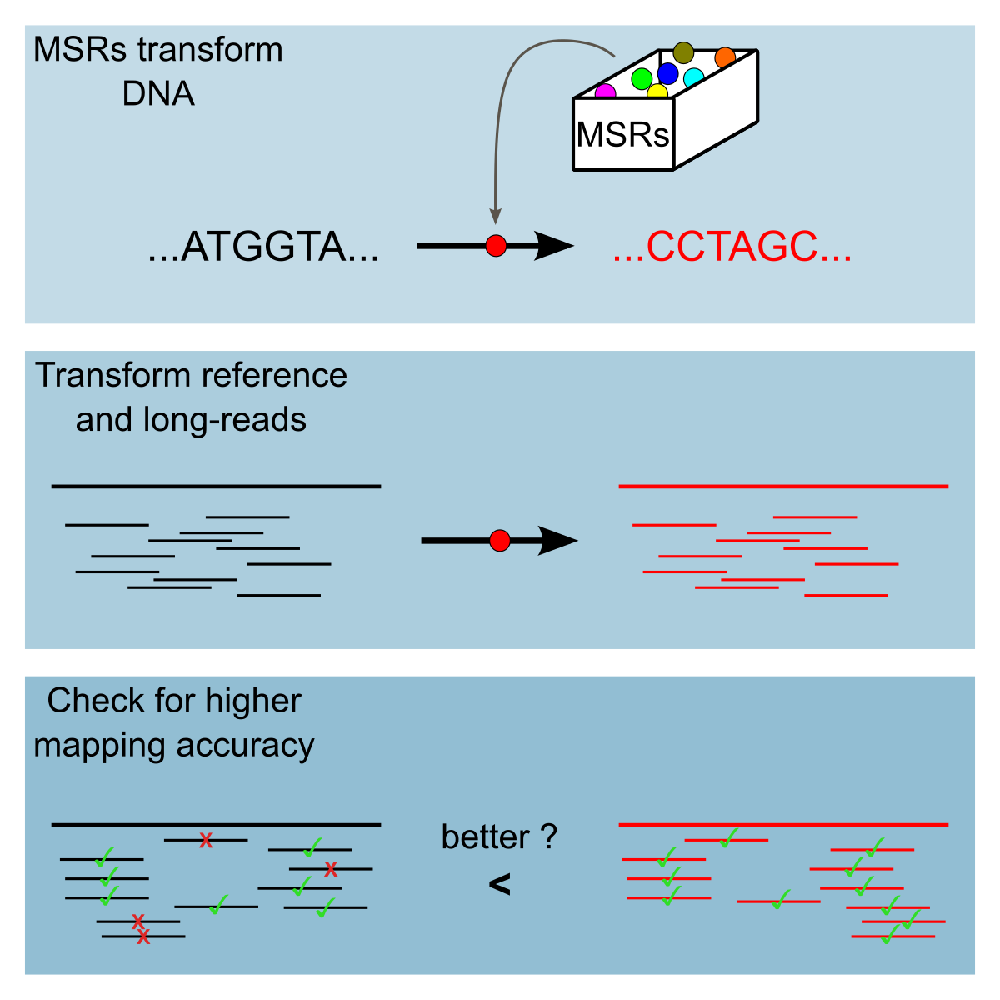
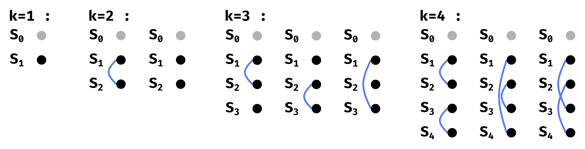
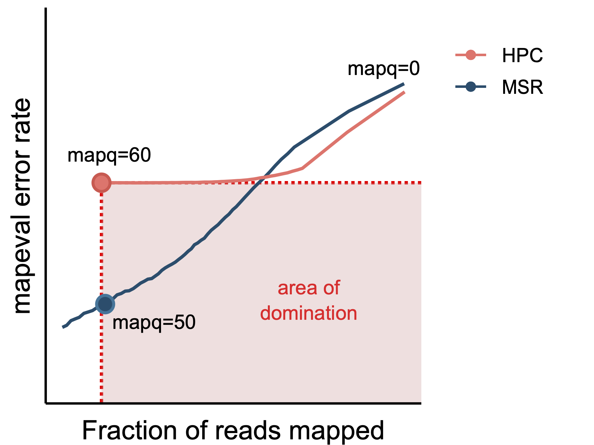
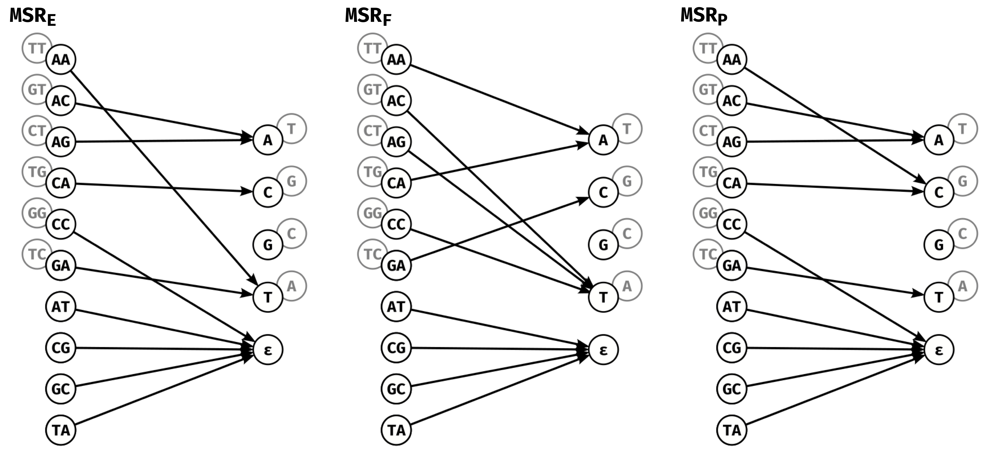
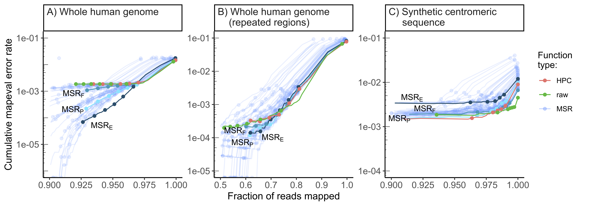
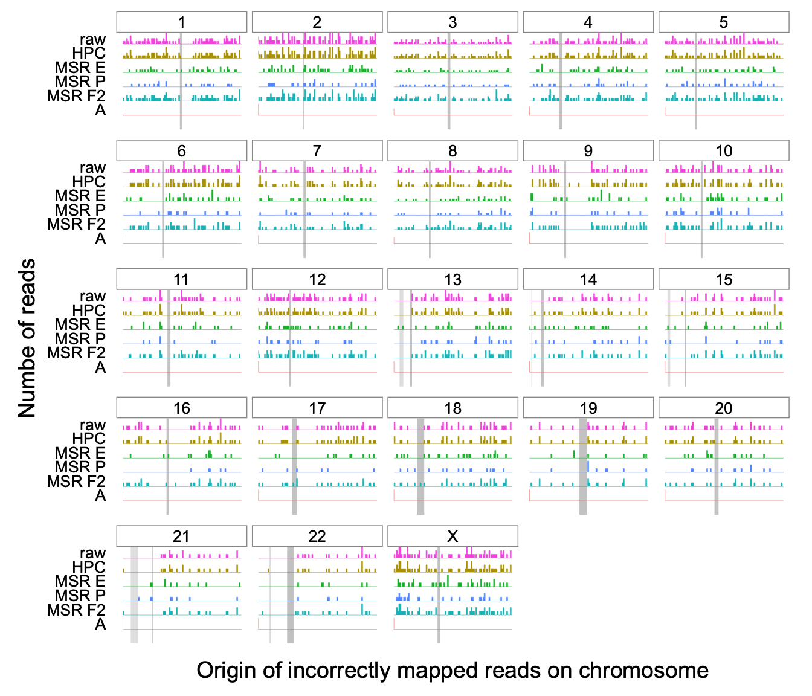

# Contribution 1: Improving read alignment by exploring a sequence transformation space {#HPC-paper}

Recall that, when using long-read sequencing technologies, sequencing errors are more frequent than when using short-read sequencing. The most common of these sequencing errors are linked to homopolymers (\@ref(homopolymers-and-long-reads)). 
In read-mapping analyses, a short sequence is globally aligned to a much longer reference sequence. Mapping long-reads can help bridge some gaps in knowledge and solve problems impossible to solve with shorter reads, however sequencing errors complicate an already complicated task (\@ref(the-specificities-of-read-mapping)). Homopolymer compression (\@ref(hpc-trick)) has been successfully used to mitigate some of the effects of these errors and improve long-read mapping analyses. There might, however, be rooom for improvement and alternative sequence transformation procedures that improve long-read mapping more than homopolymer compression.   

This chapter was written as an article titled: **"Mapping-friendly sequence reductions: going beyond homopolymer compression"**. It is currently in press for the iScience proceedings of the RECOMB-SEQ 2022 conference and is presented as is, without any modification from the submitted version. The author list, complete with affiliations is given below:\
\

Luc Blassel^**1**,**2**\*^, Paul Medvedev^**3**,**4**,**5**^, Rayan Chikhi^**1**^

**1** Sequence Bioinformatics, Department of Computational Biology, Institut Pasteur, Paris, France\
**2** Sorbonne Université, Collège doctoral, Paris, France\
**3** Department of Computer Science and Engineering, Pennsylvania State University, University Park, Pennsylvania, United States of America\
**4** Department of Biochemistry and Molecular Biology, Pennsylvania State University, University Park, Pennsylvania, United States of America\
**5** Center for Computational Biology and Bioinformatics, Pennsylvania State University, University Park, Pennsylvania, United States of America\
\


\newcommand{\stirling}[2]{\bigg\{%
\begin{matrix}
    #1 \\
    #2
\end{matrix}
\bigg\} }
\newcommand{\comb}[2]{\bigg(
\begin{matrix}
    #1 \\
    #2
\end{matrix}
\bigg) }

\newcommand{\lmer}{$\ell$-mer\xspace}
\newcommand{\lmers}{$\ell$-mers\xspace}
\newcommand{\iscomp}{\textsc{IsComp}\xspace}
\newcommand{\rccore}{RC-core-insensitive\xspace}
\newcommand{\minimap}{\texttt{minimap2}\xspace}
\newcommand{\winnowmap}{\texttt{winnowmap2}\xspace}
\newcommand{\msr}[1]{MSR$_{\text{#1}}$}

```{r, include=knitr::is_html_output()}
knitr::asis_output('\\newcommand{\\textsc}[1]{#1}')
```

## Highlights {.unnumbered}

-   Mapping-friendly sequence reductions (MSRs) are functions that transform DNA sequences.

-   They are a generalization of the concept of homopolymer compression.

-   We show that some well-chosen MSRs enable more accurate long read mapping.

## Graphical Abstract {.unnumbered}

```{r, eval=knitr::is_html_output(), out.width="60%"}

```

```{=tex}
\begin{center}
\includegraphics[width=0.6\textwidth]{figures/HPC-MSRs/abstract.pdf}
\end{center}
```

## Abstract {#hpc-abstract .unnumbered}

Sequencing errors continue to pose algorithmic challenges to methods working with sequencing data. One of the simplest and most prevalent techniques for ameliorating the detrimental effects of homopolymer expansion/contraction errors present in long reads is homopolymer compression. It collapses runs of repeated nucleotides, to remove some sequencing errors and improve mapping sensitivity. Though our intuitive understanding justifies why homopolymer compression works, it in no way implies that it is the best transformation that can be done. In this paper, we explore if there are transformations that can be applied in the same pre-processing manner as homopolymer compression that would achieve better alignment sensitivity. We introduce a more general framework than homopolymer compression, called mapping-friendly sequence reductions. We transform the reference and the reads using these reductions and then apply an alignment algorithm. We demonstrate that some mapping-friendly sequence reductions lead to improved mapping accuracy, outperforming homopolymer compression.

## Introduction {#hpc-introduction}

Sequencing errors continue to pose algorithmic challenges to methods working with read data. In short-read technologies, these tend to be substitution errors, but in long reads, these tend to be short insertions and deletions; most common are expansions or contractions of homopolymers (i.e. reporting 3 As instead of 4) [@dohmBenchmarkingLongreadCorrection2020]. Many algorithmic problems, such as alignment, become trivial if not for sequencing errors [@gusfieldAlgorithmsStringsTrees1997]. Error correction can often decrease the error rate but does not eliminate all errors. Most tools therefore incorporate the uncertainty caused by errors into their underlying algorithms. The higher the error rate, the more detrimental its effect on algorithm speed, memory, and accuracy. While the sequencing error rate of any given technology tends to decrease over time, new technologies entering the market typically have high error rates (e.g. Oxford Nanopore Technologies). Finding better ways to cope with sequencing error therefore remains a top priority in bioinformatics.

One of the simplest and most prevalent techniques for ameliorating the detrimental effects of homopolymer expansion/contraction errors is *homopolymer compression* (abbreviated HPC). HPC simply transforms runs of the same nucleotide within a sequence into a single occurrence of that nucleotide. For example, HPC applied to the sequence AAAGGTTA yields the sequence AGTA. To use HPC in an alignment algorithm, one first compresses the reads and the reference, then aligns each compressed read to the compressed reference, and finally reports all alignment locations, converted into the coordinate system of the uncompressed reference. HPC effectively removes homopolymer expansion/contraction errors from the downstream algorithm. Though there is a trade-off with specificity of the alignment (e.g. some of the compressed alignments may not correspond to true alignments) the improvement in mapping sensitivity usually outweighs it [@liMinimap2PairwiseAlignment2018].

The first use of HPC that we are aware of was in 2008 as a pre-processing step for 454 pyrosequencing data in the Celera assembler [@millerAggressiveAssemblyPyrosequencing2008]. It is used by a wide range of error-correction algorithms, e.g. for 454 data [@braggFastAccurateErrorcorrection2012], PacBio data [@auImprovingPacBioLong2012], and Oxford Nanopore data [@sahlinErrorCorrectionEnables2021]. HPC is used in alignment, e.g. by the widely used minimap2 aligner [@liMinimap2PairwiseAlignment2018]. HPC is also used in long-read assembly, e.g. HiCanu [@nurkHiCanuAccurateAssembly2020], SMARTdenovo [@liuSMARTdenovoNovoAssembler2021], or mdBG [@ekimMinimizerspaceBruijnGraphs2021]. HPC is also used for clustering transcriptome reads according to gene family of origin [@sahlinNovoClusteringLongRead2020]. Overall, HPC has been widely used, with demonstrated benefits.

Though our intuitive understanding justifies why HPC works, it in no way implies that it is the best transformation that can be done. Are there transformations that can be applied in the same pre-processing way as HPC that would achieve better alignment sensitivity? In this work, we define a more general notion which we call *mapping-friendly sequence reductions*. In order to efficiently explore the performance of all reductions, we identify two heuristics to reduce the search space of reductions. We then identify a number of mapping-friendly sequence reductions which are likely to yield better mapping performance than HPC. We evaluate them using two mappers (`minimap2` and `winnowmap2`) on three simulated datasets (whole human genome, human centromere, and whole *Drosophila* genome). We show that some of these functions provide vastly superior performance in terms of correctly placing high mapping quality reads, compared to either HPC or using raw reads. For example, one function decreased the mapping error rate of `minimap2` by an order of magnitude over the entire human genome, keeping an identical fraction of reads mapped.

We also evaluate whether HPC sensitivity gains continue to outweigh the specificity cost with the advent of telomere-to-telomere assemblies [@nurk2022]. These contain many more low-complexity and/or repeated regions such as centromeres and telomeres. HPC may increase mapping ambiguity in these regions by removing small, distinguishing, differences between repeat instances. Indeed, we find that neither HPC nor our mapping-friendly sequence reductions perform better than mapping raw reads on centromeres, hinting at the importance of preserving all sequence information in repeated regions.


## Results {#hpc-results}

### Streaming sequence reductions {#sec:msr-def}

We wish to extend the notion of homopolymer compression to a more general function while maintaining its simplicity. What makes HPC simple is that it can be done in a streaming fashion over the sequence while maintaining only a local context. The algorithm can be viewed simply as scanning a string from left to right and, at each new character, outputting that character if and only if it is different from the previous character. In order to prepare for generalizing this algorithm, let us define a function $g^\text{HPC} : \Sigma^2\rightarrow\Sigma\cup\{\varepsilon\}$ where $\Sigma$ is the DNA alphabet, $\varepsilon$ is the empty character, and


\begin{align*}
    & g^\text{HPC}(x_1\cdot x_2) =
    \begin{cases}
        x_2 & \text{if } x_1 \neq x_2 \\
        \varepsilon & \text{if } x_1 = x_2
    \end{cases}
\end{align*}

Now, we can view HPC as sliding a window of size 2 over the sequence and at each new window, applying $g^\text{HPC}$ to the window and concatenating the output to the growing compressed string. Formally, let $x$ be a string, which we index starting from 1. Then, the HPC transformation is defined as


\begin{equation}
  f(x) = x[1,\ell-1]\cdot g(x[1,\ell]) \cdot g(x[2, \ell+1])\cdots g(x[|x|-\ell+1,|x|]) 
  (\#eq:MSR)
\end{equation}

where $\ell = 2$ and $g=g^\text{HPC}$. In other words, $f$ is the concatenation of the first $\ell-1$ characters of $x$ and the sequence of outputs of $g$ applied to a sliding window of length $\ell$ over $x$. The core of the transformation is given by $g$ and the size of the context $\ell$, and $f$ is simply the wrapper for $g$ so that the transformation can be applied to arbitrary length strings.

With this view in mind, we can generalize HPC while keeping its simplicity by 1) considering different functions $g$ that can be plugged into Equation \@ref(eq:MSR) increasing the context that $g$ uses (i.e. setting $\ell>2$). Formally, for a given alphabet $\Sigma$ and a context size $\ell$, a function $T$ mapping strings to strings is said to be an *order-*$\ell$ Streaming sequence reduction (abbreviated *SSR*) if there exists some $g : \Sigma^\ell\rightarrow\Sigma\cup\{\varepsilon\}$ such that $T=f$.

Figure \@ref(fig:countingMSRs)A shows how an SSR can be visualized as a directed graph. Observe that an order-$\ell$ SSR is defined by a mapping between $|\Sigma|^\ell$ inputs and $|\Sigma| + 1$ outputs. For example, for $\ell=2$, there are $n=16$ inputs and $k=5$ outputs. Figure \@ref(fig:countingMSRs)B visualizes HPC in this way.

```{r, figCountingMSRsCaption}
countingMSRsCaption <- "**Representing and counting Streaming sequence reductions.**  
**A**: General representation of an order-2 Streaming sequence
reduction as a mapping of 16 input dinucleotides, to the 4 nucleotide
outputs and the empty character $\\varepsilon$. **B**: Homopolymer
compression is an order-2 SSR. All dinucleotides except those that
contain the same nucleotide twice map to the second nucleotide of the
pair. The 4 dinucleotides that are the two same nucleotides map to the
empty character $\\varepsilon$. **C**: Our RC-core-insensitive order-2
SSRs are mappings of the 6 representative dinucleotide inputs to the 4
nucleotide outputs and the empty character $\\varepsilon$. The 4
dinucleotides that are their own reverse complement are always mapped to
$\\varepsilon$. The remaining 6 dinucleotides are mapped to the
complement of the mapped output of the reverse complement dinucleotide
input. For example, if AA is mapped to C, then TT (the reverse
complement of AA) will be mapped to G (the complement of C). **D**:
Number of possible SSR mappings under the different restrictions
presented in the main text. All mappings from 16 dinucleotide inputs to
5 outputs (as in panel A) are represented by the outermost circle. All
RC-core-insensitive mappings (as in panel C) are represented by the
medium circle. All RC-core-insensitive mappings with only one
representative of each equivalence class are represented by the
innermost circle."
```

```{r, figCountingMSRs, fig.cap=countingMSRsCaption, label="countingMSRs", eval=knitr::is_html_output()}
knitr::include_graphics("./figures/HPC-MSRs/panels_inline.png")
```

```{=tex}
\begin{figure}[t]
    \centering
    \includegraphics[width=\textwidth]{./figures/HPC-MSRs/panels_inline.pdf}
    \extcaption{Representing and counting Streaming sequence reductions.}{
        \textbf{A}: General representation of an order-2 Streaming sequence reduction as a mapping of 16 input dinucleotides, to the 4 nucleotide outputs and the empty character $\varepsilon$.
        \textbf{B}: Homopolymer compression is an order-2 SSR. All dinucleotides except those that contain the same nucleotide twice map to the second nucleotide of the pair. The 4 dinucleotides that are the two same nucleotides map to the empty character $\varepsilon$.
        \textbf{C}: Our RC-core-insensitive order-2 SSRs are mappings of the 6 representative dinucleotide inputs to the 4 nucleotide outputs and the empty character $\varepsilon$. The 4 dinucleotides that are their own reverse complement are always mapped to $\varepsilon$. The remaining 6 dinucleotides are mapped to the complement of the mapped output of the reverse complement dinucleotide input. For example, if AA is mapped to C, then TT (the reverse complement of AA) will be mapped to G (the complement of C).
        \textbf{D}: Number of possible SSR mappings under the different restrictions presented in the main text. All mappings from 16 dinucleotide inputs to 5 outputs (as in panel A) are represented by the outermost circle. All RC-core-insensitive mappings (as in panel C) are represented by the medium circle. All RC-core-insensitive mappings with only one representative of each equivalence class are represented by the innermost circle.
    }
    \label{fig:countingMSRs}
\end{figure}
```
Since we aim to use SSRs in the context of sequencing data, we need to place additional restrictions on how they handle reverse complements. For example, given two strings $x$ (e.g. a read) and $y$ (e.g. a substring of the reference), a mapper might check if $x = RC(y)$. When strings are pre-processed using an SSR $f$, it will end up checking if $f(x) = RC(f(y))$. However, $x = RC(y)$ only implies that $f(x) = f(RC(y))$. In order to have it also imply that $f(x) = RC(f(y))$, we need $f$ to be commutative with RC, i.e. applying SSR then RC needs to be equivalent to applying RC then SSR. We say that $f$ is *RC-insensitive* if for all $x$, $f(RC(x))= RC(f(x))$. Observe that HPC is RC-insensitive.

### Restricting the space of streaming sequence reductions {#sec:enum}

To discover SSRs that improve mapping performance, our strategy is to put them all to the test by evaluating the results of an actual mapping software over a simulated test dataset reduced by each SSR. However, even with only $16$ inputs and $5$ outputs, the number of possible $g$ mappings for order-2 SSRs is $5^{16}\approx 1.5\cdot10^{11}$, which is prohibitive to enumerate. In this section, we describe two ideas for reducing the space of SSRs that we will test. In subsection \@ref(sec:rc-insensitive), we show how the restriction to RC-insensitive mappings can be used to reduce the search space. In subsection \@ref(sec:equiv), we exploit the natural symmetry that arises due to Watson-Crick complements to further restrict the search space.

These restrictions reduce the number of order-2 SSRs to only , making it feasible to test all of them. Figure \@ref(fig:countingMSRs)D shows an overview of our restriction process.

#### Reverse complement-core-insensitive streaming sequence reductions {#sec:rc-insensitive}

Consider an SSR defined by a function $g$, as in Equation \@ref(eq:MSR). Throughout this paper we will consider SSRs that have a related but weaker property than RC-insensitive. We say that an SSR is *RC-core-insensitive* if the function $g$ that defines it has the property that for every $\ell$-mer$x$ and its reverse complement $y$, we have that either $g(x)$ is the reverse complement of $g(y)$ or $g(x) = g(y) = \varepsilon$. We will restrict our SSR search space to RC-core-insensitive reductions in order to reduce the number of SSRs we will need to test.

Let us consider what this means for the case of $\ell=2$, which will be the focal point of our experimental analysis. There are 16 $\ell$-mers(i.e. dinucleotides) in total. Four of them are their own reverse complement: AT, TA, GC, CG. The RC-core-insensitive restriction forces $g$ to map each of these to $\varepsilon$, since a single nucleotide output cannot be its own reverse complement. This leaves 12 $\ell$-mers, which can be broken down into 6 pairs of reverse complements. For each pair, we can order them in lexicographical order and write them as $(AA,TT), (AC,GT), (AG,CT), (CA,TG), (CC,GG),$ and $(GA,TC)$. Defining $g$ can then be done by assigning an output nucleotide to the first $\ell$-mer in each of these pairs (Figure \@ref(fig:countingMSRs)C). For example, we can define an SSR by assigning $g(AA) = C$, $g(AC) = C$, $g(AG) = A$, $g(CA) = A$, $g(CC) = T$, and $g(GA) = G$. As an example, let us apply the corresponding SSR to an example read $r$:


\begin{align*}
    r & = \text{TAAGTTGA}    & f(RC(r)) &=\color{red}{\text{T}}\color{green}{\text{CACCTG}} \\
    f(r) & =\text{TCAGGTG}   & RC(f(r)) &=\;\;\;\color{green}{\text{CACCTG}}\color{red}{\text{A}} \\
    RC(r) & =\text{TCAACTTA} & &
\end{align*}

Observe that the first $\ell-1$ nucleotides of $r$ (shown in red) are copied as-is, since we do not apply $g$ on them (as per Equation \@ref(eq:MSR)). As we see in this example, this implies that $f(RC(r))$ is not necessarily equal to $RC(f(r))$; thus an RC-core-insensitive SSR is not necessarily an RC-insensitive SSR. However, an RC-core-insensitive SSR has the property that for all strings $r$, we have $f(RC(r))[\ell, |r|]) = RC(f(r))[1, |r| - \ell + 1]$. In other words, if we drop the $\ell - 1$ prefix of $f(RC(r))$ and the $\ell - 1$ suffix of $RC(f(r))$, then the two strings are equal. Though we no longer have the strict RC-insensitive property, this new property suffices for the purpose of mapping long reads. Since the length of the read sequences will be much greater than $\ell$ (in our results we will only use $\ell=2$), having a mismatch in the first or last nucleotide will be practically inconsequential.

It is important to note though that there may be other RC-insensitive functions not generated by this construction. For instance, HPC cannot be derived using this method (as it does not map the di-nucleotides AT,TA,GC and CG to $\varepsilon$), and yet it is RC-insensitive.

We can count the number of RC-core-insensitive SSRs. Let us define $i(\ell)$ the number of input assignments necessary to fully determine the RC-core-insensitive SSR; one can think of this as the degrees-of-freedom in choosing $g$. As we showed, for $\ell=2$, we have $i(\ell)=6$. The number of RC-core-insensitive SSRs is then $5^{i(\ell)}$. Therefore, for $\ell=2$, instead of $5^{16}$ possible mappings we have at most $5^{6}\approx1.5\cdot10^{4}$ RC-core-insensitive mappings (Figure \@ref(fig:countingMSRs)D). For an odd $\ell>2$, there are no $\ell$-mers that are their own reverse complements, hence $i(\ell)=4^\ell/2$. If $\ell$ is even then there are $4^{\ell/2}$ inputs that are their own reverse complements (i.e. we take all possible sequences of length $\ell/2$ and reconstruct the other half with reverse complements). Thus, $i(\ell)=(4^\ell- 4^{\ell/2})/2$.

#### Equivalence classes of SSRs {#sec:equiv}

Non mapping-related preliminary tests led us to hypothesize that swapping $A\leftrightarrow T$ and/or $C\leftrightarrow G$, as well as swapping the whole $A/T$ pair with the $C/G$ pair in the SSR outputs would have a negligible effect on performance. In other words, we could exchange the letters of the output in a way that preserves the Watson-Crick complementary relation. Intuitively, this can be due to the symmetry induced by reverse complements in nucleic acid strands, though we do not have a more rigorous explanation for this effect. In this section, we will formalize this observation by defining the notion of SSR equivalence. This will reduce the space of SSRs that we will need to consider by allowing us to evaluate only one SSR from each equivalence class.

Consider an RC-core-insensitive SSR defined by a function $g$, as in Equation \@ref(eq:MSR). An $\ell$-mer is canonical if it is the not lexicographically larger than its reverse complement. Let $I$ be the set of all $\ell$-mers that are canonical. Such an SSR's *dimension* $k$ is the number of distinct nucleotides that can be output by $g$ on inputs from $I$ (not counting $\varepsilon$). The dimension can range from $1$ to $4$. Next, observe that $g$ maps all elements of $I$ to one of $k+ 1$ values (i.e. $\Sigma \cup \varepsilon$). The output of $g$ on $\ell$-mers not in $I$ is determined by its output on $\ell$-mers in $I$, since we assume the SSR is RC-core-insensitive. We can therefore view it as a partition of $I$ into $k+1$ sets $S_0$, ..., $S_k$, and then having a function $t$ that is an injection from $\{1, \ldots, k\}$ to $\Sigma$ that assigns an output letter to each partition. Further, we permanently assign the output letter for $S_0$ to be $\varepsilon$. Note that while $S_0$ could be empty, $S_1, \ldots, S_k$ cannot be empty by definition of dimension. For example, the SSR used in Section \@ref(sec:rc-insensitive) has dimension four and corresponds to the partition $S_0 = \{\}, S_1=\{AG,CA\}$, $S_2=\{CC\}$, $S_3=\{AA,AC\}$, $S_4=\{GA\}$, and to the injection $t(1) = A$, $t(2) =T$, $t(3) = C$, and $t(4) = G$.

Let $\textsc{IsComp}(x,y)$ be a function that returns true if two nucleotides $x, y \in \Sigma \cup \{\varepsilon\}$ are Watson-Crick complements, and false otherwise. Consider two SSRs of dimension $k$ defined by $S_0, \ldots, S_k, t$ and $S'_0, , S'_k, t'$, respectively. We say that they are equivalent iff all the following conditions are met:

-   $S_0 = S'_0$,

-   there exists a permutation $\pi$ of $\{1,\ldots, k\}$ such that for all $1 \leq i \leq k$, we have $S_i = S'_{\pi(i)}$,

-   for all $1 \leq i < j \leq k$, we have $\textsc{IsComp}(t(i), t(j)) = \textsc{IsComp}(t'(\pi(i)), t'(\pi(j)))$.

One can verify that this definition is indeed an equivalence relation, i.e. it is reflexive, symmetric, and transitive. Therefore, we can partition the set of all SSRs into equivalence classes based on this equivalence relation. One caveat is that a single SSR defined by a function $g$ may correspond to multiple SSRs of the form $S_0,\ldots,S_k,t$. However, these multiple SSRs are equivalent, hence the resulting equivalence classes are not affected. Furthermore, we can assume that there is some rule to pick one representative SSR for its equivalence class; the rule itself does not matter in our case.

Figure \@ref(fig:figMSRConfigs) shows the equivalence classes for $\ell=2$, for a fixed partition. An equivalence class can be defined by which pair of classes $S_i$ and $S_j$ have complementary outputs under $t$ and $t'$. Let us define $o(k)$ as the number of equivalence classes for a given partition and a given $k$. Then Figure \@ref(fig:figMSRConfigs) shows that $o(1)=1$, $o(2)=2$ and $o(3) = o(4) = 3$. There are thus only 9 equivalence classes for a given partition.

```{r}
figMSR_configs_caption <- "**SSR equivalence classes for a fixed partition of the inputs.**  
$S_0$ is always assigned $\\varepsilon$, so it is represented by a gray
node. A blue link between $S_i$ and an $S_j$ denotes that
$\\textsc{IsComp}(t(i), t(j))=\\text{true}$. The equivalence classes are
determined by the Watson-Crick complementary relationships between the
rest of the parts, i.e. by all the possible ways to draw the blue links."
```

```{r, label="figMSRConfigs", figMSRConfigs, fig.cap=figMSR_configs_caption, eval=knitr::is_html_output()}

```

```{=tex}
\begin{figure}
    \centering
    \includegraphics[width=0.8\textwidth]{./figures/HPC-MSRs/equivalence_classes_simpler.pdf}
    \extcaption{SSR equivalence classes for a fixed partition of the inputs.}{
    $S_0$ is always assigned $\varepsilon$, so it is represented by a gray node. 
    A blue link between $S_i$ and an $S_j$ denotes that $\textsc{IsComp}(t(i), t(j))=\text{true}$.
    The equivalence classes are determined by the Watson-Crick complementary relationships between the rest of the parts, i.e. by all the possible ways to draw the blue links.
    }
    \label{fig:figMSRConfigs}
\end{figure}
```
#### Counting the number of restricted SSRs

In this section, we derive a formula for the number of restricted SSRs, i.e. SSRs that are RC-core-insensitive and that are representative for their equivalence class. Consider the class of RC-core-insensitive SSRs with dimension $k$. In subsection \@ref(sec:rc-insensitive), we derived that the degrees-of-freedom in assigning $\ell$-mers to an output is $i(\ell) = 4^\ell/2$ if $\ell$ is odd and $i(\ell) = (4^\ell - 4^{\ell / 2})/2$ if $\ell$ is even. Let $C(\ell,k)$ be the number of ways that $i(\ell)$ $\ell$-mers can be partitioned into $k+1$ sets $S_0, \ldots, S_k$, with $S_1, \ldots, S_k$ required to be non-empty. Then, in subsection \@ref(sec:equiv), we have derived $o(k)$, the number of SSR equivalence classes for each such partition. The number of restricted SSRs can then be written as

\begin{equation}
N(\ell) = \sum_{k=1}^{4} C(\ell, k) \cdot o(k)
(\#eq:N)
\end{equation}

To derive the formula for $C(\ell, k)$, we first recall that the number of ways to partition $n$ elements into $k$ non-empty sets is known as the Stirling number of the second kind and is denoted by $\tiny\stirling{n}{k}$ [@grahamConcreteMathematicsFoundation1994, p.265]. It can be computed using the formula

\begin{equation*}
    \stirling{n}{k} = \frac{1}{k!}\sum_{i=0}^k(-1)^i\comb{k}{i}(k-i)^n
\end{equation*}

Let $j$ be the number of the $i(\ell)$ $\ell$-mers that are assigned to $S_0$. Note this does not include the $\ell$-mers that are self-complementary that are forced to be in $S_0$. Let $C(\ell,k,j)$ be the number of ways that $i(\ell)$ $\ell$-mers can be partitioned into $k+1$ sets $S_0, \ldots, S_k$, such that $j$ of the $\ell$-mers go into $|S_0|$ and $S_1, \ldots, S_k$ to are non-empty. We need to consider several cases depending on the value of $j$:

-   In the case that $j = 0$, we are partitioning the $i(\ell)$ inputs among non-empty sets $S_1, \ldots, S_k$. Then $C(\ell, k,j) = \tiny{\stirling{i(\ell)}{k}}$.

-   In the case that $1 \leq j \leq i(\ell) - k$, there are $\tiny{\comb{i(\ell)}{j}}$ ways to choose which $j$ $\ell$-mers are in $S_0$, and $\tiny{\stirling{i(\ell) - j}{k}}$ ways to partition the remaining $\ell$-mers into $S_1, \ldots, S_k$. Hence, $C(\ell, k,j) = \tiny{\comb{i(\ell)}{j}}\tiny{\stirling{i(\ell) - j}{k}}$.

-   In the case that $j > i(\ell) - k$, it is impossible to partition the remaining $k$ (or fewer) $\ell$-mers into $S_1, \ldots, S_k$ such that the sets are non-empty. Recall that as we assume the dimension is $k$, each set must contain at least one element. Hence, $C(\ell, k,j) = 0$.

Putting this together into Equation \@ref(eq:N), we get


\begin{equation*}
    N(\ell) = \sum_{k=1}^4 o(k) \bigg( \stirling{i(\ell)}{k} + \sum_{j=1}^{i(\ell) - k}\comb{i(\ell)}{j}\stirling{i(\ell)-j}{k}  \bigg)
\end{equation*}

For $\ell=2$, we have $N(2)=2,135$ restricted SSRs, which is several orders of magnitude smaller than the initial $5^{16}$ possible SSRs and allows us to test the performance of all of them. For order-3 SSRs we get $N(3)=2.9\cdot10^{21}$ which much smaller than the full search space of $5^{4^3}\approx5.4\cdot10^{44}$, for order-4 SSRs we get a similar reduction in search space with $N(4)=9.4\cdot10^{84}$ as opposed to the full search space of $5^{4^4}\approx8.6\cdot10^{178}$. For these higher order SSRs, although the restricted search space is much smaller than the full original one, it is still too large to exhaustively search.

### Selection of mapping-friendly sequence reductions

We selected a set of "promising" SSRs starting from all of the SSRs enumerated in Section \@ref(sec:enum), that we call *mapping-friendly sequence reductions* (abbreviated *MSR*).
The selection was performed on a 0.5x coverage read set, simulated from a whole human genome assembly [@nurk2022].The transformed reads were mapped to the transformed reference using `minimap2` and `paftools mapeval` [@liMinimap2PairwiseAlignment2018] was used to compute a mapping error rate.
Note that overfitting SSRs to a particular genome is acceptable in applications where a custom SSR can be used for each genome. Yet in this work, the same set of selected SSR will be used across all genomes.

```{r, thresholdCaption}
thresholdCaption <- "**Illustration of how a respective mapq threshold is chosen for each
of our evaluated MSRs.**  
The orange dot shows the error rate and
fraction of reads mapped for HPC at mapq threshold 60. Anything below
and to the right of this point is strictly better than HPC 60, i.e. it
has both a lower error rate and higher fraction of reads mapped. If an
evaluated MSR does not pass through this region, then it is discarded
from further consideration. In the figure, the blue MSR does pass
through this region, indicating that it is better than HPC 60. We
identify the leftmost point (marked as a blue dot) and use the mapq
threshold at that point as the respective threshold."
```

```{r, thresholdChoice, label="thresholdChoice", fig.cap=thresholdCaption, eval=knitr::is_html_output(), out.width="50%"}

```

```{=tex}
\begin{figure}[t]
    \centering
    % \includegraphics[width=0.4\textwidth]{figures/main_text/hpc.png}
    \includegraphics[width=0.4\textwidth]{figures/HPC-MSRs/threshold_selection-v2.pdf}
    \extcaption{Illustration of how a respective mapq threshold is chosen for each of our evaluated MSRs.}{ 
        The orange dot shows the error rate and fraction of reads mapped for HPC at mapq threshold 60. 
        Anything below and to the right of this point is strictly better than HPC 60, i.e.
        it has both a lower error rate and higher fraction of reads mapped. 
        If an evaluated MSR does not pass through this region, then it is discarded from further consideration. 
        In the figure, the blue MSR does pass through this region, indicating that it is better than HPC 60. 
        We identify the leftmost point (marked as a blue dot) and use the mapq threshold at that point as the respective threshold.
        }
    \label{fig:thresholdChoice}
\end{figure}
```
For each evaluated SSR, we selected, if it exists, the highest mapq threshold for which the mapped read fraction is higher and the mapping error rate is lower than HPC at mapq 60 ($0.93$ and $2.1\cdot10^{-3}$ respectively), Figure \@ref(fig:thresholdChoice) illustrates the idea. Then we identified the 20 SSRs that have the highest fraction of reads mapped at their respective thresholds. Similarly we identified the 20 SSRs with the lowest mapping error rate. Finally we select the 20 SSRs that have the highest percentage of thresholds "better" than HPC at mapq 60; i.e. the number of mapq thresholds for which the SSR has both a higher fraction of reads mapped and lower mapping error rate than HPC at a mapq threshold of 60, divided by the total number of thresholds (=60).

The union of these 3 sets of 20 SSRs resulted in a set of 58 "promising" MSRs. Furthermore, we will highlight three MSRs that are "best in their category", i.e.

-   **MSR**~F~: The MSR with the highest fraction of mapped reads at a mapq threshold of 0.

-   **MSR**~E~: The MSR with the lowest mapping error rate at its respective mapq threshold.

-   **MSR**~P~: The MSR with the highest percentage of mapq thresholds for which it is "better" than HPC at mapq 60.

Figure \@ref(fig:topMSRs) shows the actual functions MSR~F~, MSR~E~, MSR~P~. An intriguing property is that they output predominantly As and Ts, with MSR~P~ assigning only 2 input pairs to the G/C output whereas MSR~E~ and MSR~F~ assign only one. Additionally, MSR~E~ and MSR~P~ both assign the {CC,GG} input pair to the deletion output $\varepsilon$ removing any information corresponding to repetitions of either G or C from the reduced sequence. Overall this means the reduced sequences are much more AT-rich than their raw counterparts, but somehow information pertinent to mapping is retained

```{r}
figtopMSRsCaption <- "**Graph representations of our highlighted MSRs: MSR~E~,
MSR~F~, and MSR~P~.**  
MSR~E~ has the lowest error rate of among MSRs at the highest
mapq threshold for which it performs better than HPC at mapq 60,
MSR~F~ has the highest fraction of reads mapped at mapq 60 and
MSR~P~ has the highest percentage of mapq thresholds for which
it outperforms HPC at mapq 60. The grayed out nodes represent the
reverse complement of input dinucleotides and outputs, as in
Figure \\@ref(fig:countingMSRs)C. For example for MSR~E~, AA is
mapped to T, so TT is mapped to
A."
```

```{r, figtopMSRs, fig.cap=figtopMSRsCaption, label="topMSRs", eval=knitr::is_html_output()}

```

```{=tex}
\begin{figure}[h!]
    \centering
    \includegraphics[width=0.7\textwidth]{figures/HPC-MSRs/Top_MSRs.pdf}
    \extcaption{Graph representations of our highlighted MSRs: MSR$_{\text{E}}$,  MSR$_{\text{F}}$,  and MSR$_{\text{P}}$.}{
        MSR$_{\text{E}}$ has the lowest error rate of among MSRs at the highest mapq threshold for which it performs better than HPC at mapq 60, MSR$_{\text{F}}$ has the highest fraction of reads mapped at mapq 60 and MSR$_{\text{P}}$ has the highest percentage of mapq thresholds for which it outperforms HPC at mapq 60.
        The grayed out nodes represent the reverse complement of input dinucleotides and outputs, as in \autoref{fig:countingMSRs}C. For example for MSR$_{\text{E}}$, AA is mapped to T, so TT is mapped to A.}
    \label{fig:topMSRs}
\end{figure}
```

The 58 selected MSRs, as well as HPC and the identity transformation (denoted as *raw*), were then evaluated on larger read-sets simulated from 3 whole genome references: a whole human genome assembly [@nurk2022], a whole *Drosophila melanogaster* genome assembly [@adamsGenomeSequenceDrosophila2000] and a synthetic centromeric sequence [@mikheenkoTandemToolsMappingLong2020] (see [STAR Methods](#sec:methods) for more details).

### Mapping-friendly sequence reductions lead to lower mapping errors on whole genomes

Across the entire human genome, at high mapping quality thresholds (above 50), our selected 58 MSRs generally have lower mapping error rate than HPC and raw Figure \@ref(fig:mapeval)A and Table \@ref(tab:table-subset). This is not surprising, as we selected those MSRs partly on the criteria of outperforming HPC at mapq 60; however, it does demonstrate that we did not overfit to the simulated reads used to select the MSRs.

```{r, figMapevalCaption}
figMapevalCaption <- " **Performance of our 58 selected mapping-friendly sequence reductions
across genomes on reads simulated by `nanosim`.**  
Panel **A)** shows the whole human genome assembly, **B)** the subset of
mapped reads from panel B that originate from repetitive regions, and
**C)** the \"TandemTools\" synthetic centromeric reference sequence. We
highlighted the best-performing mapping-friendly sequence reductions as
MSR E, F and P, respectively in terms of cumulative `mapeval` error
rate, fraction of reads mapped, and percentage of better thresholds than
HPC. Each point on a line represents, from left to right, the mapping
quality thresholds 60, 50, 40, 30, 20, 10 and 0. For the first point of
each line, only reads of mapping quality 60 are considered, and the y
value represents the rate of these reads that are not correctly mapped,
the x value represents the fraction of simulated reads that are mapped
at this threshold. The next point is computed for all reads of mapping
quality $\\geq50$, etc. The rightmost point on any curve represents the
mapping error rate and the fraction of mapped reads for all primary
alignments. The x-axes are clipped for lower mapped read fractions to
better differentiate HPC, raw and MSRs E, F and P."
```

```{r, figMapeval, fig.cap=figMapevalCaption, label="mapeval", eval=knitr::is_html_output()}

```

```{=tex}
\begin{figure}
    \centering
    \includegraphics[width=\textwidth]{figures/HPC-MSRs/MSR_mapeval_new_selection.reordered.pdf}
    \extcaption{Performance of our 58 selected mapping-friendly sequence reductions across genomes on reads simulated by \texttt{nanosim}.}{
        Panel \textbf{A)} shows the whole human genome assembly, \textbf{B)} the subset of mapped reads from panel B that originate from repetitive regions, and \textbf{C)} the ``TandemTools'' synthetic centromeric reference sequence.
        We highlighted the best-performing mapping-friendly sequence reductions as MSR E, F and P, respectively in terms of cumulative \texttt{mapeval} error rate, fraction of reads mapped, and percentage of better thresholds than HPC.
        Each point on a line represents, from left to right, the mapping quality thresholds 60, 50, 40, 30, 20, 10 and 0. For the first point of each line, only reads of mapping quality 60 are considered, and the y value represents the rate of these reads that are not correctly mapped, the x value represents the fraction of simulated reads that are mapped at this threshold. The next point is computed for all reads of mapping quality $\geq50$, etc. The rightmost point on any curve represents the mapping error rate and the fraction of mapped reads for all primary alignments. The x-axes are clipped for lower mapped read fractions to better differentiate HPC, raw and MSRs E, F and P.
    }
    \label{fig:mapeval}
\end{figure}
```
Mapping quality is only an indication from the aligner to estimate whether a read mapping is correct, and according to Figure \@ref(fig:mapeval)A the mapping error rate of most MSRs is low even for mapping qualities lower than 60. Therefore, we choose to compare MSR-mapped reads with lower mapping qualities against raw or HPC-mapped reads with the highest (60) mapping quality (which is the mapping quality thresholds most practitioners would use by default).

Table \@ref(tab:table-subset) shows that the three selected MSRs outperform both HPC and raw in terms of mapping error rate, with similar fractions of mapped reads overall. For example on the human genome, at mapq$\geq 50$, MSR~F~, MSR~P~ and MSR~E~ all map more reads than either HPC or raw at mapq=60, and MSR~P~ and MSR~E~ also have mapping error rates an order of magnitude lower than either HPC or raw.

To evaluate the robustness of MSRs E, F and P we investigated the impact of mapping to a different organism or using another mapper. To this effect we repeated the evaluation pipeline in these different settings:

-   Using the *Drosophila melanogaster* whole genome assembly as reference and mapping with `minimap2`

-   Using the whole human genome assembly as reference but mapping with `winnowmap2`(version 2.02) [@jainWeightedMinimizerSampling2020]. The same options as `minimap2` were used, and k-mers were counted using `meryl` [@rhieMerquryReferencefreeQuality2020], considering the top $0.02\%$ as repetitive (as suggested by the `winnowmap2` usage guide).

MSRs E, F and P behave very similarly in both of these contexts compared to HPC/raw: by selecting mapped reads with mapq$\geq$ 50 for the three MSRs we obtain a similar fraction of mapped reads with much lower error rates (Table \@ref(tab:table-subset)). A noticeable exception is the `winnowmap2` experiment, where a larger fraction of raw reads are mapped than any other MSR and even HPC. A more detailed results table can be found in Table \@ref(tab:mapperComparison), and a graph of MSR performance on the whole Drosophila genome in Figure \@ref(fig:drosophila-results). As Figure \@ref(fig:drosophila-results) shows, we also evaluated these MSRs on a whole *Escherichia coli* (Genbank ID [U00096.2](https://www.ncbi.nlm.nih.gov/nuccore/U00096.2)) genome, where we observed similar results, albeit the best MSRs do not seem to be one of our three candidates. This might mean that specific MSRs are more suited to particular types of genomes.

```{r, tableSubsetCaption}
tabtableSubsetCaption <- "**Performance of MSRs, HPC, and raw mappings across different mappers and reference sequences.**  
For each reference sequence and mapper pair, we report the fraction of reads mapped (\"fraction\" columns), the `paftools mapeval` mapping error rate (\"error\" columns). The percentage differences are computed w.r.t to the respective HPC value. For HPC and the raw these metrics were obtained for alignments of mapping quality of 60. For MSRs E, F and P these metrics were obtained for alignments of mapping quality $\\geq 50$."
```

```{r, tabtableSubset, label="table-subset", eval=knitr::is_html_output(), tab.topcaption=FALSE, cache=FALSE}
dt <- read_csv("tables/HPC-MSRs/Table1.csv")  

labels <- data.frame(
  col_keys = c("label","mapq","WGMf","WGMe","WWMf","WWMe","WDMf","WDMe"),
  what = c("label", "mapq", "Whole human genome (minimap2)", "Whole human genome (minimap2)", "Whole human genome (winnowmap2)", "Whole human genome (winnowmap2)", "Whole Drosophila genome (minimap2)", "Whole Drosophila genome (minimap2)"),
  measure = c("label", "mapq", "fraction", "error", "fraction", "error", "fraction", "error"),
  stringsAsFactors = FALSE
)

flextable(dt) %>%
  set_header_df(mapping=labels, key="col_keys") %>%
  merge_h(part="header") %>%
  merge_v(j="label", part="header") %>%
  merge_v(j="mapq", part="header") %>%
  ftExtra::colformat_md() %>%
  set_table_properties(width=1, layout="autofit") %>%
  theme_booktabs() %>%
  set_caption(caption=tabtableSubsetCaption, style="caption")
```

```{=tex}
\begin{table}[h!]
\centering
\resizebox{\textwidth}{!}{%
\begin{tabular}{@{}rlr@{}lr@{}lr@{}lr@{}lr@{}lr@{}l@{}}
\toprule
\multicolumn{2}{l}{}     & \multicolumn{4}{c}{Whole human genome}                                                  & \multicolumn{4}{c}{Whole human genome}                                                  & \multicolumn{4}{c}{Whole Drosophila genome}                                          \\
\multicolumn{2}{l}{}     & \multicolumn{4}{c}{\texttt{minimap2}}                                                            & \multicolumn{4}{c}{\texttt{winnowmap2}}                                                          & \multicolumn{4}{c}{\texttt{minimap2}}                                                         \\
\multicolumn{2}{r}{mapq} & \multicolumn{2}{l}{fraction}             & \multicolumn{2}{l}{error}                    & \multicolumn{2}{l}{fraction}             & \multicolumn{2}{l}{error}                    & \multicolumn{2}{l}{fraction}             & \multicolumn{2}{l}{error}                 \\ \cmidrule(lr){3-6} \cmidrule(lr){7-10} \cmidrule(l){11-14}
HPC         & 60         & 0.935          & {\:\footnotesize$+$0\%} & 1.85e-03          & {\:\footnotesize$+$ 0\%} & 0.894          & {\:\footnotesize$+$0\%} & 1.43e-03          & {\:\footnotesize$+$ 0\%} & 0.957          & {\:\footnotesize$+$0\%} & 2.27e-03      & {\:\footnotesize$+$  0\%} \\
raw         & 60         & 0.921          & {\:\footnotesize$-$1\%} & 1.86e-03          & {\:\footnotesize$+$ 0\%} & \textbf{0.932} & \textbf{\:\small$+$4\%} & 1.75e-03          & {\:\footnotesize$+$23\%} & 0.958          & {\:\footnotesize$+$0\%} & 2.27e-03      & {\:\footnotesize$-$  0\%} \\
MSR$_{\text{F}}$     & 50         & \textbf{0.938} & \textbf{\:\small$+$0\%} & 1.29e-03          & {\:\footnotesize$-$30\%} & 0.886          & {\:\footnotesize$-$1\%} & 3.82e-04          & {\:\footnotesize$-$73\%} & \textbf{0.960} & \textbf{\:\small$+$0\%} & 1.37e-03      & {\:\footnotesize$-$ 39\%} \\
MSR$_{\text{E}}$     & 50         & 0.936          & {\:\footnotesize$+$0\%} & \textbf{1.17e-04} & \textbf{\:\small$-$94\%} & 0.820          & {\:\footnotesize$-$8\%} & \textbf{8.93e-05} & \textbf{\:\small$-$94\%} & 0.954          & {\:\footnotesize$-$0\%} & \textbf{0.00} & \textbf{\:\small$-$100\%} \\ 
MSR$_{\text{P}}$     & 50         & \textbf{0.938} & \textbf{\:\small$+$0\%} & 4.15e-04          & {\:\footnotesize$-$78\%} & 0.845          & {\:\footnotesize$-$6\%} & 1.14e-04          & {\:\footnotesize$-$92\%} & 0.957          & {\:\footnotesize$+$0\%} & 8.11e-04      & {\:\footnotesize$-$ 64\%} \\ \bottomrule
\end{tabular}%
}
\extcaption{Performance of MSRs, HPC, and raw mappings across different mappers and reference sequences.}{
  For each reference sequence and mapper pair, we report the fraction of reads mapped (``fraction'' columns), the \texttt{paftools mapeval} mapping error rate (``error'' columns). The percentage differences are computed w.r.t to the respective HPC value. For HPC and the raw these metrics were obtained for alignments of mapping quality of 60. For MSRs E, F and P these metrics were obtained for alignments of mapping quality $\geq 50$. 
}
\label{tab:table-subset}
\end{table}
```
### Mapping-friendly sequence reductions increase mapping quality on repeated regions of the human genome

To evaluate the performance of our MSRs specifically on repeats, we extracted the reads for which the generating region overlapped with the repeated region of the whole human genome by more than $50\%$ of the read length. We then evaluated the MSRs on these reads only. Repeated regions were obtained from <https://t2t.gi.ucsc.edu/chm13/hub/t2t-chm13-v1.1/rmsk/rmsk.bigBed>.

We obtained similar results as on the whole human genome, with MSRs E, F and P performing better than HPC at mapq 50 (Figure \@ref(fig:mapeval)B). At a mapq threshold of 50, the mapping error rate is $53\%$, $31\%$, and $39\%$ lower than HPC at mapq 60 for MSRs E, F and P respectively, while the fraction of mapped reads remains slightly higher. At mapq=60, raw has an mapping error rate $40\%$ lower than HPC but the mapped fraction is also $17\%$ lower.

### Raw mapping improves upon HPC on centromeric regions

On the "TandemTools" centromeric reference, HPC consistently maps a smaller fraction of reads than raw, across all mapping quality thresholds (Figure \@ref(fig:mapeval)C). Additionally, the mapping error rate for raw is often inferior to that of HPC. The same is true for our selected MSRs: most of them have comparable performance to HPC, but none of them outperform raw mapping (Figure \@ref(fig:mapeval)C).

We conjecture this is due to the highly repetitive nature of centromeres. HPC likely removes small unique repetitions in the reads and the reference that might allow mappers to better match reads to a particular occurrence a centromeric pattern. Mapping raw reads on the other hand preserves all bases in the read and better differentiates repeats. Therefore it seems inadvisable to use HPC when mapping reads to highly repetitive regions of a genome, such as a centromere.

### Positions of incorrectly mapped reads across the entire human genome

To study how MSRs E, F, and P improve over HPC and raw mapping in terms of mapping error rate on the human genome, we selected all the primary alignments that `paftools mapeval` reported as incorrectly mapped. For HPC and raw, only alignments of mapping quality equal to 60 were considered. To report a comparable fraction of aligned reads, we selected alignments of mapping quality $\geq50$ for MSRs. We then reported the origin of those incorrectly mapped reads on whole human genome reference, shown per-chromosome in Figure \@ref(fig:errorHists).

```{r, ridgelines_caption}
ridgeline_caption <- "**Histogram of the original simulated positions for the incorrectly
mapped reads using `minimap2` at high mapping qualities across the whole
human genome, for several transformation methods.**  
For a given chromosome, each row represents the number of simulated
reads starting at that particular region. The dark gray rectangle
represents the position of the centromere for that chromosome, obtained
from annotations provided by the T2T consortium
(<http://t2t.gi.ucsc.edu/chm13/hub/t2t-chm13-v1.1/>). Similarly for
chromosomes 13, 14, 15, 21 and 22, a lighter gray rectangle represents
the position of the \"stalk\" satellites also containing repetitive
regions. For HPC and raw reads only alignments of mapping quality 60
were considered. To provide a fair comparison, alignments with mapping
qualities $\\geq 50$ were considered for MSRs E, F and P."
```

```{r, errorHists, fig.cap=ridgeline_caption, label="errorHists", eval=knitr::is_html_output()}

```

```{=tex}
\begin{figure}[H]
    \centering
    \includegraphics[width=0.9\textwidth]{figures/HPC-MSRs/ridgelines.new_selection.pdf}\\
    \extcaption{Histogram of the original simulated positions for the incorrectly mapped reads using \minimap at high mapping qualities across the whole human genome, for several transformation methods.}{For a given chromosome, each row represents the number of simulated reads starting at that particular region. The dark gray rectangle represents the position of the centromere for that chromosome, obtained from annotations provided by the T2T consortium (\href{http://t2t.gi.ucsc.edu/chm13/hub/t2t-chm13-v1.1/}{http://t2t.gi.ucsc.edu/chm13/hub/t2t-chm13-v1.1/}). Similarly for chromosomes 13, 14, 15, 21 and 22, a lighter gray rectangle represents the position of the ``stalk'' satellites also containing repetitive regions. For HPC and raw reads only alignments of mapping quality 60 were considered. To provide a fair comparison, alignments with mapping qualities $\geq 50$ were considered for MSRs E, F and P.}
    \label{fig:errorHists}
\end{figure}
```
We observe that erroneously mapped reads are not only those from centromeres, and instead originate from many other genomic regions. MSRs E and P have a markedly lower number of these incorrect mappings than either HPC or raw, with 1118 incorrect mappings for raw mappings and 1130 for HPC as opposed to 549, 970 and 361 for MSRs E, F and P respectively. This stays true even for difficult regions of the genome such as chromosome X, where raw and HPC have 70 incorrect mappings as opposed MSRs E and P that have 39, and 27 errors respectively.

We also investigated where all simulated reads were mapped on the whole human genome assembly, for raw, HPC and MSRs E,F and P in Figures \@ref(fig:hist-raw) through \@ref(fig:hist-msr-f). The correctly mapped reads are, as expected, evenly distributed along each chromosome. The incorrectly mapped reads are however unevenly distributed. For most chromosomes there is a sharp peak in the distribution of incorrectly mapped reads, located at the position of the centromere. For the acrocentric chromosomes, there is a second peak corresponding to the "stalk" satellite region, with an enrichment of incorrectly mapped reads. This is expected since both centromeres and "stalks" are repetitive regions which are a challenge for mapping. For chromosomes 1, 9 and 16 however the majority of incorrectly mapped reads originate in repeated regions just after the centromere.

## Discussion

We have introduced the concept of mapping-friendly sequence reduction and shown that it improves the accuracy of the popular mapping tool `minimap2` on simulated Oxford Nanopore long reads.

We focused on reads with high mapping quality (50-60), as it is a common practice to disregard reads with low mapping quality [@prodanovSensitiveAlignmentUsing2020; @liNewStrategiesImprove2021; @liSyntheticdiploidBenchmarkAccurate2018]. However across all mapped reads (mapq$\geq 0$), HPC and our MSRs have lower mapping accuracies than raw reads, consistent with the recommendation made in `minimap2` to not apply HPC to ONT data. Despite this, we newly show the benefit of using HPC (and our MSRs) with `minimap2` on ONT data when focusing on high mapping quality reads. Furthermore MSRs provide a higher fraction of high-mapq reads compared to both raw and HPC, as shown on the human and Drosophila genomes.

A natural future direction is to also test whether our MSRs perform well on mapping Pacific Biosciences long reads. Furthermore, it is important to highlight that our sampling of MSRs is incomplete. This is of course due to only looking at functions having $l=2$, but also to the operational definition of RC-core-insensitive functions, and finally to taking representatives of equivalence classes. An interesting future direction would consist in exploring other families of MSRs, especially those that would include HPC and/or close variations of it.

Additionally, our analyses suggests to not perform HPC on centromeres and other repeated regions, hinting at applying sequence transformations to only some parts of the genomes. We leave this direction for future work.

## Limitations of this study

Our proposed MSRs improve upon HPC at mapq 60, both in terms of fraction of reads mapped and mapping error rate on whole human, *Drosophila melanogaster*, and *Escherichia coli* genomes. We chose these sequences because they were from organisms that we deemed different enough, however it would be interesting to verify if our proposed MSRs are still advantageous on even more organisms, e.g. more bacterial or viral genomes. This would allow us to assess the generalizability of our proposed MSRs.

We made the choice of using simulated data to be able to compute a mapping error rate. Some metrics, such as fraction of reads mapped might still be informative with regards to the mapping performance benefits of MSRs, even on real data. Evaluating the MSRs on real data might be more challenging but would offer insight into real-world usage of such pre-processing transformations.

The hypothesis we made in subsection \@ref(sec:equiv) was derived from non mapping-related tests, it helped us reduce the search space and find MSRs. Testing if this hypothesis holds true on mapping tasks would help us make sure we are not missing some potentially well-performing SSRs by discarding them at this stage.

Finally, the restrictions we imposed to define RC-core-insensitive MSRs though intuitively understandable are somewhat arbitrary, so exploring a larger search space might be beneficial. Alternatively for higher order MSRs, even with our restrictions, the search spaces remain much too large to be explored exhaustively. To mitigate this problem, either further restrictions need to be found, or an alternative, optimization-based exploration method should be implemented.

## Acknowledgements {.unnumbered}

The authors thank Kristoffer Sahlin for feedback on the manuscript.

R.C was supported by ANR Transipedia, SeqDigger, Inception and PRAIRIE grants (ANR-18-CE45-0020, ANR-19-CE45-0008, PIA/ANR16-CONV-0005, ANR-19-P3IA-0001). This method is part of projects that have received funding from the European Union's Horizon 2020 research and innovation programme under the Marie Skłodowska-Curie grant agreements No 956229 and 872539. L.B was also supported by the ANR PRAIRIE grant (ANR-19-P3IA-0001). This material is based upon work supported by the National Science Foundation under Grant No. 1453527 and 1931531.

## Author contributions {.unnumbered}

Conceptualization, P.M. and R.C.; Methodology, L.B., P.M. and R.C.; Software, L.B.; Validation, L.B. and R.C.; Formal Analysis, L.B.; Investigation, L.B.; Resources, R.C.; Writing -- Original Draft, L.B., P.M. and R.C.; Writing -- Review & Editing, L.B., P.M. and R.C.; Visualization, L.B.; Supervision, R.C.; Project Administration, R.C.; Funding Acquisition, R.C.;

## Declaration of interests {.unnumbered}

The authors declare no competing interests.

## STAR Methods {#sec:methods .unnumbered}

### Lead contact {.unnumbered}

Further information and requests for resources should be directed to and will be fulfilled by the lead contact, Rayan Chikhi ([rayan.chikhi\@pasteur.fr](mailto:rayan.chikhi@pasteur.fr){.email})

### Materials availability {.unnumbered}

This study did not generate new unique reagents.

### Data and code availability {.unnumbered}

This paper analyzes existing, publicly available data. These accession numbers for the datasets are listed in the key resources table

All original code has been deposited at a github backed zenodo repository and is publicly available as of the date of publication. DOIs are listed in the key resources table, and the backing github repository is available at [github.com/lucblassel/MSR_discovery](https://github.com/lucblassel/MSR_discovery).

Any additional information required to reanalyze the data reported in this paper is available from the lead contact upon request.

### Method details {.unnumbered}

#### Datasets

The following three reference sequences were used for evaluation:

1.  **Whole human genome:** This reference sequence is a whole genome assembly of the CHM13hTERT human cell line by the Telomere-to-Telomere consortium [@nurk2022]. We used the 1.1 assembly release (Genbank Assembly ID [GCA_009914755.3](https://www.ncbi.nlm.nih.gov/assembly/GCA_009914755.3/)).

2.  **Whole *Drosophila* genome:** This reference sequence is a whole genome assembly of a *Drosophila melanogaster*, release 6.35 (Genbank Assembly ID [GCA_000001215.4](https://www.ncbi.nlm.nih.gov/assembly/GCF_000001215.4/)) [@adamsGenomeSequenceDrosophila2000].

3.  **Synthetic centromeric sequence:** This sequence was obtained from the `TandemTools` mapper test data [@mikheenkoTandemToolsMappingLong2020]. It is a simulated centromeric sequence that is inherently difficult to map reads to. Appendix \@ref(appendix:tandemtools) describes how it was constructed, and it is downloadable from <https://github.com/lucblassel/TandemTools/blob/master/test_data/simulated_del.fasta>

#### Simulation pipeline

Given a reference sequence, simulated reads were obtained using `nanosim` [@yangNanoSimNanoporeSequence2017] with the `human_NA12878_DNA_FAB49712_guppy_flipflop` pre-trained model, mimicking sequencing with an Oxford Nanopore instrument. The number of simulated reads was chosen to obtain a theoretical coverage of whole genomes around 1.5x, this resulted in simulating $\approx 6.6\cdot10^5$ reads for the whole human genome and $\approx 2.6\cdot10^4$ reads for the whole Drosophila genome. Since the centromeric sequence is very short, we aimed for a theoretical coverage of 100x which resulted in $\approx 1.3\cdot10^4$ simulated reads.

For each evaluated SSR, the reads as well as the reference sequence were reduced by applying the SSR to them. The reduced reads were then mapped to the reduced reference using `minimap2`[@liMinimap2PairwiseAlignment2018] with the `map-ont` preset and the `-c` flag to generate precise alignments. Although HPC is an option in `minimap2` we do not use it and we evaluate HPC as any of the other SSRs by transforming the reference and reads prior to mapping. The starting coordinates of the reduced reads on the reduced reference were translated to reflect deletions incurred by the reduction process. The mapping results with translated coordinates were filtered to keep only the primary alignments. This process was done for each of our SSRs as well as with HPC and the original untransformed reads (denoted as *raw*).

#### Evaluation pipeline

We use two metrics to evaluate the quality of a mapping of a simulated read set. The first is the *fraction of reads mapped*, i.e. that have at least one alignment. The second is the *mapping error rate*, which is the fraction of mapped reads that have an incorrect location as determined by `paftools mapeval` [@liMinimap2PairwiseAlignment2018]. This tool considers a read as correctly mapped if the intersection between its true interval of origin, and the interval where it has been mapped to, is at least 10% of the union of both intervals.

Furthermore, we measure the mapping error rate as a function of a given *mapping quality threshold*. Mapping quality (abbreviated mapq) is a metric reported by the aligner that indicates its confidence in read placement; the highest value (60) indicates that the mapping location is likely correct and unique with high probability, and a low value (e.g. 0) indicates that the read has multiple equally likely candidate mappings and that the reported location cannot be trusted. The mapping error rate at a mapq threshold $t$ is then defined as the mapping error rate of reads whose mapping quality is $t$ or above. For example, the mapping error rate at $t=0$ is the mapping error rate of the whole read set, while the mapping error rate at $t=60$ is the mapping error rate of only the most confident read mappings. Observe that the mapping error rate decreases as $t$ increases.

All experiments performed for this article are implemented and documented as nextflow workflows available in this project's repository ([github.com/lucblassel/MSR_discovery](https://github.com/lucblassel/MSR_discovery)). These workflows may be used to rerun experiments and reproduce results. The repository also contains a Rmarkdown notebook to generate all figures and tables in the main text and supplemental information from the pipeline outputs.

## Supplementary information {.unnumbered}

Supporting Information can be found in Appendix \@ref(HPC-appendix)

\printbibliography[segment=\therefsegment,heading=subbibintoc,title={References for chapter \thechapter}]
