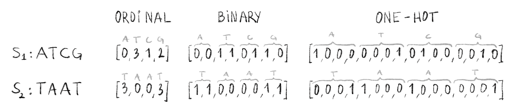

# Learning from sequences and alignments

Sequences and sequence alignments are a very rich source of information. As was stated in Chapters \@ref(aligning-sequence-data) and \@ref(HPC-paper), many downstream analyses rely on sequence alignments.

In whole genome assembly, where sequencing reads are combined together to deduce the genome sequence, pairwise sequence alignment is used, both in reference-based [@martinNextgenerationTranscriptomeAssembly2011; @kyriakidouCurrentStrategiesPolyploid2018] and *de novo* [@paszkiewiczNovoAssemblyShort2010; @sohnPresentFutureNovo2018] assembly. It has also been used to deduce protein function [@sleatorOverviewSilicoProtein2010]. Pairwise alignment, has been used for sequence clustering [@sahlinNovoClusteringLongRead2020] as well as detecting genetic [@koboldtBestPracticesVariant2020] and structural variants [@alkanGenomeStructuralVariation2011; @hoStructuralVariationSequencing2020]. Multiple sequence alignments are also very widely used, mainly in phylogenetic analyses where the evolutionary history of a set of sequences are studied and represented as trees [@morrisonPhylogeneticTreebuilding1996; @kapliPhylogeneticTreeBuilding2020], but they have also been used extensively in protein structure prediction [@kuhlmanAdvancesProteinStructure2019].

More recently, as computational power and datasets have grown, more and more machine learning methods are being used on sequence alignments in order to gain biological insight. In this chapter, we will explore how this can be done, as an introduction to Chapter \@ref(HIV-paper) where we present an application: predicting HIV drug resistance mutations.

## What to learn ?

One of the first questions one might ask themselves when wishing to use machine learning with sequence data is "what can I learn?". A simplistic answer to this question would be "a lot of things" as the following section will strive to show. To choose what we learn we must first choose a learning paradigm.

### Supervised learning from biological sequences

Supervised learning is one of the main machine learning paradigms, where we have data that consist of a collection of input and output pairs (e.g. a DNA sequence and an associated species). By feeding these pairs to our algorithm of choice it will learn to predict the output based on the input alone. This is a very powerful way of learning something interesting. We can consider the link between inputs and outputs as extra knowledge that the dataset creator or curator can infuse in the learning algorithm. Within the supervised learning paradigm there are two possible tasks: *regression* and *classification*.

#### Regression tasks

For regression tasks, the outputs of our input-output pairs are encoded by a continuous numerical value. Regression models will therefore output continuous real values. Fortunately, many interesting continuous values can be computed from aligned sequences, and in many cases machine learning models can be trained to predict these variables.

Regression methods have been used to predict drug response in cancer patients [@ammad-ud-dinSystematicIdentificationFeature2017] and resistance levels to drugs in HIV [@steinerDrugResistancePrediction2020a]. These methods are also extensively used in protein structure prediction, where they are trained to predict residue angles or values in protein contact maps from aligned sequences [@noeMachineLearningProtein2020; @pearceSolutionProteinStructure2021; @tunyasuvunakoolHighlyAccurateProtein2021; @chengMachineLearningMethods2008; @alquraishiMachineLearningProtein2021], or directly from an MSA [@jumperHighlyAccurateProtein2021]. Regression algorithms have been used to predict protein fitness *in silico* [@wittmannAdvancesMachineLearning2021; @yangMachinelearningguidedDirectedEvolution2019; @liCanMachineLearning2019] to speed up protein engineering, and make some processes like drug development faster and cheaper. They have also been used in many other tasks such as predicting gene expression levels [@xieDeepAutoencoderModel2017] or predicting multiple sequence alignment scores [@ortunoComparingDifferentMachine2015].

In many cases these methods use an encoded representation of the sequences (c.f. Section \@ref(pre-processing-the-alignment-for-machine-learning)) as input, but some represent the inputs as values computed from alignments. For example, protein structure can be predicted from contact maps [@wangAccurateNovoPrediction2017] derived from MSAs, and gene expression levels can be predicted from lists of mutations that are obtained through alignment to a reference sequence [@xieDeepAutoencoderModel2017]. This last approach is also used in Chapter \@ref(HIV-paper) to predict drug resistance in HIV.

#### Classification tasks

For classification tasks, the outputs of our input-output pairs are categorical in nature and often represented as discrete integer values. Originally, most classification methods were designed for binary classification with only two possible outputs: a "positive" and a "negative" class. This is a simpler problem to solve than multiclass classification problems where more than two outputs are possible. Most methods that can handle binary classification have been adapted to multiclass classification.

In biology, categorizing and classifying is often at the root of several research problems. As such, machine learning classifiers have obvious applications and have been widely used with sequence data as inputs. Classifiers have been used to predict if a particular virus [@hagaMachineLearningbasedTreatment2020; @zazziPredictingResponseAntiretroviral2012] (also Chapter \@ref(HIV-paper)), or bacteria [@renPredictionAntimicrobialResistance2022; @kimMachineLearningAntimicrobial2022] is resistant to antiviral or antimicrobial drugs respectively. Some classifier models have also been used to predict characteristics at positions in a sequence, like methylation site prediction [@wangPredictingDNAMethylation2016], splicing site detection [@ratschLearningInterpretableSVMs2006] or secondary structure at a particular amino acid residue [@jonesProteinSecondaryStructure1999]. Finally, classifiers have also been used to predict more general characteristics of a given sequence, like the cellular localization [@weiPredictionHumanProtein2018] and putative function [@wangProteinSequenceProtein2017] of proteins, or the cellular localization of gene expression data [@kelleyBassetLearningRegulatory2016].

I have presented here, only a fraction of what is possible to learn from sequences in the supervised learning paradigm. I hope you will agree with me that there is no shortage of problems in computational biology that are suited to this sort of approach. By using machine learning, instead of more formal statistical approaches, there is a lower amount of upfront assumptions and the algorithm is tasked with figuring out what features of the data are important or not for the task at hand.

### Unsupervised learning from biological sequences

The second main machine learning paradigm is called, by contrast to supervised learning, unsupervised learning. In this paradigm we do not have input-output pairs but only inputs. The goal of unsupervised machine learning methods is to extract some structure or patterns from the given input without additional guidance.

One of the main tasks in the unsupervised learning paradigm is clustering, wherein similar inputs are grouped together, methods like $k$-means or hierarchical clustering [@hastieElementsStatisticalLearning2009] often use some type of distance metric between inputs to define clusters of similar inputs. Clustering can be used for classification tasks, indeed if some characteristics of sequences in a given cluster are known then we can make the assumptions that sequences in the same cluster will be similar and share these characteristics, this has been used to group proteins in families [@kriventsevaClusteringAnalysisProtein2001] for example. Clustering methods can also be used to remove duplicate or near-duplicate sequences in datasets [@fuCDHITAcceleratedClustering2012]. Phylogenetic trees can be considered as a specific type of clustering methods, and they have been used to group biological sequences [@balabanTreeClusterClusteringBiological2019].

One of the main obstacles to clustering biological sequences is the need for computing distances between sequences. As stated in Chapter \@ref(aligning-sequence-data), obtaining a biologically relevant distance metric between two sequences, such as the edit-distance, is no easy task. Additionally, in many cases, all pairwise distances are needed for clustering, meaning at least a quadratic time and space complexity for a naive clustering algorithm. Two approaches can be used to resolve this problem: devise methods that do not need all pairwise distances [@zoritaStarcodeSequenceClustering2015], or find a way to speed up distance computation. Some methods have been developed to devise distance metrics that are biologically relevant and less expensive to compute that the edit-distance: like the hashing based MASH [@ondovMashFastGenome2016] or dashing [@bakerDashingFastAccurate2019], or the neural network based NeuroSEED [@corsoNeuralDistanceEmbeddings2021].

Unsupervised learning can also be used without clustering, for example unsupervised methods based on maximum likelihood approaches have been used to predict mutational effects in protein sequence [@hopfMutationEffectsPredicted2017] as well as predict recombination hotspots in human genomic sequences [@castroModelSelectionApproach2018].

In many cases, unsupervised learning can be done as a preliminary dimensionality reduction step to a supervised learning task. Indeed biological data is often high-dimensional, and it is often useful to lower the amount of dimensions to speed up computations. Some unsupervised methods can reduce the number of dimensions while retaining most of the information. One such method, Principal Component Analysis (PCA), is widely used. PCA has been applied to distance matrices to compute phylogenetic trees [@haschkaMNHNTreeToolsToolboxTree2021], and work has been done to apply PCA directly to MSAs without needing to go through a distance matrix [@konishiPrincipalComponentAnalysis2019]. PCA is also widely used in clustering applications [@ben-hurDetectingStableClusters2003; @dingKmeansClusteringPrincipal2004; @casariSequencespaceToolFamily1995; @clampJalviewJavaAlignment2004].

### Others paradigms

More recently, other learning paradigms have gained popularity in machine learning circles. Within the *semi-supervised* paradigm, a small amount of labelled data (*i.e.* input-output pairs) is included in a large un-labelled dataset, and methods can leverage both. This approach has been used to predict drug to protein interactions [@xiaSemisupervisedDrugproteinInteraction2010] and predict the secondary structure of specific transmembrane proteins [@tamposisSemisupervisedLearningHidden2019].

In the *self-supervised* paradigm, models are first trained on a proxy task that hopefully makes use of important information in the data. Through this pre-training step, self-supervised models extract important information from the data and create internal features and models that can then be leveraged in a supervised or unsupervised fine-tuning task. This paradigm has exploded lately within the field of natural language processing and machine translation with the rise of transformers, but has also been widely used to create protein language models like ProtBert [@elnaggarProtTransCrackingLanguage2021] and extract information from disordered protein regions [@luDiscoveringMolecularFeatures2022]. We will look at self-supervised learning in a little more detail in Chapter \@ref(learning-alignments-an-interesting-perspective).

Finally, the end-to-end learning paradigm designates the process of chaining several machine learning tasks together and optimizing the algorithms simultaneously using the error from the loss of the last task of the group. This has been successfully used to predict protein-protein interaction surfaces in three dimensions [@townshendEndtoEndLearning3D2019] as well as predict micro-RNA targets sequences [@leeDeepTargetEndtoendLearning2016]. This paradigm can also be used in a task-based fashion, where a differentiable loss function is crafted on a traditionally non-machine learning task and used to train preceding models. This has been explored for sequence alignment and is further detailed in Chapter \@ref(learning-alignments-an-interesting-perspective)

## How to learn ?

Machine learning regroups a multitude of techniques and methods to extract knowledge and make data-driven predictions. In this section we will quickly go over some of the main supervised-learning methods, and go into more detail for techniques used in Chapter \@ref(HIV-paper): logistic regression, naive Bayes and random forests.

### General setting

Supervised machine learning is an optimization process. A given algorithm, which I will refer to as a *model*, has an associated loss function that can be evaluated on a dataset. This loss represents how well the model is predicting outputs from inputs on known input-output pairs. Through an iterative process, this loss is optimized *(in our case minimized)* over all pairs forming a dataset. Often, in the literature, loss and cost are used interchangeably [@Goodfellow-et-al-2016]. I will favor loss in the following sections.

There is no shortage of loss functions [@wangComprehensiveSurveyLoss2022], some of them are specifically crafted for a given model while some are widely used in regression tasks like the Root Mean Square Error (RMSE). Others like the cross-entropy loss are used in classification tasks.

Often after training a machine learning model on a dataset it is important to compute a performance measure to get an idea of how well this model is performing. We could do this on the same data on which the model was trained, this would however be wrong. Indeed, it gives an unfair advantage to the model since it predicts outputs for examples it has already seen, furthermore it gives us no insight into the generalizability of the model since it could just learn the dataset by heart, getting a perfect score on it while being completely useless on new unseen data. This situation is known as *overfitting* [@hastieElementsStatisticalLearning2009], shown in Figure \@ref(fig:overfitting). Since being able to predict outcomes on unseen data is the main goal of a machine learning model we need another way of measuring model performance. The way machine learning practitioners can measure the performance of their model in a more unbiased manner is by separating the dataset into two parts before even starting to train the model: one part (usually the majority of the data) is used as the *training set*, and the other as the *testing set*. Logically, the training set is used to train the model while the testing set is used to evaluate the performance of the model after training.

```{r, overfittingCaption}
overfittingCaption <- "**Overfitting behaviour in loss functions.**  
The two curves show how the loss calculated on the training set (blue) and the testing set (red) evolve as training time increases. At first both decrease showing that the model learns informative and generalizable features. At some point, training loss keeps decreasing and testing loss increases, meaning that the model is learning over-specific features on the training set and is no longer generalizable: it is overfitting."

```

```{r, overfitting, label="overfitting", fig.cap=overfittingCaption, eval=knitr::is_html_output(), out.width="70%"}


```

```{=tex}
\begin{figure}
\centering
\includegraphics[width=0.7\textwidth]{figures/Encode-seqs/Overfitting.png}
\extcaption{Overfitting behaviour in loss functions.}{The two curves show how the loss calculated on the training set (blue) and the testing set (red) evolve as training time increases. At first both decrease showing that the model learns informative and generalizable features. At some point, training loss keeps decreasing and testing loss increases, meaning that the model is learning over-specific features on the training set and is no longer generalizable: it is overfitting.}
\label{fig:overfitting}
\end{figure}
```
As there is a multitude of loss functions, there are many performance metrics to assess how the model is doing on the testing data, especially for classification tasks [@jiaoPerformanceMeasuresEvaluating2016]. For regression, RMSE is also widely used as a performance metric, along with the Mean Absolute Error (MAE). For classification, accuracy is the most widely used performance metric. Accuracy is the ratio of the number of correctly classified examples divided by the total number of examples. Accuracy has also been adapted to specific settings like unbalanced data where the different possible output classes are not represented equally [@brodersenBalancedAccuracyIts2010]. The testing set must stay completely separate from the training set and decisions about model settings or input features used must be made without help of the testing data. If these stringent conditions are not respected this can lead to *data leakage* and artificially increase performance of the model on the testing data, giving us a biased view of the model's performance and generalizability [@kaufmanLeakageDataMining2011]. This leaking of testing data into the training process is a common pitfall of machine learning [@whalenNavigatingPitfallsApplying2022]. To remedy to this problem, a separate dataset is often reserved and used as a *validation set,* in order to provide some estimation of model performance without using the testing set.

In many cases, machine learning models have a number of parameters that guide model behavior. These parameters are chosen before training and are different from the internal parameters of the model that are optimized during training. As such, they are often called *hyper-parameters*. These can be the number of levels in a decision tree, a learning rate, or a stopping threshold for example. The value of these hyper-parameters is often very influential on model performance. However, setting hyper-parameter values based on the model's test set performance would lead to data leakage as stated earlier, and using a separate validation set can lead to small training sets. To still be able to tune hyper-parameters for optimal performance, and keep a large training set, $k$*-fold cross-validation* is used [@hastieElementsStatisticalLearning2009]. In This setting, shown in Figure \@ref(fig:crossValidation), the testing set is set aside before model training and reserved for the final model performance evaluation. The training set is then further subdivided into $k$ equally-sized subsets, called folds. Each of the $k$ folds is then used to create a what is called a *validation split*: the fold acting as a within-split testing set and the rest of the general training set is used as the within-split training set. This results in $k$ pairs of disjoint training and testing sets, and each example of the general training data is used exactly once in a within-split testing set. An idea of the model performance can be obtained by measuring performance on the within-split testing sets and averaging the measures. This cross-validation performance can be used to inform hyper-parameter value choice without using the reserved testing set and avoiding data leakage.

```{r, cvcaption}
cvCaption <- "**Example of data splits into training, testing and validation sets with 6-fold cross-validation.**  
In this setting the whole data set is first split into a training and testing set. The testing set is kept separate to assess final model performance. The training set is split into 6 folds resulting in 6 splits. In each split of the training set, the correspoding fold is used as the within-split test set (green), and the rest of the training set is used as the within-split training set (blue). You can get an idea of the model performance by averaging measures on within-split testing sets and adjusting hyper-parameters accordingly, without using the global, reserved testing set. Adapted from <https://scikit-learn.org/stable/modules/cross_validation.html>"
```

```{r, crossValidation, label="crossValidation", fig.cap=cvCaption, out.width="70%", eval=knitr::is_html_output()}


```

```{=tex}
\begin{figure}
\centering
\includegraphics[width=0.7\textwidth]{figures/Encode-seqs/Cross-validation.png}
\extcaption{Example of data splits into training, testing and validation sets with 6-fold cross-validation.}{In this setting the whole data set is first split into a training and testing set. The testing set is kept separate to assess final model performance. The training set is split into 6 folds resulting in 6 splits. In each split of the training set, the correspoding fold is used as the within-split test set (green), and the rest of the training set is used as the within-split training set (blue). You can get an idea of the model performance by averaging measures on within-split testing sets and adjusting hyper-parameters accordingly, without using the global, reserved testing set. Adapted from \url{https://scikit-learn.org/stable/modules/cross_validation.html}}
\label{fig:crossValidation}
\end{figure}
```
This is the general setting in which a lot of the supervised learning approaches in computational biology reside, *e.g.* cross-validation was used to tune hyper-parameters for the models in Chapter \@ref(HIV-paper).

### Tests and statistical learning

Some of the simplest models possible are derived from statistics and based on probabilities. One such way to classify data is with a statistical test, like Fisher's exact test [@fisherInterpretationH2Contingency1922] or a $\chi^2$ test [@pearsonCriterionThatGiven1900], depending on the number of training examples. If one of the input variables is significantly related to the output then one can make a crude prediction on the output based solely on the value of one input variable. By testing several features and predicting the output from a set of significantly related input variables (e.g. through a vote), then prediction accuracy can be improved. This approach is used as a baseline in the study presented in Chapter \@ref(HIV-paper), it is however not very sophisticated and does not have the best predictive power.

A model that fits more squarely in the process of supervised learning described above is linear regression. This regression model assumes that the output value results from a linear combination of the input features and an intercept value. The coefficients of this linear combination and the intercept are the parameters that the models optimizes during the learning process. Often the loss function used to fit this model is the RMSE mentioned above. The gradient of the RMSE w.r.t. all the coefficients of the model is easily derived and can be used for optimization. Since this model is very simple there is an exact analytical solution to find the minimum gradient value [@hastieElementsStatisticalLearning2009], however in some cases a gradient descent approach can be beneficial to train this model. This model has also been adapted to binary classification, by considering that the output value results from a linear combination of input models, passed through a logistic function. The resulting model is called logistic regression, and is one of the classifiers used in Chapter \@ref(HIV-paper). Equations \@ref(eq:linReg) and \@ref(eq:logReg) show the mathematical model of linear and logistic regression respectively. In these equations, $\hat{y}^{(i)}$ represents the predicted output of the i^th^ example and $x_j^{(i)}$ the j^th^ variable of the i^th^ example input. $\theta_0$ is the intercept and $\theta_j$ the coefficient corresponding to the j^th^ input variable.

```{=tex}
\begin{equation}
  \hat{y}^{(i)} = \theta_0 + \sum_{j=1}^k \theta_j \cdot x_j^{(i)}
  (\#eq:linReg)
\end{equation}
```
```{=tex}
\begin{equation}
  \hat{y}^{(i)} = \frac{1}{
    1 + e^{
      -(\theta_0 + \sum_{j=1}^k \theta_j \cdot x_j^{(i)})
    }
  }
  (\#eq:logReg)
\end{equation}
```
The model in Equation \@ref(eq:linReg) outputs a continuous value used in regression, and the model in Equation \@ref(eq:logReg) outputs a continuous value bounded between 0 and 1, that we can consider a probability of being in one of the classes. With this probability it is easy to classify a given example in one of the two classes. It is easy to extend the logistic regression model to multiclass classification, by training several models and predicting the class with the maximal probability.

These linear models are simple, but can achieve good performance. They can, however, be prone to overfitting. This often translates into very large values for the $\theta$ coefficients. In order to counter this, regularized versions of linear and logistic regression were introduced by adding the weights to the loss function in some way. By adding the coefficient values to the loss they are kept small through the optimization process, reducing the risk of overfitting. The two main regularization strategies are the ridge [@hoerlRidgeRegressionBiased1970] and Lasso [@tibshiraniRegressionShrinkageSelection1996] penalties.

The final supervised model I will present in this section is the Naive Bayes classifier. As its name indicates, it is based on Bayes' theorem of conditional probabilities. By making a strong assumption, that all variables of the input examples are mutually independent, we can derive the probability of the i^th^ input example belonging to class $C_{\alpha}$ as:

```{=tex}
\begin{equation}
p(C_{\alpha} | x^{(i)}_1, \ldots, x^{(i)}_k) = Z \cdot p(C_{\alpha}) \prod_{j=1}^k p(x^{(i)}_j | C_{\alpha})
\end{equation}
```
With $Z$ a constant that can be computed from the training data. Therefore it is very easy to use this to build a classifier by computing the probabilities of an example belonging to a class for all possible classes in the training data and assign the one with the maximal probability. In practice this is a very flexible model, since any probability distribution can be used for each feature and class. The parameters of these distributions can be learned with a maximum likelihood approach for example. This model builds upon the naive assumption (hence the name) that all input variables are mutually independent. This assumption is very often violated, especially in biological sequence data where independence is not at all guaranteed by the evolutionary process. This model is however quite robust to this, and stays performant despite the violations of this assumption [@zhangOptimalityNaiveBayes; @rishEmpiricalStudyNaive].

### More complex methods

While these simple methods are quite useful in many settings, more complex methods were developed. One of the most popular methods, up until fairly recently, were Support Vector Machines (SVM). This classifier was first developed in 1982 [@vapnikEstimationDependencesBased1982] and it functions by finding the optimal separation hyperplane between 2 classes, i.e. a linear boundary in high-dimensional space between training examples of two classes. What made it so popular is when it was associated with the so-called *kernel trick* [@boserTrainingAlgorithmOptimal1992; @cortesSupportvectorNetworks1995]. With the kernel trick, training examples that cannot be linearly separated can be cheaply projected into a higher dimensional space, where linear separation is possible. This made SVMs very powerful and popular, and it was quickly adapted for regression tasks as well [@druckerSupportVectorRegression1996]. The main model that will interest us in this section however is not the SVM.

Random forests are another very popular model used for both classification and regression, as it is used in Chapter \@ref(HIV-paper) we will go over it in more detail. Developed in the early 2000's [@breimanRandomForests2001], it builds upon previous work: Classification And Regression Trees (CART) [@breimanClassificationRegressionTrees1983]. CART decision trees are very useful for supervised learning tasks. To use CART trees, start at the root and at each node there is a condition on a single input feature. This condition decides if the considered example goes to the right child or the left child. By traversing this tree, choosing the path through the conditions at all the nodes met by the example, we can assign the example to one of the leaves, corresponding to a class or a predicted value. An example of such a tree is given in Figure \@ref(fig:cart).

```{r, CARTcaption}
CARTcaption <- "**Example of a decision tree on DNA data.**   
Here we have a dataset of 4 DNA sequences $S_1, \\ldots, S_4$. Each sequence has 4 input variables $x_1,\\ldots,x_4$, and an output variable $y$ indicating the strain of a sequence. Each sequence can be classified by the decision tree on the right by following a path, from root to leaf, according to the conditions in internal nodes. The predicted strains are shown in the leaves. Sequences that end up in a given leaf node are indicated underneath that leaf node. This tree can classify these 4 sequences perfectly."
```

```{r, cart, label="cart", eval=knitr::is_html_output(), fig.cap=CARTcaption, out.width="80%"}

```

```{=tex}
\begin{figure}
\centering
\includegraphics[width=0.8\textwidth]{figures/Encode-seqs/cart.png}
\extcaption{Example of a decision tree for DNA data.}{Here we have a dataset of 4 DNA sequences $S_1, \ldots, S_4$. Each sequence has 4 input variables $x_1,\ldots,x_4$, and an output variable $y$ indicating the strain of a sequence. Each sequence can be classified by the decision tree on the right by following a path, from root to leaf, according to the conditions in internal nodes. The predicted strains are shown in the leaves. Sequences that end up in a given leaf node are indicated underneath that leaf node. This tree can classify these 4 sequences perfectly.}
\label{fig:cart}
\end{figure}
```
It is actually quite simple to build CART trees, the whole methods lies upon the principle of minimizing impurity *(or maximizing purity)* on a given input variable in child nodes. Impurity can be defined in many ways [@hastieElementsStatisticalLearning2009]: for regression it is often the Residual Sum of Squares (RSS), for classification it is often the Gini index or an entropy measure. Regardless of the chosen metric, a high impurity denotes a heterogeneous collection of examples and a low impurity indicates a homogeneous set of examples. When building the tree, recursively from the root, we find the condition, and the input variable on which the condition relies, by looking at all possible splits and choosing the one that decreases impurity the most in the child nodes. This process is continued recursively until the leaves are completely pure (likely resulting in overfitting) or until a certain stopping condition is met *(e.g.* purity threshold, maximum depth, ...*)*. To avoid overfitting, trees can also be pruned after the building phase. CART trees have the distinct advantage of being interpretable: it is easy to figure out *why* an input has been assigned to a certain class, which can be very useful in biology or medicine [@kingsfordWhatAreDecision2008].

Despite these good properties, it is easy to overfit with decision trees, and small changes to the training data can induce large changes in the resulting tree [@kingsfordWhatAreDecision2008; @hastieElementsStatisticalLearning2009], hurting interpretability. This is why the Random Forest (RF) model was created. RFs are essentially an ensemble of decision trees, *a forest*, built from the training data. To build one of the decision trees in a random forest, the training data is first bootstrapped: a new training set is sampled with replacement from the original training data with the same number of examples. This process is called *bagging* for "bootstrap aggregating". With this procedure, each decision tree is built from slightly different training data and will therefore likely be slightly different. An additional step to ensure some variability between the trees is in the choice of the splitting condition at each tree node. Where, in CART trees, all input variables are considered to find the optimal split, in RF trees, only a random subset of the input variables are considered at each node. This results in a set of decision trees that are all trained from slightly different data, with slightly different features at each node but that all have the same task on the training data. We can get a prediction from all these trees, by taking the majority predicted class for classification trees, or the average of predictions for regression trees.

All these measures to reduce the variance linked to decision trees, and to yield more generalizable models, make random forests very popular. They are often very competitive and often have better performance than the models presented above [@caruanaEmpiricalComparisonSupervised2006a; @yangReviewEnsembleMethods2010]. Furthermore, by only considering a subset of features at each tree node, RF often deals better with high-dimensional data than other methods [@yangReviewEnsembleMethods2010]. Further refinements to the algorithm such as boosting, where misclassified examples are more likely to be selected in the bagging training sets have been very useful as well.

Deep learning has been use more frequently and more broadly to get good results across a large number of tasks. This is also true in biological contexts, however Chapter \@ref(HIV-paper) does not make use of deep learning methods so they will no be discussed here. A short introduction to deep learning will be presented in Chapter \@ref(learning-alignments-an-interesting-perspective).

## Pre-processing the alignment for machine learning

By now you will surely have noticed that all the models I presented above (with the exception of RFs) need to be trained on a collection of numerical variables, *i.e.* numerical vectors. Biological sequences, however, are not vectors of numbers. We therefore need to transform our sequences of letters into numerical sequences that we can feed to the machine learning model in this digestible form. Most supervised machine learning algorithms expect a matrix as inputs, where the rows are individual training examples and the columns numerical variables. A vector where each entry corresponds to an expected output value, is used during training. In this section I will present a few encoding methods, that transform a multiple sequence alignment in a matrix. Most of the encoding methods are not defined on an alignment, but on sequences alone. However to represent these sequences they often need to have the same length, and for models to learn anything meaningful the values in features should encode the same information across sequences. Therefore prior to the encoding methods described below the sequences often need to be aligned to each other so that a specific position in a sequence is homologous to that position in all other training sequences.

### General purpose encodings

The letters making up biological sequences are a form of categorical data, this type of variable is not specific to biology and as such there exists many encoding schemes [@potdarComparativeStudyCategorical2017] to transform categorical variables into numerical vectors.

The most basic, and conceptually simple, way to do so is to use the labeling scheme, often called ordinal encoding. Each level of the categorical variable is assigned an integer label. For example, when dealing with DNA sequences, we could have A=1, C=2, G=3 and T=4. This scheme outputs vectors that have the same size as the input sequence and going from the sequence to the encoded vector (and *vice versa*) is very easy. This encoding scheme has been used to predict resistance levels of HIV to antiviral drugs from sequencing data [@steinerDrugResistancePrediction2020a]. There is, however, a major disadvantage with using this method. As its name indicates, ordinal encoding implies that there is an order to the categorical variable levels (*e.g.* T\>A) which, by definition, does not exist [@hassanisaadiInterpretiveTimefrequencyAnalysis2017; @brouwerFeedforwardNetworkInput2002; @kunanbayevComplexEncoding2021]. Another option is to use what I will refer to as binary labeling, where the categorical levels are first assigned an integer label which is then converted to a binary vector. If we use the ordinal DNA encoding from above and convert it to binary vectors we would get: A=$[0,0]$, C=$[0,1]$, G=$[1,0]$ and T=$[1,1]$. This type of representation is frequently used to represent gapless sequences, like $k$-mers, in a compressed form [@dufresneKmerFileFormat2022; @wrightUsingDECIPHERV22016] (a character now only needs 2 bits instead of a full byte). For amino acids, since there are more characters, this encoding yields vectors of 5 bits [@zamaniAminoAcidEncoding2011]. Fundamentally, this encoding scheme has the same problem as the ordinal encoding, creating an order that does not exist, although with the order being split into separate values it can mitigate this effect a little bit.

On of the most widely used categorical encoding schemes, One-Hot encoding (OHE) (sometimes called orthonormal encoding [@singhEvolutionaryBasedOptimal2018]), does not have this ordering issue. The way OHE works is by creating a sparse binary vector of length $d$ to represent a variable with $d$ levels *(for DNA* $d=4$). If the i^th^ level of the categorical variable is to be encoded, then the i^th^ position in the vector is set to 1 and the rest set to 0. For example if we consider that A is the first level of our variable then OHE would yield the following vector: $[1,0,0,0]$. This encoding scheme has been used from the 1980's [@qianPredictingSecondaryStructure1988] to now [@budachPyssterClassificationBiological2018], and is the scheme used in Chapter \@ref(HIV-paper). The performance of OHE can be on par with ordinal encoding [@choongEvaluationConvolutionaryNeural2017], but it is easily interpretable, which is often very important in biology, since there is a one to one correspondence between a categorical value and a numerical feature. The main problem with OHE is that it tends to increase the number of features quite a lot, since the encoded vector representation of a length $n$ sequence is of length $n\times d$. An example comparing Ordinal, Binary and One-Hot encodings can be seen in Figure \@ref(fig:generalEncoding).

```{r, generalEncodingCaption}
generalEncodingCaption <- "**Example of 3 general categorical encoding schemes.**  
Two sequences, `ATCG` and `TAAT` are shown encoded in three different encoding schemes: ordinal, binary and one-hot encoding. In the ordinal encoding, each character is assigned an integer value, here A=0, C=1, G=3 and T=4. In the binary encoding, these integer values are encoded with 2 bits. In the one-hot encoding scheme, a character corresponds to a sparse vector indicating which level of the variable is present: here A=[1,0,0,0]. Ordinal encoding preserves the dimension of the sequence while binary and one-hot encoding result in vectors woth a bigger dimension than the original sequence. 
"
```

```{r, generalEncoding, label="generalEncoding", cache=FALSE, eval=knitr::is_html_output(), fig.cap=generalEncodingCaption, out.width="100%"}

```

```{=tex}
\begin{figure}
\centering
\includegraphics[width=\textwidth]{figures/Encode-seqs/General-purpose.png}
\extcaption{Example of 3 general categorical encoding schemes.}{Two sequences, \texttt{ATCG} and \texttt{TAAT} are shown encoded in three different encoding schemes: ordinal, binary and one-hot encoding. In the ordinal encoding, each character is assigned an integer value, here A=0, C=1, G=3 and T=4. In the binary encoding, these integer values are encoded with 2 bits. In the one-hot encoding scheme, a character corresponds to a sparse vector indicating which level of the variable is present: here A=[1,0,0,0]. Ordinal encoding preserves the dimension of the sequence while binary and one-hot encoding result in vectors woth a bigger dimension than the original sequence.}
\label{fig:generalEncoding}
\end{figure}
```
These three general purpose encodings are but some of many [@potdarComparativeStudyCategorical2017], and since categorical variables are often used in machine learning applications, these encodings are often available in widely used software libraries [@mcginnisScikitLearnContribCategoricalEncodingRelease2018].

### Biological sequence-specific encodings

While the general-purpose encoding schemes presented above work well enough in practice, some specific encoding methods were developed to include some biological information in the sequence encodings that hopefully machine learning models will be able to leverage during training. These encodings have mostly been developed for encoding protein sequences, using physicochemical properties of amino acids [@zamaniAminoAcidEncoding2011].

AAIndex [@kawashima2008] is a public database containing amino acid indices, *i.e.* sets of 20 numerical values (one for each AA) measuring some physicochemical property. There is a wide range of these indices, from hydrophobicity to flexibility or residue volume measures. By selecting an informative subset of 9 of these measures [@liPredictionProteinStructural2008], an amino acid can be represented by a length 9 numerical vector. In some cases, amino acids can be represented by all the 566 properties of AAIndex, and through PCA the dimension of the resulting numerical vectors can be reduced [@nanniNewEncodingTechnique2011]. This biological sequence specific encoding has been implemented in a software library for biological sequence encoding [@chenIFeaturePythonPackage2018].

Another biological sequence-specific encoding is based on the Amino Acid classification Venn diagram defined by Taylor in 1986 [@taylorClassificationAminoAcid1986], which groups amino acids into eight different groups based on physicochemical properties: aliphatic, aromatic, hydrophobic, polar, charged, positive, small and tiny. With this classification, a single amino acid can be represented by a vector of length 8, each element representing a group, set to one when the amino acid belongs to the group and to zero when it does not. This encoding method was used as early as 1987 to predict secondary structures of proteins [@zvelebilPredictionProteinSecondary1987]. Later on another five groups were proposed and used to encode each amino acid with longer vectors [@kremerMethodSystemComputer2009].

A third encoding method, named BLOMAP [@maetschkeBlomapEncodingAmino2005], encodes sequences based on values from the BLOSUM62 substitution matrix presented in Section \@ref(scoring-and-substitution-models). BLOMAP is defined by using a non-linear projection algorithm to generate vectors of length five, that capture the similarity measures contained in BLOSUM62. This encoding has been used to successfully predict cleavage sites of the HIV-1 protease [@maetschkeBlomapEncodingAmino2005; @singhEvolutionaryBasedOptimal2018] *(c.f. Section* \@ref(protease)). Other encodings such as OETMAP [@gokNewFeatureEncoding2013] have been derived from BLOMAP.

These three encodings are far from being the only ones specific to biological sequence. Many other encoding schemes were developed to learn from this type of sequence data. Some schemes do not encode positional data, and as such can be applied to unaligned sequences. The simplest of these would be to represent a sequence by its amino acid, or $k$-mer frequencies. The latter is often referred to as $n$-gram encoding [@sahaNovelApproachFind2019] and widely used, although with very short $k$-mers since the dimension of the encoding grows exponentially with $k$. With 20 amino acids this encoding results in vectors that have a length of $20^k$. Other encoding schemes use codon information to encode amino acids. One such scheme was proposed in [@zamaniAminoAcidEncoding2011], where an amino acid is represented by a directed graph where vertices are nucleotides and edges represent paths needed to represent codons that code for that amino acid. This graph can then be converted to a 16-dimensional vector by flattening the corresponding adjacency matrix, and be used as an encoding method.

During the work that led to Chapter \@ref(HIV-paper), several encoding methods were tested: Ordinal, Binary, OHE, AAIndex and Group encodings. The same two training sets of sequences were encoded using each of these methods, and 10 RF models were trained on each of the encoded datasets, om a binary classification task. Accuracy, precision and recall metrics were used to evaluate the performance of the RF on each encoded dataset. According to these metrics, the RF model had the best performance on the datasets encoded with OHE. OHE, also has the advantage of being more easily interpretable. As such, it was chosen for the work presented in Chapter \@ref(HIV-paper).

Other encodings have been used to convert a biological sequence into a single real value. An encoding method based on chaos game theory [@jeffreyChaosGameRepresentation1990] allows for a bijective mapping between the DNA sequence set and the real numbers set. This encoding is not specific to alignments and can be used to do alignment-free comparisons, as such it has been used often in bioinformatics applications [@lochelChaosGameRepresentation2021]. Recently, this encoding scheme has been used to classify SARS-CoV2 sequences [@cartesAccurateFastClade2022], predict anti-microbial resistance from sequence data [@renPredictionAntimicrobialResistance2022] and for phylogenetic analysis [@niApplyingFrequencyChaos2021].

In recent years algorithmic developments, computing power increase and the massive amounts of available data have made deep learning methods useful, possible to train and very popular. This has given rise to new sequence encoding methods, that are learned on the training data. These are often referred to as embeddings rather than encodings. Since these learned embeddings are not used in Chapter \@ref(HIV-paper), for the sake of thematic coherence I will not be mentioning them here. I will however go over these embedding methods shortly in Chapter \@ref(learning-alignments-an-interesting-perspective).

## Conclusion

Alignments, and the sequences in them are a rich source of information, that have long been exploited widely for many different types of analyses. With the rise of machine learning in the last years, it is logical that machine learning models have been applied more and more frequently to biological sequence data. Machine Learning is a wide field with many different methods and paradigms. Even simple methods like linear regression or naive Bayes can be very useful, and more complex models like random forests have been able to make very good predictions on biological data. The model is not the only variable to take into account when looking to apply machine learning method on sequence data. Different encoding methods will yield different vector representations, with different characteristics and applications. Special care must therefore be given to the choice of biological sequence encoding scheme, prior to starting a machine learning analysis.

\printbibliography[segment=\therefsegment,heading=subbibintoc,title={References for chapter \thechapter}]
