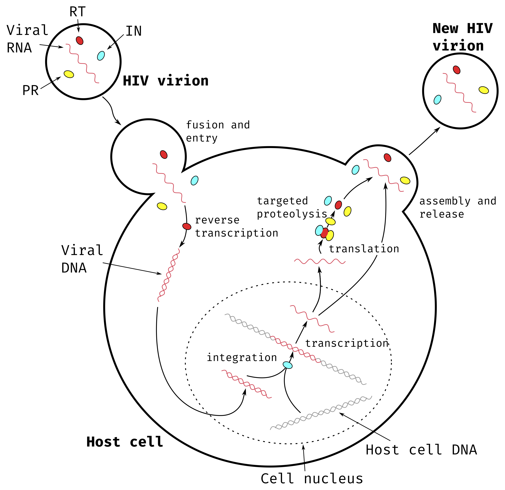
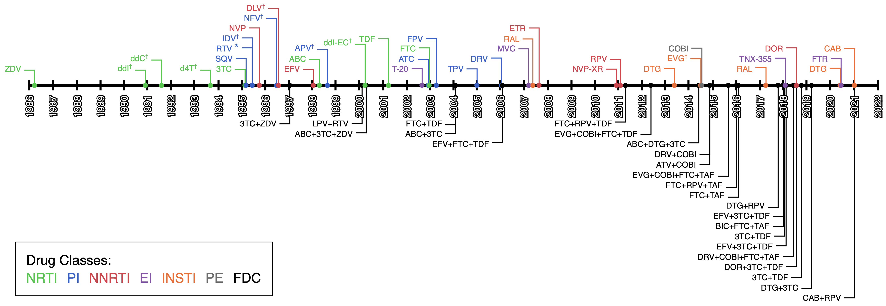
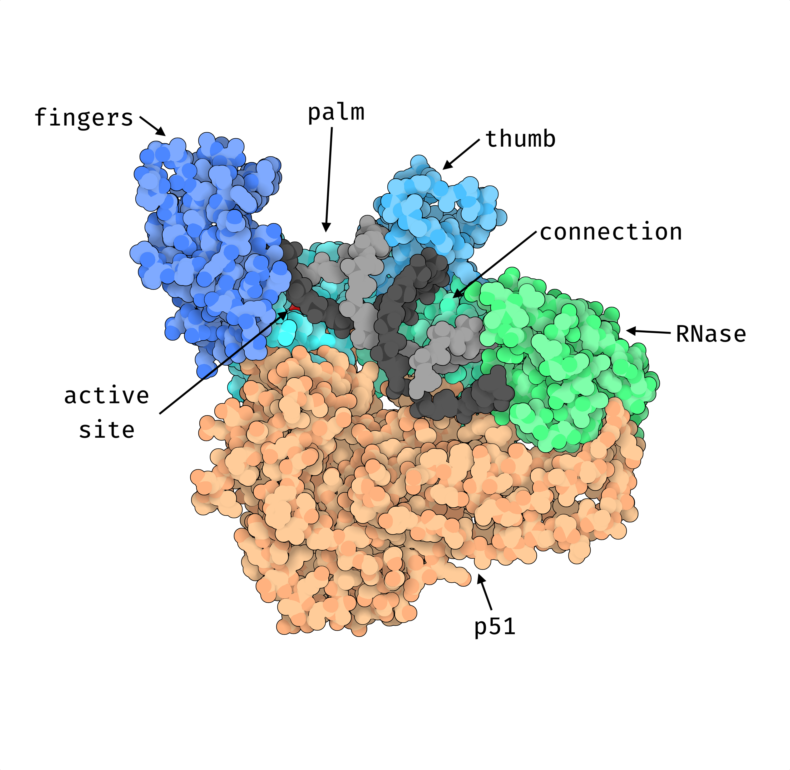
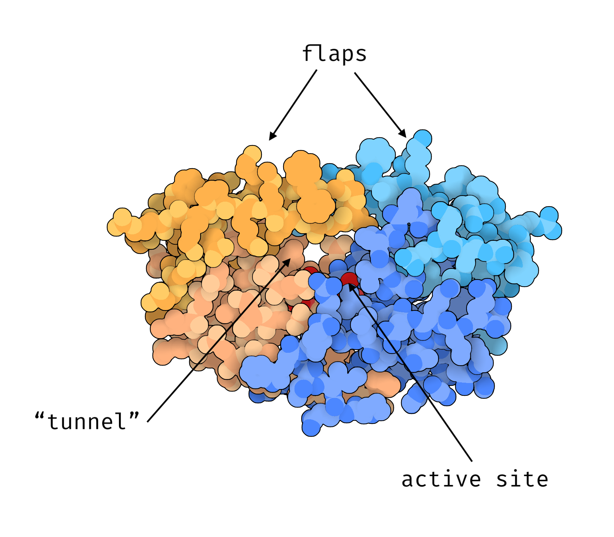
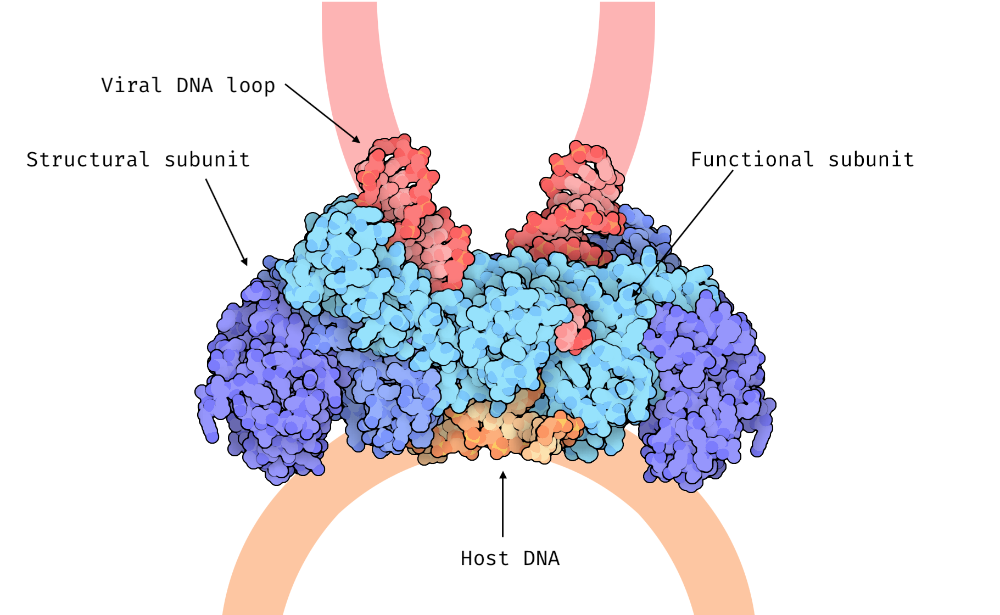

# Viruses, HIV and drug resistance

## What are viruses ?

Viruses occupy a strange place in the tree of life, with many debating if they are actually alive or not. André Lwoff gave what is probably the most fitting definition: *"viruses are viruses"* [@lwoffConceptVirus1957]. Despite this ambiguity, viruses share some common characteristics which allow us to define them as intracellular parasites [@minorViruses2014]:

1.  Viruses have some type of genetic information, contained in either DNA or RNA
2.  This genetic information is protected by some form of envelope
3.  They use the cellular machinery of host cells to make copies of themselves.

While we all know that viruses can be pathogenic and dangerous (the recent example of SARS-CoV2 springs to mind), that is not necessarily the case and some viruses like GBV-C [@stapletonGBVirusesReview2011] and certain strains of H5N1 *Influenza* [@yamamotoCharacterizationNonpathogenicH5N12011] are non pathogenic and essentially harmless.

Viruses have been discovered for all three domains of life: Eukaryota, Bacteria and Archea. In Eukaryota many viruses have been discovered for animals (both vertebrate [@shiEvolutionaryHistoryVertebrate2018] and invertebrate [@adamsAtlasInvertebrateViruses2017]), plants [@lefeuvreEvolutionEcologyPlant2019], protozoa [@wangVirusesParasiticProtozoa1991], chromista [@ferminVirusesProkaryotesProtozoa2018] and even fungi [@sutelaVirusesFungiOomycetes2019]. Bacterial viruses known as phages have been known to exists since the beginning of the 20th century [@twortINVESTIGATIONNATUREULTRAMICROSCOPIC1915; @delbrockBacterialVirusesBacteriophages1946]. These bacteriophages are being considered as a therapeutic alternative to antibiotics [@clarkBacterialVirusesHuman2004; @vankan-davelaarUsingVirusesNanomedicines2014] which could help with multi-drug-resistant bacterial pathogens. Archea are also known to have their own viral infections [@prangishviliVirusesArchaea2016; @prangishviliVirusesArchaeaUnifying2006].

Strangely even viruses of viruses seem to exist such as the plant satellite virus [@franckiPlantVirusSatellites; @xuPlantVirusSatellites2011] or hepatitis delta virus [@laiMolecularBiologyHepatitis1995; @hughesHepatitisDeltaVirus2011]. These "viroids" do not infect viral hosts *per se* but they cannot replicate on their own. Replication must happen during co-infection with a larger virus. More recently, true viruses of viruses called virophages have been discovered. These virophages like sputnik [@desnuesChapterSputnikVirophage2012] or zamilon [@gaiaZamilonNovelVirophage2014] specifically infect giant viruses.

There is a huge diversity of viruses affecting all types of life, and new viruses are being discovered all the time [@edgarPetabasescaleSequenceAlignment2022]. This diversity hints at a rich and long evolutionary history. When and where viruses originated is still under study [@nasirInvestigatingConceptOrigin2020; @forterreOriginViruses2009] and we might never know how they emerged, it is however believed that they may have played an important role in the emergence of eukaryotic cells [@forterreOriginVirusesTheir2006]. This co-evolution between virus and host cell shows a strong link between the two organisms and some parts of the human genome are likely of ancient viral origin [@boekeRetrotransposonsEndogenousRetroviruses1997; @kojimaViruslikeInsertionsSequence2021]. It has been estimated that 1% to 8% of the human genome are endogenous retroviral sequences [@lowerVirusesAllUs1996; @griffithsEndogenousRetrovirusesHuman2001].

The rich diversity of viruses is reflected in the variety of genetic information support, replication strategy, physical and genomic size, as well as shape. The differences in genetic information support and replication strategy form the basis of the Baltimore virus classification system [@baltimoreExpressionAnimalVirus1971] , still used today [@kooninBaltimoreClassificationViruses2021] to classify virus lineages.

As stated above all viruses have some genetic information, this information is stored either as DNA or as RNA, which is the molecule of choice for 70% of human pathogenic viruses [@domingoRNAVirusGenomes2018] *(HIV and SARS-CoV 2 are RNA viruses)*.

For DNA viruses, the molecule can be double-stranded as for *Herpesvirus* [@mcgeochTopicsHerpesvirusGenomics2006; @boehmerHerpesVirusReplication2003], single-stranded like in the case of *Papillomavirus* [@brentjensHumanPapillomavirusReview2002] or even circular in the case of the Hepatitis B virus [@kayHepatitisVirusGenetic2007]. This molecular diversity is also present in RNA viruses where the RNA molecule can be double-stranded like for *Rotavirus* [@parasharRotavirus1998], or single-stranded. Furthermore, for single-stranded RNA viruses the strand can either be positive *(i.e. can be directly translated into a protein)* like Hepatitis C virus [@simmondsVariabilityHepatitisVirus1995] or *Poliovirus* [@wimmerGeneticsPoliovirus1993; @racanielloOneHundredYears2006]; conversely there are negative-strand RNA viruses, for which the complementary strand of RNA must be synthesized before translation into a protein, such as the Influenza or Measles viruses [@paleseNegativestrandRNAViruses1996].

This diversity in genetic information support implies a necessary diversity in replication strategy. The main replication strategies are as follows [@domingoVirusEvolution2014]:

-   The RNA molecule is directly copied as RNA. This is the strategy followed by single-stranded RNA coronaviruses [@vkovskiCoronavirusBiologyReplication2021], Dengue viruses [@backDengueVirusesOverview2013] or Hepatitis C virus [@dustinHepatitisVirusLife2016].

-   The DNA molecule is directly replicated as DNA. this can happen for both single-stranded DNA viruses like *Papillomavirus* [@kadajaPapillomavirusDNAReplication2009]and double-stranded DNA viruses like Herpes simplex virus [@wellerHerpesSimplexViruses2012].

-   The DNA molecule is replicated by going through an RNA intermediary like Hepatitis B virus [@beckHepatitisVirusReplication2007].

-   The RNA molecule is replicated by going through a DNA intermediary. This strategy is used by retroviruses that integrate this viral DNA intermediary into the host DNA, like HIV-1 (see Section \@ref(the-replication-cycle-of-hiv)).

Finally, the genetic diversity of viruses is reflected in their physical characteristics: viruses come in all shapes and sizes. Physical size range from 17nm for plant satellite viruses [@pyleChapter58Biology2017] to the giant 400nm *Mimivirus* [@raoult2megabaseGenomeSequence2004]. Genomic size is also quite variable, there is a stark contrast between the 860 bp *Circovirus SFBeef* and the 2.5 Mbp *Pandoravirus salinus* genomes [@campillo-balderasViralGenomeSize2015]. Viruses come in a variety of shapes [@cannVirusStructure2015]: icosahedral for HIV, helical for the tobacco mosaic virus or a distinctive head-tail shape for bacteriophages.

Although there are a large number of viruses, and many of them are of great importance for human health, we will now focus on one virus of particular importance: Human Immunodeficiency Virus otherwise known as HIV.

## Getting to know HIV

### Quick Presentation of HIV

HIV is a single-stranded RNA retrovirus that is responsible for the Acquired Immune Deficiency Syndrome (AIDS) pandemic that has been around for the last couple decades. This virus is transmitted through sexual contact or through blood. Sexual activity is the largest transmission factor followed by intravenous drug use [@hladikSettingStageHost2008; @shawHIVTransmission2012].

The HIV infects cells of the host immune system, specifically CD4 T-cell lymphocytes and destroys them due to it's replication process [@weissHowDoesHIV1993]. CD4 T-cells are an essential part of the immune system response helping fight against infection in humans. An HIV infection typically start with an asymptomatic phase that can last years, followed by a growth in viral replication leading to a decrease in CD4 cells which progresses into AIDS [@melhuishNaturalHistoryHIV2018]. During AIDS, when the CD4 cell count is low enough opportunistic diseases such as pneumonia or tuberculosis [@murrayPulmonaryComplicationsAcquired1984] can easily infect the host, leading to death when the immune system is weak enough.

The HIV/AIDS is one of the deadliest pandemics in history, estimated to have lead to the death of 36 million people [@sampathPandemicsThroughoutHistory2021]. In 2010 [@worldhealthorganizationGlobalReportUNAIDS2010] approximately 33 million people were infected with HIV, 2.6 million of which were due to new infections, and 1.8 million died of AIDS. Most of the new infections happened in economically developing regions of the world, 70% of them coming from sub-Saharan Africa [@worldhealthorganizationGlobalReportUNAIDS2010]. As of 2020, these numbers have decreased with "only" 1.5 million new infections and 680,000 AIDS deaths, which is encouraging from a public health perspective.

The HIV-1 virus was discovered simultaneously in 1983 by Françoise Barré-Sinoussi, Luc Montagnier [@barre-sinoussiIsolationTlymphotropicRetrovirus1983] and Robert Gallo [@galloIsolationHumanTcell1983]. There exists a second HIV-2 virus discovered shortly after HIV-1 [@clavelIsolationNewHuman1986], it is however less transmissible than HIV-1 which is largely responsible for the global HIV/AIDS pandemic [@gilbert2003]. In Africa in 2006, HIV-1 infections were rising where HIV-2 were declining [@vanderloeffSixteenYearsHIV2006].

While both viruses are of zoonotic origin, from transmissions of Simian Immunodeficiency Virus (SIV) from primates to humans. HIV-1 most likely originates from an SIV present in chimpanzees [@gaoOriginHIV1Chimpanzee1999; @hamelTwentyYearsProspective2007; @sharpOriginsHIVAIDS2011], and HIV-2 from an SIV present in Sooty mangabeys [@hirschAfricanPrimateLentivirus1989; @gaoHumanInfectionGenetically1992; @chenGeneticCharacterizationNew1996].

Several independent such transmissions have resulted in 4 lineages of HIV-1 labeled groups M, N, O and P [@hemelaarOriginDiversityHIV12012] (similarly HIV-2 is split into groups A to H also resulting from independent zoonotic transmissions). While Groups N and P have been identified in only a handful of individuals in Cameroon , and group O is estimated to a few thousand cases in western Africa, the majority of the pandemic is due to viruses from group M.

The most most recent common ancestor, *i.e. the putative virus that founded group M*, is estimated to have originated in what is now the Democratic Republic of Congo [@worobeyDirectEvidenceExtensive2008; @vidalUnprecedentedDegreeHuman2000; @fariaEarlySpreadEpidemic2014] at some point between 1910 and 1931 [@korberTimingAncestorHIV12000; @worobeyDirectEvidenceExtensive2008; @rambautCausesConsequencesHIV2004].

Group M is further subdivided into 9 subtypes each with distinct genetic characteristics, labeled A to K [@mccutchanGlobalEpidemiologyHIV2006; @sharpOriginsHIVAIDS2011]. Like in many viruses [@perez-losadaRecombinationVirusesMechanisms2015], when 2 genetically different strains of HIV co-infect a single host there is a risk genetic recombination leading to a new strain [@robertsonRecombinationAIDSViruses1995]. During recombination, a new genome is formed from parts of the original genomes. This can lead to new strains that can spread and form lineages of their own. HIV strains resulting from recombination are called Cirulating Recombinant Forms (CRFs). There are currently 118 identifed HIV-1 CRFs in the Los Alamos National Laboratory HIV sequence database [@HIVCirculatingRecombinant] (1 for HIV-2). There also exist many unique recombinant forms (URFs). Recombination can be particulary bothersome, complicating evolutionary analyses [@posadaRecombinationEvolutionaryGenomics2002], or facilitating drug resistance and hindering vaccine development [@taylorChallengeHIV1Subtype2008].

While subtype C represented almost half of global infections from 2004 to 2007, subtype B is the majority subtype in richer countries of North America and Western Europe [@hemelaarGlobalTrendsMolecular2011] where sequencing efforts are more common. This accounts for an over-representation of subtype B sequences in public databases such as the Los Alamos sequence database where 54% of sequences are of the B subtype and only 15% are C [@DistributionAllHIV1].

### The replication cycle of HIV

The viruses replication cycle and its immune-cell host specificity are what makes it particularly dangerous. This replication cycle can broadly be categorized into 9 separate steps [@freedHIV1Replication2001; @fergusonHIV1ReplicationCycle2002] shown in Figure \@ref(fig:hivCycle).

1.  An HIV virion binds itself to the CD4 host cell through membrane proteins.

2.  The virion envelope and host cell membrane fuse together allowing the viral genetic material and proteins to enter the host cell.

3.  The viral RNA is reverse-transcripted into viral DNA

4.  The viral DNA is integrated into the host cell genome

5.  The integrated viral DNA is transcribed by the host cell machinery into multiple copies of viral RNA

6.  The viral RNA is translated into immature viral polyproteins

7.  The viral polyproteins are cleaved to form individual viral proteins.

8.  The newly synthesized viral RNA and viral proteins gather around the host-cell membrane which starts budding to create a new virion

9.  Once the budding is complete, the virion is released from the host cell and matures before being able to infect other CD4 cells and replicate again.

The successive infection of CD4 cells by HIV virions leads to cellular death due to inflammatory response and/or activation of apoptosis [@gougeonDirectIndirectMechanisms1993; @vidyavijayanPathophysiologyCD4TCell2017]. The gradual depletion of CD4 cells in the infected individual's body lead to the suppression of the immune system, eventually leading to AIDS.

```{r, hivCycleCaption}
hivCycleCaption <- "**Main steps of HIV-1 replication cycle**\
The HIV virion contains viral RNA and three essential proteins: Reverse Transcriptase (RT) represented in red, Integrase (IN) represented in cyan and Protease (PR) represented in yellow.
"
```

```{r, hivCycle, label="hivCycle", fig.cap=hivCycleCaption, eval=knitr::is_html_output(), out.width="60%", cache=FALSE}

```

```{=tex}
\begin{figure}
\centering
\includegraphics[width=0.6\textwidth]{./figures/HIV-Intro/HIV-cycle.pdf}
\extcaption{Main steps of HIV-1 replication cycle}{The HIV virion contains viral RNA and three essential proteins: Reverse Transcriptase (RT) represented in red, Integrase (IN) represented in cyan and Protease (PR) represented in yellow.}
\label{fig:hivCycle}
\end{figure}
```
### Genetics of HIV

The replication cycle described in Section \@ref(the-replication-cycle-of-hiv) is made possible by the 15 proteins of HIV. These proteins are coded by 9 separate genes [@frankelHIV1FifteenProteins1998]. An overview of the HIV proteins, their structure and localization within the viral particle can be seen in Figure \@ref(fig:hivStructure).

The HIV genome is made up of three main genes each coding for polyproteins and six genes coding for proteins with regulatory and accessory roles. The three polyproteins correspond to long chains of amino acids which are subsequently cleaved at specific positions to result in separate viral proteins.

The *gag* ("group-specific-antigen") gene codes for the Gag polyprotein which, once cleaved, results in four proteins with mainly structural roles:

-   The Matrix protein (MA or p17) lines the internal surface if the virion membrane maintaining the shape and structural integrity of the virion.

-   The Capsid protein (CA or p24) forms an inner core (the capsid) inside the virion around the viral RNA. It helps protect the viral genetic information.

-   The Nucleocapsid protein (NC or p7) binds with the viral RNA inside the capsid, stabilizing the molecule and further protecting the genetic information.

-   The p6 protein is a small, largely unstructured protein [@fossenSolutionStructureHuman2005] that is suspected of playing a role in virion budding and release from the host cell at the end of the replication cycle [@gottlingerEffectMutationsAffecting1991; @huangP6GagRequiredParticle1995].

The *pol* ("polymerase") gene coding for the Pol polyprotein. After cleaving this results in the three essential viral enzymes at the heart of the replication cycle:

-   The Protease (PR) is responsible for cleaving the Gag, Pol and Env polyproteins to get the individual viral proteins. Without it the individual viral proteins cannot come into being and therefore cannot function, stopping viral replication.

-   The Reverse Transcriptase (RT or p51/p66) is responsible for synthesizing viral DNA from the viral RNA template contained in the virion. This is the first step in hijacking the cellular machinery for replication. Without viral DNA, HIV replication is impossible.

-   The Integrase (IN) is responsible for integrating the viral DNA produced by RT in to the host cell DNA. Once the viral DNA is inside the host genome it can be transcribed and then translated (as described in Section \@ref(biological-sequences-a-primer)) to produce new copies of the viral RNA and proteins. Without this integration step the viral genetic information cannot be expressed and the replication cycle is stopped.

These three proteins are of particular importance and we will go into more detail about them in Section \@ref(drug-mechanisms).

The *env* ("envelope") gene code for the Env, the third and last polyprotein. The two resulting proteins coat the membrane of the virion and are responsible for binding with the CD4 host cells.

-   The Surface protein (SU or gp120) binds to receptors on the surface of CD4 cells and allow the virion to attach itself to the host cell [@bourHumanImmunodeficiencyVirus1995]. It also enables membrane fusion, the essential first step in the viral replication cycle [@hernandezViruscellCellcellFusion1996].

-   The Transmembrane protein (TM or gp41) anchors SU into the virion membrane.

The 6 remaining genes all code for single proteins. Two of these have essential regulatory roles and the remaining four have accessory roles.

The *tat* ("trans-activator of transcription") gene codes for Tat, the first essential regulatory protein. Tat activates and promotes transcription leading to more numerous and longer copies of the viral RNA [@jonesControlRnaInitiation1994]. The *rev* (for "regulator of virion") gene codes for Rev, the second essential regulatory protein. Rev helps transcribed viral RNA exist the nucleus of the host cell in order to be translated to viral proteins or be packages in new, budding virions [@hopeViralRNAExport1997].

The remaining four accessory genes are as follows: *nef* ("negative regulatory factor") code for the Nef protein which prevents the production of the CD4 cellular defense proteins increasing infectivity [@mangasarianMultifacetedRoleHIV1997]; *vif* ("viral infectivity factor") codes for the Vif protein which also increases viral infectivity [@cohenRoleAuxiliaryProteins1996]; *vpu* ("viral protein U") codes for Vpu which likely helps during release of new virions [@lambVpuVprHuman1997; @cohenRoleAuxiliaryProteins1996] as well as preventing production of CD4 in the host cell, it is not believed to be present in the mature virion as it binds to host cellulat membranes [@khanRoleViralProtein2021]; *vpr* ("viral protein R") likely helps viral DNA enter the host cell nucleus and prevents the natural host cell reproduction cycle [@emermanHIV1VprCell1996].

The existence of a 10th HIV-1 gene was suggested in 1988 [@millerHumanImmunodeficiencyVirus1988], overlapping the *env* gene and coding for proteins on the other strand of viral DNA than the other genes. This putative gene was named *asp* ("antisense protein") and Asp transcripts were isolated during an HIV-1 infection in 2002 [@briquetImmunolocalizationStudiesAntisense2002]. The function of this protein is still unknown but it has been shown to have a strong evolutionary correlation with HIV-1 group M responsible for the pandemic [@cassanConcomitantEmergenceAntisense2016]. Although this Asp protein is still a source of debate, it is under active research [@savoretPilotStudyHumoral2020].

```{r, hivStructCaption}
structCaption <- "**Structure and main components of a mature HIV-1 virion.**\ 
Structural proteins MA, CA, SU and TM are represented in Blue, functional enzymes RT, IN and PR in pink, RNA binding proteins Rev, Tat and NC in orange and accessory proteins Vif, Nef, Vpr and Vpu in green. Viral RNA is shown in yellow. The phospholipd membrane of the virion is shown in a light purple color. The p6 protein is not represented as it is largely unsctructured. Vpu is not believed to be present in the HIV virion.  
Figure adapted from PDB101 [@zardecki2022] ([PDB101.rcsb.org](https://PDB101.rcsb.org), *CC By 4.0 License*, detailed list of structures used available in Appendix \\@ref(HIV-intro-appendix))."
```

```{r, hivStructure, label="hivStructure", eval=knitr::is_html_output(), fig.cap=structCaption, out.width="90%", cache=FALSE}
knitr::include_graphics("./figures/HIV-Intro/HIV-structure.png")
```

```{=tex}
\begin{figure}
  \centering
  \includegraphics[width=0.9\textwidth]{./figures/HIV-Intro/HIV-structure.png}
  \extcaption{Structure and main components of a mature HIV-1 virion.}{Structural proteins MA, CA, SU and TM are represented in Blue, functional enzymes RT, IN and PR in pink, RNA binding proteins Rev, Tat and NC in orange and accessory proteins Vif, Nef, Vpr and Vpu in green. Viral RNA is shown in yellow. The phospholipd membrane of the virion is shown in a light purple color. The p6 protein is not represented as it is largely unsctructured. Vpu is not believed to be present in the HIV virion. \\
Figure adapted from PDB101 \autocite{zardecki2022} (\href{https://PDB101.rcsb.org}{PDB101.rcsb.org}, \textit{CC By 4.0 License}, detailed list of structures used available in Appendix \autoref{HIV-intro-appendix}).}
\label{fig:hivStructure}
\end{figure}
```
## Drug resistance in HIV

Although the HIV/AIDS pandemic has been very deadly around the world, we are not completely defenseless against it. The first antiretroviral therapy (ART) drugs were made available in the late eighties, only a couple years after discovery of the virus. ART reduce the viral load in an HIV positive patient reducing its transmissibility [@eisingerHIVViralLoad2019], while ART is not a cure for an HIV infection it has been shown to drastically reduce mortality and morbidity [@palellaDecliningMorbidityMortality1998]. ART is estimated to have saved the lives of 9.5 million individuals between 1995 and 2015 [@forsytheTwentyYearsAntiretroviral2019].

### A quick history of ART

The first available anti-HIV drug was Zidovudine (ZDV, also known as azidothymidine or AZT) approved by the FDA for usage in the USA in 1987 [@fischlEfficacyAzidothymidineAZT1987], a few years only after the discovery of the virus. This drug was a reverse transcriptase inhibitor (RTI) therefore preventing the viral RNA from being transcribed into viral DNA. Unfortunately, 3 years later strains of HIV resistant to ZDV were circulating [@richmanSusceptibilityNucleosideAnalogues1990]. This rapid emergence of resistance to treatment is common for HIV [@yeoDeterminationHIV1RT2020] due to its very high evolution rate [@cuevasExtremelyHighMutation2015] allowing it to explore many possible mutations in response to selective pressures. To counter this resistance new drugs were rapidly developed and, between 1988 and 1995, four more RTIs were approved by the FDA. Using a combination of these drugs was also shown to be effective and led to a slower rise of resistance [@gulickTreatmentIndinavirZidovudine1997].

Then focus was shifted to the development of a new type of drug: Protease Inhibitors (PI). Between 1995 and 1997 4 of them were approved. These, taken in combination with RTI made if harder for the virus to develop resistance [@wensingFifteenYearsHIV2010]. A new class of RTIs was also explored, Non-Nucleoside RTIs (NNRTIs) that block the RT action in another manner than the previously approved Nucleoside RTIs (NRTIs). When taken in combination with other drugs they are also highly effective [@pedersenNonNucleosideReverseTranscriptase1999]. As the years advanced even more drug targets were explored, with 5 Integrase inhibitors (INSTI) being approved since 2007 [@scarsiHIV1IntegraseInhibitors2020], A Fusion Inhibitor (FI) in 2003 [@fletcherEnfuvirtideNewDrug2003], and 3 other Entry inhibitors (EI) [@esteHIVEntryInhibitors2007; @kilbyNovelTherapiesBased2003] since 2007 all targeting different steps in the replication cycle of HIV *(see Table* \@ref(tab:tableDrugs) and Figure \@ref(fig:timeline)*)*.

In response to the rapid emergence of resistance in HIV when treated with a single drug, clinicians started systematically treating HIV with a combination of multiple drugs targeting different proteins, as early as 1996. This is now referred to as Highly active antiretroviral combination therapy (HAART, also known as tritherapy). HAART usually consists of 2 NRTIs coupled with another drug: NNRTI or PI at first and later FI or INSTI [@yeniUpdateHAARTHIV2006]. As of 2008 22 anti-HIV single drugs were approved by the FDA [@palmisanoBriefHistoryAntiretroviral2011], and 27 as of today. This large array of available drugs made HAART possible and gave options to clinicians to switch targets when the multi-resistant HIV emerged.

With the advent of HAART, patients had access to more potent treatments, however complexity of the treatment regimen grew. Treatments often involved several pills a day to take at precise intervals. Complex drug regimens have been associated with poorer treatment adherence [@mehtaPotentialFactorsAffecting1997; @millerComplianceTreatmentRegimens1997], which can lead to poor treatment outcome as well as the emergence of multi-resistant HIV strains [@chesneyAdherenceHIVCombination2000] and its spread within the population. To avoid this issue, increasingly more single pill regimens are being developed with a staggering 7 new drugs approved by the FDA in 2018. These single pill regimens greatly reduce the burden of adherence for patients leading to better therapeutic outcomes and reduced healthcare costs [@aldirSingletabletRegimensHIV2014].

```{r, timelineCaption}
timelineCaption <- "**Timeline of ART drugs FDA approvals.**\
Colored by drug type: Nucleoside Reverse transcriptase inhibitors (NRTI), Non-Nucleoside Reverse transcriptase inhibitors (NNRTI), Protease Inhibitors (PI), Integrase inhibitors (INSTI), Entry Inhibitors (EI) and pharmacokinetic enhancers (PE). Fixed Dose Combination (FDC) single pill regimens are also shown.  
* RPV is often also used as a pharmacokinetic enhancer in combination with other drugs.  
✝ These drugs are no longer approved by the FDA or no longer recommended as first line regiment treatment.  
*Information collected from <https://hivinfo.nih.gov/understanding-hiv/fact-sheets/fda-approved-hiv-medicines>, <https://hivinfo.nih.gov/understanding-hiv/infographics/fda-approval-hiv-medicines> and <https://www.accessdata.fda.gov/scripts/cder/daf/index.cfm>.*  
See also Table \\@ref(tab:tableDrugs)."
```

```{r, timeline, label="timeline", eval=knitr::is_html_output(), fig.cap=timelineCaption, out.width="100%", cache=FALSE}

```

```{=tex}
\begin{figure}
  \centering
  \includegraphics[width=\textwidth]{./figures/HIV-Intro/complete.pdf}
  \extcaption{Timeline of ART single drug FDA approvals.}{Colored by drug type: Nucleoside Reverse transcriptase inhibitors (NRTI), Non-Nucleoside Reverse transcriptase inhibitors (NNRTI), Protease Inhibitors (PI), Integrase inhibitors (INSTI), Entry Inhibitors (EI) and pharmacokinetic enhancers (PE). Fixed Dose Combination (FDC) single pill regimens are also shown.\\
* RPV is often also used as a pharmacokinetic enhancer in combination with other drugs.\\
\dag These drugs are no longer approved by the FDA or no longer recommended as first line regiment treatment.\\
\textit{Information collected from \url{https://hivinfo.nih.gov/understanding-hiv/fact-sheets/fda-approved-hiv-medicines}, 
\url{https://hivinfo.nih.gov/understanding-hiv/infographics/fda-approval-hiv-medicines} and \url{https://www.accessdata.fda.gov/scripts/cder/daf/index.cfm}}.\\
See also Table \ref{tab:tableDrugs}.
}
\label{fig:timeline}
\end{figure}
```
Most recently, some studies explored using some of these single pill regimens (such as Truvada, c.f. Table \@ref(tab:tableDrugs)) as prophylactics *i.e.* Pre-exposure prophylaxis (PrEP). Putting uninfected but at risk populations on ART before any known exposure has been shown to effectively lower the risk of infection [@grantPreexposureChemoprophylaxisHIV2010; @baetenAntiretroviralProphylaxisHIV2012; @buchbinderPreexposureProphylaxisPromise2011]. When adherence is maintained, this risk reduction has been estimated to be between 44% and 100% [@riddellHIVPreexposureProphylaxis2018]. As of 2022, Truvada is the only authorized drug for PrEP in Europe [@emaTruvada2018], although Descovy and Apretude are also authorized for PrEP in the USA [@PrEPPrEPHIV2022].

All of these drugs are widely used and are by now very well studied, therefore detailed guidelines on all the aspects of ART; when to start, which drugs to use, when to change drugs; are issued and updated regularly by practitioners [@zolopaEvolutionHIVTreatment2010] and global organisms [@worldhealthorganizationConsolidatedGuidelinesHIV2021] alike.

### Main mechanisms of viral proteins, antiretroviral drugs and associated resistance. {#drug-mechanisms}

Each ART drug targets a specific protein, most of them target one of the three *pol* proteins: RT, PR and IN. The structure of these proteins is inherently linked to their function, and as such is essential to take into account when developing ART. Similarly the structure of these proteins is very important when studying the resistance mechanisms developed by the virus [@ammaranondMechanismHIVAntiretroviral2012; @clavelHIVDrugResistance2004]. In this section we will go over; for RT, IN and PR; the main structural elements and how they relate to treatment and resistance.

#### Reverse Transcriptase

The reverse transcriptase protein is the most targeted protein in number of ART drugs *(c.f. Figure* \@ref(fig:timeline) *and Table* \@ref(tab:tableDrugs)*)*. The mature protein is formed of two subunits: p51 and p66. These two subunits are translated from the same section of the *pol* gene, and such have the same amino acid sequence, but p51 is cleaved and as such is shorter than p66. The p66 subunit contains the active sites of RT whereas p51 plays a mainly structural role.

The p66 sububit can be separated into 5 domains [@sarafianosStructureFunctionHIV12009]. The "fingers", "palm", and "thumb" domains are linked together and folded to form a canal through which the RNA template and newly synthesized viral DNA can pass through. The polymerase active site, responsible for incorporating nucleotides to the viral DNA molecule, is situated in the "palm" domain at the bottom of the canal. The "RNase" domain of RT contains a secondary active site responsible for cleaving the viral RNA template from the viral DNA so that the RT can fill out the complementary strand of viral DNA before integration into the host genome. The final "connection" domain is simply a link between the "RNase" and the "thumb" domains. A three dimensional view of RT with these domains highlighted can be seen in Figure \@ref(fig:rtStruct).

```{r, rtCaption}
rtCaption <- "**3D structure of HIV-1 Reverse-transcriptase.**\ The different domains of the p66 subunit are labeled and shown in different shades of blue and green. The structural p51 subunit is shown in orange. The RNA template is shown in dark gray and the newly synthesized DNA stran in light gray. The polymerase active site is shown in red although mostly hidden by the RNA template. The 3D visualization was produced with Illustrate [@goodsellIllustrateSoftwareBiomolecular2019] using the [2hmi](https://www.rcsb.org/structure/2HMI) PDB structure."
```

```{r, rtStruct, label="rtStruct", fig.cap=rtCaption, out.width="80%", eval=knitr::is_html_output(), cache=FALSE}

```

```{=tex}
\begin{figure} 
  \centering 
  \includegraphics[width=0.8\textwidth]{./figures/HIV-Intro/rt.png}      \extcaption{3D structure of HIV-1 Reverse-transcriptase.}{The different domains of the p66 subunit are labeled and shown in different shades of blue and green. The structural p51 subunit is shown in orange. The RNA template is shown in dark gray and the newly synthesized DNA stran in light gray. The polymerase active site is shown in red although mostly hidden by the RNA template. The 3D visualization was produced with Illustrate \autocite{goodsellIllustrateSoftwareBiomolecular2019} using the \href{https://www.rcsb.org/structure/2HMI}{2hmi} PDB structure.}       
  \label{fig:rtStruct} 
\end{figure}
```
Reverse Transcriptase inhibitors can be separated into two classes: Nucleoside RTIs (NRTIs) and Non-Nucleoside RTIs (NNRTIs), inhibiting the action of RT in two disctinct manners:

-   NRTIs are analogues of free nucleotides in the host cell. They competitively inhibit RT and can be used to elongate the viral DNA chain. Once an NRTI is incorporated, further elongation of the DNA molecule is impossible and the viral DNA cannot be synthesized anymore. This is similar to the chain terminating nucleotides introduced in Section \@ref(obtaining-sequence-data).

-   NNRTIs bind to a specific region of the p51 subunit: the Non Nucleoside Inhibitor Binding Pocket (NNIBP) *(A view of RT with the NNIBP visible is shown in Figure* \@ref(fig:figStructure)*)*. This pocket, although it is on the p51 subunit is spatially situated very close to the polymerase active site. NNRTIs bind to the NNIBP to change the conformation of the active site, lowering its flexibility [@esnoufUniqueFeaturesStructure1997], and thusly non-competitively inhibiting the action of RT.

Research has been conducted into inhibition of the RNase active site of RT [@hangActivityIsolatedHIV2004; @klumppRecentProgressDesign2006] which could also inhibit the action of RT. There is however, to this day, no approved treatment that inhibits the RNase action of RT.

Drug resistance mutations (DRMs) that arise in HIV from the selective pressures resulting from RTI exposure can similarly be grouped into two categories: NRTI and NNRTI resistance mutations.

NRTI resistance mutations can further be subcategorized into two groups [@menendez-ariasMechanismsResistanceNucleoside2008; @sluis-cremerMolecularMechanismsHIV12000]. The first type of NRTI resistance mutations are mutations that prevent the incorporation of NRTIs into the viral DNA molecule. M184V and M184I, indicating the replacement, at site number 184, of a Methionine by a Valine or an Isoleucine respectively, are very common NRTI resistance mutations. These V and I amino acids have a different structure than the original M, interfering with the incorporation of lamiduvine (3TC) but not dNTP [@sarafianosLamivudine3TCResistance1999]. The second type of mutation, allows RT to remove an incorporated NRTI from the viral DNA to resume synthesis. Thymidine Analog Mutations (TAMs), M41L, D67N, K70R, L210W, T215Y/F and K219Q/E confer resistance to azidothymidine (AZT) through this mechanism [@meyerMechanismAZTResistance1999; @boyerSelectiveExcisionAZTMP2001].

Similarly, NNRTI resistance mutations work via several different mechanisms [@deeksNonnucleosideReverseTranscriptase2001; @renStructuralBasisDrug2008]. Some NNRTI resistance mutations, like Y181C, lower the affinity of the NNIBP to NNRTIs preventing binding of drugs to RT. Others, like K103N change the conformation of the p51 subunit, making the NNIBP disappear. NNRTI resistance mutations are particularly dangerous because they often confer cross-resistance to multiple NNRTIs without affecting the polymerase action very much [@ammaranondMechanismHIVAntiretroviral2012], giving rise to viruses that are both fit and highly resistant. This is contrast to NRTI resistance mutations that generally incur a fitness cost for the virus, lowering its efficacy [@lloydHighCostFidelity2014].

#### Protease

The Protease protein, also a major drug target for ART, cleaves the *gag* and *pol* polyproteins in order to produce functional viral proteins, essential to replication. It has a symmetric dimeric structure, that is two say that it is composed of two identical chains of amino acids [@pearlStructuralModelRetroviral1987; @gulnikHIVProteaseEnzyme2000]. A structural view of PR is shown in Figure \@ref(fig:prStruct).

These two chains are folded in order to create a "tunnel" through which the polyproteins enter. In the middle of this "tunnel", at the bottom, is the active site. The active site is composed of two Aspartate residues, one on each chain, with water they can participate in a chemical reaction that cleaves the polyprotein at a specific position [@silvaInhibitionCatalyticMechanism1996].

The roof of the "tunnel" is formed by the flaps, a flexible region from each of the two chains that can open or close the "tunnel" [@hornakHIV1ProteaseFlaps2006]. These flaps most likely control the access of polyproteins to the active site [@freedbergRapidStructuralFluctuations2002; @yuStructuralInsightsHIV12017].

```{r, prCaption}
prCaption <- "**3D structure of HIV-1 Protease.**\ The two identical chains are colored in orange and blue shades respectively. The flexible, flaps form the the \"roof\" of a tunnel, at the bottom of which is the active site: 2 Asp residues, one on each chain. The 3D visualization was produced with Illustrate [@goodsellIllustrateSoftwareBiomolecular2019] using the [2p3b](https://www.rcsb.org/structure/2P3B) PDB structure."

```

```{r,prStruct, label="prStruct", fig.cap=prCaption, out.width="70%", eval=knitr::is_html_output(), cache=FALSE}

```

```{=tex}
\begin{figure} 
  \centering 
  \includegraphics[width=0.7\textwidth]{./figures/HIV-Intro/pr.png}      \extcaption{3D structure of HIV-1 Protease.}{The two identical chains are colored in orange and blue shades respectively. The flexible, flaps form the the "roof" of a tunnel, at the bottom of which is the active site: 2 Asp residues, one on each chain. The 3D visualization was produced with Illustrate \autocite{goodsellIllustrateSoftwareBiomolecular2019} using the \href{https://www.rcsb.org/structure/2P3B}{2p3b} PDB structure.}       
  \label{fig:prStruct} 
\end{figure}
```
All the approve Protease Inhibitors (PIs) share a similar mode of action, each PI binds to the active site of the PR, denying access to the "tunnel" for polyproteins and stopping the catalytic action of PR [@robertsRationalDesignPeptideBased1990; @lvHIVProteaseInhibitors2015]. Tipranavir, one of the more recent PIs, also binds with the flaps [@lvHIVProteaseInhibitors2015].

According to Prabu-Jeyabalan and colleagues, the Protease structure does not recognize the specific sequence of the polyprotein cleavage site but rather its shape [@prabu-jeyabalanSubstrateShapeDetermines2002]. They proposed an inhibitor based on this shape for all polyproteins combined, which establishes more bonds with PR, making it suposedly more efficient [@prabu-jeyabalanSubstrateEnvelopeDrug2006] than current approved PIs.

As is the case with RTIs, when under selective pressure due to PIs, the virus tends to develop PI associated DRMs. Most PI resistance mutations result in an enlarged "tunnel", this tends to lower the affinity of the PIs to the active site, but also the affinity of polyproteins, lowering the fitness of the virus significantly [@wensingFifteenYearsHIV2010]. In addition, some mutations on the *gag* polyprotein seem to lower the efficacy of PIs, although the underlying mechanism is not well known [@wensingFifteenYearsHIV2010].

Some mutations in the flaps of PR have also been shown to confer PI resistance. It seems likely that these mutations change conformation of the flaps, opening them leading to the release of inhibitors from the active site [@kurtyilmazImprovingViralProtease2016].

#### Integrase

The integrase protein is the third major anti-retroviral drug target, it is responsible for integrating the viral DNA into the host genome. It is a tetramer composed of four identical amino acid chains. [@chiuStructureFunctionHIV12004; @espositoHIVIntegraseStructure1999]. Each of these chains contain three domains linked together by flexible linker sequences: the N-terminal domain, the catalytic core and the C-terminal domain. In each tetramer, two chains provide the active site for the integration reaction while the other two have a mostly structural role. It is probable that the N-terminal domain which is very conserved is necessary for stable tetramerization of IN monomers [@delelisIntegraseIntegrationBiochemical2008], this tetrameric structure is shown in Figure \@ref(fig:inStruct).

```{r, inCaption}
inCaption <- "**3D structure of an Integrase.**\ This Integrase tetramer is binded with viral (red) and host (orange) DNA, linked to the two light blue functional subunits via the C-terminal domain. The active site formed by the the catalytic cores of the two functional subunits *(not visible in this representation)*, is where the strand transfer reaction will take place. The two dark blue IN subunits have a structural role. 
This figure was adapted from the PDB 101 molecule of the month Integrase entry by David S. Goodsell and the RCSB PDB ([pdb101.rcsb.org/motm/135](https://pdb101.rcsb.org/motm/135)) with a CC By 4.0 license. "
```

```{r,inStruct, label="inStruct", fig.cap=inCaption, out.width="95%", eval=knitr::is_html_output(), cache=FALSE}

```

```{=tex}
\begin{figure} 
  \centering 
  \includegraphics[width=0.7\textwidth]{./figures/HIV-Intro/in.png}      \extcaption{3D structure of an Integrase.}{This Integrase tetramer is binded with viral (red) and host (orange) DNA, linked to the two light blue functional subunits via the C-terminal domain. The active site formed by the the catalytic cores of the two functional subunits \textit{(not visible in this representation)}, is where the strand transfer reaction will take place. The two dark blue IN subunits have a structural role.
  This figure was adapted from the PDB 101 molecule of the month Integrase entry by David S. Goodsell and the RCSB PDB (\url{https://pdb101.rcsb.org/motm/135}) with a CC By 4.0 license.}       
  \label{fig:inStruct} 
\end{figure}
```
Several steps are needed in order to integrate the viral DNA with the host genome [@maertensStructureFunctionRetroviral2022]. First, IN binds to the both ends of the viral DNA, using the C-terminal domains, forming a closed loop. Secondly, both ends of the viral DNA molecule are then prepared for integration by the catalytic core. Third, the host DNA is captured with C-terminal domains. Then, the strand-transfer is done within the catalytic core: the host DNA is cut in two places and a single strand from each end of the viral DNA are attached to these two breakpoints. Finally, the IN tetramer detaches from the linked molecules and the final steps necessary to create a single hybrid DNA molecule are done by the host cellular machinery. A graphical representation of this process can be found in Figure 1 of the 2022 article by Maertens et al. [@maertensStructureFunctionRetroviral2022].

Integrase Strand Transfer Inhibitors (INSTIs), as their name indicates, block the strand transfer reaction. They achieve this by strongly binding to the active site of the IN tetramer after it has formed a complex with the viral DNA [@pommierIntegraseInhibitorsTreat2005; @maertensStructureFunctionRetroviral2022]. In doing so, INSTIs prevent the IN / viral DNA complex from binding to the host DNA, effectively preventing strand transfer.

In the presence of INSTIs during therapy, once more the HIV virus develops resistance mutations over time. These mutations all lower affinity of IN to INSTIs, preventing bonding [@blancoHIV1IntegraseInhibitor2011; @maertensStructureFunctionRetroviral2022]. Since most INSTIs behave similarly, this means that cross-resistance to INSTIs is quite common for INSTI DRMs [@blancoHIV1IntegraseInhibitor2011; @gerettiEmergingPatternsImplications2012]. Once more, these mutations tend to lower the overall viral fitness necessitating secondary compensatory mutations to restore fitness [@gerettiEmergingPatternsImplications2012; @blancoHIV1IntegraseInhibitor2011].

#### Other drug targets

For now, resistance has not been observed for novel drugs like entry inhibitors. This might be because the genetic barrier to resistance is higher and because not enough time has passed since their introduction for resistance to emerge.

For all the other drug targets however, as stated earlier in this section, resistance is documented and problematic. Resistance has even been detected for PrEP which is prophylactic [@knoxMultidrugResistantHIV1Infection2017; @hurtPreexposureProphylaxisAntiretroviral2011]. This seems to be rare however and mostly due to an unknown pre-treatment HIV infection [@gibasDrugResistanceHIV2019].

### Consequences of resistance on global health

HIV resistance to ART drugs is problematic from a global health perspective. Indeed circulation of resistant strains of HIV within populations can lead to treatment-naive individuals that will not respond well to treatment.

More concerning is the fact that transmission of resistant strains of HIV between treatment-naive individuals is the main mode of resistance transmission in the UK [@mouradPhylotypebasedAnalysisHighlights2015; @hueDemonstrationSustainedDrugResistant2009] and Switzerland [@drescherTreatmentNaiveIndividualsAre2014]. This treatment-naive to treatment-naive transmission is particularly insidious since it can go undetected and creates long lasting drug resistant strain reservoirs in the treatment-naive population. This of course is dangerous since some infected individuals might experience poor therapeutic outcomes and even failure when administered first line regimens [@boermaHighLevelsPretreatment2016]. To avoid this, genotypic resistance testing has become standard practice when choosing the therapeutic strategy in high-income countries, but more effort must be done to make resistance testing less expensive and more cost-efficient in lower and middle income countries [@clutterHIV1DrugResistance2016].

Although the transmitted drug resistance described above is problematic, a large portion of DRMs incur a fitness cost for the resistant strain [@kuhnertQuantifyingFitnessCost2018; @mespledeViralFitnessCost2013]. This means that although they are selected when exposed to the evolutionary pressure of ART, when the treatment is interrupted there is another pressure leading these costly mutations to disappear. This reversion is commonly observed after interruption of treatment, however the median reversion times vary widely from 1 to 13 years [@castroPersistenceHIV1Transmitted2013] depending on the severity of the fitness loss and type of mutation. This means that although reversion can possibly lead to loss of resistance this can potentially take a long time and possibly longer than the treatment interruption.

In practice it is therefore very important to keep an eye on all drug resistance mutations, their population dynamics and spread as well as their presence or absence in a particular strain before starting treatment.

### Finding DRMS [^hiv-context-1] {#finding-drms}

[^hiv-context-1]: This sections build upon a review I participated in during my PhD [@blasselDrugResistanceMutations2021]

Finding and categorizing mutations as DRMs is an important task in light of the public health implications mentioned in Section \@ref(consequences-of-resistance-on-global-health), as such this is an active part of the HIV research field.

The most important thing needed in order to study DRMs is of course viral sequences. To facilitate the search for DRMs several sequence databases exist. Sequences are often linked to metadata related to the treatment status of the patient from which the sequence was obtained. This metadata can be quite variable: from a coarse level binary indicator of treatment to a finely detailed list of all treatments recieved and associated phenotypic measurements like viral load.

Databases like the UK-CHIC [@ukchicsteeringcommitteeCreationLargeUKbased2004], uk HIV drug resistance database (<https://www.hivrdb.org.uk/>) and Swiss cohort study (<https://www.shcs.ch/>) host sequences on a national level, although access can be granted to international researchers. Other databases like the PANGEA database [@abeler-dornerPANGEAHIVPhylogeneticsNetworks2019] host sequences from multiple countries in sub-Saharan Africa. The Stanford HIV drug resistance database (<https://hivdb.stanford.edu/>) hosts HIV sequences with some phenotypic data [@rheeHumanImmunodeficiencyVirus2003; @shaferRationaleUsesPublic2006]. Finally some database only host sequences, such as the Los Alamos HIV sequence database (<http://www.hiv.lanl.gov/>), however without any specific treatment or resistance related metadata [@kuikenHIVSequenceDatabases2003] these have less direct applicability to the DRM search task.

Some databases, like the Standford HIV resistance database, also store specific knowledge about known resistance mutations, keeping and regularly updating lists of clinically important DRMs as well as their impact on ART [@wensing2019UpdateDrug2019; @clarkMutationsRetroviralGenes2007]. Additionaly, Stanford also offers tools for clinicians to do genotypic resistance testing with interpretable results [@liuWebResourcesHIV2006d].

The first step of mutations discovery is usually some kind of statistical association analysis[@johnsonUpdateDrugResistance2016; @wensing2019UpdateDrug2019] where the association between treatment status (coarse of fine grained) and specific mutations is statistically tested. This is usually done with Fisher association tests [@villabona-arenasIndepthAnalysisHIV12016; @shulmanGeneticCorrelatesEfavirenz2004] or correlation testing with the Spearman correlation for example [@millerGenotypicPhenotypicPredictors2004]. This results in a list of mutations that are significantly associated with a given treatment and corresponding p-values.

Since, on a given sequence dataset, several mutations are usually tested at once this can lead to inflated false positive [@brownMethodsCorrectingMultiple1997] and spurious [@austinTestingMultipleStatistical2006] associations. Fortunately this is a well studied problem and many methods exist to control this effect by controlling the Familywise Error Rate (FWER) *e.g.* with the Bonferroni procedure,[@hochbergMultipleComparisonProcedures1987] or the False Discovery Rate (FDR) *e.g.* with the Benjamini-Hochberg procedure [@benjaminiControllingFalseDiscovery1995]. These methods are often applied when testing for resistance association [@villabona-arenasIndepthAnalysisHIV12016; @gonzalesExtendedSpectrumHIV12003; @seoigheModelDirectionalSelection2007]. However these correction methods are a double-edged sword, some of them can be very conservative and lead to falsely rejecting true associations [@shamStatisticalPowerSignificance2014]. In some studies on resistance phylogenetic correlation between the sequences is also accounted for in statistical analyses [@alizonPhylogeneticApproachReveals2010; @flynnDeepSequencingProtease2015].

Statistical testing on treatment status, while informative, can only associate a mutation with a treatment. In order to actually validate whether a mutation causes resistance or not biological analyses are needed [@johnsonUpdateDrugResistance2016; @wensing2019UpdateDrug2019]. The easiest of these are *in vitro* analyses where live viruses are subjected to a phenotypical assay. These assays measure the susceptibility of HIV viruses to a wide array of drugs, which can then be statistically associated with genetic traits like specific mutations. These assays like phenosense [@petropoulosNovelPhenotypicDrug2000] or antivirogram [@hertogsRapidMethodSimultaneous1998] are widely used [@heilek-snyderRoleHIVPhenotypic2002; @moyleEpidemiologyPredictiveFactors2005; @gartlandSusceptibilityGlobalHIV12021]. The viruses can be obtained from clinical isolates [@masquelierGenotypicPhenotypicResistance2001] or, viruses with specific mutations can be manufactured with site directed mutagenesis [@larderMultipleMutationsHIV11989; @devreeseResistanceHumanImmunodeficiency1992]. *In vivo* can be conducted by sequencing viruses from patients failing ART, following over time and studying the association between their treatment response and HIV genetics [@tambuyzerEffectMutationsPosition2011; @katzensteinPhenotypicSusceptibilityVirological2003].

More recently, as sequence database grow bigger and bigger *(The UK-CHIC database contains more than 80,000 HIV sequences with treatment status)*, methods based on statistical and machine learning are being used to study resistance. Most approaches rely on training models to predict some type of resistance: either classifying sequences as resistant or not [@blasselUsingMachineLearning2021; @steinerDrugResistancePrediction2020a] of predicting a phenotypic response like fold resistance compared to wild type [@sheikamamuddyImprovingFoldResistance2017b]. Initial approaches were mainly designed for clinical testing, rather than new DRM search, and distributed via web services [@beerenwinkelGeno2phenoInterpretingGenotypic2001; @riemenschneiderSHIVAWebApplication2016b].

Initially these approaches were based on models like decision trees [@beerenwinkelDiversityComplexityHIV12002c], SVMs [@beerenwinkelGeno2phenoInterpretingGenotypic2001] or logistic regression [@heiderMultilabelClassificationExploiting2013b]. Over time the use of more complex models such as neural networks has increased, with increased prediction accuracy [@sheikamamuddyImprovingFoldResistance2017b].

By analyzing the important features used by trained models to predict resistance, it is possible to find features, corresponding to mutations, that are useful for predicting, and therefore likely associated with, drug resistance (see Chapter \@ref(HIV-paper)). With the improvement in methods to interpret and extract features from complex models such as deep neural networks, this approach has been used with deep learning models [@steinerDrugResistancePrediction2020a]. This novel way of finding resistance associated mutations has the potential to uncover complex mutational effects that simple association testing cannot.

## Conclusion

Viruses are surprisingly complex in light of their apparent simplicity. They are ubiquitous and present an extreme diversity. Whether they are pathogenic or not, the role of viruses in a myriad of processes and niches make them interesting and important to study. The sequences of these viruses, although small can be very useful for evolutionary as well as clinical analyses.

Although the study of viruses as a whole can be very useful, HIV is particularly important to study. The impact of the HIV pandemic on global health has been severe, both in Lower and Higher income countries. It is therefore paramount to fully understand the underlying mechanisms and evolutionary adaptations of this virus. It's high mutation rate allow it to quickly explore evolutionary alternatives when exposed to drugs, making anti HIV therapy a complex endeavor.

Fortunately, with large scale sequencing efforts it is possible to study and track these evolutionary adaptations to treatments. This allows us to adapt therapeutic strategies as well as developing new compounds and approaches. In this context, studying and finding the virus' mutational processes is paramount. This is especially important when studying resistance to RTIs as they form the backbone of first line regimen combination therapies, and are the most common type of anti-HIV drug. This process is made easier by the large scale sequence repositories now available, and the usage of machine and statistical learning to leverage that data.

\printbibliography[segment=\therefsegment,heading=subbibintoc,title={References for chapter \thechapter}]
