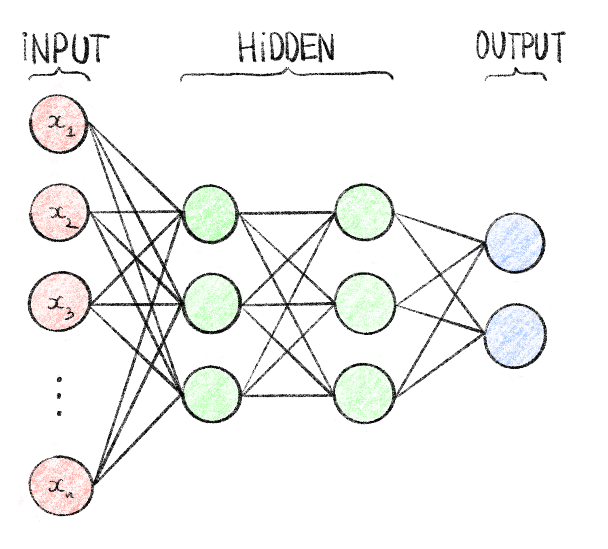

# Learning Alignments, an Interesting Perspective

Recently, machine learning methods have been increasingly applied to the process of alignment. Using this framework to "learn" an optimal sequence alignment algorithm might lead to better performance with less design biases.

## Deep learning and sequences

As many of these techniques are based on deep learning, which I did not introduce in Chapter \@ref(learning-from-sequences-and-alignments), I will first present deep learning very shortly. I will then introduce the concept of learned sequence embeddings which could become very useful for machine sequence alignment.

### Intro to deep learning

Deep learning is the process of learning using neural networks. Neural networks all started in 1958 when Rosenblatt proposed the *perceptron* [@rosenblattPerceptronProbabilisticModel1958]. This learning algorithm was loosely inspired by biological neurons, which led to the name: *neural networks.* The perceptron takes as input $n$ values, these are used in a weighted sum that is then fed through an *activation function.* The output of this function is the output of the perceptron. Originally, to replicate biological neurons, the activation function was a step function where, the perceptron has an output only if the weighted sum crosses a given threshold. This structure is often represented through a computational graph as in Figure \@ref(fig:perceptron). By tuning the weights of the inputs, the perceptron can be used to solve linear separation problems.

```{r, perceptronCap}
perceptronCaption <- "**Computational graph of a perceptron.**  
Here, $n$ inputs $\\{x_1,\\ldots,x_n\\}$ are passed into the perceptron where they are summed, weighted by $w_1,\\ldots,w_n$. This sum is then fed through the perceptron's activation function $f$ (here a binary step function) which gives the output $y$ of the perceptron. Often the sum is implicitely considered part of the activation function, and will be represented as a single node in computational graphs."
```

```{r, perceptron, label="perceptron", fig.cap=perceptronCaption, eval=knitr::is_html_output(), out.width="60%"}
knitr::include_graphics("figures/Learn-alignments/perceptron.png")
```

```{=tex}
\begin{figure}
  \centering
  \includegraphics[width=.6\textwidth]{figures/Learn-alignments/perceptron.png}
  \extcaption{Computational graph of a perceptron.}{
Here, $n$ inputs $\{x_1,\ldots,x_n\}$ are passed into the perceptron where they are summed, weighted by $w_1,\ldots,w_n$. This sum is then fed through the perceptron's activation function $f$ (here a binary step function) which gives the output $y$ of the perceptron. Often the sum is implicitely considered part of the activation function, and will be represented as a single node in computational graphs.}
  \label{fig:perceptron}
\end{figure}
```
The perceptron could only be used on simple linear separation problems, but it was discovered that by linking several perceptrons together, mimicking a biological brain, more complex problems could also be solved. These structure, called *multilayer perceptrons* (MLP), are organized in layers where the outputs of perceptrons on a layer are used as inputs by perceptrons is the next layer (c.f. Figure \@ref(fig:mlp)). The perceptrons, when in this form, are often called *neurons*, and the MLP a *neural network* (NN). These neural networks are organized in layers, with an input and output layer on either end, and hidden layers in the middle. With the large number of weights to tune, these models were very difficult to train and therefore not very practically useful.

```{r, mlpCap}
mlpCaption <- "**Computational graph of a multilayer perceptron.**  
This MLP, also called feedforward neural network, has $n$ inputs $\\{x_1, \\ldots, x_n\\}$ represented as the input layer, 2 hidden layers of 3 neurons each and an output layer of 2 neurons (e.g. suitable for binary classification). It is fully connected meaning that each node of a given layer is used as input for every neuron of the following layer. Each edge in this graph corresponds to a weight which are the tunable parameters during the training process."
```

```{r, mlp, label="mlp", eval=knitr::is_html_output(), fig.cap=mlpCaption, out.width="60%"}

```

```{=tex}
\begin{figure}
  \centering
  \includegraphics[width=.6\textwidth]{figures/Learn-alignments/mlp.png}
  \extcaption{Computational graph of a multilayer perceptron.}{  
This MLP, also called feedforward neural network, has $n$ inputs $\{x_1, \ldots, x_n\}$ represented as the input layer, 2 hidden layers of 3 neurons each and an output layer of 2 neurons (e.g. suitable for binary classification). It is fully connected meaning that each node of a given layer is used as input for every neuron of the following layer. Each edge in this graph corresponds to a weight which are the tunable parameters during the training process.}
  \label{fig:mlp}
\end{figure}
```
There was a great resurgence of these models in the nineties due to the invention of *backpropagation* [@rumelhartLearningRepresentationsBackpropagating1986]. By replacing the step functions of neurons with continuous, differentiable activation functions like sigmoids or hyperbolic tangents, a gradient of the output could be computed w.r.t each weight. This made gradient descent procedures possible for automatically learning the optimal weights from data as (c.f. Section \@ref(supervised-learning-from-biological-sequences)). With this method, neural networks could be efficiently trained on complex classification and regression problems [@murtaghMultilayerPerceptronsClassification1991]. It was also proven that with hidden layers, neural networks are universal function approximators [@cybenkoApproximationSuperpositionsSigmoidal1989; @hornikMultilayerFeedforwardNetworks1989; @hornikApproximationCapabilitiesMultilayer1991a], suitable for all types of tasks. One notable caveat for neural networks is, due to the large amount of weights to tune, that they require large amounts of training data, which also explains their low usage before the internet and accompanying data explosion.

In the following years, NNs saw an large increase in usage, with more complex architectures like convolutional neural networks (CNN) achieving state of the art results in computer vision tasks [@lecunBackpropagationAppliedHandwritten1989; @lecunGradientbasedLearningApplied1998]. By representing an input variable as a linear combination of its neighbors, some form of contextual information can be passed to the NN and improve performance. CNNs can also have good results in non computer-vision tasks like: drug resistance prediction [@steinerDrugResistancePrediction2020a], protein subcellular localization [@weiPredictionHumanProtein2018], or epidemiological model parameter estimation [@voznicaDeepLearningPhylogenies2022].

More recently, as computational power and the amount of training data grew, larger and deeper (i.e. more hidden layers) architectures were able to be trained and achieved state of the art performance in many fields: image recognition with deep CNNs like `Alexnet` [@krizhevskyImageNetClassificationDeep2017] or `Resnet` [@heDeepResidualLearning2016], translation with Recurrent NNs [@bahdanauNeuralMachineTranslation2016] and Transformers [@vaswaniAttentionAllYou2017] (more on that in Section \@ref(learned-sequence-embeddings)) or protein structure prediction with `Alphafold2` [@jumperHighlyAccurateProtein2021].

### Learned sequence embeddings

An area that in which deep learning has recently proved particularly useful, is the creation of relevant learned embeddings. These embeddings, similarly to the encodings discussed in Section \@ref(pre-processing-the-alignment-for-machine-learning), transform a sequence of categorical tokens in a numerical vector which can then be used in machine learning tasks. By learning these embeddings, the hope is that the resulting vector will retain the most important information in the sequence and some contextual information.

#### $x$-`2vec`

Learned embeddings were mainly developed in the field of natural language processing (NLP), where machine learning algorithms use text, in languages such as English or French, as input. In this contexts, simple encodings like OHE are not very practical because of the very high dimensionality of a language. For example, the Merriam-Webster English dictionary contains 470,000 words [@HowManyWords] so to encode a single word with OHE would result in a 470,000-dimensional sparse vector. Encoding a whole text or even a single sentence is wildly unpractical. Therefore, as a field, NLP needed to come up with ways of efficiently representing words in lower-dimensional vectors than naive encoding methods, while retaining semantic meaning.

One of the early methods for creating such embeddings is called `word2vec` [@mikolovEfficientEstimationWord2013; @mikolovDistributedRepresentationsWords2013], proposed by researchers at Google, that learns a word-embedding on a particular text corpus. This method is designed to make embeddings that contain semantically relevant information. An example given in the article is that the vector corresponding to $vec(Madrid) - vec(Spain) + vec(France)$ should be very similar to the vector $vec(Paris)$, and that similar words should result in similar vectors.

The way this method works is by considering a word within its context, *i.e.* a window of length $k$ centered around the word. In a corpus of words (*i.e.* our training data), each word is encoded as a One Hot Vector, which is possible since the corpus contains only a subset of the words in the English language. A neural network is then trained on one of two tasks [@goldbergWord2vecExplainedDeriving2014]:

-   Continuous bag of words: where the word is predicted given the context of the word as input

-   Skip-gram: where the context is predicted given the encoded word vector

After having sufficiently trained the neural network on the corpus on one of these tasks, one of the hidden layers of the network can be extracted and used as a vector representation of the input word, this results in an embedding method that is specific to a given corpus and the embedded vectors can be used in downstream learning tasks.

`word2vec` was very successful and widely used in the field of NLP, it is perhaps no surprise that the ideas behind it were adapted and reused in the field of bioinformatics. `dna2vec` [@ngDna2vecConsistentVector2017] uses similar ideas and was used to embed $k$-mers, and predict methylation sites on DNA sequences [@liangHyb4mCHybridDNA2vecbased2022]. Similar embedding methods like `seq2vec` [@kimothiDistributedRepresentationsBiological2016] as well as `bioVec` (including the protein specific `protVec`) [@asgariContinuousDistributedRepresentation2015] were also developed to embed whole biological sequences. They were successfully used in biological sequence classification problems [@kimothiMetricLearningBiological2017].

#### The attention revolution

While `word2vec` was widely used for many NLP tasks where word embeddings were needed, a lot of interesting developments on word embeddings were made in the field of automated machine translation. In this application, the desired embedding characteristics are slightly different. While semantic relevance is useful, in machine translation the embedding method needs to be able to capture dependencies, e.g. within a sentence where the link between the subject and the verb must be captured even though they are not necessarily next to each other. This was initially done by using recurrent neural networks, called RNNs or LSTMs, but they were hard to train and had trouble properly capturing long-range dependencies [@songPretrainingModelBiological2021].

One of the most successful methods developed for this task is the transformer [@vaswaniAttentionAllYou2017], also created by Google researchers. The main mechanisms of the transformer is the *self-attention* mechanisms: each input token, usually encoded as a One-Hot vector, is represented as a weighted sum of all the other tokens in a sequence *(here a token is a word and the sequence is a sentence)*. The weights of this sum are trained along with the rest of this network. by stacking several of these self-attention blocks, transformers can learn to represent and leverage long-range dependencies. These transformers are made of an encoder module that learns the token embedding, and a decoder module that makes predictions when fed embedded tokens sequentially. This mechanism, attention, and the transformer in general have had very successful applications in machine translation, while being easier to train than recurrent networks [@wangProgressMachineTranslation2021].

This architecture was used to create very large pre-trained language models, that is to say models that perform word embedding. These models like `BERT` [@devlinBERTPretrainingDeep2019] or `GPT-3` [@brownLanguageModelsAre2020] are huge, with millions or even billions of learned weights, and have been trained on huge quantities of data in order to produce word embeddings useful in a wide range of contexts. `BERT` was trained using Masked Language Modelling (MLM), where some percentage of the tokens *(words)* in an input sequence *(sentence)* are replaced by a special `[MASK]` token, and the model is trained to predict the whole sentence, effectively guessing what words are missing based on the context of the whole sequence. This process allows the model to learn relevant dependencies between tokens in the training data.

As was the case with `word2vec`, these methods have been adapted to bioinformatics tasks with state of the art results, proving the versatility of the transformer model. Several *protein language models* similar to `BERT` were trained on various training sets of protein data like `ProGen` [@madaniProGenLanguageModeling2020], `ProGen2` [@eriknijkampProGen2ExploringBoundaries2022] and `ProtBERT` [@elnaggarProtTransCrackingLanguage2021]. These large protein language models have been studied and interesting properties have been observed [@beplerLearningProteinLanguage2021]. Some specific characteristics of proteins can be inferred from these models without specifying them in the training step. For example, protein language models seem to learn some information about the protein structure and attention maps can be used to infer residue contact maps [@raoTransformerProteinLanguage2020; @rivesBiologicalStructureFunction2019; @bhattacharyaSingleLayersAttention2020]. Similarly these models capture some information about protein function [@huExploringEvolutionbasedFree2022], mutational effects [@meierLanguageModelsEnable2021], evolutionary characteristics [@hieEvolutionaryVelocityProtein2022] and can even be used to generate new protein with desired properties [@madaniProGenLanguageModeling2020]. Some large language models have also been trained on DNA sequences like `DNABert` [@jiDNABERTPretrainedBidirectional2021] and also seem to capture some information without explicit specification during training, like variant effects [@benegasDNALanguageModels2022].

While, these protein language models have shown very useful for embedding single sequences, some developments have been made to embed multiple sequence alignments as learning inputs. In some cases this is done by including information on the alignment in the tokens and then using a regular language model to embed them [@caiGenomewidePredictionSmall2020]. In the case of the MSA transformer [@raoMSATransformer2021], the attention mechanism was extended to include a weighted sum between aligned sequences effectively taking the alignment into account when embedding sequences. An attention-like mechanism was also used to train a protein structure prediction model directly on MSAs [@sercuNeuralPottsModel2021]. Similarly, by pre-training language models on profiles derived from MSAs, some information about the alignment can be included in the resulting embeddings [@sturmfelsProfilePredictionAlignmentBased2020]. Finally aligned sequences can be used as inputs in a regular transformer as was done `DeepConsensus` [@baidDeepConsensusImprovesAccuracy2022], a transformer-based polisher to decrease the error rate PacBio HiFi reads even further. Finally the *EvoFormer* model included in `AlphaFold2` [@jumperHighlyAccurateProtein2021], which embeds MSAs to predict protein structure, is partly responsible for the leap in performance between the two generations of the `AlphaFold` model, and the current protein structure prediction revolution [@ourmazdStructuralBiologySolved2022].

It is important to note that while these transformer models are very powerful and useful in practice, their complexity and size makes them very hard to study and understand what they actually learns. There is work to peek inside this "black box", notably by interpreting the learned attention maps [@vigBERTologyMeetsBiology2021] and decipher biologically relevant information contained within.

## Learning sequence alignment

With the success of deep learning methods in learning informative and effective embeddings from sequences, it is maybe natural to try and see if similar methods can learn how to align sequences to each other.

### Predicting a substitution matrix

One approach is to learn a *position-specific scoring matrix* (PSSM), which assigns an alignment cost not between two amino-acids but between two specific residues of the sequences (i.e. an amino acid/position pair). Therefore, when aligning a sequence of length $m$ and another of length $n$, we can use a standard alignment method such as NW or SW with an $m\times n$ PSSM.

One approach, used in the `SAdLSA` model [@gaoNovelSequenceAlignment2021] used CNNs to refine an input PSSM. The model is trained on experimentally validated structural alignments. A starting PSSM is created from both sequences with PSI-BLAST [@altschulGappedBLASTPSIBLAST1997], and fed through a deep CNN, which outputs a refined PSSM. This learned matrix is used with a SW algorithm to locally align the two sequences. This alignment is then compared to the structural alignment to compute a loss and train the model.

Some methods rely on protein language model embeddings coupled with differentiable alignment algorithms to learn a PSSM in an end-to-end fashion. `DeepBLAST` is one such model [@mortonProteinStructuralAlignments2020]. It was trained on 1.5 million structural alignments obtained from the PDB database [@bermanWorldwideProteinData2007]. The sequences are embedded using a pre-trained LSTM-based protein language model. These embeddings are fed through LSTM networks to predict a match scoring and gap scoring PSSMs. These matrices are then used in a differentiable variant of the NW algorithm, that can be used to backpropagate the alignment error through the network and learn relevant parameters. RNNs and LSTMs were also used to predict PSSMs by Guo *et al.* albeit with the goal of protein structure prediction rather than alignment [@guoComprehensiveStudyEnhancing2021].

The `DEDAL` model [@llinares-lopezDeepEmbeddingAlignment2022] implements similar ideas. It predicts matching, gap-open and gap-extend PSSMs from a pair of sequences, that can be used in a classical alignment method, in this case a SW algorithm. In this model, a transformer-based embedding network is used to embed each residue of both sequences. Then each possible pair of embedded residues from both sequences is used to predict specific gap-open, gap-extend and match scores used to build the PSSMs. The DEDAL model is trained on three tasks at once:

1.  Masked language modelling (c.f. Section \@ref(the-attention-revolution)) to train the transformer-based embedding model on 30 million sequences from the UniRef50 database [@suzekUniRefClustersComprehensive2015].
2.  A homology detection task where the whole model is trained to predict if a pair of sequences are evolutionarily related or not. This was done on pairs of sequences extracted from the 1.2 million sequences of the Pfam-A seed database [@mistryPfamProteinFamilies2021].
3.  An alignment task, where the whole model is trained to align two sequences using the authors' differentiable variant of the SW algorithm to backpropagate the alignment error through the network and tune the parameters. This training task was also done using aligned sequence pairs from the Pfam-A seed database.

Trained on the three tasks at once, the `DEDAL` model predicts PSSMs leading to good alignments overall. However, where it really shines and outperforms other methods is on alignments of remote homologs. Classical alignment algorithms can struggle when the similarity between two sequences dips below a certain threshold, `DEDAL` is able to pick up on this remote homology and produce a sensible and accurate alignment.

The learned alignment module [@pettiEndtoendLearningMultiple2022] also uses a differentiable variant of the SW algorithm to learn a scoring matrix. Sequences are encoded as OHE vectors and fed embedded with simple convolutions, to predict a "context-specific" scoring matrix. This module is used to build MSAs where, similarly to the center star alignment, all *target* sequences are aligned to a single *query* sequence. This model was validated by including it in the `Alphafold2` model and seeing the improvement in performance for certain protein structure prediction tasks.

### Predicting an alignment

Predicting a PSSM is one way of learning to align. However, an alignment algorithm still needs to be used in order to obtain aligned sequences. It might be possible to directly output an alignment between input sequences. As stated above, transformers have been particularly useful in automated translation, and one could construe the alignment problem as translating from an unaligned sequence "language" to an aligned sequence "language". This is exactly the idea behind `BetaAlign`, a recently developed transformer model used for pairwise and multiple sequence alignment [@dotanHarnessingMachineTranslation2022]. For example, the two sequences `AAG` and `ACGG` can be represented as a single "sentence": `AAG|ACGG` with the `|` special token denoting a separation between sequences. Aligned sequences output by the transformer can then be represented as a succession of aligned pairs: `AAAC-GGG` corresponding to the following alignment:

<center>

| **`AA-G`**
| **`ACGG`**

</center>

The authors trained this model on millions of simulated alignments, of two to ten sequences, generated with different underlying evolutionary models, in the same fashion that regular transformers are trained for machine translation. The authors trained models for protein and DNA sequence alignment on these simulated datasets, containing sequences around 40 residues long. According to some measures, `BetaAlign` outperforms widely used multiple sequence aligners such as MUSCLE, CLUSTALW or T-Coffee, especially on nucleotide sequence alignment. This model was also trained to deal with longer sequences, generating MSAs of 5 sequences between 500 and 1000 residues long. In this setting `BetaAlign` performs on par with most widely used aligners.

While `BetaAlign` is an interesting step in the direction of learned alignment methods, and a good proof of concept, it seems to be efficient only on a low number of short sequences. This is mostly due to the attention mechanism at the heart of transformers.

### The attention limitation

While the transformer architecture has revolutionized the field of machine translation, and proved to be useful in sequence-related bioinformatics tasks, the attention mechanism at its heart presents some problems. The main problem is that by including a weighted sum of all input tokens in the embedding of a specific token, the time and space complexity of the attention mechanism is quadratic in sequence length. This is particularly problematic in biological tasks where DNA and protein sequences can be much longer than a typical sentence, in any spoken language. This limitation is mentioned in the articles for both the `DEDAL` and `BetaAlign` models described above.

This problem is not inherent to biology and many different approaches to counter it have been proposed in other fields where transformer usage is prevalent. The *Linformer* [@wangLinformerSelfAttentionLinear2020] and *Nyströmformer* [@xiongNystromformerNystrombasedAlgorithm2021] architectures both present different approximations of the attention mechanism that scale linearly w.r.t. sequence length both in time and memory. Others yet have tried to make the attention process produce sparse matrices, reducing the memory requirements [@childGeneratingLongSequences2019; @correiaAdaptivelySparseTransformers2019]. Others have tried adjusting the attention span, i.e. the number of tokens taken into account in the attention mechanism, with an adaptive attention span [@sukhbaatarAdaptiveAttentionSpan2019] or long-short range attention [@wuLiteTransformerLongShort2020]. Finally, with some change the operations in the attention mechanism, the *Reformer* model reduces the memory requirements to a linear complexity by replacing a dot product operation [@kitaevReformerEfficientTransformer2020].

Some improvements to the attention mechanism have also been tried in a biological context. Choromanski *et al.* propose the *Performer* model that uses a fast attention mechanism [@choromanskiMaskedLanguageModeling2020], based on orthogonal random features and trained on an protein MLM task. With this approach, the attention mechanism scales linearly with the sequence length rather than quadratically. Another team used factored attention in their model trained on protein structure prediction [@bhattacharyaInterpretingPottsTransformer2021]. They show that with this mechanism, fewer parameters need to be tuned, lowering the memory and time requirements, while retaining structurally relevant information.

### Predicting read-mappings

In the read-mapping setting, the methods described above are of limited use. This is due to some intrinsic characteristics of read-mapping: mainly the size discrepancy between reads and the reference sequence, as well as the length of the reference sequence. Some work has been done however on including machine learning methods into the read-mapping process.

One first approach is to learn data structures, called *learned indices*, used to store potential seeds in the seed and extend framework. These learned indices are trained to replicate the output of a particular data structure. This approach was first proposed in 2018 [@kraskaCaseLearnedIndex2018], although it was not implemented then. The `BWA-MEME` [@jungBWAMEMEBWAMEMEmulated2022] read-mapper uses a learned index that predicts positions in a suffix array. This approach is also the one used by the `Sapling` algorithm [@kirscheSaplingAcceleratingSuffix2021]. Learned indices have also been used to predict a position in an FM-index [@hoLISALearnedIndexes2021]. These learned indices lower the memory cost and execution time costs by eliminating the need to build the whole data structure and only storing a reduced amount of information. Furthermore it is well adapted to read-mapping since it only needs to be trained once on a specific reference sequence that can be used anytime reads need to be mapped to this reference.

Another approach where machine learning has proven useful is in learning a seed selection scheme. `DeepMinimizer` [@hoangDifferentiableLearningSequenceSpecific2022] is one such method, where neural networks are trained to select appropriate minimizers from a DNA sequence. This approach results in minimizers (c.f. Section \@ref(other-algorithms)) with optimal density, that is to say they are spread out evenly over the whole sequence lowering the memory and time costs of building a seed index. Similarly, although not a direct application of read mapping, deep learning has been used to predict candidate alignment sites in mRNA-miRNA pairs, a similar task to seed selection [@minTargetNetFunctionalMicroRNA2022].

Finally, the pre-processing function framework of MSRs presented in Chapter \@ref(HPC-paper) could also be extended with machine learning methods. Learning connections in the graphs representing MSRs could allow the exploration of the large function spaces of higher-order MSRs. Alternatively some sequence-to-sequence models like transformers could also be used to learn a pre-processing function. To learn an appropriate pre-processing function in an end-to-end fashion, a differentiable read-mapping algorithm is needed. Differentiable versions of the NW and SW could be used in read-mappers, but differentiable seeding and seed-selection processes are also needed.

## Conclusion

Deep learning is a powerful framework for sequence-based tasks. The recent transformer architecture has shown an unprecedented ability to capture within-sequence dependencies and learn relevant information. This ability has made them dominant in the NLP field, particularly machine translation. Transformers and large language models have shown some power in biological sequence processing and sequence alignment. However, the attention mechanism that makes these models so successful has limitations, especially w.r.t. input sequence length. Some approaches and approximations, have been proposed to lower the time and memory complexity of the attention mechanism, but these improvements have yet to be implemented in a sequence alignment task. In the special case of read-mapping, even with improved attention mechanisms, the size discrepancy between reference and reads, as well as the often very large scale of the reference sequence, make transformer based embedding approaches impractical. Learned data structures and seeding schemes might be one of the approaches to improve read alignment.

\printbibliography[segment=\therefsegment,heading=subbibintoc,title={References for chapter \thechapter}]
