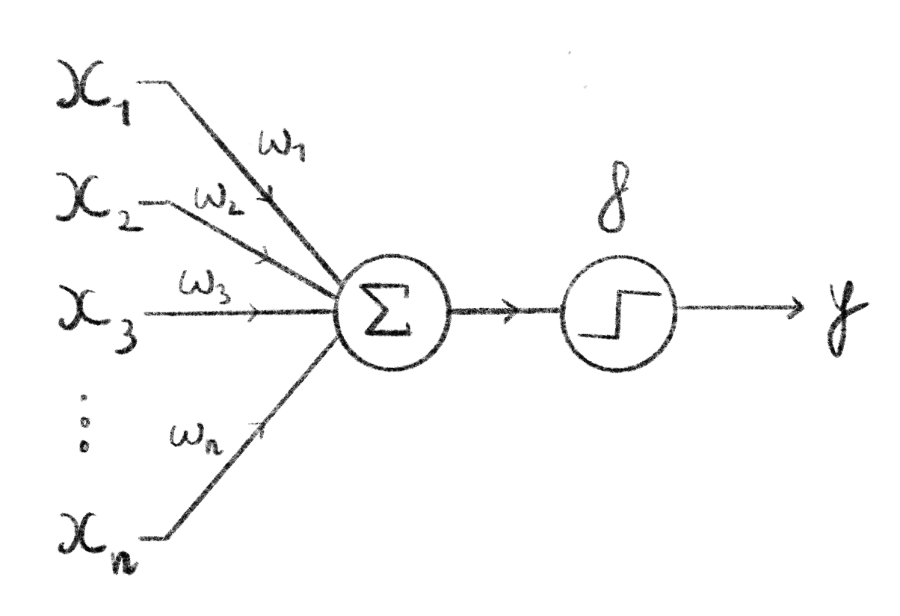

# Learning alignments, an interesting perspective

## Deep learning and sequences

### Intro to deep learning

-   The perceptron [@rosenblattPerceptronProbabilisticModel1958] & neuron structure (c.f. Figure \@ref(fig:perceptron):

    -   Inputs -\> weighted sum -\> step activation function -\> output

    -   By tweaking the weights you can solve linear separation problems

```{r, perceptronCap}
perceptronCaption <- "**Computational graph of a perceptron.**  
Here, $n$ inputs are passed into the perceptron where they are summed, weighted by $w_1,\\ldots,w_n$. This sum is then fed through the perceptron's activation function (here a binary step function) which is the output of the perceptron. Often the sum is implicitely considered part of the activation function."
```

```{r, perceptron, label="perceptron", fig.cap=perceptronCaption, eval=knitr::is_html_output(), out.width="70%"}

```

```{=tex}
\begin{figure}
  \centering
  \includegraphics[width=.7\textwidth]{figures/Learn-alignments/perceptron.png}
  \extcaption{Computational graph of a perceptron.}{
Here, $n$ inputs are passed into the perceptron where they are summed, weighted by $w_1,\ldots,w_n$. This sum is then fed through the perceptron's activation function (here a binary step function) which is the output of the perceptron. Often the sum is implicitely considered part of the activation function.}
  \label{fig:perceptron}
\end{figure}
```
-   Resurgence in 90s due to Back Prop [@rumelhartLearningRepresentationsBackpropagating1986] managed by continuous, differentiable activations -\> gradient based training procedures!:

    -   Sigmoid

    -   Tanh

    -   Relu (has some nice convergence properties [@liConvergenceAnalysisTwolayer2017]

-   and the MLP (c.f. Figure \@ref(fig:mlp)) which is versatile (non linear problems!) and could now be trained efficiently [@murtaghMultilayerPerceptronsClassification1991]

-   Turns out they're universal function approximators [@cybenkoApproximationSuperpositionsSigmoidal1989; @hornikMultilayerFeedforwardNetworks1989; @hornikApproximationCapabilitiesMultilayer1991a] !

```{r, mlpCap}
mlpCaption <- "**Computational graph of a multilayer perceptron.**  
This MLP, also called feedforward neural network, has $n$ inputs represented as the input layer, 2 hidden layers of 3 neurons each and an output layer of 2 neurons (e.g. suitable to binary classification). It is fully connected meaning that each node of a given layer is used as input for every neuron of the following layer. Each edge in this graph is paired to a weight, these are the tunable parameters during the training process."
```

```{r, mlp, label="mlp", eval=knitr::is_html_output(), fig.cap=mlpCaption, out.width="70%"}
knitr::include_graphics("figures/Learn-alignments/mlp.png")
```

```{=tex}
\begin{figure}
  \centering
  \includegraphics[width=.7\textwidth]{figures/Learn-alignments/mlp.png}
  \extcaption{**Computational graph of a multilayer perceptron.}{  
This MLP, also called feedforward neural network, has $n$ inputs represented as the input layer, 2 hidden layers of 3 neurons each and an output layer of 2 neurons (e.g. suitable to binary classification). It is fully connected meaning that each node of a given layer is used as input for every neuron of the following layer. Each edge in this graph is paired to a weight, these are the tunable parameters during the training process.}
  \label{fig:mlp}
\end{figure}
```
-   Then came convolution neural networks, explosion in computer vision (Le cun [@lecunBackpropagationAppliedHandwritten1989; @lecunGradientbasedLearningApplied1998]) but also other tasks (steiner [@steinerDrugResistancePrediction2020a], subcellular localization [@weiPredictionHumanProtein2018], epidemiological parameters [@voznicaDeepLearningPhylogenies2022], etc...). an input feature is represented as a weighted linear combination of its neighbors, very interesting you start to inculde "context" in networks.

-   Recently super deep network with billions of params, reaching state of the art in many tasks:

    -   image recognition with deep CNNs like alexnet [@krizhevskyImageNetClassificationDeep2017] or resnet [@heDeepResidualLearning2016]

    -   translation with RNNs [@bahdanauNeuralMachineTranslation2016] and later Transformers [@vaswaniAttentionAllYou2017] (more on that below)

    -   protein folding with alphafold-2 [@jumperHighlyAccurateProtein2021]

### Learned sequence embeddings

An area that in which deep learning has proved very useful is creating relevant learned embeddings, idea to capture some context with powerful non-linearity.

-   (Variational) Auto-encoders:

    -   Bottlneck in deep neural neck, task is to predict input. Add noise in the hidden layers -\> remove noise or regularize to have smooth latent space and get embeddings
    -   Used for ancestral sequence reconstruction [@moretaAncestralProteinSequence2022] and estimating evolutionary distances [@corsoNeuralDistanceEmbeddings2021]
    -   VAEs used for sequence design as well [@wuProteinSequenceDesign2021; @stantonAcceleratingBayesianOptimization2022]

NLP:

-   From the field of natural language processing where very high dimensionality (470,000 words in the Merriam-Webster English dictionary [@HowManyWords], so naive one hot is out of the question), we need other ways to transform words into sequences.

-   Method of pre-training embedding methods

-   Word2Vec derivatives:

    -   word2Vec [@mikolovEfficientEstimationWord2013; @mikolovDistributedRepresentationsWords2013], take in a large corpus of text and learns a vector space from it. Then each word in the corpus can be assigned a vector, constraints mean that similar words have similar vectors (i.e. low distance in the vector space). And that the embeddings make sense grammatically (e.g. of the Paper $vec(Madrid) - vec(Spain)$ should be close to $vec(Paris)$ in the learned space.

        -   Context of a word = window of $k$ words centered around it

        -   The model is a neural network and the hidden layer corresponds to the embedding (similar to auto-encoders)

        -   2 ways to train it [@goldbergWord2vecExplainedDeriving2014]:

            -   CBOW (continuous bag of words) = predict word from context

            -   skip-gram = predict context from word

    -   dna2vec [@ngDna2vecConsistentVector2017]

        -   Used to predict methylation sites [@liangHyb4mCHybridDNA2vecbased2022]

    -   seq2vec [@kimothiDistributedRepresentationsBiological2016]

    -   BioVec/ProtVec/GeneVec [@asgariContinuousDistributedRepresentation2015]

        -   Seq2vec and ProtVec both used in classification [@kimothiMetricLearningBiological2017]

-   Transformers / NN-based language models:

    -   Also from NLP, more recent development,

        -   Some have seen a lot of success like BERT [@devlinBERTPretrainingDeep2019] and GPT-3 [@brownLanguageModelsAre2020]
        -   Based on the very popular Transformer architecture [@vaswaniAttentionAllYou2017], with attention maps. Embed features as a linear weighted sum of other features (learn weights).
        -   Allows for long range dependencies to be captured efficiently
        -   LLMs trained with MLM
        -   Replaced methods based on RNNs / LSTMs which have trouble capturing long range dependencies [@songPretrainingModelBiological2021].

    -   protein language models have been developed from this with the same idea.

        -   ProGen [@madaniProGenLanguageModeling2020] and ProGen2 [@eriknijkampProGen2ExploringBoundaries2022]

        -   ProtBERT [@elnaggarProtTransCrackingLanguage2021]

        -   DNABert [@jiDNABERTPretrainedBidirectional2021]

        -   They have interesting properties [@beplerLearningProteinLanguage2021]:

            -   Intuitively learn structure of proteins [@raoTransformerProteinLanguage2020; @rivesBiologicalStructureFunction2019]

            -   Learn mutational effects [@meierLanguageModelsEnable2021]

            -   Evolutionary characteristics [@hieEvolutionaryVelocityProtein2022]

        -   To counter the space limitations (i.e. sequence length limitations) induced by attention, other types of transformers used, with linear scale attention maps not quadratic [@choromanskiMaskedLanguageModeling2020]

    -   Include information from MSA directly in embedding[@caiGenomewidePredictionSmall2020]: transform aligned sequence in to tokens -\> use ALBERT to embed tokens

    -   MSA Transformer [@raoMSATransformer2021] that extends attention to include aligned residues from an input MSA as well.

        -   Similarly: learn on profiles derived from MSAs [@sturmfelsProfilePredictionAlignmentBased2020] as a pre-training task for protein language models

        -   Learn a protein structure model (potts model) directly on the MSA with a mechanism similar to attention [@sercuNeuralPottsModel2021]

-   Powerful but hard to interpret what the model actually learns. i.e. "black box" but some work is being done to interpret attention maps [@vigBERTologyMeetsBiology2021]

## Learning pairwise alignment

### Predicting a substitution matrix 

DEDAL [@llinares-lopezDeepEmbeddingAlignment2022]

-   reference to transformer embedding

-   Predict substitution matrix

-   Reference other similar works

-   drawback: only on proteins

### predicting an alignment

-   Transformer models can also predict tokens -\> predict "CIGAR string" or a an aligned sequence.

-   Challenges:

    -   Longer sequences in DNA

    -   Size difference in the case of mapping

    -   Less information in a single nucleotide token than in proteins....

### Learning seeds

-   DeepMinimizer

-   predict start position given a pair of sequences

### Learn pre-processing functions

i.e. either connections in MSR graph or sequence 2 sequence models

\printbibliography[segment=\therefsegment,heading=subbibintoc,title={References for chapter \thechapter}]
