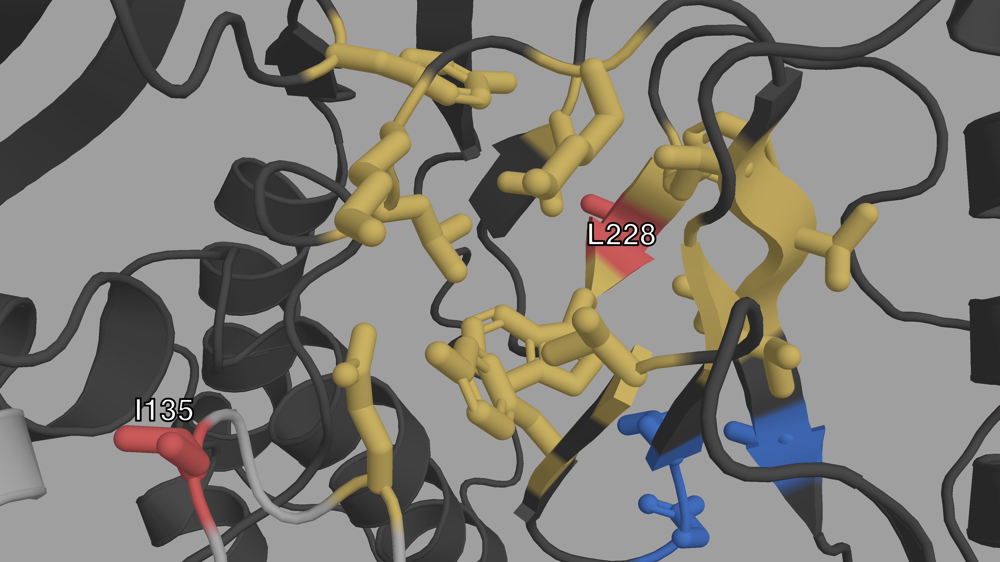

# Supporting Information for "Using Machine Learning and Big Data to Explore the Drug Resistance Landscape in HIV" {#HIV-appendix}

## S1 Appendix (Technical appendix). {#S1-Appendix }

### Data {#data-appendix }
#### Data Availability {#data-availability }

The policy of the UK HIV Drug Resistance Database is to make DNA
sequences available to any bona fide researcher who submits a
scientifically robust proposal, provided data exchange complies with
Information Governance and Data Security Policies in all the relevant
countries. This includes replication of findings from published studies,
although the researcher would be encouraged to work with the main author
of the published paper to understand the nuances of the data. Enquiries
should be addressed to <iph.hivrdb@ucl.ac.uk> in the first instance.
More information on the UK dataset is also available on the UK CHIC
homepage: [www.ukchic.org.uk](http://www.ukchic.org.uk/). Amino acid
sequences are made available along with a metadata file.\
The West and central African dataset is available as supplementary
information along with a metadata file containing HIV subtype, treatment
information and known RAM presence/absence for each sequence.\
Predictions made for each sequence of both datasets, by all of the
trained classifiers are made available as part of the supplementary data
as well as synthetic results from which the figures of the paper were
drawn. The importance values for each mutation and each trained
classifier are also made available.\
All the data and metadata files made available are hosted in the online
repository linked to this project at the following URL:\
[github.com/lucblassel/HIV-DRM-machine-learning/tree/main/data](https://github.com/lucblassel/HIV-DRM-machine-learning/tree/main/data)

#### Data Preprocessing {#data-preprocessing }

For both the African and UK datasets, the sequences were truncated to
keep sites 41 to 235 of the RT protein sequence before encoding. This
truncation was needed to avoid the perturbation to classifier training
due to long gappy regions at the beginning and end of the UK RT
alignment caused by shorter sequences. These positions were determined
with the Gblocks software [@castresanaSelectionConservedBlocks2000] with
default parameters, except for the Maximum number of sequences for a
flanking position, set to 50,000, and the Allowed gap positions, which
was set to \"All\". The encoding was done with the `OneHotEncoder` from
the category-encoders python module
[@mcginnisScikitLearnContribCategoricalEncodingRelease2018].

### Classifiers {#classifiers }

We used classifier implementations from the scikit-learn python library
[@pedregosaScikitlearnMachineLearning2011], `RandomForestClassifier` for
the random forest classifier, `MultinomialNB` for Naïve Bayes and
`LogisticRegressionCV` for logistic regression.\
`RandomForestClassifier` was used with default parameters except:

-   `"n_jobs"=4`
-   `"n_estimators"=5000`

`LogisticRegressionCV` was used with the following parameters:

-   `"n_jobs"=4`
-   `"cv"=10`
-   `"Cs"=100`
-   `"penalty"=’l1’`
-   `"multi_class"=’multinomial’`
-   `"solver"=’saga’`
-   `"scoring"=’balanced_accuracy’`

`MultinomialNB` was used with default parameters.

For the Fisher exact tests, we used the implementation from the scipy
python library [@virtanenSciPyFundamentalAlgorithms2020], and corrected
p-values for multiple testing with the statsmodels python library
[@seaboldStatsmodelsEconometricStatistical2010] using the `"Bonferroni"`
method.

### Scoring {#scoring }

To evaluate classifier performance several measures were used. We
computed balanced accuracy instead of classical accuracy, because it can
be overly optimistic, especially when assessing a highly biased
classifier on an unbalanced test set
[@brodersenBalancedAccuracyIts2010].The balanced accuracy is computed
using the following formula, where $TP$ and $TN$ are the number of true
positives and true negatives respectively, and $FP$ and $FN$ are the
number of false positives and false negatives respectively:\
$$
balanced~accuracy = \frac{1}{2}\left(
      \frac{TP}{TP + FP} + \frac{TN}{TN + FN}
  \right)
$$

We also computed adjusted mutual information (AMI). We chose it over
mutual information (MI) because it has an upper bound of 1 for a perfect
classifier and is not dependent on the size of the test set, allowing us
to compare the performance for differently sized test sets
[@vinhInformationTheoreticMeasures2010]. The adjusted mutual information
of variables $U$ and $V$ is defined by the following formula, where
$MI(U,V)$ is the mutual information between variables $U$ and $V$,
$H(X)$ is the entropy of the variable $X$ (= $U$ or $V$) and
$E\{MI(U,V)\}$ is the expected MI, as explained in
[@vinhNovelApproachAutomatic2009].\
$$
AMI(U,V) = \frac{
      MI(U,V) - E\{MI(U,V)\} 
  }{
      \frac{1}{2}[H(U) + H(V)] - E\{MI(U,V)\}
  }
$$

MI was used to compute the $G$ statistic, which follows the chi-square
distribution under the null hypothesis
[@harremoesMutualInformationContingency2014]. This was used to compute
p-values for each of our classifiers and assess the significance of
their performance. $G$ is defined by equation below, where $N$ is the
number of samples.\
$$G = 2\cdot N \cdot MI(U,V)$$

Finally, to check the probabilistic predictive power of the classifiers
we also computed the Brier score which is the mean squared difference
between the ground truth and the predicted probability of being of the
positive class for every sequence in the test set (therefore lower is
better for this metric). The Brier score is defined in equation below,
where $p_t$ is the predicted probability of being of the positive class
for sample $t$ and $o_t$ is the actual class (0 or 1, 1=positive class)
of sample $t$:\
$$Brier~score=\frac{1}{N}\sum_{t=1}^N(p_t-o_t)^2$$

We used the following implementations from the scikit-learn python
library [@pedregosaScikitlearnMachineLearning2011] with default options:

-   `balanced_accuracy_score`
-   `mutual_info_score`
-   `adjusted_mutual_info_score`
-   `brier_score_loss`

We used the relative risk to observe the relationship between one of our
new mutations and a binary character $X$ such as treatment status or
presence/absence of a known RAM. 
$$
\begin{aligned}
  RR(new, X) &= \frac{prevalence\left(new~mutation\mid X=1\right)}{prevalence\left(new~mutation\mid X=0\right)} \nonumber\\
  \nonumber\\
  &= \frac{|(new=1)\cap(X=1)|}{|(X=1)|}\div\frac{|(new=1)\cap(X=0)|}{|(X=0)|} \\
  \end{aligned}
$$

## S1 Fig. 

```{r}
s1Caption <- "**Relative risks of the new mutations with regards to known RAMs on the
African dataset** (i.e. the prevalence of the new mutation in sequences
with a given RAM divided by the prevalence of the new mutation in
sequences without the RAM). RRs were only computed for mutations (new
and RAMs) that appeared in at least 30 sequences, which is why RRs were
not computed for H208Y and D218E. 95% confidence intervals, represented
by vertical bars, were computed with 1000 bootstrap samples of the
African sequences. Only RRs with a lower CI boundary greater than 2 are
shown. The shape and color of the point represents the type of RAM as
defined by Stanford's HIVDB. Blue circle: NRTI, orange square: NNRTI,
green diamond: Other. For the RR of L228H with regards to M184V, the
upper CI bound is infinite. The new RAMs have high RR values for known
RAMs similar to those obtained on the UK dataset. We also arrive at
similar conclusions, I135L being associated with NNRTIs, E203K and L228H
to NRTI and L228R to both. RR values are shown from left to right, by
order of decreasing values on the lower bound of the 95% CI."
```
```{r, s1, fig.cap=s1Caption, fig.label="s1", eval=knitr::is_html_output()}

```
\begin{figure}[H]
{
\centering
\includegraphics[width=0.9\linewidth]{./figures/Chapter-02/S1_Fig.png}
}
\extcaption{Relative risks of the new mutations with regards to known RAMs on the African dataset}{
(i.e. the prevalence of the new mutation in sequences with a given RAM divided by the prevalence of the new mutation in sequences without the RAM). RRs were only computed for mutations (new and RAMs) that appeared in at least 30 sequences, which is why RRs were not computed for H208Y and D218E. 95\% confidence intervals, represented by vertical bars, were computed with 1000 bootstrap samples of the African sequences. Only RRs with a lower CI boundary greater than 2 are shown. The shape and color of the point represents the type of RAM as defined by Stanford’s HIVDB. Blue circle: NRTI, orange square: NNRTI, green diamond: Other. For the RR of L228H with regards to M184V, the upper CI bound is infinite. The new RAMs have high RR values for known RAMs similar to those obtained on the UK dataset. We also arrive at similar conclusions, I135L being associated with NNRTIs, E203K and L228H to NRTI and L228R to both. RR values are shown from left to right, by order of decreasing values on the lower bound of the 95\% CI.}
\label{fig:s1}
\end{figure}


## S2 Fig. 

```{r}
s2Caption <- "**Closeup structural view of the entrance of the NNIBP of HIV-1 RT** The
p66 subunit is colored in dark gray, the p51 subunit in light gray. The
NNIBP is highlighted in yellow. The active site is colored in blue. We
can see the physical proximity of I135 (red) to the entrance of the
NNIBP. We can also see how L228 (red) is between 2 AAs of the NNIBP."
```
```{r, s2, fig.cap=s2Caption, fig.label="s2", eval=knitr::is_html_output()}

```

\begin{figure}[H]
{
\centering
\includegraphics[width=0.9\linewidth]{./figures/Chapter-02/S2_Fig.png}
}
\extcaption{Closeup structural view of the entrance of the NNIBP of HIV-1 RT}{
The p66 subunit is  colored in dark gray, the p51 subunit in light gray. The NNIBP is highlighted in yellow. The active site is colored in blue. We can see the physical proximity of I135 (red) to the entrance of the NNIBP. We can also see how L228 (red) is between 2 AAs of the NNIBP.}
\label{fig:s2}
\end{figure}

## S3 Fig. 

```{r}
s3Caption <- "**Closeup structural view of the active site of HIV-1 RT.** The p66
subunit is colored in dark gray, the p51 subunit in light gray. The
active site is highlighted in blue. The NNIBP is colored in yellow.
L228, E203 and D218 (red) are also very close on either side of the
active site."
```
```{r, s3, fig.cap=s3Caption, fig.label="s3", eval=knitr::is_html_output()}

```

\begin{figure}[H]
{
\centering
\includegraphics[width=0.9\linewidth]{./figures/Chapter-02/S3_Fig.png}
}
\extcaption{Closeup structural view of the active site of HIV-1 RT.}{
The p66 subunit is colored in dark gray, the p51 subunit in light gray. The active site is highlighted in blue. The NNIBP is colored in yellow. L228, E203 and D218 (red) are also very close on either side of the active site.}
\label{fig:s3}
\end{figure}

## S1 Table. {#S1-Table }

**Detailed table of "new mutation" characteristics.**

<!-- \begin{table}[!h] -->
<!-- \centering -->
<!-- \resizebox{\linewidth}{!}{% -->
<!-- \begin{tabular}{@lllllll@{}ll@{}ll@{}ll@{}ll@{}ll@{}llllllll@{}}  -->
<!-- \toprule -->
<!-- \multirow{3}{*}{} & \multicolumn{2}{l}{\multirow{2}{*}{rank}} & \multicolumn{3}{l}{\multirow{2}{*}{codon distance}} & \multicolumn{6}{l}{UK} & \multicolumn{7}{l}{Africa} & \multirow{3}{*}{B62} & \multirow{3}{*}{\begin{tabular}[c]{@{}l@{}}Dayhoff \\ category \\ shift \end{tabular}} & \multicolumn{4}{l}{Change in} \\ -->
<!--  & \multicolumn{2}{l}{} & \multicolumn{3}{l}{} & \multicolumn{2}{l}{\multirow{2}{*}{count}} & \multicolumn{4}{l}{ratio} & \multicolumn{2}{l}{\multirow{2}{*}{count}} & \multicolumn{4}{l}{ratio} & \multirow{2}{*}{p-value} &  &  & \multirow{2}{*}{\begin{tabular}[c]{@{}l@{}}net \\ charge \end{tabular}} & \multirow{2}{*}{polarity} & \multirow{2}{*}{\begin{tabular}[c]{@{}l@{}}hydrophobicity \\ index \end{tabular}} & \multirow{2}{*}{\begin{tabular}[c]{@{}l@{}}molecular \\ weight \end{tabular}} \\ -->
<!--  & T/N & W/W & min & UK & Africa & \multicolumn{2}{l}{} & \multicolumn{2}{l}{$\rho(new, treatment)$ } & \multicolumn{2}{l}{$\rho(new, with~RAM)$ ~} & \multicolumn{2}{l}{} & \multicolumn{2}{l}{$\rho(new, treatment)$~~ } & \multicolumn{2}{l}{$\rho(new, with~RAM)$~~ } &  &  &  &  &  &  &  \\  -->
<!-- \midrule -->
<!--  \textbf{L228R}  & 0 & 0 & 1 & 1.16 & 1.21 & 227~ & (0.4\%) & 18.1~ & {[}12.9;27.3] & 115.7~ & {[}55.1;507.3] & 98~ & (2.5\%) & 32.5 & {[}15.4;147.1] & 42.4~ & {[}17.8;$\infty$] & 2.0E-30 & -2 & e $\rightarrow$ d  & 1 & 5.6 & -0.93 & 43.03 \\ -->
<!-- \textbf{E203K}  & 1 & 1 & 1 & 1.31 & 1.33 & 256~ & (0.5\%) & 11.0~ & {[}8.2;15.1] & 20.1~ & {[}13.7;32.1] & 56~ & (1.4\%) & 14.1 & {[}6.7;71.9] & 17.4 & {[}8.2;83.7] & 6.4E-14 & 1 & c $\rightarrow$ d  & 2 & -1 & 0.68 & -0.94 \\ -->
<!-- \textbf{D218E}  & 2 & 3 & 1 & 1 & 1 & 168~ & (0.3\%) & 13.1~ & {[}9.0;19.6] & 27.0~ & {[}16.3;57.0] & 25~ & (0.6\%) & $\infty$~ & {[}$\infty$;$\infty$] & $\infty$ & {[}$\infty$;$\infty$]~ & 2.0E-09 & 2 & c $\rightarrow$ c  & 0 & -0.7 & 0.01 & 14.03 \\ -->
<!-- \textbf{L228H}  & 3 & 4 & 1 & 1.12 & 1.17 & 287 & (0.5\%) & 6.4~ & {[}5.1;8.4] & 9.2~ & {[}6.9;12.6] & 53~ & (1.3\%) & 23.1 & {[}9.4;$\infty$] & 34.1 & {[}12.0;$\infty$] & 2.7E-15 & -3 & e $\rightarrow$ d  & 0 & 5.5 & -0.92 & 23.99 \\ -->
<!-- \textbf{I135L}  & 4 & 6 & 1 & 1.16 & 1.13 & 540 & (1.0\%) & 1.8~ & {[}1.5;2.1] & 2.4 & {[}2.0;2.8] & 134 & (3.4\%) & 2.6~ & {[}1.8;3.8] & 2.4 & {[}1.7;3.4] & 2.6E-07 & 2 & e $\rightarrow$ e  & 0 & -0.3 & -0.69 & 0 \\ -->
<!-- \textbf{H208Y}  & 8 & 9 & 1 & 1.10 & 1.12 & 205~ & (0.4\%) & 8.8~ & {[}6.5;12.5] & 14.9 & {[}9.9;23.6] & 13~ & (0.3\%) & $\infty$~~ & {[}$\infty$;$\infty$] & $\infty$ & {[}$\infty$;$\infty$]~ & 7.3E-05 & 2 & d $\rightarrow$ f  & 0 & -4.2 & 1.27 & 26.03 \\ -->
<!-- \bottomrule -->
<!-- \end{tabular} -->
<!-- } -->
<!-- \begin{flushleft} -->
<!--   \textbf{Detailed table of "new mutation" characteristics.} -->
<!--   \footnotesize -->
<!--   \textbf{Rank:} For each new mutation we computed the aggregate feature importance ranks for the RTI-naive / RTI-experienced and known RAM present / known RAM absent classification tasks. -->
<!--   \textbf{Codon distance:} We computed the minimum number of nucleotide mutations to go from the wild amino acid codons to those of the mutated amino acid, as well as the average codon distance between both amino acids, weighted by the prevalence of each wild and mutated codon in the UK and the African datasets.  -->
<!--   \textbf{Count (both UK and Africa):} We looked at the number of apparitions of each new potential RAM in the UK and African datasets and the corresponding prevalence in parentheses.  -->
<!--   \textbf{Ratio (both UK and Africa):} We computed the prevalence ratio $\rho(new, treatment)$ (e.g. L228R is 18.1 times more prevalent in RTI-experienced sequences compared to RTI-naive sequences in the UK dataset). We also computed the prevalence ratio $\rho(new,any RAM)$ (e.g. L228R is 115.7 times more prevalent in sequences that have at least one known RAM than in sequences that have none in the UK dataset). The 95\% confidence intervals shown under each ratio were computed with 1000 bootstrap samples of size $n=55,000$ drawn with replacement from the whole UK dataset (The same procedure was done on the African dataset with size $n=3990$).  -->
<!--   \textbf{p-values:} Fisher exact tests were done on the African dataset to see if each of these new mutations were more prevalent in RTI-experienced sequences; p-value were corrected with the Bonferroni method for the six simultaneous tests. -->
<!--   \textbf{B62:} BLOSUM62 similarity values (e.g. D218E = 2, reflecting that E and D are both negatively charged and highly similar).  -->
<!--   \textbf{Dayhoff category shift:} The change in Dayhoff amino acid category is written thusly: “starting category $\rightarrow$ ending category”. These categories are as follows: \textit{a:} Sulfur polymerization. \textit{b:} Small, \textit{c:} Acid and amide, \textit{d:} Basic, \textit{e:} Hydrophobic and \textit{f:} aromatic. -->
<!--   \textbf{Physico-chemical change:} Change in physicochemical properties was obtained by subtracting the property value of the wil-type amino acid from the mutated amino acid. All values were obtained from the AAindex database (Kawashima S, Pokarowski P, Pokarowska M, Kolinski A, Katayama T, Kanehisa M. AAindex: amino acid index database, progress report 2008. Nucleic acids research. 2007 Nov 12;36(suppl\_1):D202-5.) -->
<!-- \end{flushleft} -->
<!-- \end{table}    -->

## S2 Appendix. (Fisher exact tests) {#S2-Appendix }

**Fisher exact tests on pairs of mutations.** A detailed explanation of
the procedure followed to test pairs of mutations for association with
treatment. Detailed numerical results are also given.

In order to study epistasis further we conducted conducted Fisher exact
tests between every pair of mutations in the UK dataset ($n=867,903$)
and the treatment status, corrected the p-values with the Bonferroni
method with an overall risk level $\alpha=0.05$.\
Out of these tests, $1,309$ pairs were significantly associated with
treatment status. $424$ out of $1,309$ these pairs were two known RAMs,
$806$ of these pairs contained one known RAM and only $79$ tests had
pairs involving no known RAM at all. Furthermore out of these $1,309$
significantly associated pairs, $829$ contained two mutations that were
significantly associated to treatment when testing mutations one by one.
In $478$ pairs, one of the two mutations is associated to treatment on
its own, and the remaining 2 pairs, none of the mutations were
significantly associated with treatment on their own.\
These 2 pairs were K103R + V179D and T165I + K173Q. The first pair, is a
pair of known RAMs and this interaction is characterized in the HIVDb
database (<https://hivdb.stanford.edu/dr-summary/comments/NNRTI/>). The
second pair is made up of new mutations, and the corrected p-value is
$0.02$. In the Standford HIVDB, T165I has been associated to a reduction
in EFV susceptibility.\
Out of the $1,309$ pairs significantly associated to treatment, $151$
contained at least one of our 6 new potential RAMs, in $6$ cases the
pair was made up of 2 of them.\
In the UK dataset, phylogenetic correlation is likely very impactful
with regards to these tests. Indeed, the sequences are far from being
independent. In order to alleviate this effect we decided to test the
sigficative pairs again on the African dataset, and once more correct
with the Bonferroni procedure.\
Out of the $1,309$ tests $294$ have significative p-values after
correction. Out of these $221$ pairs were composed of 2 mutations
individually significatively associated with treatment. The remaining
$73$ pairs had one mutation significantly associated with treatment.\
Out of the $221$ significative tests, 156 pairs were composed of 2 known
RAMS while $135$ had one known RAM in the pair. The remaining 3 pairs
that do not contain a known RAM all contained either L228R or L228H
which are both part of our 6 potential RAMS.

## S1 Data.

**Archive of figure generating data.** A zip archive containing the
processed data used to generate each panel of the main figures.  

```{r, s1_data}
xfun::embed_file("./figures/Chapter-02/S1_Data.zip", text="Download data")
```

## S2 Data.

**List of known DRMs.** A .csv file containing all the known RAMs used
in this project as well as the corresponding feature name in the encoded
datasets. Obtained from
([hivdb.stanford.edu/dr-summary/comments/NRTI/](https://hivdb.stanford.edu/dr-summary/comments/NRTI/))
and
([hivdb.stanford.edu/dr-summary/comments/NNRTI/](https://hivdb.stanford.edu/dr-summary/comments/NNRTI/)).  

```{r, s2_data}
xfun::embed_file("./figures/Chapter-02/S2_Data.csv", text="Download data")
```