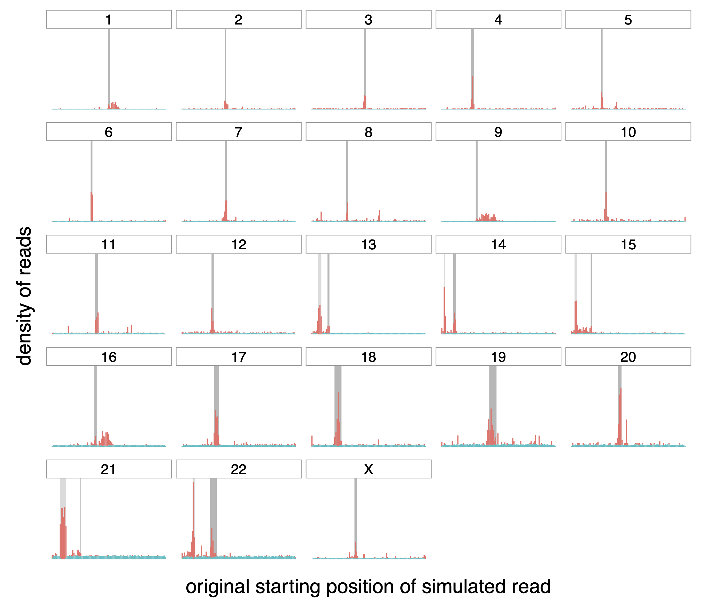
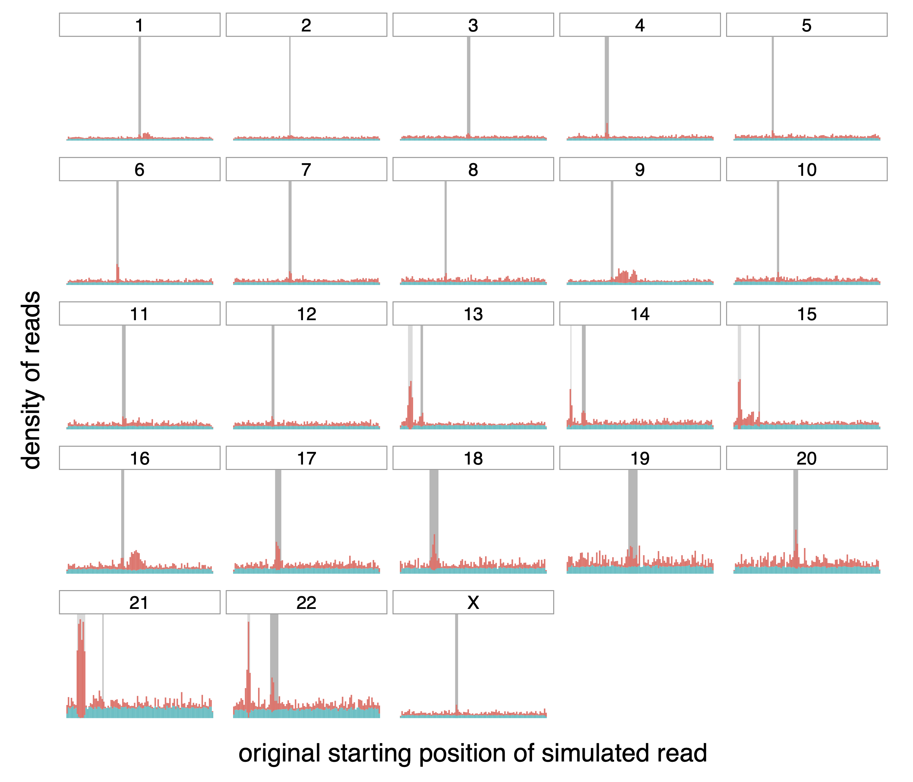
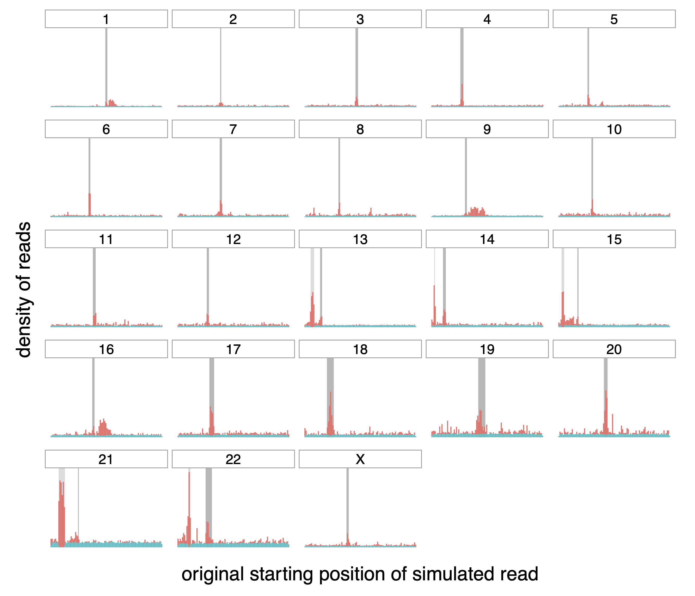
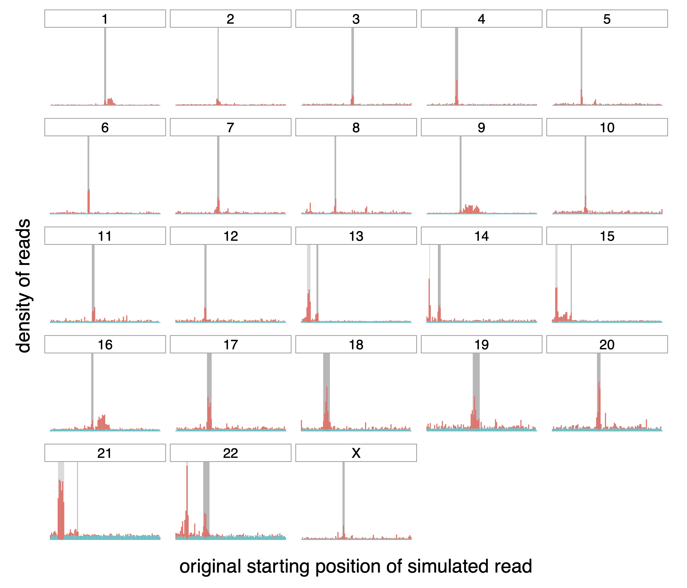
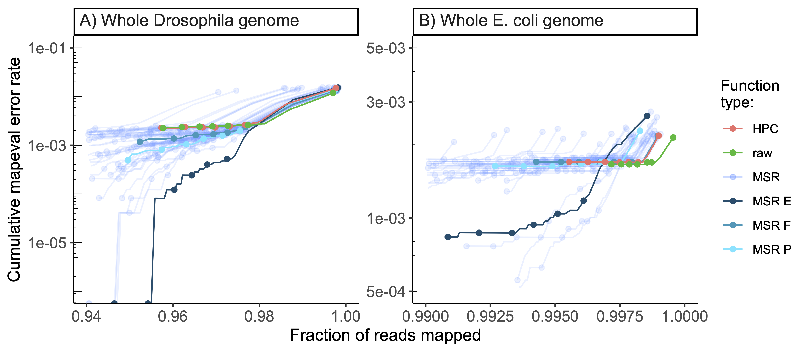

\fancyhead[LE]{APPENDIX \thechapter}

# Supporting Information for "Mapping-friendly sequence reductions: going beyond homopolymer compression" {#HPC-appendix}

## "TandemTools" dataset generation {#appendix:tandemtools}

This dataset was obtained by taking a human X chromosome HOR sequence, concatenating it 500 times with added mutations in order to obtain an approximately 1 Mbp long sequence. Then 1200 reads were simulated from the sequence using `nanosim` [@yangNanoSimNanoporeSequence2017] and assembled using a centromere-tailored pipeline [@bzikadzeAutomatedAssemblyCentromeres2020]. A 10kbp deletion was then added to this assembly. The resulting sequence is the one we refer to as the "Centromeric sequence".

## MSR performance comparison

```{r, mapperComparisonCaption}
mapperComparisonCaption <- "**Comparing performance of MSRs on the whole human genome, whole *Drosophila melanogaster* genome, repeated regions of the whole human genome and synthetic centromeric sequence.**\
Results using  `minimap2` [@liMinimap2PairwiseAlignment2018] and winnowmap2  [@jainWeightedMinimizerSampling2020]. The number of simulated reads for each reference sequence is given in parentheses and called $n$. Results are reported for mapq thresholds of 60, 50 and 0. The best performance for each category is highlighted in bold. The percentage difference are computed w.r.t HPC at each given threshold."
```

```{r, mapperComparison, label="mapperComparison", eval=knitr::is_html_output(), tab.topcaption=FALSE, cache=FALSE}
dt <- read_csv("tables/HPC-MSRs/Table2.csv")  

labels <- data.frame(
  col_keys = c("label","mq60frac","mq60err","mq50frac","mq50err","mq00frac","mq00err"),
  what = c("label", "mapq = 60", "mapq = 60", "mapq ≥ 50", "mapq ≥ 50", "any mapq", "any mapq"),
  measure = c("label", "fraction", "error", "fraction", "error", "fraction", "error"),
  stringsAsFactors = FALSE
)

flextable(dt) %>%
  set_header_df(mapping=labels, key="col_keys") %>%
  merge_h(part="header") %>%
  merge_v(j="label", part="header") %>%
  merge_h_range(i=1, j1=1, j2=7) %>%
  merge_h_range(i=7, j1=1, j2=7) %>%
  merge_h_range(i=13, j1=1, j2=7) %>%
  merge_h_range(i=19, j1=1, j2=7) %>%
  merge_h_range(i=25, j1=1, j2=7) %>%
  merge_h_range(i=31, j1=1, j2=7) %>%
  merge_h_range(i=37, j1=1, j2=7) %>%
  merge_h_range(i=43, j1=1, j2=7) %>%
  ftExtra::colformat_md() %>%
  set_table_properties(width=1, layout="autofit") %>%
  theme_booktabs() %>%
  set_caption(caption=mapperComparisonCaption, style="caption")
```

```{=tex}
\begin{table}[H]
\extcaption{Comparing performance of MSRs on the whole human genome, whole \textit{Drosophila melanogaster} genome, repeated regions of the whole human genome and synthetic centromeric sequence.}{Results using  \minimap \autocite{liMinimap2PairwiseAlignment2018} and \winnowmap  \autocite{jainWeightedMinimizerSampling2020}. The number of simulated reads for each reference sequence is given in parentheses and called $n$. Results are reported for mapq thresholds of 60, 50 and 0. The best performance for each category is highlighted in bold. The percentage difference are computed w.r.t HPC at each given threshold.}
\label{tab:mapperComparison}
{\centering
\resizebox{0.93\textwidth}{!}{%
\begin{tabular}{@{}lr@{}lr@{}lr@{}lr@{}lr@{}lr@{}l@{}}
\toprule
                                    & \multicolumn{4}{l}{mapq=60}                                                                                 & \multicolumn{4}{l}{mapq$\geq50$}                                                                            & \multicolumn{4}{l}{any mapq}                                                                              \\ \cmidrule(l){2-5}\cmidrule(l){6-9}\cmidrule(l){6-9}\cmidrule(l){10-13}
mapping friendly sequence reduction & \multicolumn{2}{l}{fraction}                       & \multicolumn{2}{l}{error}                              & \multicolumn{2}{l}{fraction}                       & \multicolumn{2}{l}{error}                              & \multicolumn{2}{l}{fraction}                      & \multicolumn{2}{l}{error}                             \\ \midrule
                                                                                                                                                                                                                                                                                                                                                                            \\
\multicolumn{13}{l}{\textbf{Whole Drosophila melanogaster genome - \minimap (n = \numprint{25764})}}                                                                                                                                                                                                                                                                                  \\
HPC                                 & 0.957          & \footnotesize{\;$+$0\%}           & 2.27e-03          & \footnotesize{\;$+$  0\%}          & \textbf{0.963} & \textbf{\footnotesize{\;$+$0\%}}  & 2.34e-03          & \footnotesize{\;$+$  0\%}          & \textbf{0.998} & \textbf{\footnotesize{\;$+$0\%}} & 1.48e-02          & \footnotesize{\;$+$ 0\%}          \\
raw                                 & \textbf{0.958} & \textbf{\footnotesize{\;$+$0\%}}  & 2.27e-03          & \footnotesize{\;$-$  0\%}          & 0.962          & \footnotesize{\;$-$0\%}           & 2.34e-03          & \footnotesize{\;$+$  0\%}          & 0.997          & \footnotesize{\;$-$0\%}          & \textbf{1.17e-02} & \textbf{\footnotesize{\;$-$21\%}} \\
\msr{F}                             & 0.952          & \footnotesize{\;$-$1\%}           & 1.18e-03          & \footnotesize{\;$-$ 48\%}          & 0.960          & \footnotesize{\;$-$0\%}           & 1.37e-03          & \footnotesize{\;$-$ 41\%}          & \textbf{0.998} & \textbf{\footnotesize{\;$+$0\%}} & 1.36e-02          & \footnotesize{\;$-$ 8\%}          \\
\msr{E}                             & 0.946          & \footnotesize{\;$-$1\%}           & \textbf{0}     & \textbf{\footnotesize{\;$-$100\%}} & 0.954          & \footnotesize{\;$-$1\%}           & \textbf{0}     & \textbf{\footnotesize{\;$-$100\%}} & \textbf{0.998} & \textbf{\footnotesize{\;$+$0\%}} & 1.53e-02          & \footnotesize{\;$+$ 3\%}          \\
\msr{P}                             & 0.950          & \footnotesize{\;$-$1\%}           & 4.90e-04          & \footnotesize{\;$-$ 78\%}          & 0.957          & \footnotesize{\;$-$1\%}           & 8.11e-04          & \footnotesize{\;$-$ 65\%}          & \textbf{0.998} & \textbf{\footnotesize{\;$-$0\%}} & 1.39e-02          & \footnotesize{\;$-$ 6\%}          \\
                                                                                                                                                                                                                                                                                                                                                                            \\
\multicolumn{13}{l}{\textbf{Whole Drosophila melanogaster genome - \winnowmap (n = \numprint{25764})}}                                                                                                                                                                                                                                                                                \\
HPC                                 & 0.923          & \footnotesize{\;$+$0\%}           & 1.51e-03          & \footnotesize{\;$+$ 0\%}           & 0.930          & \footnotesize{\;$+$0\%}           & 1.59e-03          & \footnotesize{\;$+$ 0\%}           & 0.989          & \footnotesize{\;$+$0\%}          & 1.50e-02          & \footnotesize{\;$+$ 0\%}          \\
raw                                 & \textbf{0.949} & \textbf{\footnotesize{\;$+$3\%}}  & 1.92e-03          & \footnotesize{\;$+$27\%}           & \textbf{0.954} & \textbf{\footnotesize{\;$+$3\%}}  & 1.99e-03          & \footnotesize{\;$+$26\%}           & \textbf{0.995} & \textbf{\footnotesize{\;$+$1\%}} & \textbf{1.33e-02} & \textbf{\footnotesize{\;$-$12\%}} \\
\msr{F}                             & 0.918          & \footnotesize{\;$-$1\%}           & \textbf{1.27e-03} & \textbf{\footnotesize{\;$-$16\%}}  & 0.925          & \footnotesize{\;$-$0\%}           & \textbf{1.30e-03} & \textbf{\footnotesize{\;$-$18\%}}  & 0.987          & \footnotesize{\;$-$0\%}          & 1.37e-02          & \footnotesize{\;$-$ 9\%}          \\
\msr{P}                             & 0.905          & \footnotesize{\;$-$2\%}           & 1.33e-03          & \footnotesize{\;$-$12\%}           & 0.912          & \footnotesize{\;$-$2\%}           & 1.53e-03          & \footnotesize{\;$-$3\%}            & 0.983          & \footnotesize{\;$-$1\%}          & 1.40e-02          & \footnotesize{\;$-$ 7\%}          \\
\msr{E}                             & 0.905          & \footnotesize{\;$-$2\%}           & 1.42e-03          & \footnotesize{\;$-$ 6\%}           & 0.912          & \footnotesize{\;$-$2\%}           & 1.49e-03          & \footnotesize{\;$-$ 6\%}           & 0.983          & \footnotesize{\;$-$1\%}          & 1.44e-02          & \footnotesize{\;$-$ 4\%}          \\
                                                                                                                                                                                                                                                                                                                                                                            \\
\multicolumn{13}{l}{\textbf{Synthetic centromeric sequence - \minimap (n = \numprint{12673})}}                                                                                                                                                                                                                                                                                        \\
HPC                                 & 0.870          & \footnotesize{\;$+$0\%}           & \textbf{1.36e-03} & \textbf{\footnotesize{\;$+$ 0\%}}  & 0.964          & \footnotesize{\;$+$0\%}           & \textbf{1.56e-03} & \textbf{\footnotesize{\;$+$  0\%}} & \textbf{1.000} & \textbf{\footnotesize{\;$+$0\%}} & 9.00e-03          & \footnotesize{\;$+$ 0\%}          \\
raw                                 & \textbf{0.936} & \textbf{\footnotesize{\;$+$8\%}}  & 1.86e-03          & \footnotesize{\;$+$ 36\%}          & \textbf{0.984} & \textbf{\footnotesize{\;$+$2\%}}  & 2.09e-03          & \footnotesize{\;$+$ 34\%}          & \textbf{1.000} & \textbf{\footnotesize{\;$+$0\%}} & \textbf{4.50e-03} & \textbf{\footnotesize{\;$-$50\%}} \\
\msr{E}                             & 0.885          & \footnotesize{\;$+$2\%}           & 3.39e-03          & \footnotesize{\;$+$149\%}          & 0.962          & \footnotesize{\;$-$0\%}           & 3.53e-03          & \footnotesize{\;$+$127\%}          & \textbf{1.000} & \textbf{\footnotesize{\;$+$0\%}} & 1.20e-02          & \footnotesize{\;$+$33\%}          \\
\msr{F}                             & 0.850          & \footnotesize{\;$-$2\%}           & 2.04e-03          & \footnotesize{\;$+$ 50\%}          & 0.968          & \footnotesize{\;$+$0\%}           & 2.12e-03          & \footnotesize{\;$+$ 36\%}          & \textbf{1.000} & \textbf{\footnotesize{\;$+$0\%}} & 6.63e-03          & \footnotesize{\;$-$26\%}          \\
\msr{P}                             & 0.898          & \footnotesize{\;$+$3\%}           & 1.58e-03          & \footnotesize{\;$+$ 16\%}          & 0.968          & \footnotesize{\;$+$0\%}           & 1.79e-03          & \footnotesize{\;$+$ 15\%}          & \textbf{1.000} & \textbf{\footnotesize{\;$+$0\%}} & 9.78e-03          & \footnotesize{\;$+$ 9\%}          \\
                                                                                                                                                                                                                                                                                                                                                                            \\
\multicolumn{13}{l}{\textbf{Synthetic centromeric sequence - \winnowmap (n = \numprint{12673})}}                                                                                                                                                                                                                                                                                      \\
HPC                                 & 0.775          & \footnotesize{\;$+$ 0\%}          & \textbf{1.32e-03} & \textbf{\footnotesize{\;$+$ 0\%}}  & \textbf{0.822} & \textbf{\footnotesize{\;$+$0\%}}  & \textbf{1.82e-03} & \textbf{\footnotesize{\;$+$ 0\%}}  & 0.997          & \footnotesize{\;$+$0\%}          & 8.37e-02          & \footnotesize{\;$+$ 0\%}          \\
raw                                 & \textbf{0.850} & \textbf{\footnotesize{\;$+$10\%}} & 2.04e-03          & \footnotesize{\;$+$54\%}           & 0.890          & \footnotesize{\;$+$8\%}           & 1.95e-03          & \footnotesize{\;$+$ 7\%}           & \textbf{0.999} & \textbf{\footnotesize{\;$+$0\%}} & \textbf{4.60e-02} & \textbf{\footnotesize{\;$-$45\%}} \\
\msr{E}                             & 0.795          & \footnotesize{\;$+$ 2\%}          & 2.28e-03          & \footnotesize{\;$+$73\%}           & 0.846          & \footnotesize{\;$+$3\%}           & 2.52e-03          & \footnotesize{\;$+$38\%}           & 0.997          & \footnotesize{\;$-$0\%}          & 6.96e-02          & \footnotesize{\;$-$17\%}          \\
\msr{F}                             & 0.820          & \footnotesize{\;$+$ 6\%}          & 1.83e-03          & \footnotesize{\;$+$38\%}           & 0.867          & \footnotesize{\;$+$6\%}           & 2.27e-03          & \footnotesize{\;$+$25\%}           & 0.997          & \footnotesize{\;$-$0\%}          & 5.97e-02          & \footnotesize{\;$-$29\%}          \\
\msr{P}                             & 0.780          & \footnotesize{\;$+$ 1\%}          & 1.62e-03          & \footnotesize{\;$+$22\%}           & 0.829          & \footnotesize{\;$+$1\%}           & 2.09e-03          & \footnotesize{\;$+$15\%}           & 0.997          & \footnotesize{\;$-$0\%}          & 8.65e-02          & \footnotesize{\;$+$ 3\%}          \\
                                                                                                                                                                                                                                                                                                                                                                            \\
\multicolumn{13}{l}{\textbf{Whole human genome - \minimap (n = \numprint{655594})}}                                                                                                                                                                                                                                                                                                   \\
HPC                                 & \textbf{0.935} & \textbf{\footnotesize{\;$+$0\%}}  & 1.85e-03          & \footnotesize{\;$+$ 0\%}           & \textbf{0.942} & \textbf{\footnotesize{\;$+$0\%}}  & 1.85e-03          & \footnotesize{\;$+$ 0\%}           & \textbf{1.000} & \textbf{\footnotesize{\;$+$0\%}} & 1.46e-02          & \footnotesize{\;$+$ 0\%}          \\
raw                                 & 0.921          & \footnotesize{\;$-$1\%}           & 1.86e-03          & \footnotesize{\;$+$ 0\%}           & 0.927          & \footnotesize{\;$-$2\%}           & 1.86e-03          & \footnotesize{\;$+$ 1\%}           & 0.998          & \footnotesize{\;$-$0\%}          & \textbf{1.29e-02} & \textbf{\footnotesize{\;$-$11\%}} \\
\msr{E}                             & 0.926          & \footnotesize{\;$-$1\%}           & \textbf{6.92e-05} & \textbf{\footnotesize{\;$-$96\%}}  & 0.936          & \footnotesize{\;$-$1\%}           & \textbf{1.17e-04} & \textbf{\footnotesize{\;$-$94\%}}  & 0.999          & \footnotesize{\;$-$0\%}          & 1.76e-02          & \footnotesize{\;$+$20\%}          \\
\msr{P}                             & 0.929          & \footnotesize{\;$-$1\%}           & 2.20e-04          & \footnotesize{\;$-$88\%}           & 0.938          & \footnotesize{\;$-$0\%}           & 4.15e-04          & \footnotesize{\;$-$78\%}           & 0.999          & \footnotesize{\;$-$0\%}          & 1.55e-02          & \footnotesize{\;$+$ 6\%}          \\
\msr{F}                             & 0.930          & \footnotesize{\;$-$1\%}           & 1.09e-03          & \footnotesize{\;$-$41\%}           & 0.938          & \footnotesize{\;$-$0\%}           & 1.29e-03          & \footnotesize{\;$-$30\%}           & \textbf{1.000} & \textbf{\footnotesize{\;$-$0\%}} & 1.51e-02          & \footnotesize{\;$+$ 4\%}          \\
                                                                                                                                                                                                                                                                                                                                                                            \\
\multicolumn{13}{l}{\textbf{Whole human genome - \winnowmap (n = \numprint{655594})}}                                                                                                                                                                                                                                                                                                 \\
HPC                                 & 0.894          & \footnotesize{\;$+$ 0\%}          & 1.43e-03          & \footnotesize{\;$+$ 0\%}           & 0.902          & \footnotesize{\;$+$0\%}           & 1.49e-03          & \footnotesize{\;$+$ 0\%}           & 0.988          & \footnotesize{\;$+$0\%}          & 1.92e-02          & \footnotesize{\;$+$ 0\%}          \\
raw                                 & \textbf{0.932} & \textbf{\footnotesize{\;$+$ 4\%}} & 1.75e-03          & \footnotesize{\;$+$23\%}           & \textbf{0.937} & \textbf{\footnotesize{\;$+$4\%}}  & 1.79e-03          & \footnotesize{\;$+$20\%}           & \textbf{0.994} & \textbf{\footnotesize{\;$+$1\%}} & \textbf{1.43e-02} & \textbf{\footnotesize{\;$-$26\%}} \\
\msr{F}                             & 0.874          & \footnotesize{\;$-$ 2\%}          & 2.81e-04          & \footnotesize{\;$-$80\%}           & 0.886          & \footnotesize{\;$-$2\%}           & 3.82e-04          & \footnotesize{\;$-$74\%}           & 0.984          & \footnotesize{\;$-$0\%}          & 1.94e-02          & \footnotesize{\;$+$ 1\%}          \\
\msr{E}                             & 0.795          & \footnotesize{\;$-$11\%}          & \textbf{6.33e-05} & \textbf{\footnotesize{\;$-$96\%}}  & 0.820          & \footnotesize{\;$-$9\%}           & \textbf{8.93e-05} & \textbf{\footnotesize{\;$-$94\%}}  & 0.971          & \footnotesize{\;$-$2\%}          & 2.08e-02          & \footnotesize{\;$+$ 9\%}          \\
\msr{P}                             & 0.826          & \footnotesize{\;$-$ 8\%}          & 8.68e-05          & \footnotesize{\;$-$94\%}           & 0.845          & \footnotesize{\;$-$6\%}           & 1.14e-04          & \footnotesize{\;$-$92\%}           & 0.975          & \footnotesize{\;$-$1\%}          & 2.11e-02          & \footnotesize{\;$+$10\%}          \\
\\
\multicolumn{13}{l}{\textbf{Whole Human genome (repeated regions) - \minimap (n = \numprint{68811})}}                                                                                                                                                                                                                                                                                 \\
HPC                                 & \textbf{0.619} & \textbf{\footnotesize{\;+ 0\%}}   & 3.29e-04          & \footnotesize{\;+ 0\%}             & 0.656          & \footnotesize{\;+ 0\%}            & 3.10e-04          & \footnotesize{\;+ 0\%}             & \textbf{0.998} & \textbf{\footnotesize{\;+0\%}}   & 7.79e-02          & \footnotesize{\;+ 0\%}            \\
raw                                 & 0.514          & \footnotesize{\;-17\%}            & 1.98e-04          & \footnotesize{\;-40\%}             & 0.539          & \footnotesize{\;-18\%}            & 2.16e-04          & \footnotesize{\;-30\%}             & 0.981          & \footnotesize{\;-2\%}            & \textbf{6.69e-02} & \textbf{\footnotesize{\;-14\%}}   \\
\msr{F}                             & 0.601          & \footnotesize{\;- 3\%}            & 2.18e-04          & \footnotesize{\;-34\%}             & 0.640          & \footnotesize{\;- 2\%}            & 2.27e-04          & \footnotesize{\;-27\%}             & \textbf{0.998} & \textbf{\footnotesize{\;-0\%}}   & 8.15e-02          & \footnotesize{\;+ 5\%}            \\
\msr{E}                             & 0.618          & \footnotesize{\;- 0\%}            & 1.41e-04          & \footnotesize{\;-57\%}             & \textbf{0.658} & \textbf{\footnotesize{\;+ 0\%}}   & \textbf{1.55e-04} & \textbf{\footnotesize{\;-50\%}}    & 0.997          & \footnotesize{\;-0\%}            & 8.23e-02          & \footnotesize{\;+ 6\%}            \\
\msr{P}                             & 0.616          & \footnotesize{\;- 1\%}            & \textbf{1.18e-04} & \textbf{\footnotesize{\;-64\%}}    & 0.656          & \footnotesize{\;+ 0\%}            & 1.99e-04          & \footnotesize{\;-36\%}             & 0.997          & \footnotesize{\;-0\%}            & 8.31e-02          & \footnotesize{\;+ 7\%}            \\
                                                                                                                                                                                                                                                                                                                                                                            \\
\multicolumn{13}{l}{\textbf{Whole Human genome (repeated regions) - \winnowmap (n = \numprint{68811})}}                                                                                                                                                                                                                                                                               \\
HPC                                 & 0.525          & \footnotesize{\;+ 0\%}            & 1.24e-03          & \footnotesize{\;+ 0\%}             & 0.557          & \footnotesize{\;+ 0\%}            & 1.49e-03          & \footnotesize{\;+ 0\%}             & 0.950          & \footnotesize{\;+0\%}            & 1.19e-01          & \footnotesize{\;+ 0\%}            \\
raw                                 & \textbf{0.648} & \textbf{\footnotesize{\;+23\%}}   & 1.26e-03          & \footnotesize{\;+ 1\%}             & \textbf{0.672} & \textbf{\footnotesize{\;+21\%}}   & 1.49e-03          & \footnotesize{\;+ 0\%}             & \textbf{0.968} & \textbf{\footnotesize{\;+2\%}}   & \textbf{8.09e-02} & \textbf{\footnotesize{\;-32\%}}   \\ 
\msr{F}                             & 0.482          & \footnotesize{\;- 8\%}            & \textbf{1.63e-03} & \textbf{\footnotesize{\;+31\%}}    & 0.516          & \footnotesize{\;- 7\%}            & 1.83e-03          & \footnotesize{\;+23\%}             & 0.940          & \footnotesize{\;-1\%}            & 1.21e-01          & \footnotesize{\;+ 2\%}            \\
\msr{E}                             & 0.366          & \footnotesize{\;-30\%}            & 6.35e-04          & \footnotesize{\;-49\%}             & 0.405          & \footnotesize{\;-27\%}            & \textbf{9.32e-04} & \textbf{\footnotesize{\;-37\%}}    & 0.911          & \footnotesize{\;-4\%}            & 1.38e-01          & \footnotesize{\;+17\%}            \\
\msr{P}                             & 0.415          & \footnotesize{\;-21\%}            & 9.45e-04          & \footnotesize{\;-24\%}             & 0.451          & \footnotesize{\;-19\%}            & 1.16e-03          & \footnotesize{\;-22\%}             & 0.920          & \footnotesize{\;-3\%}            & 1.39e-01          & \footnotesize{\;+17\%}            \\ \bottomrule
\end{tabular}%
}
}
\end{table}
```

## Analyzing read origin on whole human genome

```{r, raw_distrib_caption}
raw_distrib_caption <- "**Origin of correctly (teal) and incorrectly (red) mapped raw reads.**\
Distribution of the origin of correctly and incorrectly mapped simulated
reads (in teal and red respectively) on the different chromosomes of the
whole human genome. The dark grey rectangle for each chromosome
represents the centromere of that chromosome. The lighter gray rectangle
on chromosomes 13, 14, 15, 21 and 22 correspond to satellites denoted as
\"stalk\", another repetitive region."
```

```{r, figrawDistrib, fig.cap=raw_distrib_caption, label="hist-raw", eval=knitr::is_html_output()}

```

```{=tex}
\begin{figure}[H]
    \centering
    \includegraphics[width=0.8\textwidth]{figures/HPC-MSRs/raw_distrib.centro.rstart.pdf}\\
    \extcaption{Origin of correctly and incorrectly mapped raw reads}{
    Distribution of the origin of correctly and incorrectly mapped simulated reads (in teal and red respectively) on the different chromosomes of the whole human genome. The dark grey rectangle for each chromosome represents the centromere of that chromosome. The lighter gray rectangle on chromosomes 13, 14, 15, 21 and 22 correspond to satellites denoted as ``stalk'', another repetitive region.}
    \label{fig:hist-raw}
\end{figure}
```
```{r, hpc_distrib_caption}
hpc_distrib_caption <- "**Origin of correctly (teal) and incorrectly (red) mapped reads,
transformed with HPC.**\
Distribution of the origin of correctly and incorrectly mapped simulated
reads (in teal and red respectively) on the different chromosomes of the
whole human genome. The dark grey rectangle for each chromosome
represents the centromere of that chromosome. The lighter gray rectangle
on chromosomes 13, 14, 15, 21 and 22 correspond to satellites denoted as
\"stalk\", another repetitive region."
```

```{r, figHpcDistrib, fig.cap=hpc_distrib_caption, label="hist-hpc", eval=knitr::is_html_output(), cache=FALSE}

```

```{=tex}
\begin{figure}[H]
    \centering
    \includegraphics[width=0.8\textwidth]{figures/HPC-MSRs/hpc_distrib.centro.pdf}
    \extcaption{Origin of correctly (teal) and incorrectly (red) mapped reads, transformed with HPC}{Distribution of the origin of correctly and incorrectly mapped simulated reads (in teal and red respectively) on the different chromosomes of the whole human genome. The dark grey rectangle for each chromosome represents the centromere of that chromosome. The lighter gray rectangle on chromosomes 13, 14, 15, 21 and 22 correspond to satellites denoted as ``stalk'', another repetitive region.}
    \label{fig:hist-hpc}
\end{figure}
```
```{r, msr_e_distrib_caption, cache=FALSE}
msr_e_distrib_caption <- "**Origin of correctly (teal) and incorrectly (red) mapped reads,
transformed with MSR~E~.**\
Distribution of the origin of correctly and incorrectly mapped simulated
reads (in teal and red respectively) on the different chromosomes of the
whole human genome. The dark grey rectangle for each chromosome
represents the centromere of that chromosome. The lighter gray rectangle
on chromosomes 13, 14, 15, 21 and 22 correspond to satellites denoted as
\"stalk\", another repetitive region."
```

```{r, figMSREDistrib, fig.cap=msr_e_distrib_caption, label="hist-msr-e", eval=knitr::is_html_output(), cache=FALSE}

```

```{=tex}
\begin{figure}[H]
    \centering
    \includegraphics[width=0.8\textwidth]{figures/HPC-MSRs/msr_e_distrib.centro.pdf}
    \extcaption{Origin of correctly (teal) and incorrectly (red) mapped reads, transformed with \msr{E}}{Distribution of the origin of correctly and incorrectly mapped simulated reads (in teal and red respectively) on the different chromosomes of the whole human genome. The dark grey rectangle for each chromosome represents the centromere of that chromosome. The lighter gray rectangle on chromosomes 13, 14, 15, 21 and 22 correspond to satellites denoted as ``stalk'', another repetitive region.}
    \label{fig:hist-msr-e}
\end{figure}
```
```{r, msr_p_distrib_caption, cache=FALSE}
msr_p_distrib_caption <- "**Origin of correctly (teal) and incorrectly (red) mapped reads,
transformed with MSR~P~.**\
Distribution of the origin of correctly and incorrectly mapped simulated
reads (in teal and red respectively) on the different chromosomes of the
whole human genome. The dark grey rectangle for each chromosome
represents the centromere of that chromosome. The lighter gray rectangle
on chromosomes 13, 14, 15, 21 and 22 correspond to satellites denoted as
\"stalk\", another repetitive region."
```

```{r, figMSRPDistrib, fig.cap=msr_p_distrib_caption, label="hist-msr-p", eval=knitr::is_html_output(), cache=FALSE}

```

```{=tex}
\begin{figure}[H]
    \centering
    \includegraphics[width=0.8\textwidth]{figures/HPC-MSRs/msr_p_distrib.centro.pdf}
    \extcaption{Origin of correctly (teal) and incorrectly (red) mapped reads, transformed with \msr{P}}{Distribution of the origin of correctly and incorrectly mapped simulated reads (in teal and red respectively) on the different chromosomes of the whole human genome. The dark grey rectangle for each chromosome represents the centromere of that chromosome. The lighter gray rectangle on chromosomes 13, 14, 15, 21 and 22 correspond to satellites denoted as ``stalk'', another repetitive region.}
    \label{fig:hist-msr-p}
\end{figure}
```
```{r, msr_f_distrib_caption, cache=FALSE}
msr_f_distrib_caption <- "**Origin of correctly (teal) and incorrectly (red) mapped reads,
transformed with MSR~F~.**\
Distribution of the origin of correctly and incorrectly mapped simulated
reads (in teal and red respectively) on the different chromosomes of the
whole human genome. The dark grey rectangle for each chromosome
represents the centromere of that chromosome. The lighter gray rectangle
on chromosomes 13, 14, 15, 21 and 22 correspond to satellites denoted as
\"stalk\", another repetitive region."
```

```{r, figMSRFDistrib, fig.cap=msr_f_distrib_caption, label="hist-msr-f", eval=knitr::is_html_output(), cache=FALSE}

```

```{=tex}
\begin{figure}[H]
    \centering
    \includegraphics[width=0.8\textwidth]{figures/HPC-MSRs/msr_f2_distrib.centro.pdf}
    \extcaption{Origin of correctly (teal) and incorrectly (red) mapped reads, transformed with \msr{F}}{Distribution of the origin of correctly and incorrectly mapped simulated reads (in teal and red respectively) on the different chromosomes of the whole human genome. The dark grey rectangle for each chromosome represents the centromere of that chromosome. The lighter gray rectangle on chromosomes 13, 14, 15, 21 and 22 correspond to satellites denoted as ``stalk'', another repetitive region.}
    \label{fig:hist-msr-f}
\end{figure}
```
## Performance of MSRs on the Drosophila genome

```{r, figDrosoResults_caption}
figDrosoResults_caption <- "**Results of the `paftools mapeval` evaluation on reads simulated and
mapped to whole *Drosophila melanogaster* and *Escherichia coli* genomes.**\
MSRs E, F and P are shown in different shades of blue to
differentiate them from other MSRs. Reads were simulated with `nanosim`,
and mapped with `minimap2`. The *E. coli* genome was obtained from Genbank ID [U00096.2](https://www.ncbi.nlm.nih.gov/nuccore/U00096.2)"
```

```{r, figDrosoResults, fig.cap=figDrosoResults_caption, eval=knitr::is_html_output(), label="drosophila-results"}

```

```{=tex}
\begin{figure}[H]
    \centering
    \includegraphics[width=\textwidth]{figures/HPC-MSRs/droso_ecoli.pdf}
    \extcaption{Results of the \texttt{paftools mapeval} evaluation on reads simulated and mapped to whole \textit{Drosophila melanogaster} and \textit{Escherichia coli} (Genbank ID \href{https://www.ncbi.nlm.nih.gov/nuccore/U00096.2}{U00096.2}) genomes.}{MSRs E, F and P are shown in different shades of blue to differentiate them from other MSRs. Reads were simulated with \texttt{nanosim}, and mapped with \minimap.}
    \label{fig:drosophila-results}
\end{figure}
\newpage
```

## Key Resource Table

```{r, krt, eval=knitr::is_html_output(), cache=FALSE}
dt <- read_tsv("tables/HPC-MSRs/krt.tsv")  

flextable(dt) %>%
  merge_at(i=1, j=1:3) %>%
  merge_at(i=7, j=1:3) %>%
  ftExtra::colformat_md() %>%
  set_table_properties(width=1, layout="autofit") %>%
  theme_booktabs()
```
```{=tex}
\begin{table}[H]
\small
\centering
\begin{tabular}{p{0.3\textwidth}p{0.2\textwidth}p{0.5\textwidth}}
\toprule
REAGENT or RESOURCE  & SOURCE                 & IDENTIFIER                             \\ \midrule
\multicolumn{3}{l}{\textbf{Deposited Data}}                                                     \\ \midrule
T2T CHM13 v1.1, whole human genome assembly &
  (Nurk et al., 2022) &
  Genbank accession number \href{https://www.ncbi.nlm.nih.gov/assembly/GCA_009914755.3/}{GCA\_009914755.3} \\ \addlinespace
Release 6 plus ISO1 MT, whole drosophila melanogaster genome assembly &
  (Adams et al., 2000) &
  Genbank accession number \href{https://www.ncbi.nlm.nih.gov/assembly/GCA_000001215.4/}{GCA\_000001215.4} \\ \addlinespace
Synthetic centrormeric sequence &
  (Mikheenko et al., 2020) &
  \url{https://github.com/ablab/TandemTools/blob/master/test\_data/simulated\_del.fasta} \\ \addlinespace
Escherichia coli str. K-12 substr. MG1655, complete genome &
  (Blattner et al., 1997) &
  Genbank accession number \href{https://www.ncbi.nlm.nih.gov/nuccore/U00096.2}{U00096.2} \\ \addlinespace
Coordinates of repeated regions of the CHM13 whole genome assembly &
  Telomere to Telomere consortium &
  \url{https://t2t.gi.ucsc.edu/chm13/hub/t2t-chm13-v1.1/rmsk/rmsk.bigBed} \\ \addlinespace
\multicolumn{3}{l}{\textbf{Software and Algorithms}}                                            \\ \midrule
minimap2 v2.22-r1101 & (Li, 2018)             & \url{https://github.com/lh3/minimap2}        \\
Winnowmap v2.0       & (Jain et al., 2020)    & \url{https://github.com/marbl/Winnowmap}     \\
NanoSim v3.0.0       & (Yang et al., 2017)    & \url{https://github.com/bcgsc/NanoSim}       \\
Bedtools v2.30.0     & (Quinlan et al., 2010) & \url{https://github.com/arq5x/bedtools2}     \\
Meryl v1.0           & (Rhie et al., 2020)    & \url{https://github.com/marbl/Winnowmap}     \\
Analysis pipelines   & This paper             & \url{https://doi.org/10.5281/zenodo.6859636} \\ \bottomrule
\end{tabular}
\end{table}
```

\printbibliography[segment=\therefsegment,heading=subbibintoc,title={References for appendix \thechapter}]
